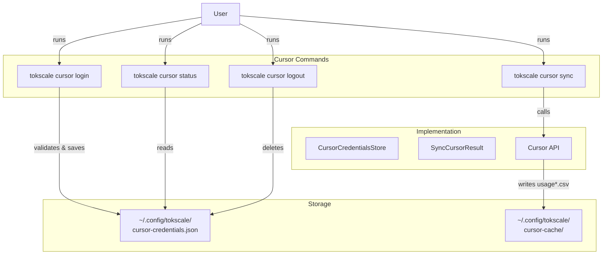
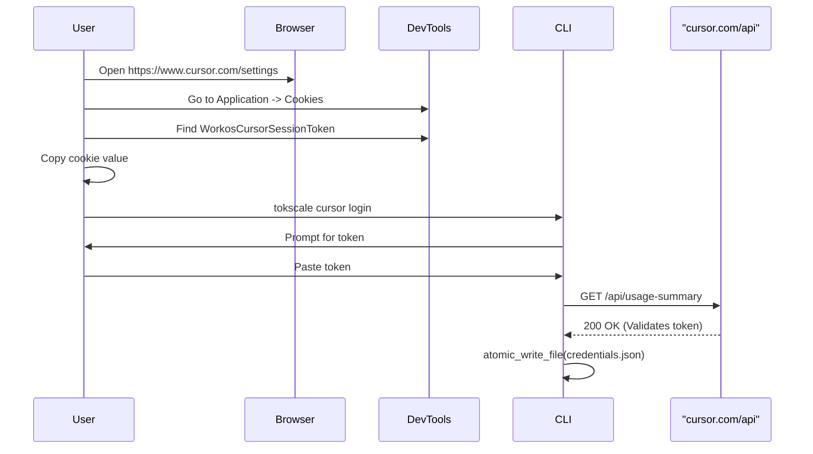
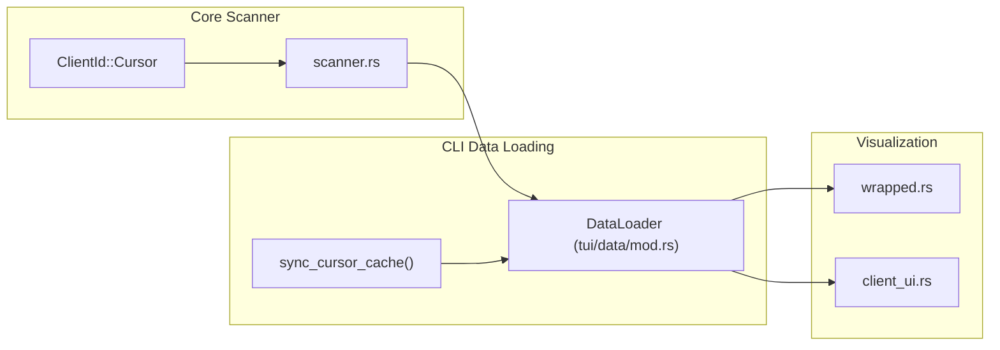

# Cursor IDE Integration

Relevant source files

The following files were used as context for generating this wiki page:

- [Cargo.lock](Cargo.lock)
- [crates/tokscale-cli/Cargo.toml](crates/tokscale-cli/Cargo.toml)
- [crates/tokscale-cli/src/auth.rs](crates/tokscale-cli/src/auth.rs)
- [crates/tokscale-cli/src/commands/wrapped.rs](crates/tokscale-cli/src/commands/wrapped.rs)
- [crates/tokscale-cli/src/cursor.rs](crates/tokscale-cli/src/cursor.rs)
- [crates/tokscale-cli/src/main.rs](crates/tokscale-cli/src/main.rs)
- [crates/tokscale-cli/src/tui/client_ui.rs](crates/tokscale-cli/src/tui/client_ui.rs)
- [crates/tokscale-cli/src/tui/data/mod.rs](crates/tokscale-cli/src/tui/data/mod.rs)
- [crates/tokscale-cli/src/tui/ui/widgets.rs](crates/tokscale-cli/src/tui/ui/widgets.rs)
- [crates/tokscale-core/Cargo.toml](crates/tokscale-core/Cargo.toml)
- [crates/tokscale-core/src/aggregator.rs](crates/tokscale-core/src/aggregator.rs)
- [crates/tokscale-core/src/clients.rs](crates/tokscale-core/src/clients.rs)
- [crates/tokscale-core/src/lib.rs](crates/tokscale-core/src/lib.rs)
- [crates/tokscale-core/src/scanner.rs](crates/tokscale-core/src/scanner.rs)
- [crates/tokscale-core/src/sessions/mod.rs](crates/tokscale-core/src/sessions/mod.rs)

## Purpose and Scope

This document describes the Cursor IDE integration subsystem in Tokscale. Unlike other supported platforms (OpenCode, Claude Code, Codex, Gemini, Amp, Droid) that read session files directly from disk, Cursor integration fetches usage data via authenticated API requests and caches it locally in a unified CSV format.

For information about the social platform login (GitHub OAuth), see [Social Platform Commands](#3.2.2). For details on how Cursor data is parsed and aggregated with other sources, see [Session Parsing and Data Sources](#3.4.2).

---

## Authentication Model

Cursor IDE requires **separate authentication** from the Tokscale social platform login. This is because Cursor data is accessed through Cursor's proprietary API rather than local filesystem parsing.

### Key Differences from Social Platform Auth

| Aspect | Social Platform (`tokscale login`) | Cursor Integration (`tokscale cursor login`) |
|--------|-----------------------------------|---------------------------------------------|
| **Purpose** | Submit data to tokscale.ai leaderboard | Fetch usage data from Cursor API |
| **Auth Method** | GitHub OAuth device flow | Manual session token from browser |
| **Token Storage** | `~/.config/tokscale/credentials.json` | `~/.config/tokscale/cursor-credentials.json` |
| **Token Type** | Tokscale API token | Cursor `WorkosCursorSessionToken` cookie |
| **Scope** | Upload reports, view profile | Read-only usage data |

**Security Warning**: The Cursor session token grants full access to the user's Cursor account. It must be treated as a password. Tokscale stores this locally with restricted file permissions (0o600 on Unix) [crates/tokscale-cli/src/cursor.rs:187]().

Sources: [crates/tokscale-cli/src/auth.rs:73](), [crates/tokscale-cli/src/cursor.rs:33-35](), [crates/tokscale-cli/src/cursor.rs:187]()

---

## Command Reference

The Cursor integration is managed via the `cursor` subcommand in the CLI [crates/tokscale-cli/src/main.rs:232-247]().

Sources: [crates/tokscale-cli/src/main.rs:232-247](), [crates/tokscale-cli/src/cursor.rs:68-73](), [crates/tokscale-cli/src/cursor.rs:161-218]()

### `tokscale cursor login`

Authenticates with Cursor by prompting for a session token. The command supports multi-account management through the `CursorCredentialsStore` struct [crates/tokscale-cli/src/cursor.rs:68-73]().

### `tokscale cursor status`

Checks authentication status and session validity. It returns an `AccountInfo` list showing active and inactive accounts [crates/tokscale-cli/src/cursor.rs:75-86]().

### `tokscale cursor logout`

Removes saved Cursor credentials. The CLI provides a `clear_cursor_credentials` function that removes the file at the path returned by `get_cursor_credentials_path()` [crates/tokscale-cli/src/cursor.rs:95-97]().

---

## Session Token Acquisition

The Cursor session token is a browser cookie (`WorkosCursorSessionToken`) that must be extracted manually from the browser's Developer Tools.

Sources: [crates/tokscale-cli/src/cursor.rs:51](), [crates/tokscale-cli/src/cursor.rs:130-151](), [crates/tokscale-cli/src/cursor.rs:161-218]()

---

## Data Synchronization Process

Cursor usage data is fetched from the Cursor API and cached locally. The CLI uses `reqwest` with a specific timeout and header set to mimic a browser [crates/tokscale-cli/src/cursor.rs:14-27]().

### Synchronization Behavior

**Automatic Sync Trigger**:
The CLI performs an implicit pre-report sync if the cached `usage.csv` is older than 5 minutes (`CURSOR_AUTO_SYNC_FRESHNESS`) [crates/tokscale-cli/src/cursor.rs:20](). This ensures reports in the TUI or `models` command stay fresh without redundant API calls.

**Implementation Details**:
- **Endpoints**: Uses `/api/dashboard/export-usage-events-csv?strategy=tokens` for data [crates/tokscale-cli/src/cursor.rs:49-50]().
- **Headers**: Includes `User-Agent` (Chrome/macOS), `Referer`, and the `Cookie` header [crates/tokscale-cli/src/cursor.rs:130-151]().
- **Atomic Writes**: Uses a temporary file and `fs::rename` (or copy fallback) to ensure the cache is never corrupted during a sync [crates/tokscale-cli/src/cursor.rs:161-218]().

Sources: [crates/tokscale-cli/src/cursor.rs:14-20](), [crates/tokscale-cli/src/cursor.rs:49-51](), [crates/tokscale-cli/src/cursor.rs:130-151](), [crates/tokscale-cli/src/cursor.rs:161-218]()

### Cache Structure

**Location**: `~/.config/tokscale/cursor-cache/` [crates/tokscale-cli/src/cursor.rs:41-43]().

The cache directory stores usage data in CSV files prefixed with `usage` [crates/tokscale-core/src/clients.rs:202]().

| Component | File/Path |
|-----------|-----------|
| **Credentials** | `~/.config/tokscale/cursor-credentials.json` |
| **Usage Cache** | `~/.config/tokscale/cursor-cache/usage-[hash].csv` |

Sources: [crates/tokscale-cli/src/cursor.rs:33-43](), [crates/tokscale-core/src/clients.rs:198-206]()

---

## Integration with Core and TUI

Cursor is defined as a `ClientId` with index `3` in the core crate [crates/tokscale-core/src/clients.rs:198]().

### Implementation in Data Flow

**Key Code Entities**:
- `ClientId::Cursor`: The enum variant identifying Cursor [crates/tokscale-core/src/clients.rs:198]().
- `sync_cursor_cache()`: The primary function for fetching and updating local data [crates/tokscale-cli/src/cursor.rs:89-93]().
- `CURSOR_SHADES`: The color palette used for Cursor in the TUI [crates/tokscale-cli/src/tui/ui/widgets.rs:168-176]().
- `hotkey: '4'`: The default TUI shortcut for the Cursor view [crates/tokscale-cli/src/tui/client_ui.rs:21-24]().

Sources: [crates/tokscale-core/src/clients.rs:198-206](), [crates/tokscale-cli/src/tui/client_ui.rs:21-24](), [crates/tokscale-cli/src/tui/ui/widgets.rs:168-176](), [crates/tokscale-cli/src/commands/wrapped.rs:176-182]()

### Wrapped Reports
The `wrapped` command specifically checks for `cursor::has_cursor_usage_cache()` and attempts a sync before generating the year-end summary [crates/tokscale-cli/src/commands/wrapped.rs:176-182](). If sync fails, it falls back to cached data to ensure the report can still be generated offline [crates/tokscale-cli/src/commands/wrapped.rs:185-194]().

Sources: [crates/tokscale-cli/src/commands/wrapped.rs:176-204]()
