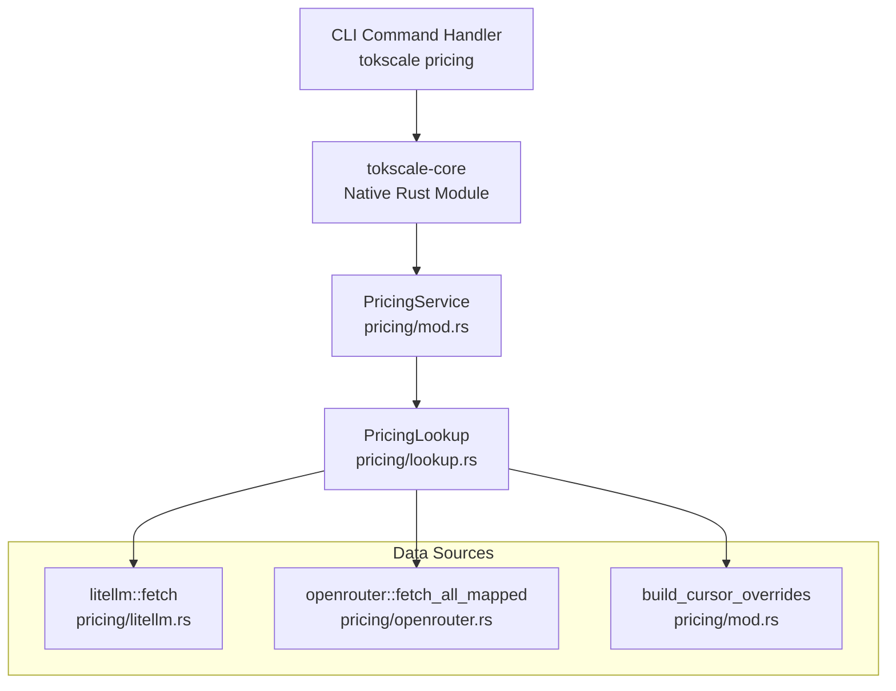
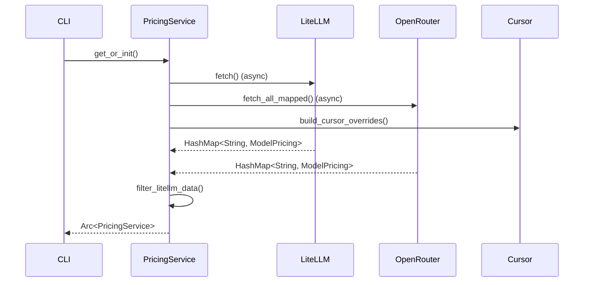
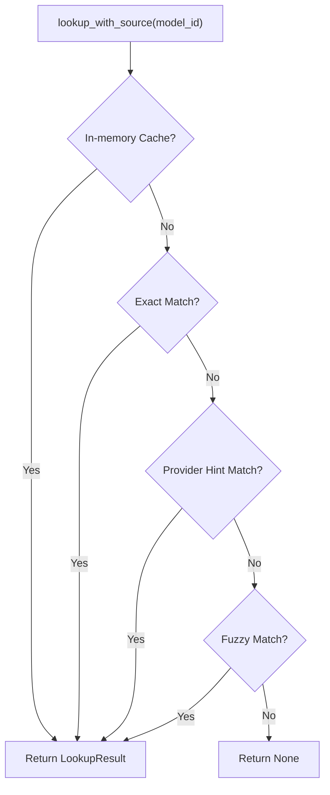

# Pricing Lookup

<details>
<summary>Relevant source files</summary>

The following files were used as context for generating this wiki page:

- [README.ja.md](README.ja.md)
- [README.ko.md](README.ko.md)
- [README.md](README.md)
- [README.zh-cn.md](README.zh-cn.md)
- [crates/tokscale-cli/src/antigravity.rs](crates/tokscale-cli/src/antigravity.rs)
- [crates/tokscale-cli/src/paths.rs](crates/tokscale-cli/src/paths.rs)
- [crates/tokscale-core/src/pricing/litellm.rs](crates/tokscale-core/src/pricing/litellm.rs)
- [crates/tokscale-core/src/pricing/lookup.rs](crates/tokscale-core/src/pricing/lookup.rs)
- [crates/tokscale-core/src/pricing/mod.rs](crates/tokscale-core/src/pricing/mod.rs)
- [crates/tokscale-core/src/pricing/openrouter.rs](crates/tokscale-core/src/pricing/openrouter.rs)
- [crates/tokscale-core/src/provider_identity.rs](crates/tokscale-core/src/provider_identity.rs)

</details>


## Purpose and Scope

The pricing lookup command (`tokscale pricing <model-id>`) provides a CLI interface for querying real-time model pricing information from LiteLLM and OpenRouter APIs. This command allows users to check costs for specific AI models before using them, helping with cost estimation and budgeting.

This page covers the user-facing pricing command only. For information about the internal pricing system used during report generation and cost calculation, see the Native Rust Core documentation.

Sources: [crates/tokscale-core/src/pricing/lookup.rs:81-100](), [crates/tokscale-core/src/pricing/mod.rs:158-186]()

## Command Syntax

The pricing command accepts a model identifier and optional flags:

```bash
tokscale pricing <model-id> [options]
```

### Options

| Option | Description | Default |
|--------|-------------|---------|
| `--json` | Output results as JSON instead of human-readable format | false |
| `--provider <source>` | Force pricing source: `litellm` or `openrouter` | auto-select |
| `--no-spinner` | Disable loading spinner for scripting use | false |

### Example Usage

```bash
# Basic lookup with human-readable output
tokscale pricing "gpt-4o"

# Force LiteLLM as pricing source
tokscale pricing "claude-3-opus" --provider litellm

# JSON output for scripting
tokscale pricing "gemini-pro" --json
```

Sources: [crates/tokscale-core/src/pricing/mod.rs:140-156]()

## Architecture Overview



**Figure 1: Pricing Lookup Command Architecture**

The pricing lookup command flows from the CLI through the native Rust core to the `PricingService`, which consults LiteLLM, OpenRouter, and internal Cursor overrides.

Sources: [crates/tokscale-core/src/pricing/mod.rs:24-40](), [crates/tokscale-core/src/pricing/lookup.rs:81-94]()

## Implementation Details

### PricingService Initialization

The `PricingService` follows a lazy initialization pattern using `OnceCell` to ensure datasets are fetched only when needed and shared across the process.



**Figure 2: Pricing Service Initialization Flow**

The service filters out subscription-based entries (like `github_copilot/`) during initialization because their $0.00 pricing is not useful for per-token cost estimation.

Sources: [crates/tokscale-core/src/pricing/mod.rs:16-22](), [crates/tokscale-core/src/pricing/mod.rs:102-110](), [crates/tokscale-core/src/pricing/mod.rs:46-56]()

### Cursor Overrides

Tokscale includes hardcoded pricing for models not yet available in upstream LiteLLM/OpenRouter datasets, such as Cursor's custom models.

| Model ID | Input (per 1M) | Output (per 1M) | Cache Read (per 1M) |
|----------|----------------|-----------------|---------------------|
| `gpt-5.3` | $1.75 | $14.00 | $0.175 |
| `composer-2` | $0.50 | $2.50 | $0.20 |
| `composer-2-fast` | $1.50 | $7.50 | $0.35 |

Sources: [crates/tokscale-core/src/pricing/mod.rs:62-84]()

## Lookup Algorithm

The `PricingLookup` struct implements a multi-step resolution strategy to match model IDs to pricing data.

### 1. Key Normalization
Before lookup, model IDs are normalized to handle variations in naming:
- **Provider Tags**: Extracted using `provider_tags` and `key_provider_tags` to handle nested segments like `openrouter/google/gemini-pro`.
- **Canonicalization**: Providers like `x-ai` and `xai` are mapped to a single canonical tag.

Sources: [crates/tokscale-core/src/provider_identity.rs:36-55](), [crates/tokscale-core/src/provider_identity.rs:58-81]()

### 2. Lookup Strategy
The lookup algorithm prioritizes sources and handles tier-based pricing (e.g., higher costs for prompts >128k tokens).



**Figure 3: Multi-step Lookup Logic**

Sources: [crates/tokscale-core/src/pricing/lookup.rs:168-190](), [crates/tokscale-core/src/pricing/lookup.rs:215-240]()

### 3. Provider Ranking
When multiple sources (LiteLLM and OpenRouter) provide data for the same model, Tokscale uses a ranking system:
- **Original Providers**: Direct providers (e.g., `openai/`) are preferred over resellers.
- **Resellers**: Services like `azure/` or `together/` are ranked lower than the original author.

Sources: [crates/tokscale-core/src/pricing/lookup.rs:19-45](), [crates/tokscale-core/src/pricing/lookup.rs:261-285]()

## Data Sources

### LiteLLM
LiteLLM provides a massive JSON dataset of model prices. Tokscale fetches this from the BerriAI GitHub repository and caches it locally.
- **URL**: `https://raw.githubusercontent.com/BerriAI/litellm/main/model_prices_and_context_window.json`
- **Cache File**: `pricing-litellm.json`

Sources: [crates/tokscale-core/src/pricing/litellm.rs:5-7]()

### OpenRouter
OpenRouter data is fetched in two stages:
1. **Model List**: Fetches all available models from `https://openrouter.ai/api/v1/models`.
2. **Author Pricing**: For each model, Tokscale attempts to fetch the "author" pricing (the direct provider cost) to ensure accuracy.

Sources: [crates/tokscale-core/src/pricing/openrouter.rs:8-12](), [crates/tokscale-core/src/pricing/openrouter.rs:179-210]()

## Caching and Performance

### Lookup Cache
To speed up repeated lookups, `PricingLookup` maintains an internal `RwLock<HashMap>` cache of results.
- **Max Entries**: 512 entries.
- **Eviction**: When the cache is full, it evicts ~25% of entries to avoid "thundering herd" misses.

Sources: [crates/tokscale-core/src/pricing/lookup.rs:49](), [crates/tokscale-core/src/pricing/lookup.rs:194-213]()

### Tiered Pricing Support
The system calculates costs based on context window thresholds (128k, 200k, 256k, 272k tokens) if the model pricing data includes these tiers.

Sources: [crates/tokscale-core/src/pricing/lookup.rs:50-53](), [crates/tokscale-core/src/pricing/litellm.rs:12-28]()
