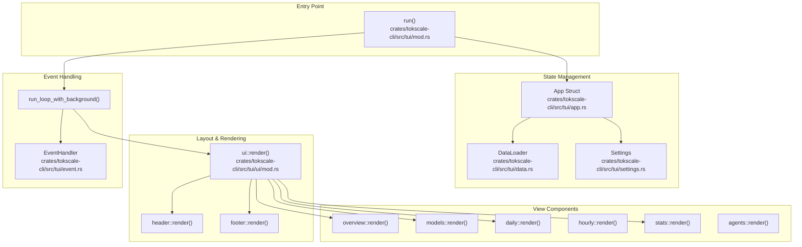
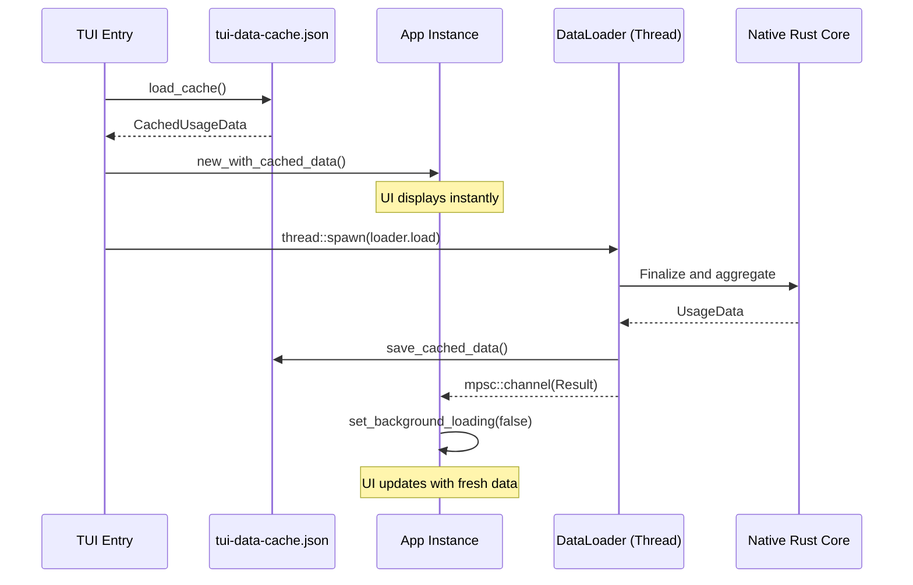

# Terminal UI (TUI)

Relevant source files

The following files were used as context for generating this wiki page:

- [crates/tokscale-cli/src/tui/app.rs](crates/tokscale-cli/src/tui/app.rs)
- [crates/tokscale-cli/src/tui/cache.rs](crates/tokscale-cli/src/tui/cache.rs)
- [crates/tokscale-cli/src/tui/mod.rs](crates/tokscale-cli/src/tui/mod.rs)
- [crates/tokscale-cli/src/tui/settings.rs](crates/tokscale-cli/src/tui/settings.rs)
- [crates/tokscale-cli/src/tui/ui/daily.rs](crates/tokscale-cli/src/tui/ui/daily.rs)
- [crates/tokscale-cli/src/tui/ui/footer.rs](crates/tokscale-cli/src/tui/ui/footer.rs)
- [crates/tokscale-cli/src/tui/ui/hourly.rs](crates/tokscale-cli/src/tui/ui/hourly.rs)
- [crates/tokscale-cli/src/tui/ui/mod.rs](crates/tokscale-cli/src/tui/ui/mod.rs)
- [crates/tokscale-cli/src/tui/ui/models.rs](crates/tokscale-cli/src/tui/ui/models.rs)
- [crates/tokscale-cli/src/tui/ui/overview.rs](crates/tokscale-cli/src/tui/ui/overview.rs)
- [crates/tokscale-cli/src/tui/ui/stats.rs](crates/tokscale-cli/src/tui/ui/stats.rs)
- [crates/tokscale-core/src/pricing/cache.rs](crates/tokscale-core/src/pricing/cache.rs)

The Terminal UI (TUI) is an interactive dashboard mode for the Tokscale CLI that provides real-time visualization of AI token usage data. It replaces static table output with a full-screen, responsive interface featuring multiple navigable views, keyboard/mouse controls, and high-performance rendering powered by `ratatui` and the native Rust core [crates/tokscale-cli/src/tui/mod.rs:40]().

For information about the CLI command structure and how to launch the TUI, see [Commands Reference](#3.2). For details on the native Rust core that powers data processing, see [Native Rust Core](#3.4).

## Architecture Overview

The TUI is built using the `ratatui` crate for terminal drawing and `crossterm` for backend event handling [crates/tokscale-cli/src/tui/mod.rs:33-40](). The architecture centers around an `App` struct that manages global state, routing between tabs, and background data loading [crates/tokscale-cli/src/tui/app.rs:139-192]().

**Sources:** [crates/tokscale-cli/src/tui/mod.rs:55-191](), [crates/tokscale-cli/src/tui/app.rs:139-192](), [crates/tokscale-cli/src/tui/ui/mod.rs:20-60]()

### Component Hierarchy

The TUI uses a tab-based navigation system defined by the `Tab` enum [crates/tokscale-cli/src/tui/app.rs:33-41](). The `App` struct tracks the `current_tab` and orchestrates rendering via the `ui::render` function [crates/tokscale-cli/src/tui/ui/mod.rs:45-52]().

| Component | File | Purpose |
|-----------|------|---------|
| `App` | [crates/tokscale-cli/src/tui/app.rs]() | Root state container (tabs, sorting, filters, scroll) |
| `Header` | [crates/tokscale-cli/src/tui/ui/header.rs]() | Renders the tab navigation bar and current title |
| `Overview` | [crates/tokscale-cli/src/tui/ui/overview.rs]() | Stacked bar chart and top models list |
| `Models` | [crates/tokscale-cli/src/tui/ui/models.rs]() | Sortable table of per-model usage details |
| `Daily` | [crates/tokscale-cli/src/tui/ui/daily.rs]() | Table showing usage grouped by date |
| `Hourly` | [crates/tokscale-cli/src/tui/ui/hourly.rs]() | Table or profile view of hourly usage |
| `Stats` | [crates/tokscale-cli/src/tui/ui/stats.rs]() | GitHub-style contribution graph and stats breakdown |
| `Footer` | [crates/tokscale-cli/src/tui/ui/footer.rs]() | Global totals, sort indicators, and keyboard help |

**Sources:** [crates/tokscale-cli/src/tui/app.rs:33-53](), [crates/tokscale-cli/src/tui/ui/mod.rs:45-52]()

## Data Loading and Caching

To ensure instant startup, the TUI implements a disk-based caching mechanism. It loads cached data immediately upon launch and spawns a background thread to fetch fresh data from the native Rust core [crates/tokscale-cli/src/tui/mod.rs:98-167]().

**Sources:** [crates/tokscale-cli/src/tui/cache.rs:1-60](), [crates/tokscale-cli/src/tui/mod.rs:138-167]()

### State Persistence

The TUI persists user preferences (theme, auto-refresh, scanner paths) in a `settings.json` file [crates/tokscale-cli/src/tui/settings.rs:31-64]().
- **Path:** `~/.config/tokscale/settings.json` [crates/tokscale-cli/src/tui/settings.rs:134-142]().
- **Default Theme:** "blue" [crates/tokscale-cli/src/tui/settings.rs:85-87]().
- **Auto-Refresh:** Configurable interval between 30s and 1 hour [crates/tokscale-cli/src/tui/settings.rs:11-13]().

**Sources:** [crates/tokscale-cli/src/tui/settings.rs:11-142]()

## View Details

### Overview View
Features a `StackedBarChart` showing token usage over time (Daily or Hourly) [crates/tokscale-cli/src/tui/ui/overview.rs:76-144](). It includes a legend for the top models and a scrollable list of model details [crates/tokscale-cli/src/tui/ui/overview.rs:146-183]().

### Stats View
Renders a 52-week contribution graph [crates/tokscale-cli/src/tui/ui/stats.rs:62-83](). Users can select individual cells (days) to see a detailed breakdown of models and costs for that specific date [crates/tokscale-cli/src/tui/ui/stats.rs:138-163]().

### Hourly View
Supports two modes: `Table` (standard row-based data) and `Profile` (a visual timeline of usage intensity throughout the day) [crates/tokscale-cli/src/tui/app.rs:115-119]().

## Keyboard Controls

Navigation and interaction are primarily keyboard-driven:

| Key | Action |
|-----|--------|
| `Tab` / `Right` | Next tab [crates/tokscale-cli/src/tui/app.rs:77-86]() |
| `Left` | Previous tab [crates/tokscale-cli/src/tui/app.rs:88-97]() |
| `Up` / `Down` | Scroll through lists/tables [crates/tokscale-cli/src/tui/ui/footer.rs:187]() |
| `d` / `t` / `c` | Sort by Date, Tokens, or Cost [crates/tokscale-cli/src/tui/ui/footer.rs:190]() |
| `r` | Manual refresh [crates/tokscale-cli/src/tui/ui/footer.rs:171]() |
| `s` | Open Source Picker dialog [crates/tokscale-cli/src/tui/ui/footer.rs:165]() |
| `g` | Toggle Grouping (Model vs Workspace) [crates/tokscale-cli/src/tui/ui/footer.rs:167]() |
| `q` | Quit TUI [crates/tokscale-cli/src/tui/ui/footer.rs:173]() |

**Sources:** [crates/tokscale-cli/src/tui/ui/footer.rs:154-200](), [crates/tokscale-cli/src/tui/app.rs:77-97]()

## Sub-Pages

For more detailed technical information, see the following child pages:
- [TUI Architecture and State Management](#3.3.1) — Detail the TUI's component hierarchy, state management with the `App` struct, data loading hooks, caching, and settings persistence.
- [TUI Views and Navigation](#3.3.2) — Document the Overview, Models, Daily, Hourly, Hourly Profile, Stats, and Agents views, including keyboard shortcuts and filtering.
- [TUI Components](#3.3.3) — Describe individual TUI components like `StatsView`, `DailyView`, `ModelView`, `Footer`, bar charts, and dialogs.
