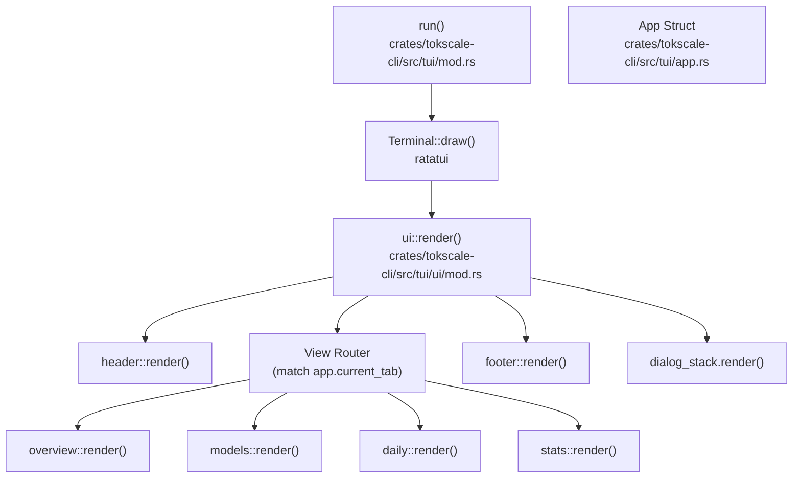
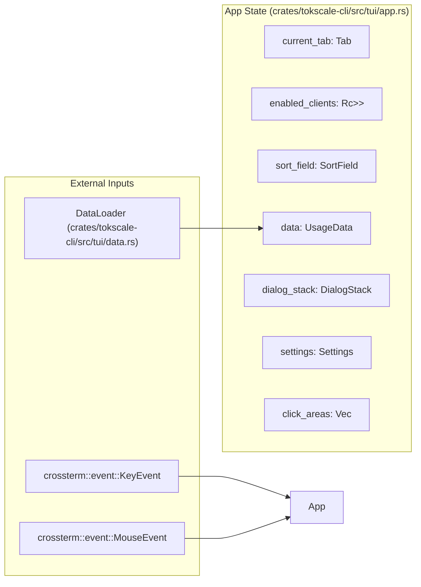
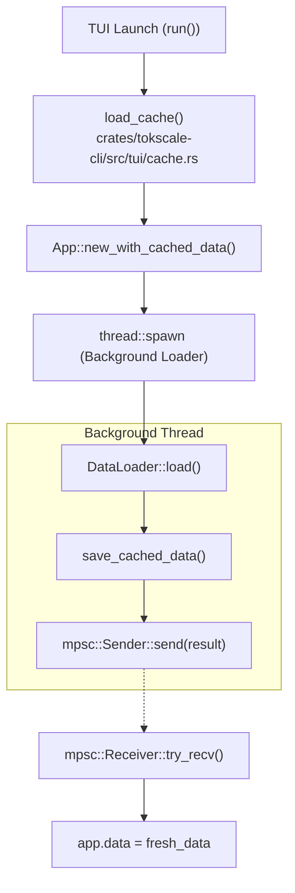

# TUI Architecture and State Management

Relevant source files

The following files were used as context for generating this wiki page:

- [crates/tokscale-cli/src/tui/app.rs](crates/tokscale-cli/src/tui/app.rs)
- [crates/tokscale-cli/src/tui/cache.rs](crates/tokscale-cli/src/tui/cache.rs)
- [crates/tokscale-cli/src/tui/event.rs](crates/tokscale-cli/src/tui/event.rs)
- [crates/tokscale-cli/src/tui/mod.rs](crates/tokscale-cli/src/tui/mod.rs)
- [crates/tokscale-cli/src/tui/settings.rs](crates/tokscale-cli/src/tui/settings.rs)
- [crates/tokscale-cli/src/tui/ui/daily.rs](crates/tokscale-cli/src/tui/ui/daily.rs)
- [crates/tokscale-cli/src/tui/ui/footer.rs](crates/tokscale-cli/src/tui/ui/footer.rs)
- [crates/tokscale-cli/src/tui/ui/hourly.rs](crates/tokscale-cli/src/tui/ui/hourly.rs)
- [crates/tokscale-cli/src/tui/ui/mod.rs](crates/tokscale-cli/src/tui/ui/mod.rs)
- [crates/tokscale-cli/src/tui/ui/models.rs](crates/tokscale-cli/src/tui/ui/models.rs)
- [crates/tokscale-cli/src/tui/ui/overview.rs](crates/tokscale-cli/src/tui/ui/overview.rs)
- [crates/tokscale-cli/src/tui/ui/stats.rs](crates/tokscale-cli/src/tui/ui/stats.rs)
- [crates/tokscale-core/src/pricing/cache.rs](crates/tokscale-core/src/pricing/cache.rs)

## Purpose and Scope

This document details the architecture and state management of the Terminal User Interface (TUI) component of Tokscale. The TUI is a high-performance interactive dashboard implemented in Rust using the `ratatui` library. It features a centralized state management system, background data loading with stale-while-revalidate semantics, and persistent configuration.

For information about individual TUI views and their rendering logic, see [TUI Components](3.3.3). For keyboard controls and navigation patterns, see [TUI Views and Navigation](3.3.2).

**Sources:** [crates/tokscale-cli/src/tui/app.rs:139-192](), [crates/tokscale-cli/src/tui/mod.rs:1-41]()

---

## Component Hierarchy

The TUI follows a modular structure where a central `App` struct coordinates state, and specialized modules handle rendering via a functional composition pattern.

### Top-Level Structure

**Sources:** [crates/tokscale-cli/src/tui/mod.rs:55-191](), [crates/tokscale-cli/src/tui/ui/mod.rs:20-60]()

### Component Responsibilities

| Component | File | Primary Responsibility |
|-----------|------|----------------------|
| `run` | [crates/tokscale-cli/src/tui/mod.rs:55]() | Entry point, terminal initialization, background thread spawning, event loop |
| `App` | [crates/tokscale-cli/src/tui/app.rs:139]() | Central state container, sorting logic, filter management, and click area tracking |
| `ui::render` | [crates/tokscale-cli/src/tui/ui/mod.rs:20]() | Main layout definition and routing between views |
| `Header` | [crates/tokscale-cli/src/tui/ui/header.rs]() | Tab display and title bar |
| `Footer` | [crates/tokscale-cli/src/tui/ui/footer.rs:8]() | Global totals, sort indicators, help text, and status messages |
| `OverviewView` | [crates/tokscale-cli/src/tui/ui/overview.rs:45]() | Multi-model bar charts and top usage summaries |
| `DialogStack` | [crates/tokscale-cli/src/tui/ui/dialog.rs]() | Modal overlay management (Source Picker, Grouping, etc.) |

**Sources:** [crates/tokscale-cli/src/tui/app.rs:139-192](), [crates/tokscale-cli/src/tui/ui/mod.rs:40-60]()

---

## State Management System

The TUI uses a centralized `App` struct to maintain the entire application state. Unlike web-based frameworks, state transitions are handled via explicit event processing and method calls that mutate the `App` instance.

### App State Architecture

**Sources:** [crates/tokscale-cli/src/tui/app.rs:139-192](), [crates/tokscale-cli/src/tui/event.rs:1-16]()

### Key State Primitives

| Field | Type | Role |
|-------|------|------|
| `data` | `UsageData` | The primary usage statistics (models, daily, hourly, graph) |
| `enabled_clients` | `Rc<RefCell<HashSet<ClientFilter>>>` | Shared set of active sources used for filtering and background loads |
| `sort_field` | `SortField` | Current sorting criteria (Cost, Tokens, or Date) |
| `dialog_stack` | `DialogStack` | Manages the LIFO stack of active modal dialogs |
| `click_areas` | `Vec<ClickArea>` | Dynamic list of screen regions mapped to actions for mouse support |

**Sources:** [crates/tokscale-cli/src/tui/app.rs:140-192]()

---

## Data Loading and Caching

The TUI implements a "Stale-While-Revalidate" pattern to ensure the interface is interactive immediately upon launch while data is updated in the background.

### Data Loading Flow

**Sources:** [crates/tokscale-cli/src/tui/mod.rs:98-167](), [crates/tokscale-cli/src/tui/cache.rs:1-24]()

### Caching Strategy

The caching system uses disk-based JSON storage to bridge sessions.

*   **Location:** Cache is stored in `~/.cache/tokscale/tui-data-cache.json` to maintain compatibility with the legacy TypeScript implementation [crates/tokscale-cli/src/tui/cache.rs:28-34]().
*   **Staleness:** A cache is considered stale after 5 minutes (`CACHE_STALE_THRESHOLD_MS`) [crates/tokscale-cli/src/tui/cache.rs:22-23]().
*   **Schema Versioning:** The cache includes a `schema_version` (currently 7) to prevent loading incompatible data structures [crates/tokscale-cli/src/tui/cache.rs:24, 52]().
*   **Atomic Writes:** Cache updates use a temporary file rename pattern to prevent corruption during crashes [crates/tokscale-core/src/pricing/cache.rs:86-96]().

**Sources:** [crates/tokscale-cli/src/tui/cache.rs:1-60](), [crates/tokscale-core/src/pricing/cache.rs:62-103]()

---

## Settings Persistence

The TUI's behavior is customized via `settings.json`, which is loaded into the `App` struct at initialization.

### Settings Schema

The `Settings` struct manages both TUI preferences and scanner configurations:

| Field | Type | Description |
|-------|------|-------------|
| `color_palette` | `String` | Theme name (e.g., "blue", "ocean") |
| `auto_refresh_enabled` | `bool` | Whether the TUI reloads data automatically |
| `auto_refresh_ms` | `u64` | Refresh interval in milliseconds |
| `scanner` | `ScannerSettings` | Custom paths for OpenCode SQLite databases |
| `default_clients` | `Vec<String>` | Pinned sources to load when no CLI flags are provided |

**Sources:** [crates/tokscale-cli/src/tui/settings.rs:31-64]()

### Implementation Details

*   **Path Resolution:** Settings are stored in `~/.config/tokscale/settings.json`, with a legacy fallback for macOS paths [crates/tokscale-cli/src/tui/settings.rs:134-169]().
*   **Lossy Deserialization:** The `default_clients` field uses a lossy deserializer to gracefully handle malformed JSON entries without failing the entire settings load [crates/tokscale-cli/src/tui/settings.rs:73-83]().
*   **Validation:** Numeric settings like `auto_refresh_ms` and `native_timeout_ms` are clamped to safe minimum/maximum values during load [crates/tokscale-cli/src/tui/settings.rs:172-180]().

**Sources:** [crates/tokscale-cli/src/tui/settings.rs:151-182]()
