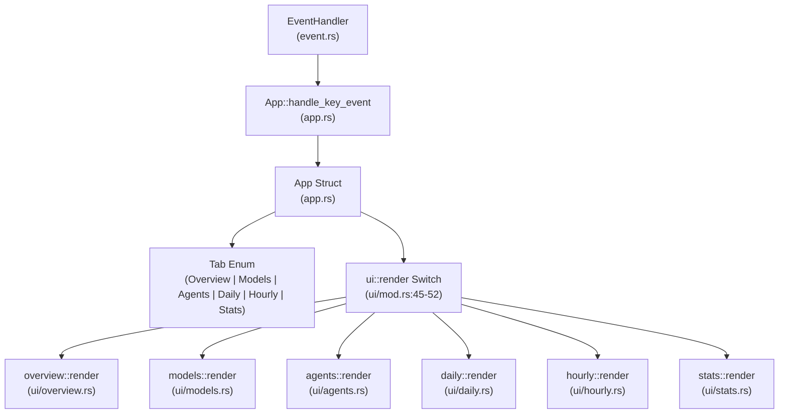

# TUI Views and Navigation

Relevant source files

The following files were used as context for generating this wiki page:

- [crates/tokscale-cli/src/tui/app.rs](crates/tokscale-cli/src/tui/app.rs)
- [crates/tokscale-cli/src/tui/mod.rs](crates/tokscale-cli/src/tui/mod.rs)
- [crates/tokscale-cli/src/tui/ui/agents.rs](crates/tokscale-cli/src/tui/ui/agents.rs)
- [crates/tokscale-cli/src/tui/ui/daily.rs](crates/tokscale-cli/src/tui/ui/daily.rs)
- [crates/tokscale-cli/src/tui/ui/footer.rs](crates/tokscale-cli/src/tui/ui/footer.rs)
- [crates/tokscale-cli/src/tui/ui/hourly.rs](crates/tokscale-cli/src/tui/ui/hourly.rs)
- [crates/tokscale-cli/src/tui/ui/hourly_profile.rs](crates/tokscale-cli/src/tui/ui/hourly_profile.rs)
- [crates/tokscale-cli/src/tui/ui/mod.rs](crates/tokscale-cli/src/tui/ui/mod.rs)
- [crates/tokscale-cli/src/tui/ui/models.rs](crates/tokscale-cli/src/tui/ui/models.rs)
- [crates/tokscale-cli/src/tui/ui/overview.rs](crates/tokscale-cli/src/tui/ui/overview.rs)
- [crates/tokscale-cli/src/tui/ui/stats.rs](crates/tokscale-cli/src/tui/ui/stats.rs)
- [crates/tokscale-core/src/sessions/claudecode.rs](crates/tokscale-core/src/sessions/claudecode.rs)

This document describes the primary views in the Tokscale Terminal UI (Overview, Models, Agents, Daily, Hourly, and Stats), how users navigate between them, and the keyboard shortcuts available for data exploration. For information about state management, see [TUI Architecture and State Management](#3.3.1). For details on individual component implementations, see [TUI Components](#3.3.3).

## Purpose and Scope

The TUI presents token usage data through six distinct views, each optimized for different analysis tasks. Users navigate between these views using keyboard shortcuts or mouse clicks. Each view provides specific interactions for sorting, filtering by source, and drill-down exploration.

## View Management Architecture

The `App` struct manages the active view via the `current_tab` field, which holds a `Tab` enum variant [crates/tokscale-cli/src/tui/app.rs:141](). Navigation is handled by the `Tab::next()` and `Tab::prev()` methods [crates/tokscale-cli/src/tui/app.rs:77-97]().

**Sources:** [crates/tokscale-cli/src/tui/app.rs:34-98](), [crates/tokscale-cli/src/tui/ui/mod.rs:20-60]()

## The Six Views

### Overview View
Displays a stacked bar chart of recent usage (last 60 intervals) and a scrollable list of top models.
- **Stacked Bar Chart**: Visualizes token distribution by model over time [crates/tokscale-cli/src/tui/ui/overview.rs:76-144]().
- **Granularity**: Toggle between Daily and Hourly chart views using the `v` key [crates/tokscale-cli/src/tui/ui/overview.rs:79-114]().
- **Legend**: Shows top 3-5 models with color-coded indicators [crates/tokscale-cli/src/tui/ui/overview.rs:146-183]().

### Models View
A detailed table of all models across enabled sources, including granular token breakdowns.
- **Columns**: Provider, Source, Input, Output, Cache Read/Write, and Cost [crates/tokscale-cli/src/tui/ui/models.rs:72-91]().
- **Grouping**: Supports toggling between `Model` and `WorkspaceModel` grouping using the `g` key [crates/tokscale-cli/src/tui/ui/models.rs:20-26]().

### Agents View
Breakdown of token usage by AI Agent (e.g., Claude Code subagents).
- **Subagent Resolution**: Parses Claude Code JSONL and meta files to identify specific subagent types [crates/tokscale-core/src/sessions/claudecode.rs:71-111]().
- **Display**: Shows Agent name, associated sources, and total costs [crates/tokscale-cli/src/tui/ui/agents.rs:47-53]().

### Daily View
Chronological aggregate of usage per day.
- **Indicators**: Highlights "Today" in yellow [crates/tokscale-cli/src/tui/ui/daily.rs:122-133]().
- **Turn Data**: Displays turn counts and message counts if available for the session type [crates/tokscale-cli/src/tui/ui/daily.rs:56-65]().

### Hourly View
Provides two modes: **Table** (chronological list) and **Profile** (behavioral analysis).
- **Hourly Profile**: Aggregates data to show "When You Work Most" (Time-of-day) and "Most Productive Day" (Weekday) [crates/tokscale-cli/src/tui/ui/hourly_profile.rs:94-196]().
- **Peak Hour**: Identifies the single hour with the highest consumption [crates/tokscale-cli/src/tui/ui/hourly_profile.rs:199-210]().

### Stats View
Features a 52-week contribution graph and aggregate stats.
- **Interactive Graph**: Users can click or navigate to a specific cell to see a breakdown for that day [crates/tokscale-cli/src/tui/ui/stats.rs:62-167]().
- **Layout**: Dynamic zones for the graph, compact stats, and a breakdown panel [crates/tokscale-cli/src/tui/ui/stats.rs:15-60]().

**Sources:** [crates/tokscale-cli/src/tui/ui/overview.rs:1-183](), [crates/tokscale-cli/src/tui/ui/models.rs:1-127](), [crates/tokscale-cli/src/tui/ui/agents.rs:1-53](), [crates/tokscale-cli/src/tui/ui/daily.rs:1-105](), [crates/tokscale-cli/src/tui/ui/hourly.rs:1-115](), [crates/tokscale-cli/src/tui/ui/hourly_profile.rs:1-210](), [crates/tokscale-cli/src/tui/ui/stats.rs:1-188]()

## Navigation and Controls

Tokscale uses a unified keyboard and mouse interaction model.

### Keyboard Shortcuts Reference

| Key | Action | Context |
|-----|--------|---------|
| `Tab` / `→` | Next Tab | Global |
| `Shift+Tab` / `←` | Previous Tab | Global |
| `↑` / `↓` | Scroll / Selection | Tables / Overview |
| `d` | Sort by Date | Models, Daily, Hourly, Agents |
| `t` | Sort by Tokens | Models, Daily, Hourly, Agents |
| `c` | Sort by Cost | Models, Daily, Hourly, Agents |
| `s` | Open Source Picker | Global |
| `g` | Toggle Grouping | Models, Overview |
| `v` | Toggle View Mode | Hourly (Table/Profile), Overview (Daily/Hourly) |
| `r` | Manual Refresh | Global |
| `e` | Export to JSON | Global |
| `q` / `Esc` | Quit / Close Dialog | Global |

**Sources:** [crates/tokscale-cli/src/tui/ui/footer.rs:154-213](), [crates/tokscale-cli/src/tui/app.rs:77-97]()

### Mouse Interaction

The TUI supports mouse clicks for navigation and selection:
- **Tab Headers**: Clicking a tab name in the header switches the view [crates/tokscale-cli/src/tui/app.rs:134]().
- **Sort Buttons**: Footer sort labels are clickable to change table ordering [crates/tokscale-cli/src/tui/ui/footer.rs:83-88]().
- **Graph Cells**: In the Stats view, individual cells in the contribution graph can be clicked to view daily details [crates/tokscale-cli/src/tui/ui/stats.rs:165-167]().

## Responsive Layouts

The TUI calculates available space and adjusts component visibility:
- **Narrow Mode**: (< 100 chars) Hides granular token columns (Input/Output/Cache) and truncates labels [crates/tokscale-cli/src/tui/ui/models.rs:152-157]().
- **Very Narrow Mode**: (< 80 chars) Shows only essential fields like "Model" and "Cost" [crates/tokscale-cli/src/tui/ui/agents.rs:106-111]().
- **Dynamic Sizing**: The `render` function in `ui/mod.rs` uses `Layout` constraints to split the terminal into Header (3 lines), Content (Min 0), and Footer (5 lines) [crates/tokscale-cli/src/tui/ui/mod.rs:29-36]().

**Sources:** [crates/tokscale-cli/src/tui/ui/mod.rs:20-60](), [crates/tokscale-cli/src/tui/ui/models.rs:147-185](), [crates/tokscale-cli/src/tui/ui/footer.rs:17-44]()
