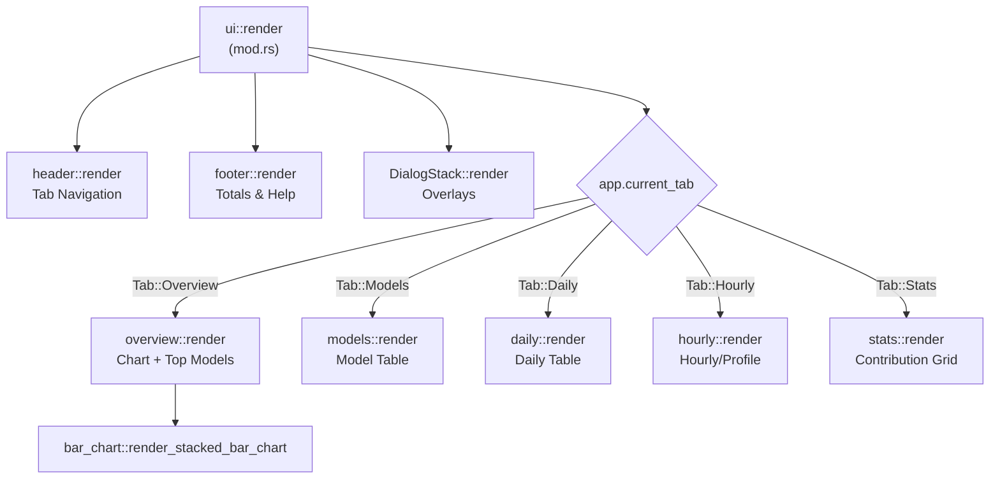

# TUI Components

Relevant source files

The following files were used as context for generating this wiki page:

- [crates/tokscale-cli/src/tui/app.rs](crates/tokscale-cli/src/tui/app.rs)
- [crates/tokscale-cli/src/tui/mod.rs](crates/tokscale-cli/src/tui/mod.rs)
- [crates/tokscale-cli/src/tui/themes.rs](crates/tokscale-cli/src/tui/themes.rs)
- [crates/tokscale-cli/src/tui/ui/bar_chart.rs](crates/tokscale-cli/src/tui/ui/bar_chart.rs)
- [crates/tokscale-cli/src/tui/ui/daily.rs](crates/tokscale-cli/src/tui/ui/daily.rs)
- [crates/tokscale-cli/src/tui/ui/dialog/mod.rs](crates/tokscale-cli/src/tui/ui/dialog/mod.rs)
- [crates/tokscale-cli/src/tui/ui/dialog/overlay.rs](crates/tokscale-cli/src/tui/ui/dialog/overlay.rs)
- [crates/tokscale-cli/src/tui/ui/dialog/source_picker.rs](crates/tokscale-cli/src/tui/ui/dialog/source_picker.rs)
- [crates/tokscale-cli/src/tui/ui/dialog/stack.rs](crates/tokscale-cli/src/tui/ui/dialog/stack.rs)
- [crates/tokscale-cli/src/tui/ui/footer.rs](crates/tokscale-cli/src/tui/ui/footer.rs)
- [crates/tokscale-cli/src/tui/ui/header.rs](crates/tokscale-cli/src/tui/ui/header.rs)
- [crates/tokscale-cli/src/tui/ui/hourly.rs](crates/tokscale-cli/src/tui/ui/hourly.rs)
- [crates/tokscale-cli/src/tui/ui/mod.rs](crates/tokscale-cli/src/tui/ui/mod.rs)
- [crates/tokscale-cli/src/tui/ui/models.rs](crates/tokscale-cli/src/tui/ui/models.rs)
- [crates/tokscale-cli/src/tui/ui/overview.rs](crates/tokscale-cli/src/tui/ui/overview.rs)
- [crates/tokscale-cli/src/tui/ui/stats.rs](crates/tokscale-cli/src/tui/ui/stats.rs)
- [crates/tokscale-core/src/sessions/codebuff.rs](crates/tokscale-core/src/sessions/codebuff.rs)
- [crates/tokscale-core/src/sessions/utils.rs](crates/tokscale-core/src/sessions/utils.rs)
- [crates/tokscale-core/tests/codebuff.rs](crates/tokscale-core/tests/codebuff.rs)

This page documents the individual UI components that comprise the Terminal User Interface (TUI), including their rendering logic, data flow, and responsive behavior. The TUI is built using the `ratatui` library, which provides a widget-based system for terminal rendering.

## Component Hierarchy

The TUI follows a hierarchical structure where the main `render` function in `crates/tokscale-cli/src/tui/ui/mod.rs` delegates drawing to specific view modules based on the application state.

**Component Tree Diagram**

Sources: [crates/tokscale-cli/src/tui/ui/mod.rs:20-60](), [crates/tokscale-cli/src/tui/app.rs:33-41]()

## Shared Widgets and Logic

Common UI elements are encapsulated in the `widgets` module. This includes formatting for currency and tokens, as well as color assignment logic.

### Model Coloring
Model colors are determined dynamically. The TUI maintains a `model_shade_map` in the `App` struct to ensure visual consistency across different views.
- `get_model_color`: Assigns a base color based on the model name [crates/tokscale-cli/src/tui/ui/widgets.rs:172-195]().
- `get_provider_shade`: Provides specific color themes for major providers (e.g., Anthropic, OpenAI, Google) [crates/tokscale-cli/src/tui/ui/widgets.rs:117-154]().

### Formatting
- `format_tokens`: Converts large numbers into human-readable strings (e.g., "1.2M", "450K") [crates/tokscale-cli/src/tui/ui/widgets.rs:34-49]().
- `format_cost`: Formats floats into currency strings with precision handling for sub-cent values [crates/tokscale-cli/src/tui/ui/widgets.rs:51-64]().

Sources: [crates/tokscale-cli/src/tui/ui/widgets.rs:1-200](), [crates/tokscale-cli/src/tui/app.rs:191-191]()

## Overview Component

The `OverviewView` is the default landing page. It combines a visual bar chart with a scrollable list of top-consuming models.

### Layout Allocation
The view divides vertical space proportionally:
1. **Chart**: ~35% of height (min 5 rows) [crates/tokscale-cli/src/tui/ui/overview.rs:54-55]().
2. **Legend**: 1 row [crates/tokscale-cli/src/tui/ui/overview.rs:56-56]().
3. **Model List**: Remaining space [crates/tokscale-cli/src/tui/ui/overview.rs:63-63]().

### Stacked Bar Chart
The `render_stacked_bar_chart` function uses sub-cell precision block characters (` ▁▂▃▄▅▆▇█`) to visualize token volume [crates/tokscale-cli/src/tui/ui/bar_chart.rs:6-7]().
- **Data Granularity**: Can toggle between `Daily` and `Hourly` views [crates/tokscale-cli/src/tui/app.rs:100-105]().
- **Model Segments**: Each bar is "stacked" by model. The logic determines which model's color to show at a specific vertical threshold based on its contribution to the total volume [crates/tokscale-cli/src/tui/ui/bar_chart.rs:192-212]().

Sources: [crates/tokscale-cli/src/tui/ui/overview.rs:45-74](), [crates/tokscale-cli/src/tui/ui/bar_chart.rs:30-190]()

## Table Views (Models, Daily, Hourly)

These components render detailed data using `ratatui::widgets::Table`. They share a common pattern for handling responsive columns and sorting.

### Responsive Column logic
Columns are added or removed based on `app.is_narrow()` and `app.is_very_narrow()` [crates/tokscale-cli/src/tui/ui/models.rs:46-47]().

| View | Very Narrow (<60) | Narrow (<80) | Full (≥80) |
| :--- | :--- | :--- | :--- |
| **Models** | Model, Cost | Model, Tokens, Cost | #, Model, Provider, Source, Input, Output, Cache, Total, Cost |
| **Daily** | Date, Cost | Date, Msgs, Tokens, Cost | Date, Msgs, Input, Output, Cache R/W, Total, Cost |

### Sort Indicators
Headers dynamically display `▲` or `▼` symbols based on the current `SortField` and `SortDirection` [crates/tokscale-cli/src/tui/ui/models.rs:93-102]().

Sources: [crates/tokscale-cli/src/tui/ui/models.rs:28-126](), [crates/tokscale-cli/src/tui/ui/daily.rs:10-105]()

## Stats View (Contribution Graph)

The `StatsView` renders a GitHub-style activity grid and detailed breakdowns.

### Rendering the Grid
- **Intensity Mapping**: Daily token volume is normalized into 5 intensity levels [crates/tokscale-cli/src/tui/ui/stats.rs:109-123]().
- **Interactive Cells**: The grid supports mouse interaction. Clicking a cell updates `app.selected_graph_cell`, which triggers a layout shift to show the `render_breakdown_panel` for that specific day [crates/tokscale-cli/src/tui/ui/stats.rs:15-60]().
- **Layout Logic**: If a cell is selected, the screen splits into a three-zone layout (Graph, Compact Stats, Breakdown) [crates/tokscale-cli/src/tui/ui/stats.rs:22-40]().

Sources: [crates/tokscale-cli/src/tui/ui/stats.rs:1-163](), [crates/tokscale-cli/src/tui/app.rs:164-165]()

## Footer Component

The footer provides context-aware help and global statistics.

### Layout
It splits into three rows when height permits [crates/tokscale-cli/src/tui/ui/footer.rs:18-28]():
1. **Main Row**: Sorting buttons (Date, Cost, Tokens) and global totals (Tokens | Cost) [crates/tokscale-cli/src/tui/ui/footer.rs:46-152]().
2. **Help Row**: Keyboard shortcut hints (e.g., `[s]` for sources, `[g]` for grouping) [crates/tokscale-cli/src/tui/ui/footer.rs:154-200]().
3. **Status Row**: Displays the current loading phase or status messages [crates/tokscale-cli/src/tui/ui/footer.rs:41-43]().

### Interactive Elements
Sorting buttons in the footer are interactive via mouse clicks, using the `app.add_click_area` system to map terminal coordinates to `ClickAction::Sort` [crates/tokscale-cli/src/tui/ui/footer.rs:83-88]().

Sources: [crates/tokscale-cli/src/tui/ui/footer.rs:1-200]()

## Dialogs and Overlays

The TUI uses a `DialogStack` to manage modal windows like the Source Picker or Group-By Picker.

### ClientPickerDialog
Used to toggle which data sources (e.g., `opencode`, `claude`, `synthetic`) are included in the current view.
- **State Propagation**: It uses `Rc<RefCell<HashSet<ClientFilter>>>` to ensure that toggling a source in the dialog immediately marks the app as needing a data reload [crates/tokscale-cli/src/tui/ui/dialog/source_picker.rs:89-104]().
- **Filtering**: Supports "type-to-filter" functionality to quickly find specific sources in the list [crates/tokscale-cli/src/tui/ui/dialog/source_picker.rs:106-122]().

### Dialog Stack Logic
Dialogs are rendered as centered overlays. The `DialogStack` handles event capturing, ensuring that keyboard input is routed to the active dialog instead of the main app tabs while a modal is open [crates/tokscale-cli/src/tui/ui/dialog/stack.rs:1-50]().

Sources: [crates/tokscale-cli/src/tui/ui/dialog/source_picker.rs:34-123](), [crates/tokscale-cli/src/tui/ui/dialog/mod.rs:27-43]()
