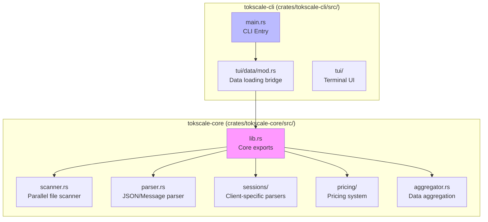
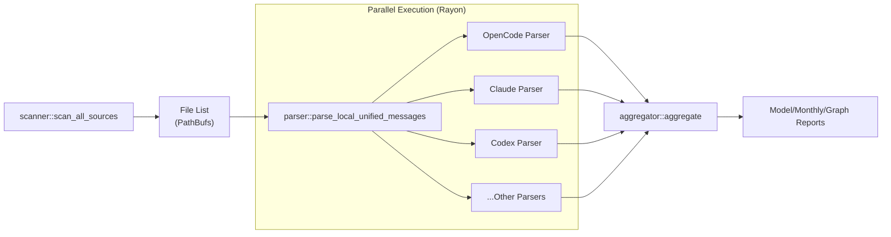

# Native Rust Core

Relevant source files

The following files were used as context for generating this wiki page:

- [Cargo.toml](Cargo.toml)
- [crates/tokscale-cli/src/commands/wrapped.rs](crates/tokscale-cli/src/commands/wrapped.rs)
- [crates/tokscale-cli/src/main.rs](crates/tokscale-cli/src/main.rs)
- [crates/tokscale-cli/src/tui/client_ui.rs](crates/tokscale-cli/src/tui/client_ui.rs)
- [crates/tokscale-cli/src/tui/data/mod.rs](crates/tokscale-cli/src/tui/data/mod.rs)
- [crates/tokscale-cli/src/tui/ui/widgets.rs](crates/tokscale-cli/src/tui/ui/widgets.rs)
- [crates/tokscale-core/src/aggregator.rs](crates/tokscale-core/src/aggregator.rs)
- [crates/tokscale-core/src/clients.rs](crates/tokscale-core/src/clients.rs)
- [crates/tokscale-core/src/lib.rs](crates/tokscale-core/src/lib.rs)
- [crates/tokscale-core/src/scanner.rs](crates/tokscale-core/src/scanner.rs)
- [crates/tokscale-core/src/sessions/mod.rs](crates/tokscale-core/src/sessions/mod.rs)
- [packages/cli-darwin-arm64/package.json](packages/cli-darwin-arm64/package.json)
- [packages/cli-darwin-x64/package.json](packages/cli-darwin-x64/package.json)
- [packages/cli-linux-arm64-gnu/package.json](packages/cli-linux-arm64-gnu/package.json)
- [packages/cli-linux-arm64-musl/package.json](packages/cli-linux-arm64-musl/package.json)
- [packages/cli-linux-x64-gnu/package.json](packages/cli-linux-x64-gnu/package.json)
- [packages/cli-linux-x64-musl/package.json](packages/cli-linux-x64-musl/package.json)
- [packages/cli-win32-arm64-msvc/package.json](packages/cli-win32-arm64-msvc/package.json)
- [packages/cli-win32-x64-msvc/package.json](packages/cli-win32-x64-msvc/package.json)

The Native Rust Core (`tokscale-core`) is a high-performance native module written in Rust that provides the computational backbone for session parsing and data aggregation. It delivers significant performance improvements over pure TypeScript implementations through parallel file scanning, SIMD-accelerated JSON parsing, and efficient memory management. This page documents the core's architecture and its integration with the CLI layer.

For details on specific session parsers, see [Session Parsing and Data Sources](#3.4.2). For pricing calculation algorithms, see [Pricing System](#3.4.3).

---

## Overview

The Rust core handles all performance-critical operations in tokscale. It scans local file systems for AI coding assistant session files, parses JSON/SQLite data in parallel using `rayon`, applies pricing calculations, and aggregates results into structured reports.

The module is distributed as a set of platform-specific binary packages for 8 platform targets (macOS x64/ARM64, Linux GNU/MUSL x64/ARM64, Windows x64/ARM64).

**Sources:** [crates/tokscale-core/src/lib.rs:1-25](), [packages/cli-linux-arm64-gnu/package.json:1-15]()

---

## Module Structure

**Diagram: Rust core module organization and CLI integration**

The Rust source code is organized into modules that handle different aspects of the data pipeline. The `tokscale-core` crate is used as a library by the `tokscale-cli` crate, which provides the user interface.

**Sources:** [crates/tokscale-core/src/lib.rs:3-13](), [crates/tokscale-cli/src/main.rs:1-18]()

---

## Data Loading and Integration

The `DataLoader` in the CLI serves as the bridge between the user interface and the core processing logic. It configures `LocalParseOptions` and invokes core functions to retrieve usage data.

### Core Data Entities

The core defines several key structures for representing token usage:

| Struct | Purpose |
|--------|---------|
| `TokenBreakdown` | Tracks input, output, cache (read/write), and reasoning tokens [crates/tokscale-core/src/lib.rs:137-144]() |
| `ParsedMessage` | A normalized record of a single AI interaction [crates/tokscale-core/src/lib.rs:153-169]() |
| `ParsedMessages` | A collection of parsed messages with metadata and processing time [crates/tokscale-core/src/lib.rs:171-175]() |
| `ClientContribution` | Aggregated usage data for a specific client/model/provider triplet [crates/tokscale-core/src/lib.rs:225-232]() |

**Sources:** [crates/tokscale-core/src/lib.rs:137-232](), [crates/tokscale-cli/src/tui/data/mod.rs:151-156]()

---

## Processing Pipeline

The core implements a high-performance pipeline that transforms raw session files into actionable reports.

**Diagram: High-performance data processing pipeline**

### 1. Parallel Scanning (`scanner.rs`)
The scanner uses `walkdir` combined with `rayon` to perform parallel directory traversal. It identifies session files for over 25 supported clients based on known path patterns and environment variables like `TOKSCALE_EXTRA_DIRS`.

**Sources:** [crates/tokscale-core/src/scanner.rs:1-13](), [crates/tokscale-core/src/scanner.rs:168-208]()

### 2. Normalized Parsing (`parser.rs` & `sessions/`)
Raw files (JSON, JSONL, SQLite, CSV) are parsed into a `UnifiedMessage` format. The core handles complex logic like:
- **Deduplication:** Removing duplicate messages across multiple session files.
- **Normalization:** Standardizing model IDs and provider names using `normalize_model_for_grouping`.
- **Filtering:** Applying date ranges (`since`, `until`) and client filters.

**Sources:** [crates/tokscale-core/src/lib.rs:52-86](), [crates/tokscale-core/src/lib.rs:205-215]()

### 3. Aggregation and Finalization (`aggregator.rs`)
The aggregator groups messages based on the requested `GroupBy` strategy (Model, Client-Model, Client-Provider-Model, or Workspace-Model). It calculates total tokens, estimated costs, and message counts.

**Sources:** [crates/tokscale-core/src/lib.rs:100-106](), [crates/tokscale-core/src/lib.rs:108-135]()

---

## Child Pages

For deep technical details on specific subsystems of the Native Rust Core, refer to the following pages:

- [Core Architecture and NAPI Integration](#3.4.1) — Detail the Rust workspace structure, crate organization, key dependencies (rayon, tokio, simd-json), and the platform-specific build model.
- [Session Parsing and Data Sources](#3.4.2) — Document how the core parses sessions from all supported clients including OpenCode, Claude Code, Codex, Gemini, Cursor, and others.
- [Pricing System](#3.4.3) — Explain the pricing lookup algorithm with its multi-step resolution strategy, alias handling, and provider ranking.
- [Report Generation and Aggregation](#3.4.4) — Detail the finalization functions that generate model reports, monthly reports, graph data, and the message cache with fingerprinting.

---

## Performance Optimizations

- **Rayon:** Used extensively for parallel file I/O and CPU-bound parsing tasks [crates/tokscale-core/src/lib.rs:20]().
- **BTreeMap/HashMap:** Used for efficient grouping and sorting of usage data during aggregation [crates/tokscale-cli/src/tui/data/mod.rs:1]().
- **Zero-Copy Parsing:** Where possible, the core utilizes efficient parsing techniques to minimize memory allocations.

**Sources:** [crates/tokscale-core/src/lib.rs:20-24](), [crates/tokscale-cli/src/tui/data/mod.rs:1-12]()
