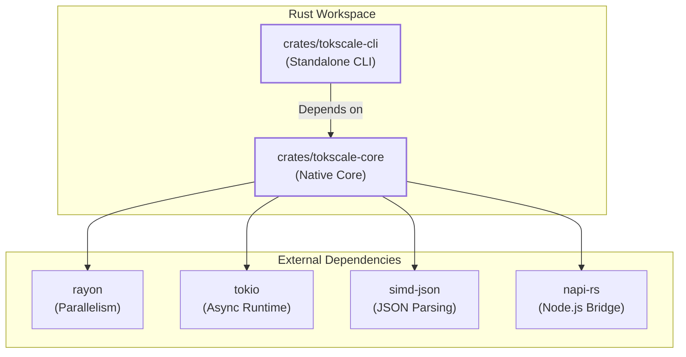
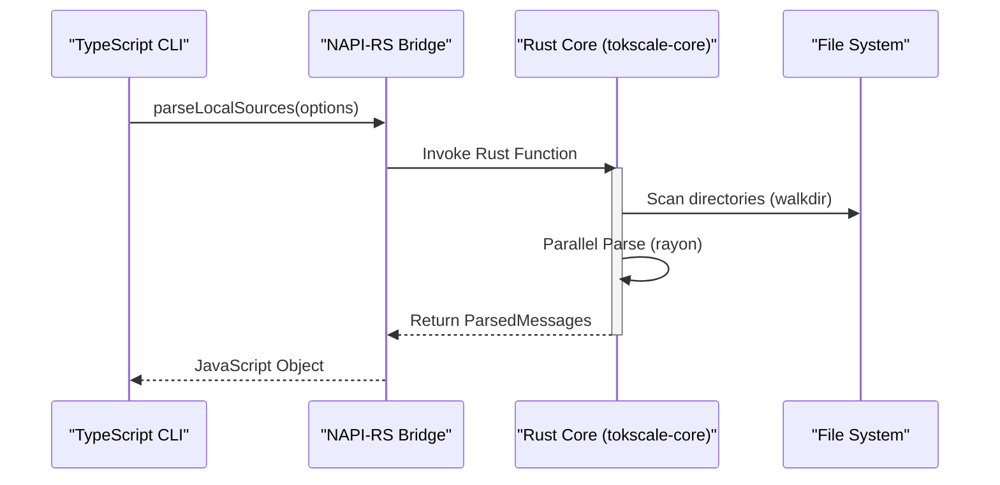

# Core Architecture and NAPI Integration

Relevant source files

The following files were used as context for generating this wiki page:

- [.github/assets/client-codebuff.png](.github/assets/client-codebuff.png)
- [Cargo.lock](Cargo.lock)
- [Cargo.toml](Cargo.toml)
- [crates/tokscale-cli/Cargo.toml](crates/tokscale-cli/Cargo.toml)
- [crates/tokscale-cli/src/auth.rs](crates/tokscale-cli/src/auth.rs)
- [crates/tokscale-cli/src/cursor.rs](crates/tokscale-cli/src/cursor.rs)
- [crates/tokscale-core/Cargo.toml](crates/tokscale-core/Cargo.toml)
- [crates/tokscale-core/src/fs_atomic.rs](crates/tokscale-core/src/fs_atomic.rs)
- [packages/cli-darwin-arm64/package.json](packages/cli-darwin-arm64/package.json)
- [packages/cli-darwin-x64/package.json](packages/cli-darwin-x64/package.json)
- [packages/cli-linux-arm64-gnu/package.json](packages/cli-linux-arm64-gnu/package.json)
- [packages/cli-linux-arm64-musl/package.json](packages/cli-linux-arm64-musl/package.json)
- [packages/cli-linux-x64-gnu/package.json](packages/cli-linux-x64-gnu/package.json)
- [packages/cli-linux-x64-musl/package.json](packages/cli-linux-x64-musl/package.json)
- [packages/cli-win32-arm64-msvc/package.json](packages/cli-win32-arm64-msvc/package.json)
- [packages/cli-win32-x64-msvc/package.json](packages/cli-win32-x64-msvc/package.json)

## Purpose and Scope

This document details the core architecture of the native Rust module and its integration with the TypeScript CLI via NAPI-RS. It covers the Rust workspace structure, crate organization, and the execution model that bridges the high-performance Rust core with the TypeScript CLI.

The native core provides the heavy lifting for session parsing, pricing lookups, and data aggregation, utilizing libraries like `rayon` for parallelism, `tokio` for async I/O, and `simd-json` for high-speed data processing.

---

## Workspace Structure and Crate Organization

Tokscale is organized as a Rust workspace with two primary crates that handle different aspects of the system.

### Key Crate Responsibilities

| Crate | Role | Key Dependencies |
|-------|------|------------------|
| `tokscale-core` | The engine for parsing and pricing. It is compiled as a Node.js native addon using NAPI-RS. | `napi`, `simd-json`, `rayon`, `reqwest` |
| `tokscale-cli` | A standalone binary implementation of the CLI features, including the TUI and Cursor sync. | `ratatui`, `clap`, `tokio`, `rusqlite` |

**Sources:** [Cargo.toml:1-6](), [Cargo.toml:15-17]()

---

## Dependency Architecture

Tokscale leverages specific high-performance Rust libraries to ensure rapid processing of large session files.

### Parallelism with `rayon`
Used for CPU-bound tasks such as parsing thousands of local session files. It enables data-parallelism by automatically distributing work across all available CPU cores.
- **Used in**: Session parsing and local file scanning.

### Async Runtime with `tokio`
Used for I/O-bound tasks, primarily network requests to pricing APIs (LiteLLM, OpenRouter) and the Tokscale backend.
- **Used in**: `PricingService`, `auth.rs` [crates/tokscale-cli/src/auth.rs:219-248](), and Cursor synchronization [crates/tokscale-cli/src/cursor.rs:10-27]().

### JSON Processing with `simd-json`
Used for high-speed JSON parsing. Many AI clients (like OpenCode or Claude) store sessions in large JSON files. `simd-json` uses SIMD instructions to parse these significantly faster than standard `serde_json`.
- **Used in**: Core parsing logic.

**Sources:** [Cargo.toml:19-23](), [Cargo.toml:44]()

---

## NAPI-RS Bridge and Binary Loading

The native core is packaged as `@tokscale/core`. It includes an auto-generated `index.js` loader that handles platform-specific binary resolution.

### Platform Targets
The system builds native binaries for multiple architectures to ensure the CLI works across different environments:
- **macOS**: `x64`, `arm64` [packages/cli-darwin-x64/package.json:7-12](), [packages/cli-darwin-arm64/package.json:7-12]()
- **Linux**: `x64`, `arm64` with both `gnu` and `musl` support [packages/cli-linux-x64-gnu/package.json:7-15](), [packages/cli-linux-arm64-musl/package.json:7-15]()
- **Windows**: `x64`, `arm64` [packages/cli-win32-x64-msvc/package.json:7-12](), [packages/cli-win32-arm64-msvc/package.json:7-12]()

### Execution Model: TypeScript to Rust
The CLI interacts with the native core through a subprocess model or direct NAPI calls.

**Sources:** [Cargo.toml:32](), [Cargo.toml:88-93]()

---

## Core System Entities

The following table bridges natural language concepts to specific code entities within the Rust core and CLI.

| Concept | Code Entity | File |
|---------|-------------|------|
| **Native Entry Point** | `#[napi]` functions | `crates/tokscale-core/src/lib.rs` |
| **Cursor Sync** | `SyncCursorResult`, `CURSOR_HTTP_TIMEOUT` | [crates/tokscale-cli/src/cursor.rs:14-89]() |
| **Authentication** | `ApiTokenAuth`, `login()` | [crates/tokscale-cli/src/auth.rs:31-219]() |
| **Atomic FS** | `atomic_write_file` | [crates/tokscale-cli/src/cursor.rs:161-218]() |
| **Pricing Engine** | `PricingService` | `crates/tokscale-core/src/pricing.rs` |

---

## Performance Optimizations

### Release Profile
The Rust core is compiled with aggressive optimizations to minimize the overhead of native execution:
- **LTO (Link Time Optimization)**: Enabled to optimize across crate boundaries [Cargo.toml:89]().
- **Codegen Units**: Set to 1 to maximize optimization potential [Cargo.toml:91]().
- **Strip**: Debug symbols are stripped to reduce binary size for distribution [Cargo.toml:92]().

### Atomic File Operations
To prevent data corruption during synchronization (especially for Cursor data), the system uses an atomic write pattern:
1. Write to a temporary file [crates/tokscale-cli/src/cursor.rs:176-195]().
2. Use `fs::rename` to overwrite the target file atomically [crates/tokscale-cli/src/cursor.rs:197-216]().

**Sources:** [Cargo.toml:88-93](), [crates/tokscale-cli/src/cursor.rs:161-218]()
