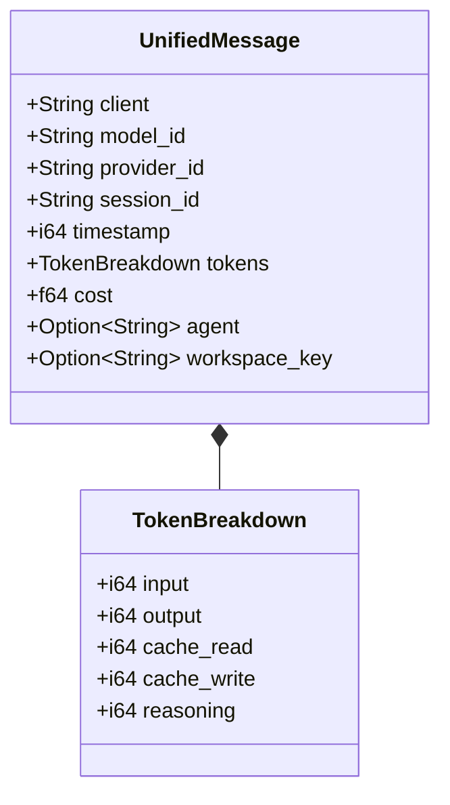
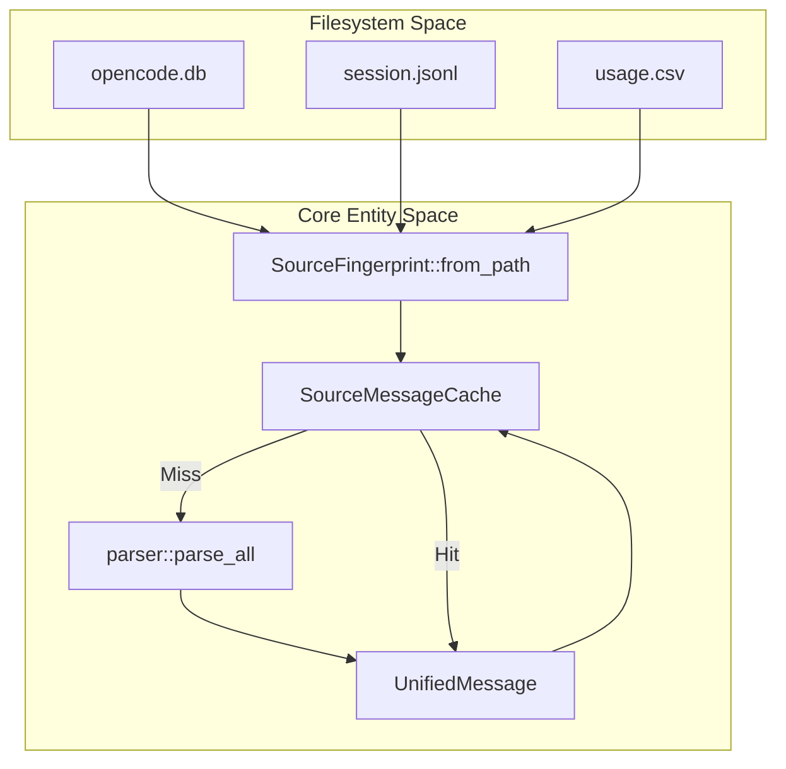

# Session Parsing and Data Sources

Relevant source files

The following files were used as context for generating this wiki page:

- [AGENTS.md](AGENTS.md)
- [crates/tokscale-cli/src/tui/ui/hourly_profile.rs](crates/tokscale-cli/src/tui/ui/hourly_profile.rs)
- [crates/tokscale-cli/tests/cli_tests.rs](crates/tokscale-cli/tests/cli_tests.rs)
- [crates/tokscale-core/src/message_cache.rs](crates/tokscale-core/src/message_cache.rs)
- [crates/tokscale-core/src/parser.rs](crates/tokscale-core/src/parser.rs)
- [crates/tokscale-core/src/sessions/amp.rs](crates/tokscale-core/src/sessions/amp.rs)
- [crates/tokscale-core/src/sessions/claudecode.rs](crates/tokscale-core/src/sessions/claudecode.rs)
- [crates/tokscale-core/src/sessions/codex.rs](crates/tokscale-core/src/sessions/codex.rs)
- [crates/tokscale-core/src/sessions/cursor.rs](crates/tokscale-core/src/sessions/cursor.rs)
- [crates/tokscale-core/src/sessions/droid.rs](crates/tokscale-core/src/sessions/droid.rs)
- [crates/tokscale-core/src/sessions/gemini.rs](crates/tokscale-core/src/sessions/gemini.rs)
- [crates/tokscale-core/src/sessions/goose.rs](crates/tokscale-core/src/sessions/goose.rs)
- [crates/tokscale-core/src/sessions/kilo.rs](crates/tokscale-core/src/sessions/kilo.rs)
- [crates/tokscale-core/src/sessions/kilocode.rs](crates/tokscale-core/src/sessions/kilocode.rs)
- [crates/tokscale-core/src/sessions/mux.rs](crates/tokscale-core/src/sessions/mux.rs)
- [crates/tokscale-core/src/sessions/openclaw.rs](crates/tokscale-core/src/sessions/openclaw.rs)
- [crates/tokscale-core/src/sessions/opencode.rs](crates/tokscale-core/src/sessions/opencode.rs)
- [crates/tokscale-core/src/sessions/qwen.rs](crates/tokscale-core/src/sessions/qwen.rs)
- [crates/tokscale-core/src/sessions/roocode.rs](crates/tokscale-core/src/sessions/roocode.rs)
- [crates/tokscale-core/src/sessions/synthetic.rs](crates/tokscale-core/src/sessions/synthetic.rs)
- [crates/tokscale-core/src/sessions/zed.rs](crates/tokscale-core/src/sessions/zed.rs)

## Purpose and Scope

This page documents how the native Rust core parses session data from over 25 supported AI coding assistant clients. It details the unified message format, the specific implementation logic for diverse data sources (JSONL streams, SQLite databases, CSV exports), and the high-performance parallel processing architecture.

For information about the pricing system that calculates costs for parsed messages, see **3.4.3 Pricing System**. For details on aggregation, see **3.4.4 Report Generation and Aggregation**.

## Unified Message Format

All session data from disparate sources is normalized into a common `UnifiedMessage` structure. This enables consistent aggregation and cost calculation regardless of whether the source was a local SQLite DB or a cloud-synced CSV.

### Core Data Structure

The parser converts all raw entries into the `UnifiedMessage` format within the Rust core:

| Field | Type | Description |
|-------|------|-------------|
| `client` | String | Platform identifier (e.g., `opencode`, `claudecode`, `cursor`, `gemini`, `zed`) |
| `model_id` | String | Model name (e.g., `claude-3-7-sonnet-20250219`, `gpt-4o`) |
| `provider_id` | String | Provider name (e.g., `anthropic`, `openai`, `google`, `synthetic`) |
| `session_id` | String | Unique conversation identifier |
| `timestamp` | i64 | Unix timestamp in milliseconds |
| `tokens` | TokenBreakdown | Struct containing input, output, cache_read, cache_write, and reasoning tokens |
| `cost` | f64 | Calculated or reported cost of the message |
| `agent` | Option<String> | Specific agent/subagent name (e.g., `architect`, `coder`) |
| `workspace_key` | Option<String> | Normalized path to the project directory |

**Sources:** [crates/tokscale-core/src/parser.rs:1-50](), [crates/tokscale-core/src/sessions/opencode.rs:161-180]()

### Token Breakdown Entity

The `TokenBreakdown` struct provides a detailed view of usage, specifically tracking modern features like prompt caching and reasoning tokens.

**Sources:** [crates/tokscale-core/src/parser.rs:10-30]()

## Data Source Overview

Tokscale supports a wide array of clients, each with unique storage patterns. The core categorizes these into three primary parsing strategies:

| Strategy | Clients | Implementation Detail |
|----------|---------|-----------------------|
| **JSONL Streams** | Claude Code, Codex, Zed, Goose, Qwen | Line-by-line parsing of event logs. |
| **SQLite DBs** | OpenCode, Kilo, Octofriend, Roo Code | Relational queries against local databases. |
| **File Trees** | Gemini, Amp, Droid, OpenClaw | Recursive scanning of session/thread JSON files. |
| **CSV Exports** | Cursor | Parsing of multi-versioned CSV usage reports. |

**Sources:** [crates/tokscale-core/src/parser.rs:100-250](), [crates/tokscale-core/src/sessions/cursor.rs:1-11]()

## Key Parser Implementations

### Claude Code (JSONL)
Claude Code stores sessions in `~/.claude/projects/`. The parser (`claudecode.rs`) handles complex subagent relationships. It uses a three-tier resolution strategy for agent names:
1. Checking sibling `.meta.json` sidecar files.
2. Scanning parent sessions for `tool_use` events that spawned the subagent.
3. Falling back to a generic `claude-code-subagent` label.

**Sources:** [crates/tokscale-core/src/sessions/claudecode.rs:1-111]()

### OpenCode & Kilo (SQLite)
OpenCode (1.2+) and Kilo use SQLite databases located in `~/.local/share/`. The `parse_opencode_sqlite` function executes queries to extract assistant messages. It includes a sophisticated fingerprinting system to deduplicate messages between the SQLite DB and legacy JSON files.

**Sources:** [crates/tokscale-core/src/sessions/opencode.rs:182-230](), [crates/tokscale-core/src/sessions/kilo.rs:53-155]()

### Codex (Stateful JSONL)
Codex parsing is stateful. Because Codex logs cumulative token totals or deltas in an event stream, the `CodexParseState` tracks the `previous_totals` to calculate the actual increment for each event. It also includes logic to handle "stale regressions" where snapshots arrive out of order.

**Sources:** [crates/tokscale-core/src/sessions/codex.rs:66-163]()

### Cursor (CSV)
Cursor data is parsed from cached CSV files in `~/.config/tokscale/cursor-cache/`. The parser handles three distinct CSV versions (v1, v2, v3), identifying them by header field presence (e.g., the "Kind" or "Cloud Agent ID" columns).

**Sources:** [crates/tokscale-core/src/sessions/cursor.rs:72-196]()

## Incremental Parsing and Caching

To maintain high performance over thousands of files, Tokscale uses a `SourceMessageCache`.

### Fingerprinting
Every source file is fingerprinted using:
- File size and modification time (nanoseconds).
- Content hashes of sample points (start, middle, end).
- Sidecar file presence (e.g., `.meta.json` for Claude Code or `-wal` for SQLite).

**Sources:** [crates/tokscale-core/src/message_cache.rs:104-166]()

### Data Flow Pipeline

**Sources:** [crates/tokscale-core/src/message_cache.rs:240-300](), [crates/tokscale-core/src/parser.rs:300-350]()

## Parallel Execution Model

The core utilizes the `rayon` crate to parallelize parsing across all available CPU cores.

1. **Discovery**: The scanner identifies all relevant paths for enabled sources.
2. **Distribution**: Paths are distributed into a Rayon thread pool.
3. **SIMD Parsing**: Parsers like `opencode.rs` use `simd-json` for high-speed deserialization of JSON payloads.
4. **Aggregation**: Results are collected into a single vector of `UnifiedMessage` objects.

**Sources:** [crates/tokscale-core/src/parser.rs:350-400](), [crates/tokscale-core/src/sessions/opencode.rs:132-140]()

## Synthetic.new Detection
Tokscale includes specialized logic to detect and normalize messages routed through the `synthetic.new` gateway. It identifies these by checking for `hf:` prefixes in model IDs or specific provider IDs like `glhf` or `octofriend`. It then strips these prefixes to ensure the [Pricing System](3.4.3) can correctly identify the underlying model (e.g., converting `hf:deepseek-ai/DeepSeek-V3` to `deepseek-v3`).

**Sources:** [crates/tokscale-core/src/sessions/synthetic.rs:15-96]()

---

**Sources:**
- `crates/tokscale-core/src/sessions/claudecode.rs`
- `crates/tokscale-core/src/sessions/codex.rs`
- `crates/tokscale-core/src/sessions/opencode.rs`
- `crates/tokscale-core/src/sessions/cursor.rs`
- `crates/tokscale-core/src/sessions/gemini.rs`
- `crates/tokscale-core/src/sessions/kilo.rs`
- `crates/tokscale-core/src/sessions/synthetic.rs`
- `crates/tokscale-core/src/message_cache.rs`
- `crates/tokscale-core/src/parser.rs`
