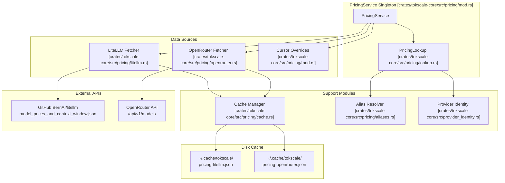
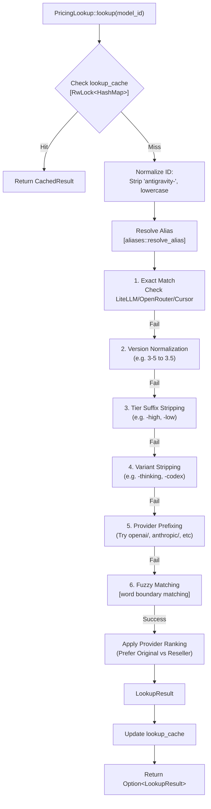
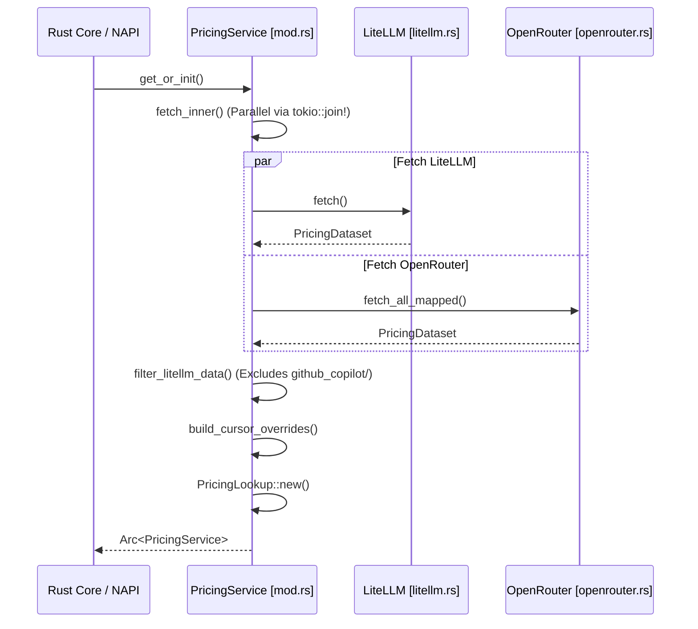

# Pricing System

<details>
<summary>Relevant source files</summary>

The following files were used as context for generating this wiki page:

- [crates/tokscale-cli/src/tui/cache.rs](crates/tokscale-cli/src/tui/cache.rs)
- [crates/tokscale-cli/src/tui/settings.rs](crates/tokscale-cli/src/tui/settings.rs)
- [crates/tokscale-core/src/pricing/aliases.rs](crates/tokscale-core/src/pricing/aliases.rs)
- [crates/tokscale-core/src/pricing/cache.rs](crates/tokscale-core/src/pricing/cache.rs)
- [crates/tokscale-core/src/pricing/litellm.rs](crates/tokscale-core/src/pricing/litellm.rs)
- [crates/tokscale-core/src/pricing/lookup.rs](crates/tokscale-core/src/pricing/lookup.rs)
- [crates/tokscale-core/src/pricing/mod.rs](crates/tokscale-core/src/pricing/mod.rs)
- [crates/tokscale-core/src/pricing/openrouter.rs](crates/tokscale-core/src/pricing/openrouter.rs)
- [crates/tokscale-core/src/provider_identity.rs](crates/tokscale-core/src/provider_identity.rs)
- [crates/tokscale-core/src/sessions/antigravity.rs](crates/tokscale-core/src/sessions/antigravity.rs)

</details>


The Pricing System is responsible for resolving AI model names to their cost structures and calculating token usage costs. It implements a sophisticated multi-step lookup algorithm that queries three pricing sources (LiteLLM, OpenRouter, and internal Cursor overrides), handles model name variations, resolves aliases, and applies provider preference rules to ensure accurate pricing from original model creators rather than resellers. The system operates as a singleton service within the Rust core and includes disk caching for performance.

## Architecture Overview

The pricing system consists of several core modules organized under `crates/tokscale-core/src/pricing/`:



**Sources:** [crates/tokscale-core/src/pricing/mod.rs:1-40](), [crates/tokscale-core/src/pricing/lookup.rs:81-166](), [crates/tokscale-core/src/pricing/litellm.rs:1-115](), [crates/tokscale-core/src/pricing/openrouter.rs:1-177](), [crates/tokscale-core/src/pricing/cache.rs:1-117]()

## Data Sources and Model Pricing Structure

The system queries three primary sources with different characteristics and fallback behavior:

| Source | Strategy | Models |
|--------|----------|--------|
| **LiteLLM** | Full dataset fetch from GitHub | ~1000+ models from all providers |
| **OpenRouter** | API fetch with author endpoint resolution | Author-specific pricing for known providers |
| **Cursor** | Static internal overrides | Specific Cursor models (e.g., `composer-2`, `gpt-5.3`) |

### ModelPricing Structure

All sources produce a unified `ModelPricing` structure which supports tiered pricing for high-context windows:

```rust
pub struct ModelPricing {
    pub input_cost_per_token: Option<f64>,
    pub input_cost_per_token_above_128k_tokens: Option<f64>,
    pub input_cost_per_token_above_200k_tokens: Option<f64>,
    // ... additional tiers for 256k and 272k
    pub output_cost_per_token: Option<f64>,
    pub cache_creation_input_token_cost: Option<f64>,
    pub cache_read_input_token_cost: Option<f64>,
}
```

**Sources:** [crates/tokscale-core/src/pricing/litellm.rs:11-28](), [crates/tokscale-core/src/pricing/mod.rs:62-99]()

## Pricing Lookup Algorithm

The `PricingLookup` structure implements a sophisticated resolution strategy with normalization and fallback mechanisms. It uses a tiered approach to ensure that specific provider matches are preferred over generic or reseller matches.

### Lookup Flow



**Sources:** [crates/tokscale-core/src/pricing/lookup.rs:168-213](), [crates/tokscale-core/src/pricing/lookup.rs:215-286](), [crates/tokscale-core/src/pricing/aliases.rs:4-41]()

### Provider Preference and Ranking

The system maintains lists of `ORIGINAL_PROVIDER_PREFIXES` and `RESELLER_PROVIDER_PREFIXES` to rank results when multiple matches are found.

- **Original Providers:** `x-ai/`, `anthropic/`, `openai/`, `google/`, `meta-llama/`, `deepseek/`, `mistralai/`, `z-ai/`, `qwen/`, `cohere/`, `perplexity/`, `moonshotai/`.
- **Resellers:** `azure/`, `bedrock/`, `vertex_ai/`, `together/`, `fireworks_ai/`, `groq/`, `openrouter/`.

The ranking logic ensures that if a model is available from both a reseller and the original author, the author's pricing (which is often more accurate or includes caching discounts) is used.

**Sources:** [crates/tokscale-core/src/pricing/lookup.rs:19-45](), [crates/tokscale-core/src/pricing/lookup.rs:261-285]()

## Caching Strategy

The system employs two distinct caching layers to balance startup speed with data freshness.

### 1. Persistent Disk Cache
Managed by `crates/tokscale-core/src/pricing/cache.rs`, this layer stores the raw datasets from LiteLLM and OpenRouter.
- **TTL:** 1 hour (`CACHE_TTL_SECS = 3600`).
- **Atomic Saves:** Uses a temporary file pattern (`.tmp` + rename) to prevent corruption during process crashes.
- **Legacy Fallback:** Checks legacy directory paths (e.g., `~/.cache/tokscale/`) for compatibility during upgrades.

**Sources:** [crates/tokscale-core/src/pricing/cache.rs:6-14](), [crates/tokscale-core/src/pricing/cache.rs:62-103]()

### 2. In-Memory Lookup Cache
The `PricingLookup` struct contains a `lookup_cache` protected by an `RwLock`.
- **Purpose:** Memoizes the results of the complex 6-step resolution algorithm.
- **Eviction Policy:** When the cache reaches `MAX_LOOKUP_CACHE_ENTRIES` (512), it evicts ~25% of entries to avoid a "thundering-herd" cache miss storm.

**Sources:** [crates/tokscale-core/src/pricing/lookup.rs:49-53](), [crates/tokscale-core/src/pricing/lookup.rs:192-213]()

## Cost Calculation

Cost calculation handles standard tokens, prompt caching, and reasoning tokens.

### Logic and Tiered Pricing
The `calculate_cost_with_provider` function accounts for context-window-based tiered pricing:
1. **Input Cost:** Applies the highest applicable tier (128k, 200k, 256k, 272k) based on total input tokens.
2. **Output/Reasoning:** Reasoning tokens are added to output tokens and priced at the output rate.
3. **Caching:** Specifically checks for `cache_read_input_token_cost` and `cache_creation_input_token_cost`.

```rust
// Calculation logic from lookup.rs
let input_cost = match input_tokens {
    t if t >= TIERED_PRICING_THRESHOLD_272K_TOKENS => pricing.input_cost_per_token_above_272k_tokens,
    t if t >= TIERED_PRICING_THRESHOLD_256K_TOKENS => pricing.input_cost_per_token_above_256k_tokens,
    // ... continues through tiers
}.or(pricing.input_cost_per_token).unwrap_or(0.0) * input_tokens as f64;
```

**Sources:** [crates/tokscale-core/src/pricing/lookup.rs:509-565](), [crates/tokscale-core/src/pricing/mod.rs:158-185]()

## Service Initialization

The `PricingService` is a singleton managed via `tokio::sync::OnceCell`.

### Initialization Flow



**Sources:** [crates/tokscale-core/src/pricing/mod.rs:102-138](), [crates/tokscale-core/src/pricing/mod.rs:46-56]()
