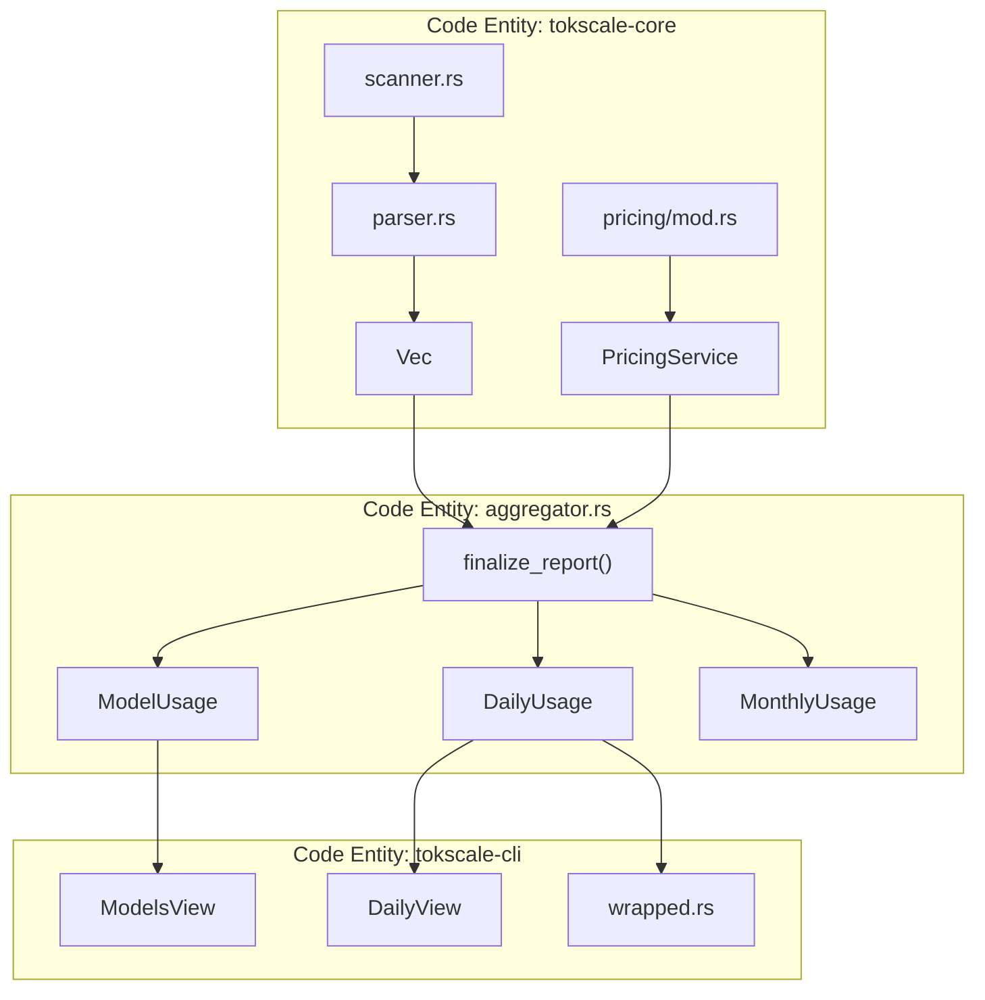
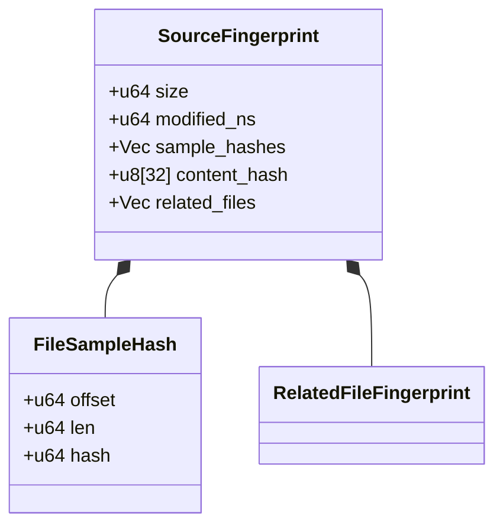

# Report Generation and Aggregation

Relevant source files

The following files were used as context for generating this wiki page:

- [AGENTS.md](AGENTS.md)
- [crates/tokscale-cli/src/commands/wrapped.rs](crates/tokscale-cli/src/commands/wrapped.rs)
- [crates/tokscale-cli/src/main.rs](crates/tokscale-cli/src/main.rs)
- [crates/tokscale-cli/src/tui/client_ui.rs](crates/tokscale-cli/src/tui/client_ui.rs)
- [crates/tokscale-cli/src/tui/data/mod.rs](crates/tokscale-cli/src/tui/data/mod.rs)
- [crates/tokscale-cli/src/tui/ui/widgets.rs](crates/tokscale-cli/src/tui/ui/widgets.rs)
- [crates/tokscale-cli/tests/cli_tests.rs](crates/tokscale-cli/tests/cli_tests.rs)
- [crates/tokscale-core/src/aggregator.rs](crates/tokscale-core/src/aggregator.rs)
- [crates/tokscale-core/src/clients.rs](crates/tokscale-core/src/clients.rs)
- [crates/tokscale-core/src/lib.rs](crates/tokscale-core/src/lib.rs)
- [crates/tokscale-core/src/message_cache.rs](crates/tokscale-core/src/message_cache.rs)
- [crates/tokscale-core/src/scanner.rs](crates/tokscale-core/src/scanner.rs)
- [crates/tokscale-core/src/sessions/codex.rs](crates/tokscale-core/src/sessions/codex.rs)
- [crates/tokscale-core/src/sessions/gemini.rs](crates/tokscale-core/src/sessions/gemini.rs)
- [crates/tokscale-core/src/sessions/mod.rs](crates/tokscale-core/src/sessions/mod.rs)
- [crates/tokscale-core/src/sessions/opencode.rs](crates/tokscale-core/src/sessions/opencode.rs)

This page documents the report generation and aggregation subsystem within the Native Rust Core (3.4). After session files have been parsed (see [Session Parsing and Data Sources](#3.4.2)) and pricing data has been resolved (see [Pricing System](#3.4.3)), the finalization functions aggregate this data into structured reports with cost calculations and visualization metrics.

---

## Overview

The report generation system operates as the final stage of the processing pipeline. It takes `UnifiedMessage` objects (token counts without pricing) and combines them with the `PricingService` to produce three primary outputs:

1.  **Model Report**: Aggregated by model and client, showing token usage and costs.
2.  **Monthly Report**: Aggregated by calendar month.
3.  **Graph Data**: Daily contribution intensity and streaks formatted for 2D/3D visualization.

**Sources:** [crates/tokscale-core/src/lib.rs:137-232](), [crates/tokscale-cli/src/tui/data/mod.rs:137-150]()

---

## Data Aggregation Architecture

The system uses a two-phase pipeline where the CLI or TUI requests specific views of the underlying session data.

**Sources:** [crates/tokscale-core/src/lib.rs:3-12](), [crates/tokscale-cli/src/tui/data/mod.rs:151-230]()

---

## Aggregation Strategies

The core supports several grouping strategies defined in the `GroupBy` enum. This determines the granularity of the reports and how models are displayed in the TUI.

| Strategy | Key Composition | Use Case |
| :--- | :--- | :--- |
| `Model` | `model_id` | Global model usage across all tools. |
| `ClientModel` | `client:model_id` | Usage per tool (e.g., Cursor vs. Claude Code). |
| `ClientProviderModel` | `client:provider:model_id` | Distinguishes between direct API vs. OpenRouter. |
| `WorkspaceModel` | `workspace:model_id` | Project-specific cost tracking. |

**Sources:** [crates/tokscale-core/src/lib.rs:99-135](), [crates/tokscale-cli/src/tui/data/mod.rs:189-214]()

---

## Key Aggregation Functions

### 1. Model Usage Aggregation
The `ModelUsage` struct tracks aggregated statistics for a specific model/client pair. It includes a `TokenBreakdown` which categorizes tokens into input, output, cache read, cache write, and reasoning.

**Implementation Details:**
- **Model Normalization**: The function `normalize_model_for_grouping` strips reasoning-effort suffixes (e.g., `(high)`) and date-based versioning (e.g., `-20241022`) to ensure consistent aggregation.
- **Cost Calculation**: Costs are applied at the message level before aggregation using the `PricingService`.

**Sources:** [crates/tokscale-core/src/lib.rs:52-86](), [crates/tokscale-cli/src/tui/data/mod.rs:48-58]()

### 2. Daily & Hourly Totals
For the TUI's "Daily" and "Hourly" views, data is bucketed by timestamp.
- **Daily**: Uses `NaiveDate` for keys. It tracks `source_breakdown` (a map of `DailySourceInfo`) to allow expanding a day to see which models contributed to that day's cost.
- **Hourly**: Uses `NaiveDateTime` truncated to the hour. It tracks `turn_count` (user interaction turns) vs. `message_count` (raw API calls).

**Sources:** [crates/tokscale-cli/src/tui/data/mod.rs:94-121]()

### 3. Contribution Graph & Intensity
The `GraphData` structure generates the data required for the "GitHub-style" contribution grid.

**Intensity Logic:**
Intensity is calculated on a scale of 0.0 to 1.0 based on the daily cost relative to the user's historical peak.
- **Level 0**: No activity.
- **Level 1-4**: Quadrants of the max daily cost recorded in the session history.

**Sources:** [crates/tokscale-cli/src/tui/data/mod.rs:123-134](), [crates/tokscale-cli/src/commands/wrapped.rs:36-40]()

---

## Message Cache and Fingerprinting

To maintain high performance across thousands of session files, `tokscale-core` implements a sophisticated caching layer in `message_cache.rs`.

### Fingerprinting Strategy
Before parsing a file, the system generates a `SourceFingerprint`. A file is only re-parsed if its fingerprint changes.

**Implementation Details:**
- **Sampling**: Instead of hashing the entire file (which is slow for large SQLite DBs), it takes 4KB samples at 5 different points in the file.
- **Sidecar Awareness**: For Claude Code, it tracks `.meta.json` files. For SQLite (OpenCode), it tracks `-wal` (Write-Ahead Log) files. If the WAL changes, the database is considered dirty and re-scanned.

**Sources:** [crates/tokscale-core/src/message_cache.rs:96-143](), [crates/tokscale-core/src/message_cache.rs:17-19]()

---

## Wrapped Report Generation

The `wrapped.rs` module handles the year-end "Wrapped" summary. It aggregates data specifically for visual rendering into a PNG.

**Data Flow for Wrapped:**
1.  **Load**: Calls `load_wrapped_data`, which uses `LocalParseOptions` filtered by `year`.
2.  **Filter**: Specifically looks for "Agents" (e.g., Sisyphus, Planner) using `normalize_agent_name`.
3.  **Rank**: Sorts `top_models` and `top_clients` by cost.
4.  **Streak**: Calculates the `longest_streak` by iterating through the sorted `DailyUsage` keys.

**Sources:** [crates/tokscale-cli/src/commands/wrapped.rs:54-85](), [crates/tokscale-cli/src/commands/wrapped.rs:160-215](), [crates/tokscale-core/src/sessions/mod.rs:58-95]()

---

## Technical Summary of Code Entities

| Code Entity | File Path | Role |
| :--- | :--- | :--- |
| `TokenBreakdown` | `crates/tokscale-core/src/lib.rs` | Primitive struct for input/output/cache/reasoning tokens. |
| `SourceFingerprint` | `crates/tokscale-core/src/message_cache.rs` | Logic for invalidating cache based on file size/mtime/samples. |
| `DataLoader` | `crates/tokscale-cli/src/tui/data/mod.rs` | High-level orchestrator that calls the Rust core and transforms results for the UI. |
| `normalize_model_for_grouping` | `crates/tokscale-core/src/lib.rs` | String manipulation to merge model variants (e.g., `gpt-4o-2024-05-13` -> `gpt-4o`). |
| `CodexParseState` | `crates/tokscale-core/src/sessions/codex.rs` | Tracks cumulative token deltas to handle stateful session files. |

**Sources:** [crates/tokscale-core/src/lib.rs:52-86](), [crates/tokscale-core/src/lib.rs:138-144](), [crates/tokscale-core/src/message_cache.rs:104-110](), [crates/tokscale-core/src/sessions/codex.rs:153-163]()
