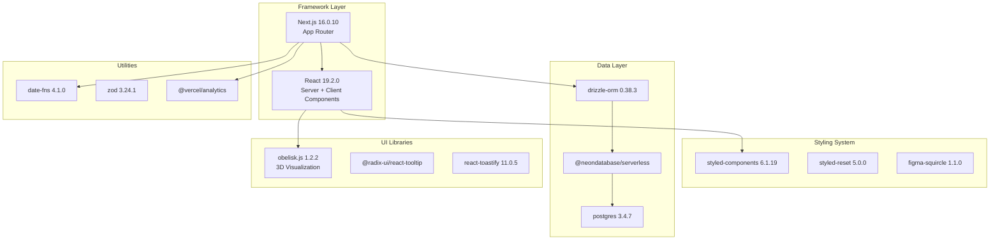
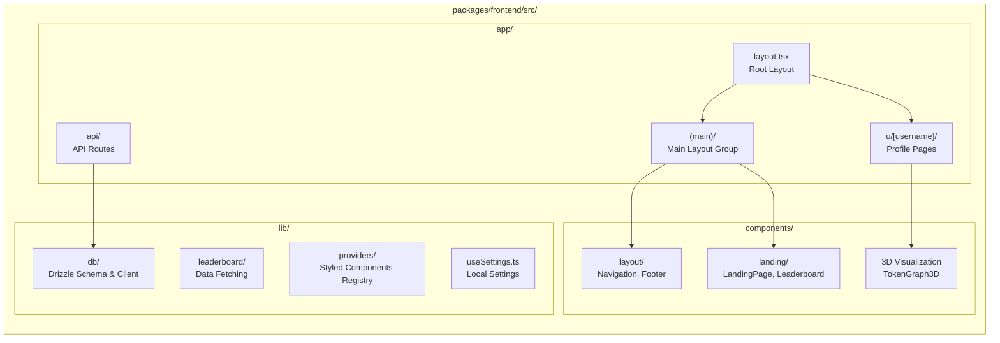

# Frontend Web Application

Relevant source files

The following files were used as context for generating this wiki page:

- [bun.lock](bun.lock)
- [packages/frontend/package.json](packages/frontend/package.json)
- [packages/frontend/src/app/(main)/page.tsx](packages/frontend/src/app/(main)/page.tsx)
- [packages/frontend/src/app/layout.tsx](packages/frontend/src/app/layout.tsx)
- [packages/frontend/src/components/BlackholeHero.tsx](packages/frontend/src/components/BlackholeHero.tsx)
- [packages/frontend/src/components/Switch.tsx](packages/frontend/src/components/Switch.tsx)
- [packages/frontend/src/components/layout/Navigation.tsx](packages/frontend/src/components/layout/Navigation.tsx)
- [packages/frontend/src/lib/db/index.ts](packages/frontend/src/lib/db/index.ts)
- [packages/frontend/src/lib/providers/Providers.tsx](packages/frontend/src/lib/providers/Providers.tsx)
- [packages/frontend/src/lib/providers/index.ts](packages/frontend/src/lib/providers/index.ts)
- [packages/frontend/src/lib/useSettings.ts](packages/frontend/src/lib/useSettings.ts)

The Frontend Web Application is a Next.js-based web platform hosted at [tokscale.ai](https://tokscale.ai) that provides social features for viewing and comparing AI token usage data. It implements a public leaderboard system, user profile pages with contribution visualizations, and GitHub OAuth authentication. For information about the CLI tool, see [CLI Tool](#3). For backend API implementation details, see [API Routes](#5).

## Application Stack and Technology

The frontend is built with Next.js 16.0.10 using the App Router architecture, React 19.2.0, and TypeScript. It leverages Server Components for initial page loads and Incremental Static Regeneration (ISR) for performance optimization.

**Sources:** [packages/frontend/package.json:15-33](), [packages/frontend/src/app/layout.tsx:1-5]()

## Project Structure

The frontend package follows Next.js App Router conventions with a clear separation between server logic, client components, and shared libraries.

**Sources:** [packages/frontend/src/app/layout.tsx:62-75](), [packages/frontend/src/app/(main)/page.tsx:1-45]()

## Application Structure

The application utilizes Next.js Server Components for data fetching and `styled-components` for UI rendering. It employs a singleton pattern for database connections optimized for serverless environments. For details, see [Application Structure](#4.1).

[packages/frontend/src/lib/db/index.ts:21-51]() implements a serverless-optimized connection pool:
- `max: 1`: Limits connections per function instance.
- `prepare: false`: Disables prepared statements to avoid state issues in serverless.

**Sources:** [packages/frontend/src/lib/db/index.ts:21-51](), [packages/frontend/src/lib/providers/Providers.tsx:9-53]()

## Leaderboard Page

The leaderboard is the central social feature of Tokscale, allowing users to compare token usage and costs across different periods (All-time, Month, Week). For details, see [Leaderboard Page](#4.2).

The `HomePage` fetches top users by both cost and tokens in parallel using `getLeaderboardData` [packages/frontend/src/app/(main)/page.tsx:28-33]().

**Sources:** [packages/frontend/src/app/(main)/page.tsx:6-33]()

## User Profile Pages

User profiles provide a deep dive into an individual's AI usage, featuring contribution graphs and model breakdowns. For details, see [User Profile Pages](#4.3).

Profiles include:
- **Contribution Graphs**: Isometric 3D visualizations of activity.
- **Model Usage**: Statistics on which LLMs the user interacts with most.
- **Embed Dialog**: Tools for users to share their stats via SVG cards or badges.

## Navigation and Layout

The `Navigation` component [packages/frontend/src/components/layout/Navigation.tsx:28-61]() provides a persistent header with a glassmorphism effect and responsive mobile menu. It handles user authentication states, showing a `SignInButton` [packages/frontend/src/components/layout/Navigation.tsx:173-196]() or a `ProfileButton` with a dropdown menu. For details, see [Navigation and Layout](#4.4).

**Sources:** [packages/frontend/src/components/layout/Navigation.tsx:28-61](), [packages/frontend/src/app/layout.tsx:62-75]()

## 3D Visualization Components

Tokscale features unique 3D visualizations for token usage data using `obelisk.js`. These include the `TokenGraph3D` component which renders isometric contribution bars. For details, see [3D Visualization Components](#4.5).

**Sources:** [packages/frontend/package.json:25](), [packages/frontend/src/lib/utils.ts:20-119]()

## Embeddable Profile Cards and Badges

The system provides dynamic SVG endpoints for embedding statistics in GitHub READMEs or personal websites. This includes 2D/3D profile cards and shields.io-style badges. For details, see [Embeddable Profile Cards and Badges](#4.6).

## Local Settings Management

Client-side settings, such as the preferred color palette and leaderboard sorting preference, are managed via the `useSettings` hook [packages/frontend/src/lib/useSettings.ts:111-144]().

- **Persistence**: Settings are stored in `localStorage` [packages/frontend/src/lib/useSettings.ts:68-79]().
- **Syncing**: Uses `useSyncExternalStore` to keep multiple components in sync [packages/frontend/src/lib/useSettings.ts:112-121]().
- **Cookie Sync**: Leaderboard sort preferences are mirrored to cookies for server-side consistency [packages/frontend/src/lib/useSettings.ts:30-33]().

**Sources:** [packages/frontend/src/lib/useSettings.ts:1-145]()
