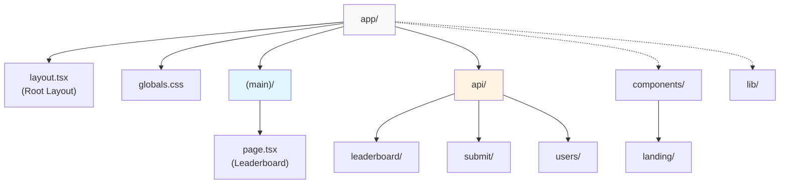
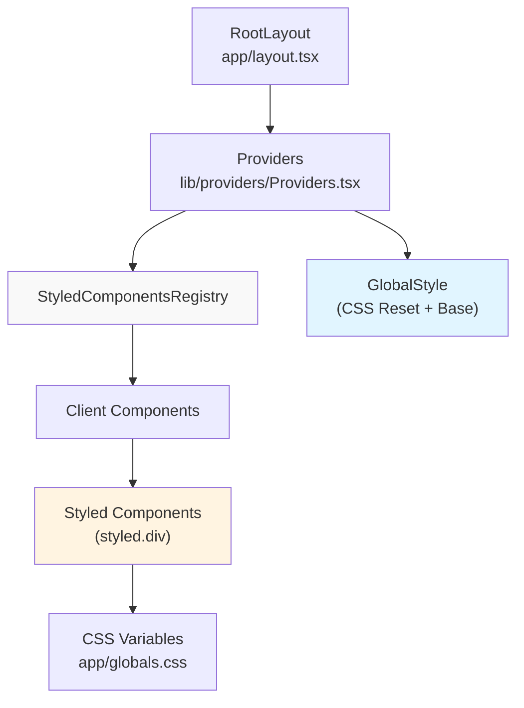
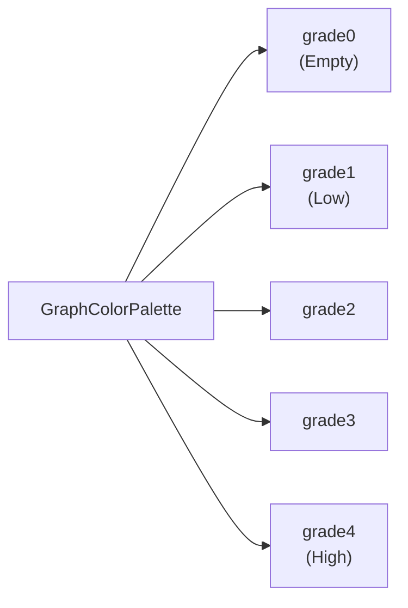

# Application Structure

Relevant source files

The following files were used as context for generating this wiki page:

- [bun.lock](bun.lock)
- [packages/frontend/next.config.ts](packages/frontend/next.config.ts)
- [packages/frontend/package.json](packages/frontend/package.json)
- [packages/frontend/postcss.config.mjs](packages/frontend/postcss.config.mjs)
- [packages/frontend/public/assets/landing/client-logos-grid.svg](packages/frontend/public/assets/landing/client-logos-grid.svg)
- [packages/frontend/src/app/globals.css](packages/frontend/src/app/globals.css)
- [packages/frontend/src/app/layout.tsx](packages/frontend/src/app/layout.tsx)
- [packages/frontend/src/components/DataInput.tsx](packages/frontend/src/components/DataInput.tsx)
- [packages/frontend/src/components/Skeleton.tsx](packages/frontend/src/components/Skeleton.tsx)
- [packages/frontend/src/components/landing/LandingPage.tsx](packages/frontend/src/components/landing/LandingPage.tsx)
- [packages/frontend/src/components/landing/sections/DescriptionSection.tsx](packages/frontend/src/components/landing/sections/DescriptionSection.tsx)
- [packages/frontend/src/components/landing/sections/FollowSection.tsx](packages/frontend/src/components/landing/sections/FollowSection.tsx)
- [packages/frontend/src/components/landing/sections/FooterSection.tsx](packages/frontend/src/components/landing/sections/FooterSection.tsx)
- [packages/frontend/src/components/landing/sections/HeroSection.tsx](packages/frontend/src/components/landing/sections/HeroSection.tsx)
- [packages/frontend/src/lib/providers/Providers.tsx](packages/frontend/src/lib/providers/Providers.tsx)
- [packages/frontend/src/lib/providers/index.ts](packages/frontend/src/lib/providers/index.ts)
- [packages/frontend/src/lib/themes.ts](packages/frontend/src/lib/themes.ts)

## Purpose and Scope

This document describes the frontend application structure of the Tokscale web platform, focusing on the Next.js App Router architecture, component organization, styling system, and rendering strategies. It covers how the application leverages Server Components, Incremental Static Regeneration (ISR), and `styled-components` to create a performant web experience.

For information about specific pages like the leaderboard and user profiles, see [Leaderboard Page](#4.2) and [User Profile Pages](#4.3). For API endpoint implementations, see [API Routes](#5). For database schema details, see [Database Schema](#6).

## Next.js App Router Structure

The frontend uses Next.js 16.0.10 with the App Router paradigm, organizing files under [packages/frontend/src/app/]() using file-system based routing conventions.

**Directory Structure:**

**Sources:** [packages/frontend/package.json:23](), [packages/frontend/src/app/layout.tsx:1-76](), [packages/frontend/src/app/globals.css:1-105]()

## Root Layout and Global Configuration

The `RootLayout` [packages/frontend/src/app/layout.tsx:62-75]() serves as the entry point for all pages, managing global metadata, fonts, and provider injection.

*   **Fonts**: Uses `Figtree` for UI text and `JetBrains_Mono` for code/data, configured as CSS variables [packages/frontend/src/app/layout.tsx:10-20]().
*   **TopLoader**: Integrated `nextjs-toploader` for visual navigation feedback [packages/frontend/src/app/layout.tsx:66]().
*   **Providers**: Wraps children in the `Providers` component [packages/frontend/src/app/layout.tsx:67]().

**Sources:** [packages/frontend/src/app/layout.tsx:10-75](), [packages/frontend/src/app/globals.css:46-62]()

## Styling System with styled-components

The application uses `styled-components` v6.1.19 for CSS-in-JS styling with proper Server Component support through a dedicated registry.

**Styling Architecture:**

The `Providers` component [packages/frontend/src/lib/providers/Providers.tsx:55-62]() ensures that global styles and the styled-components registry are available to the entire tree. Base styling is defined in [packages/frontend/src/app/globals.css](), utilizing CSS custom properties for theming (e.g., `--color-bg-default`, `--color-primary`) [packages/frontend/src/app/globals.css:1-44]().

**Sources:** [packages/frontend/src/lib/providers/Providers.tsx:1-62](), [packages/frontend/src/app/globals.css:1-44](), [packages/frontend/package.json:31]()

## Landing Page Architecture

The landing page is organized into modular sections under [packages/frontend/src/components/landing/sections/](). The `LandingPage` component [packages/frontend/src/components/landing/LandingPage.tsx:20-40]() composes these sections into a vertical flow.

### Key Sections
| Section | Component | Purpose |
| :--- | :--- | :--- |
| **Hero** | `HeroSection` | Above-the-fold content with "Kardashev Scale" branding and GitHub star count [packages/frontend/src/components/landing/sections/HeroSection.tsx:11-153](). |
| **Description** | `DescriptionSection` | High-level overview of the CLI tool and supported AI coding clients [packages/frontend/src/components/landing/sections/DescriptionSection.tsx:6-38](). |
| **Worldwide** | `WorldwideSection` | Displays the leaderboard preview (Top Users by Cost/Tokens) [packages/frontend/src/components/landing/LandingPage.tsx:30-33](). |
| **Follow** | `FollowSection` | GitHub call-to-action with 3D avatar and project branding [packages/frontend/src/components/landing/sections/FollowSection.tsx:6-53](). |

**Sources:** [packages/frontend/src/components/landing/LandingPage.tsx:5-12](), [packages/frontend/src/components/landing/sections/HeroSection.tsx:33-50]()

## Interactive and State-Managed Components

Components requiring browser-side interactivity use the `"use client"` directive.

### Data Loading and Skeletons
To handle async data states gracefully, the app uses custom skeleton components. `LeaderboardSkeleton` and `ProfileSkeleton` [packages/frontend/src/components/Skeleton.tsx:93-242]() replicate the layout of their respective pages using a pulsing animation [packages/frontend/src/components/Skeleton.tsx:5-12]().

### Data Input and Validation
The `DataInput` component [packages/frontend/src/components/DataInput.tsx:219-253]() provides a client-side interface for pasting JSON usage data. It includes:
*   **Validation**: Uses `isValidContributionData` to verify the JSON structure [packages/frontend/src/components/DataInput.tsx:235-238]().
*   **Sample Data**: Ability to fetch and load sample datasets for demonstration [packages/frontend/src/components/DataInput.tsx:246-251]().

**Sources:** [packages/frontend/src/components/Skeleton.tsx:1-253](), [packages/frontend/src/components/DataInput.tsx:1-253]()

## Visual Themes and Palettes

The platform supports multiple color palettes for contribution graphs, defined in [packages/frontend/src/lib/themes.ts]().

**Color Palette Mapping:**

The system includes themes like `green`, `halloween`, `teal`, `blue`, and `monochrome` [packages/frontend/src/lib/themes.ts:23-96](). The `getGradeColor` function [packages/frontend/src/lib/themes.ts:106-109]() maps usage intensity to a specific color from the selected palette.

**Sources:** [packages/frontend/src/lib/themes.ts:1-110]()
