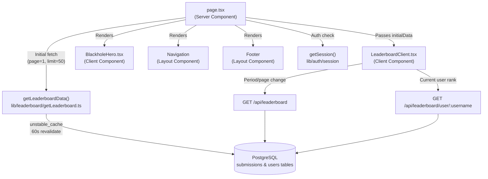
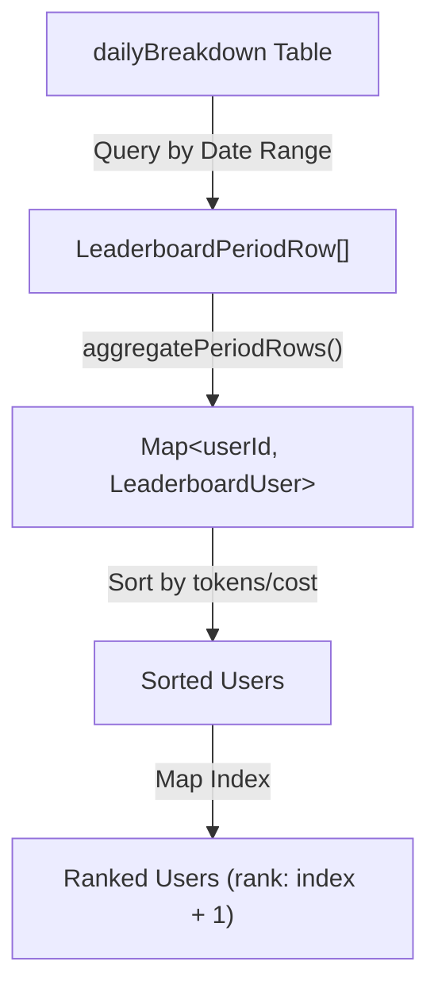
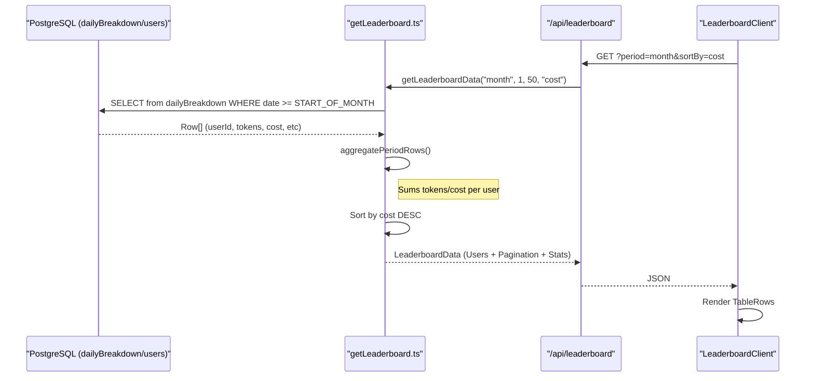

# Leaderboard Page

Relevant source files

The following files were used as context for generating this wiki page:

- [crates/tokscale-core/src/sessions/crush.rs](crates/tokscale-core/src/sessions/crush.rs)
- [packages/frontend/__tests__/api/leaderboard.test.ts](packages/frontend/__tests__/api/leaderboard.test.ts)
- [packages/frontend/__tests__/api/usersProfile.test.ts](packages/frontend/__tests__/api/usersProfile.test.ts)
- [packages/frontend/__tests__/lib/getLeaderboard.test.ts](packages/frontend/__tests__/lib/getLeaderboard.test.ts)
- [packages/frontend/__tests__/lib/getLeaderboardAllTime.test.ts](packages/frontend/__tests__/lib/getLeaderboardAllTime.test.ts)
- [packages/frontend/__tests__/lib/submissionFreshness.test.ts](packages/frontend/__tests__/lib/submissionFreshness.test.ts)
- [packages/frontend/src/app/(main)/leaderboard/LeaderboardClient.tsx](packages/frontend/src/app/(main)/leaderboard/LeaderboardClient.tsx)
- [packages/frontend/src/app/(main)/leaderboard/page.tsx](packages/frontend/src/app/(main)/leaderboard/page.tsx)
- [packages/frontend/src/app/api/leaderboard/route.ts](packages/frontend/src/app/api/leaderboard/route.ts)
- [packages/frontend/src/app/api/leaderboard/user/[username]/route.ts](packages/frontend/src/app/api/leaderboard/user/[username]/route.ts)
- [packages/frontend/src/components/landing/hooks/useSquircleClip.ts](packages/frontend/src/components/landing/hooks/useSquircleClip.ts)
- [packages/frontend/src/components/landing/sections/QuickstartSection.tsx](packages/frontend/src/components/landing/sections/QuickstartSection.tsx)
- [packages/frontend/src/components/landing/sections/WorldwideSection.tsx](packages/frontend/src/components/landing/sections/WorldwideSection.tsx)
- [packages/frontend/src/components/ui/Icons.tsx](packages/frontend/src/components/ui/Icons.tsx)
- [packages/frontend/src/lib/leaderboard/getLeaderboard.ts](packages/frontend/src/lib/leaderboard/getLeaderboard.ts)
- [packages/frontend/src/lib/leaderboard/types.ts](packages/frontend/src/lib/leaderboard/types.ts)
- [packages/frontend/vercel.json](packages/frontend/vercel.json)

## Purpose and Scope

The Leaderboard Page is the main landing page of the tokscale.ai web application, displaying global rankings of users based on their AI token usage. This page allows users to compare their token consumption with others through period-based filtering (All Time, This Month, This Week), view aggregate statistics, and see their personal ranking when authenticated. Additionally, a simplified "Worldwide" leaderboard is featured on the landing page to provide immediate social proof and community scale.

Sources: [packages/frontend/src/app/(main)/leaderboard/page.tsx:39-61](), [packages/frontend/src/components/landing/sections/WorldwideSection.tsx:31-189]()

## Page Architecture

The leaderboard page follows Next.js App Router conventions with a hybrid Server Component + Client Component architecture. The page leverages Incremental Static Regeneration (ISR) to balance performance and data freshness.

**Component Hierarchy:**

| Component | Type | Responsibility |
|-----------|------|---------------|
| `page.tsx` | Server Component | Initial data fetching, SEO, ISR configuration |
| `LeaderboardClient` | Client Component | Interactive filtering, pagination, user actions |
| `BlackholeHero` | Client Component | Visual branding, CLI command copy |
| `Navigation` | Layout Component | Global navigation header |
| `Footer` | Layout Component | Site footer with links |

Sources: [packages/frontend/src/app/(main)/leaderboard/page.tsx:39-101](), [packages/frontend/src/app/(main)/leaderboard/LeaderboardClient.tsx:1-400]()

## Ranking and Period System

The ranking system is calculated dynamically based on user submissions. The core logic resides in `getLeaderboard.ts`, which handles both all-time and period-scoped queries.

### Period Calculation
Periods are mapped to specific UTC date ranges at [packages/frontend/src/lib/leaderboard/getLeaderboard.ts:65-91]():
- **Week**: Last 7 days including today.
- **Month**: From the first day of the current UTC month to today.
- **All**: No date range restriction.

### Data Aggregation
For period-based leaderboards, the system queries the `dailyBreakdown` table and aggregates rows by `userId` in memory at [packages/frontend/src/lib/leaderboard/getLeaderboard.ts:117-160](). This aggregation ensures that if a user has multiple submission sources, their tokens and costs are summed correctly for the ranking.

Sources: [packages/frontend/src/lib/leaderboard/getLeaderboard.ts:65-91](), [packages/frontend/src/lib/leaderboard/getLeaderboard.ts:117-160]()

## Worldwide Landing Section

The landing page includes a "Worldwide" section (`WorldwideSection.tsx`) that acts as a mini-leaderboard. It features a high-performance visual display and tabbed ranking.

**Key Features:**
- **Tabbed View**: Switch between "Tokens" and "Cost" rankings at [packages/frontend/src/components/landing/sections/WorldwideSection.tsx:137-150]().
- **Visual Assets**: Includes a transparent trophy video and a squircle-clipped container with dynamic blue-to-dark gradients at [packages/frontend/src/components/landing/sections/WorldwideSection.tsx:101-113]().
- **Compact Formatting**: Uses `formatCompactNumber` and `formatCompactCurrency` to display large values (e.g., "1.2M", "$1.5K") suitable for a landing page widget at [packages/frontend/src/components/landing/sections/WorldwideSection.tsx:16-30]().

Sources: [packages/frontend/src/components/landing/sections/WorldwideSection.tsx:16-189]()

## Leaderboard API Implementation

The frontend interacts with two primary API routes to maintain the leaderboard state:

### Global Leaderboard (`/api/leaderboard`)
The `GET` handler at [packages/frontend/src/app/api/leaderboard/route.ts:16-45]() processes query parameters for `period`, `sortBy`, `page`, and `limit`. It enforces safety limits (max 100 users per page) and trims search queries before calling `getLeaderboardData`.

### User Rank (`/api/leaderboard/user/[username]`)
Used to fetch a specific user's position relative to the entire dataset. It validates the GitHub username format at [packages/frontend/src/app/api/leaderboard/user/[username]/route.ts:18-23]() before querying. This allows the UI to show "Your Rank" even if the user is not on the first page of the results.

Sources: [packages/frontend/src/app/api/leaderboard/route.ts:16-45](), [packages/frontend/src/app/api/leaderboard/user/[username]/route.ts:11-50]()

## Leaderboard Client UI

The `LeaderboardClient` component is the stateful heart of the page. It manages search, sorting, and pagination.

### Sorting and Persistence
The leaderboard supports sorting by `tokens` or `cost`. The user's preference is persisted via a cookie (`SORT_BY_COOKIE_NAME`) which is read during SSR at [packages/frontend/src/app/(main)/leaderboard/page.tsx:65-66]() and updated in the client.

### Current User Highlight
If the logged-in user appears in the current page of results, their row is highlighted using a data attribute `data-current-user="true"` at [packages/frontend/src/app/(main)/leaderboard/LeaderboardClient.tsx:198-206](), which applies a blue inset box-shadow and a subtle background tint.

### Submission Freshness
The leaderboard displays "freshness" metadata for each user, indicating how recently they submitted data and which CLI version they are using. This is built using `buildSubmissionFreshness` at [packages/frontend/src/lib/leaderboard/getLeaderboard.ts:131-135]() and passed through the API at [packages/frontend/__tests__/api/leaderboard.test.ts:69-74]().

Sources: [packages/frontend/src/app/(main)/leaderboard/LeaderboardClient.tsx:198-206](), [packages/frontend/src/app/(main)/leaderboard/page.tsx:65-66](), [packages/frontend/src/lib/leaderboard/getLeaderboard.ts:131-135]()

## Data Flow Diagram

The following diagram illustrates the flow of data from the database to the leaderboard UI components.

Sources: [packages/frontend/src/lib/leaderboard/getLeaderboard.ts:236-270](), [packages/frontend/src/app/api/leaderboard/route.ts:16-45]()
