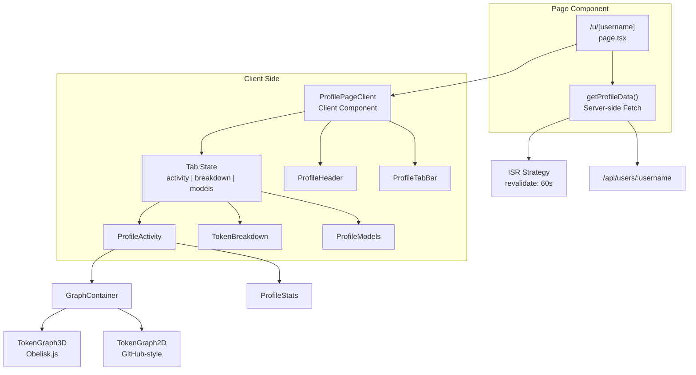
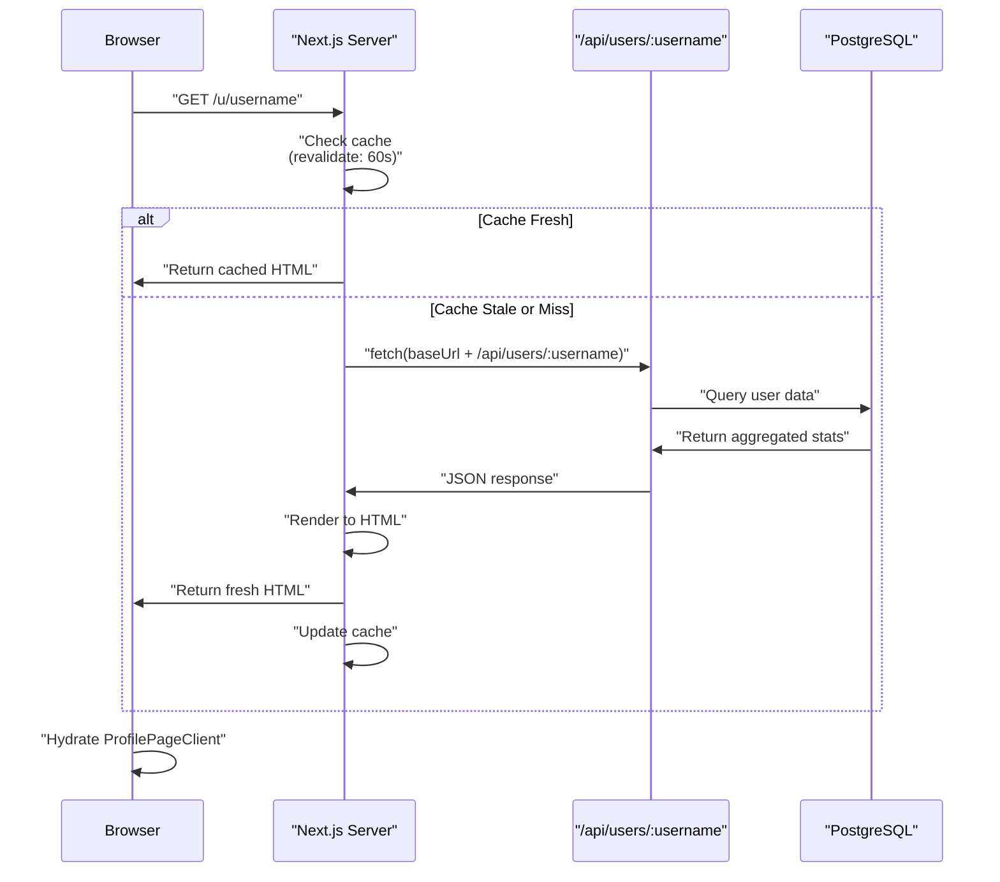
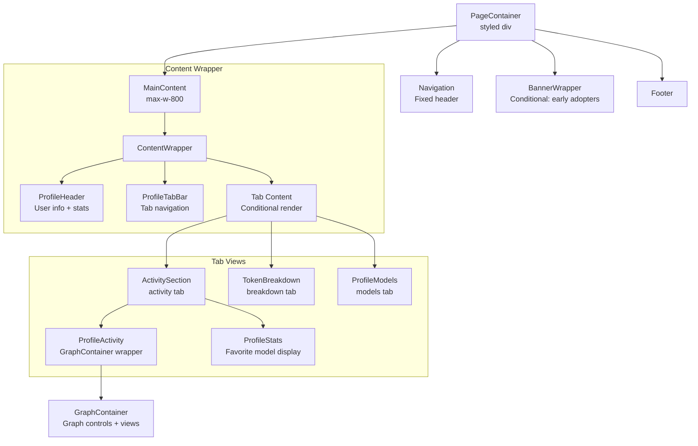
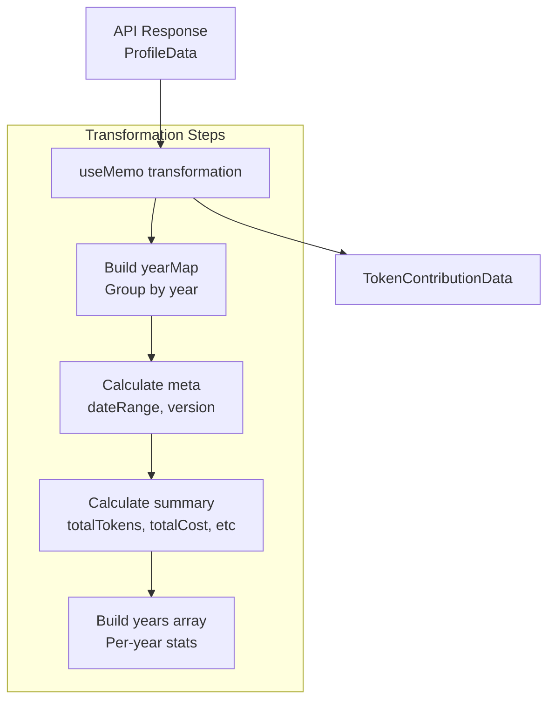
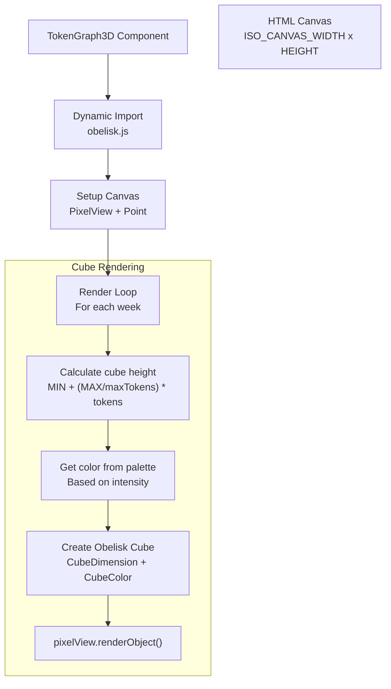
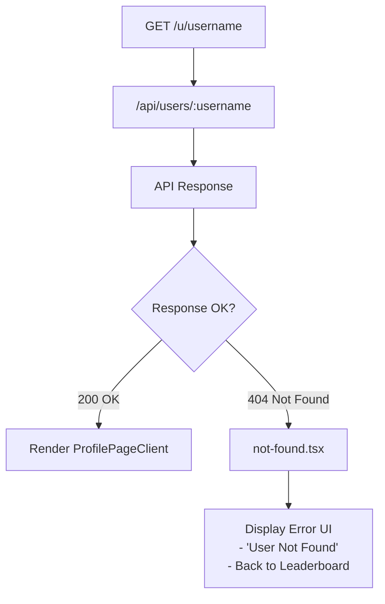

# User Profile Pages

<details>
<summary>Relevant source files</summary>

The following files were used as context for generating this wiki page:

- [packages/frontend/public/og-image.png](packages/frontend/public/og-image.png)
- [packages/frontend/src/app/u/[username]/ProfilePageClient.tsx](packages/frontend/src/app/u/[username]/ProfilePageClient.tsx)
- [packages/frontend/src/app/u/[username]/not-found.tsx](packages/frontend/src/app/u/[username]/not-found.tsx)
- [packages/frontend/src/app/u/[username]/page.tsx](packages/frontend/src/app/u/[username]/page.tsx)
- [packages/frontend/src/components/BreakdownPanel.tsx](packages/frontend/src/components/BreakdownPanel.tsx)
- [packages/frontend/src/components/GraphContainer.tsx](packages/frontend/src/components/GraphContainer.tsx)
- [packages/frontend/src/components/GraphControls.tsx](packages/frontend/src/components/GraphControls.tsx)
- [packages/frontend/src/components/StatsPanel.tsx](packages/frontend/src/components/StatsPanel.tsx)
- [packages/frontend/src/components/TokenGraph2D.tsx](packages/frontend/src/components/TokenGraph2D.tsx)
- [packages/frontend/src/components/TokenGraph3D.tsx](packages/frontend/src/components/TokenGraph3D.tsx)
- [packages/frontend/src/components/Tooltip.tsx](packages/frontend/src/components/Tooltip.tsx)
- [packages/frontend/src/components/profile/index.tsx](packages/frontend/src/components/profile/index.tsx)
- [packages/frontend/src/lib/utils.ts](packages/frontend/src/lib/utils.ts)

</details>


User profile pages display comprehensive token usage statistics, contribution graphs, and activity breakdowns for individual users who have submitted data to the Tokscale platform. These pages are publicly accessible at `/u/[username]` and provide interactive visualizations of AI coding assistant usage over time.

For information about the API endpoints that serve profile data, see [User Profile API](#5.3). For details about the leaderboard system that lists all users, see [Leaderboard Page](#4.2).

## Page Architecture

User profile pages are implemented using Next.js App Router with Server Components for initial rendering and Client Components for interactivity. The page follows a hybrid rendering strategy with Incremental Static Regeneration (ISR) for performance.

### Route and Component Structure



**Sources:** [packages/frontend/src/app/u/[username]/page.tsx:1-67](), [packages/frontend/src/app/u/[username]/ProfilePageClient.tsx:1-212]()

The page follows this rendering flow:
1. Next.js Server Component at [packages/frontend/src/app/u/[username]/page.tsx:53-66]() handles initial request.
2. `getProfileData()` function at [packages/frontend/src/app/u/[username]/page.tsx:7-23]() fetches user data with 60-second revalidation.
3. Data is passed to `ProfilePageClient` for client-side rendering and interactivity at [packages/frontend/src/app/u/[username]/page.tsx:65]().

## Data Fetching Strategy

### Server-Side Fetch with ISR

The page implements Incremental Static Regeneration with a 60-second revalidation period:



**Sources:** [packages/frontend/src/app/u/[username]/page.tsx:5-23]()

The `revalidate` export at [packages/frontend/src/app/u/[username]/page.tsx:5]() configures ISR behavior. The `getProfileData()` function constructs the base URL from environment variables, supporting both local development and Vercel deployments [packages/frontend/src/app/u/[username]/page.tsx:10-12]().

### Profile Data Structure

The API returns a structured `ProfileData` object consumed by the client component:

| Field | Type | Description |
|-------|------|-------------|
| `user` | Object | Basic user information (id, username, displayName, avatarUrl, rank) |
| `stats` | Object | Aggregated token statistics (totalTokens, totalCost, activeDays) |
| `dateRange` | Object | First and last submission dates |
| `updatedAt` | string | Last submission timestamp |
| `clients` | string[] | Array of AI assistant clients used |
| `models` | string[] | Array of LLM models used |
| `modelUsage` | ModelUsage[] | Per-model cost and token breakdown |
| `contributions` | DailyContribution[] | Daily activity data for graphs |

**Sources:** [packages/frontend/src/app/u/[username]/ProfilePageClient.tsx:22-50]()

## Component Hierarchy

### ProfilePageClient Structure

The `ProfilePageClient` component manages the overall layout and tab state of the user profile.



**Sources:** [packages/frontend/src/app/u/[username]/ProfilePageClient.tsx:142-211]()

The `ProfilePageClient` component at [packages/frontend/src/app/u/[username]/ProfilePageClient.tsx:57]() manages:
- Tab state using React `useState` hook [packages/frontend/src/app/u/[username]/ProfilePageClient.tsx:58]().
- Data transformation from API format to graph format using `useMemo` [packages/frontend/src/app/u/[username]/ProfilePageClient.tsx:61-119]().
- Conditional rendering based on `activeTab` [packages/frontend/src/app/u/[username]/ProfilePageClient.tsx:169-205]().

## Activity Tab

The Activity tab displays the user's contribution graph and statistics, providing both 2D and 3D visualizations of daily token usage.

### Graph Data Transformation

The `graphData` memo transforms raw API data into the `TokenContributionData` format required by `GraphContainer`:



**Sources:** [packages/frontend/src/app/u/[username]/ProfilePageClient.tsx:61-119]()

The transformation at [packages/frontend/src/app/u/[username]/ProfilePageClient.tsx:69-86]() creates a `yearMap` to aggregate token usage by year, enabling multi-year visualization.

### Graph Container and Controls

The `GraphContainer` component at [packages/frontend/src/components/GraphContainer.tsx:67]() manages the view mode (2D vs 3D) and filtering logic.

- **View Switching**: Users can toggle between 2D and 3D views using `GraphControls` [packages/frontend/src/components/GraphControls.tsx:276-300]().
- **Filtering**: Supports filtering by year [packages/frontend/src/components/GraphContainer.tsx:88-90]() and client source [packages/frontend/src/components/GraphContainer.tsx:82-85]().
- **Palette Management**: Users can select different color palettes (e.g., "github", "gitlab", "tokscale") [packages/frontend/src/components/GraphControls.tsx:58-81]().

**Sources:** [packages/frontend/src/components/GraphContainer.tsx:67-183](), [packages/frontend/src/components/GraphControls.tsx:9-263]()

### 3D Isometric Visualization

The `TokenGraph3D` component renders an isometric cube-based contribution graph using `obelisk.js`:



**Sources:** [packages/frontend/src/components/TokenGraph3D.tsx:135-225]()

#### Key Rendering Details

| Aspect | Implementation | Location |
|--------|----------------|----------|
| Canvas dimensions | `ISO_CANVAS_WIDTH = 900`, `ISO_CANVAS_HEIGHT = 450` | [packages/frontend/src/lib/constants.ts]() |
| Cube size | `CUBE_SIZE = 8` pixels | [packages/frontend/src/lib/constants.ts]() |
| Min/Max height | `MIN_CUBE_HEIGHT = 2`, `MAX_CUBE_HEIGHT = 20` | [packages/frontend/src/lib/constants.ts]() |
| Grid offset | `GH_OFFSET = 14` pixels | [packages/frontend/src/components/TokenGraph3D.tsx:191]() |
| Obelisk point | `Point(130, 90)` for 3D origin | [packages/frontend/src/components/TokenGraph3D.tsx:188]() |

**Sources:** [packages/frontend/src/components/TokenGraph3D.tsx:179-224]()

### Interactive Features

The graph supports hover and click interactions:

- **Tooltip**: Hovering over a day displays the `Tooltip` component with specific token breakdowns (Input, Output, Cache Read/Write) [packages/frontend/src/components/Tooltip.tsx:128-194]().
- **Breakdown Panel**: Clicking a day opens the `BreakdownPanel` [packages/frontend/src/components/BreakdownPanel.tsx:121-197](), showing per-client and per-model costs for that specific date.

**Sources:** [packages/frontend/src/components/GraphContainer.tsx:123-130](), [packages/frontend/src/components/BreakdownPanel.tsx:1-197]()

## Statistics and Breakdowns

### StatsPanel Component

The `StatsPanel` at [packages/frontend/src/components/StatsPanel.tsx:143]() provides a high-level overview of the user's performance:

| Statistic | Logic |
|-----------|-------|
| Total Cost | Sum of costs across all contributions [packages/frontend/src/components/StatsPanel.tsx:154]() |
| Active Days | Count of days with token usage [packages/frontend/src/components/StatsPanel.tsx:156]() |
| Current Streak | Calculated using `calculateCurrentStreak` [packages/frontend/src/lib/utils.ts:246]() |
| Best Day | Found using `findBestDay` [packages/frontend/src/lib/utils.ts:225]() |

**Sources:** [packages/frontend/src/components/StatsPanel.tsx:143-179](), [packages/frontend/src/lib/utils.ts:225-270]()

### Token Breakdown Tab

The `TokenBreakdown` component (rendered when `activeTab === "breakdown"`) displays a granular view of token categories: Input, Output, Cache Read, Cache Write, and Reasoning [packages/frontend/src/app/u/[username]/ProfilePageClient.tsx:194]().

## Model Usage Tab

The `ProfileModels` component at [packages/frontend/src/app/u/[username]/ProfilePageClient.tsx:203]() displays usage data for every LLM model the user has utilized.

- **Data Source**: Uses `data.modelUsage` which contains per-model cost and token counts [packages/frontend/src/app/u/[username]/ProfilePageClient.tsx:48]().
- **Favorite Model**: The favorite model is determined by the highest cost model in the `modelUsage` array [packages/frontend/src/app/u/[username]/ProfilePageClient.tsx:181]().

## Sharing and Embeds

Users can share their statistics through various profile buttons.

- **Embed Dialog**: The `ProfileEmbedDialog` (imported in [packages/frontend/src/components/profile/index.tsx:11]()) provides code snippets for embedding 2D/3D profile cards and shields.io style badges.
- **Action Buttons**: The profile header includes buttons for "Share", "Copy Link", and "Embed" [packages/frontend/src/components/profile/index.tsx:293-351]().

**Sources:** [packages/frontend/src/components/profile/index.tsx:11-351]()

## Error Handling

### Not Found Page

When a user doesn't exist or hasn't submitted data, the custom not-found page renders:



**Sources:** [packages/frontend/src/app/u/[username]/page.tsx:55-59](), [packages/frontend/src/app/u/[username]/not-found.tsx:56-74]()

The `notFound()` function from Next.js at [packages/frontend/src/app/u/[username]/page.tsx:58]() triggers rendering of `not-found.tsx`, which displays a centered error message and a link back to the leaderboard [packages/frontend/src/app/u/[username]/not-found.tsx:61-69]().

### SEO and Metadata

The page generates dynamic metadata for social sharing:

```typescript
export async function generateMetadata({ params }): Promise<Metadata> {
  const { username } = await params;
  return {
    title: `@${username} - Token Usage | Tokscale`,
    description: `View ${username}'s AI token usage statistics...`,
    openGraph: { 
      type: 'profile',
      images: [{ url: 'https://tokscale.ai/og-image.png' }]
    }
  };
}
```

**Sources:** [packages/frontend/src/app/u/[username]/page.tsx:25-51]()
