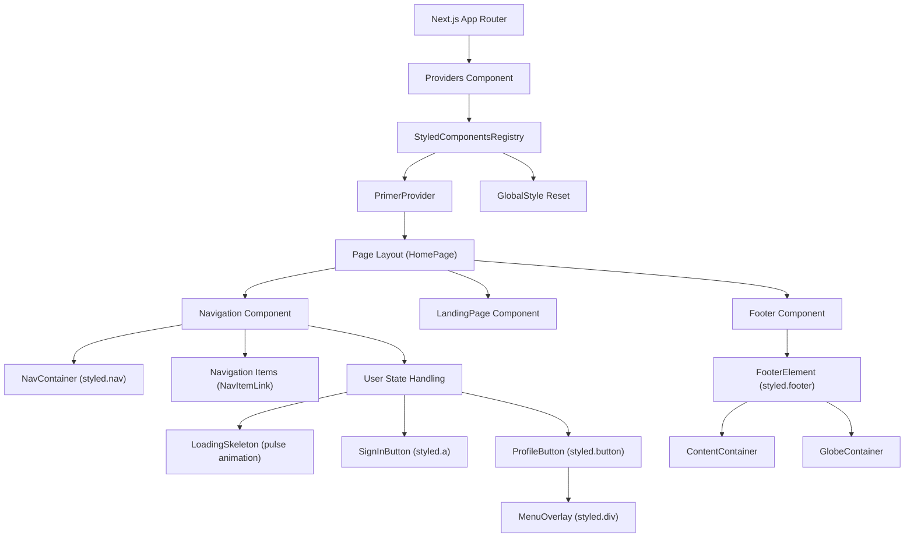
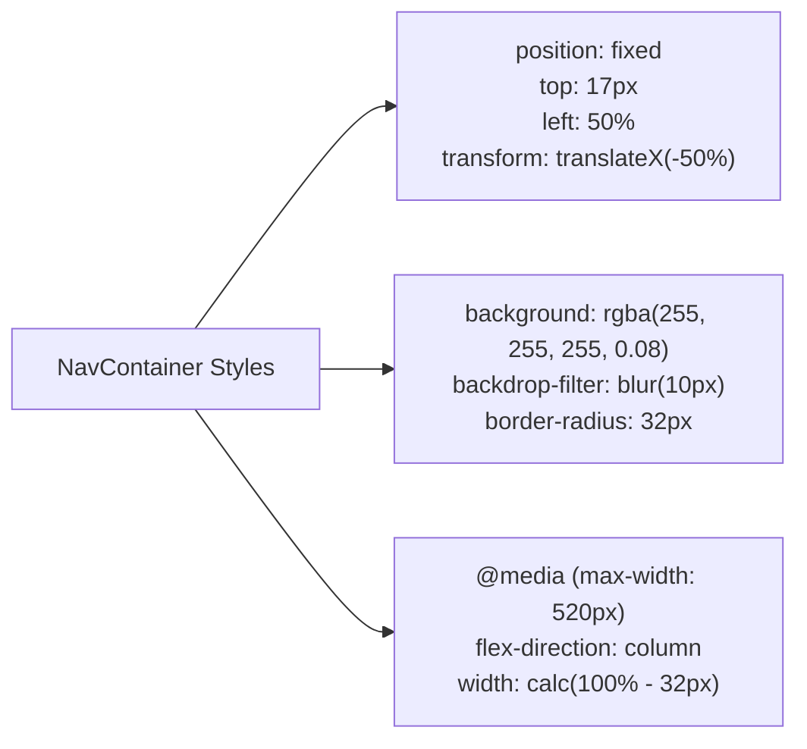
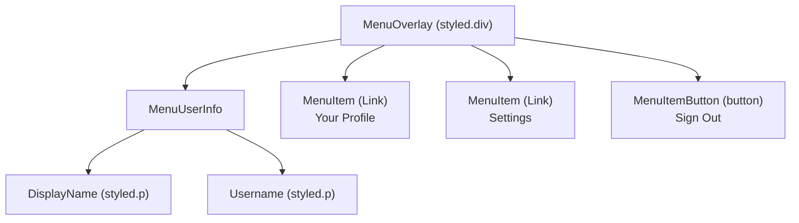
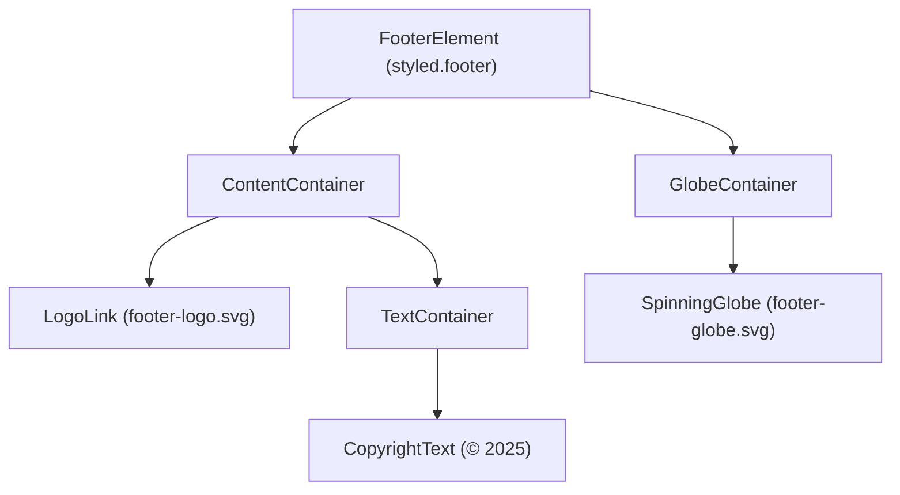

# Navigation and Layout

Relevant source files

The following files were used as context for generating this wiki page:

- [packages/frontend/public/assets/footer-globe.svg](packages/frontend/public/assets/footer-globe.svg)
- [packages/frontend/public/assets/footer-logo-icon.png](packages/frontend/public/assets/footer-logo-icon.png)
- [packages/frontend/public/assets/footer-logo.svg](packages/frontend/public/assets/footer-logo.svg)
- [packages/frontend/src/app/(main)/page.tsx](packages/frontend/src/app/(main)/page.tsx)
- [packages/frontend/src/components/BlackholeHero.tsx](packages/frontend/src/components/BlackholeHero.tsx)
- [packages/frontend/src/components/Switch.tsx](packages/frontend/src/components/Switch.tsx)
- [packages/frontend/src/components/layout/Footer.tsx](packages/frontend/src/components/layout/Footer.tsx)
- [packages/frontend/src/components/layout/Navigation.tsx](packages/frontend/src/components/layout/Navigation.tsx)
- [packages/frontend/src/lib/db/index.ts](packages/frontend/src/lib/db/index.ts)
- [packages/frontend/src/lib/useSettings.ts](packages/frontend/src/lib/useSettings.ts)

## Purpose and Scope

This page documents the persistent navigation and layout components of the tokscale web frontend, including the fixed header navigation bar, the footer, and the global layout provider system. These components are rendered on all pages and provide the consistent visual structure and styling foundation for the application. For information about specific page layouts like the leaderboard or user profiles, see [4.2]() and [4.3](). For details on the Next.js application structure and routing, see [4.1]().

## Layout Component Hierarchy

The following diagram shows how the layout components are structured and where they appear in the application:

**Sources:** [packages/frontend/src/app/(main)/page.tsx:1-45](), [packages/frontend/src/components/layout/Navigation.tsx:1-356](), [packages/frontend/src/components/layout/Footer.tsx:1-254]()

## Navigation Component Architecture

The navigation bar is implemented in the `Navigation` component as a fixed-position header that remains visible during scrolling. The component manages user authentication state and adapts its UI accordingly.

### Component Structure

| Element | Component/Style | Purpose |
|---------|----------------|---------|
| Container | `NavContainer` | Fixed-position wrapper with blur backdrop [packages/frontend/src/components/layout/Navigation.tsx:28-61]() |
| Navigation Items | `NavItemLink` | Links to main sections (Leaderboard, Profile) [packages/frontend/src/components/layout/Navigation.tsx:115-152]() |
| User State | Conditional rendering | Shows loading skeleton, sign-in button, or profile menu [packages/frontend/src/components/layout/Navigation.tsx:320-350]() |
| Profile Menu | `MenuOverlay` | Custom styled dropdown with user options [packages/frontend/src/components/layout/Navigation.tsx:255-266]() |

### Fixed Positioning and Styling

The navigation uses CSS-in-JS with `styled-components`. The `NavContainer` is positioned at the top center of the viewport and uses a backdrop filter for a frosted glass effect.

**Sources:** [packages/frontend/src/components/layout/Navigation.tsx:28-61]()

### Authentication State Management

The navigation component fetches user session state and renders different UI based on the result. It uses a `LoadingSkeleton` with a pulse animation while fetching.

| State | Rendered Component | Description |
|-------|-------------------|-------------|
| `isLoading === true` | `LoadingSkeleton` | Pulsing skeleton using `pulse` keyframes [packages/frontend/src/components/layout/Navigation.tsx:154-161]() |
| `user === null` | `SignInButton` | Link to GitHub OAuth with icon and text [packages/frontend/src/components/layout/Navigation.tsx:173-196]() |
| `user !== null` | `ProfileButton` | Renders user avatar and toggles `MenuOverlay` [packages/frontend/src/components/layout/Navigation.tsx:230-249]() |

**Sources:** [packages/frontend/src/components/layout/Navigation.tsx:19-26](), [packages/frontend/src/components/layout/Navigation.tsx:320-350]()

### User Menu System

The authenticated user menu provides links to the user's specific profile and settings.

**Sources:** [packages/frontend/src/components/layout/Navigation.tsx:255-310]()

## Local Data Visualization Page

While much of the web platform focuses on social leaderboards, the frontend also supports local data visualization components that mirror CLI capabilities, such as the `BlackholeHero`.

### Hero Component

The `BlackholeHero` serves as the primary landing visual, encouraging users to run the CLI tool.

| Code Entity | Role |
|-------------|------|
| `BlackholeHero` | Main functional component for the landing hero section [packages/frontend/src/components/BlackholeHero.tsx:9]() |
| `CommandCard` | Container for the `bunx tokscale` copyable command [packages/frontend/src/components/BlackholeHero.tsx:200-216]() |
| `handleCopy` | Function utilizing `navigator.clipboard` to copy CLI command [packages/frontend/src/components/BlackholeHero.tsx:12-16]() |

**Sources:** [packages/frontend/src/components/BlackholeHero.tsx:9-92]()

## Footer Component

The `Footer` component provides persistent links and visual branding at the bottom of the page.

### Structure and Animation

The footer features a `SpinningGlobe` that uses a 60-second linear infinite rotation.

**Sources:** [packages/frontend/src/components/layout/Footer.tsx:25-40](), [packages/frontend/src/components/layout/Footer.tsx:176-197](), [packages/frontend/src/components/layout/Footer.tsx:202-250]()

## Settings and Theme Management

The frontend layout is influenced by user settings, specifically the color palette and leaderboard sorting preferences.

### useSettings Hook

The `useSettings` hook synchronizes state with `localStorage` and cookies.

- **State Persistence**: Uses `localStorage` with the key `tokscale-settings` [packages/frontend/src/lib/useSettings.ts:24]().
- **Cookie Sync**: Synchronizes the `leaderboardSortBy` preference to a cookie for server-side consumption [packages/frontend/src/lib/useSettings.ts:30-33]().
- **Dark Mode**: Force-applies the `dark` class to the document root [packages/frontend/src/lib/useSettings.ts:104-109]().

**Sources:** [packages/frontend/src/lib/useSettings.ts:1-144]()

### Sort Toggle

The `Switch` component is used within the layout (often in the leaderboard section) to toggle between sorting by "Tokens" or "Cost".

- **Implementation**: A styled toggle with `Track` and `Thumb` components [packages/frontend/src/components/Switch.tsx:28-55]().
- **Interaction**: Triggers the `onChange` callback which usually maps to `setLeaderboardSort` from `useSettings` [packages/frontend/src/components/Switch.tsx:57-86]().

**Sources:** [packages/frontend/src/components/Switch.tsx:1-86](), [packages/frontend/src/lib/useSettings.ts:132-135]()
