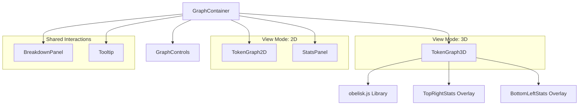
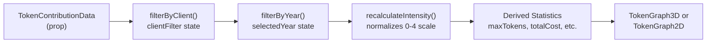
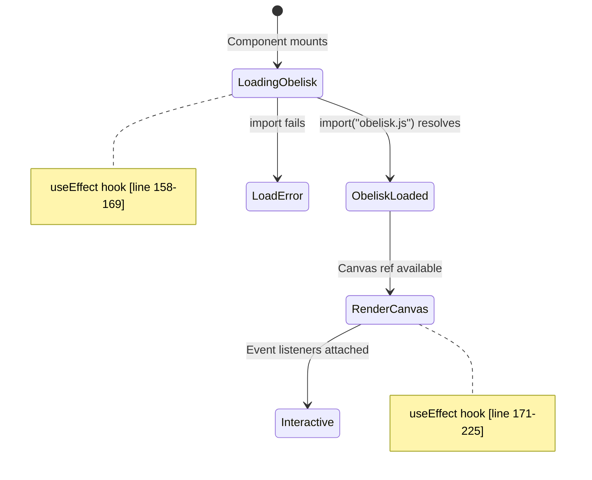
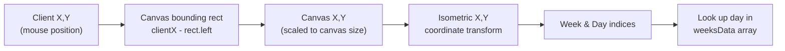

# 3D Visualization Components

<details>
<summary>Relevant source files</summary>

The following files were used as context for generating this wiki page:

- [packages/frontend/__tests__/api/submit.test.ts](packages/frontend/__tests__/api/submit.test.ts)
- [packages/frontend/src/components/BreakdownPanel.tsx](packages/frontend/src/components/BreakdownPanel.tsx)
- [packages/frontend/src/components/GraphContainer.tsx](packages/frontend/src/components/GraphContainer.tsx)
- [packages/frontend/src/components/GraphControls.tsx](packages/frontend/src/components/GraphControls.tsx)
- [packages/frontend/src/components/SourceLogo.tsx](packages/frontend/src/components/SourceLogo.tsx)
- [packages/frontend/src/components/StatsPanel.tsx](packages/frontend/src/components/StatsPanel.tsx)
- [packages/frontend/src/components/TokenGraph2D.tsx](packages/frontend/src/components/TokenGraph2D.tsx)
- [packages/frontend/src/components/TokenGraph3D.tsx](packages/frontend/src/components/TokenGraph3D.tsx)
- [packages/frontend/src/components/Tooltip.tsx](packages/frontend/src/components/Tooltip.tsx)
- [packages/frontend/src/lib/constants.ts](packages/frontend/src/lib/constants.ts)
- [packages/frontend/src/lib/types.ts](packages/frontend/src/lib/types.ts)
- [packages/frontend/src/lib/utils.ts](packages/frontend/src/lib/utils.ts)
- [packages/frontend/src/lib/validation/submission.ts](packages/frontend/src/lib/validation/submission.ts)

</details>


## Purpose and Scope

This document describes the 3D visualization components in the Tokscale frontend that render isometric contribution graphs. The primary component is `TokenGraph3D`, which uses the Obelisk.js library to create GitHub-style contribution grids with a three-dimensional isometric perspective. These components display daily token usage data as colored 3D cubes with varying heights based on activity intensity.

The system is designed to handle multi-source data (e.g., OpenCode, Cursor, Claude Code) and allows users to filter by specific clients or years while maintaining real-time updates to the 3D view.

---

## Component Architecture

The 3D visualization system consists of a hierarchical component structure with `GraphContainer` as the orchestrator that manages view modes, filtering, and data transformations.

### Component Hierarchy



**Sources:** [packages/frontend/src/components/GraphContainer.tsx:1-182](), [packages/frontend/src/components/TokenGraph3D.tsx:1-338]()

---

## GraphContainer State Management

The `GraphContainer` component manages the overall state for both 2D and 3D visualization modes, handling view switching, filtering, and user interactions.

### State Variables and Data Transformations

| State Variable | Type | Purpose |
|---------------|------|---------|
| `view` | `ViewMode` | Toggles between `"2d"` and `"3d"` display modes [packages/frontend/src/lib/types.ts:114]() |
| `selectedYear` | `string` | Filters contributions to a specific year |
| `hoveredDay` | `DailyContribution \| null` | Tracks currently hovered day for tooltip |
| `tooltipPosition` | `TooltipPosition \| null` | Stores mouse coordinates for tooltip placement |
| `selectedDay` | `DailyContribution \| null` | Tracks clicked day for breakdown panel |
| `clientFilter` | `ClientType[]` | Filters contributions by client (OpenCode, Cursor, etc.) |

### Data Processing Pipeline



**Sources:** [packages/frontend/src/components/GraphContainer.tsx:82-98](), [packages/frontend/src/lib/utils.ts:77-118]()

### Computed Statistics

The container calculates several key statistics using memoized values to drive the visualization overlays:

- **maxTokens**: Maximum token count across all days for height scaling [packages/frontend/src/components/GraphContainer.tsx:92]()
- **totalCost**: Sum of all daily costs in the filtered set [packages/frontend/src/components/GraphContainer.tsx:93]()
- **totalTokens**: Sum of all daily token usage [packages/frontend/src/components/GraphContainer.tsx:94]()
- **activeDays**: Count of days with non-zero token usage [packages/frontend/src/components/GraphContainer.tsx:95]()
- **bestDay**: Day with highest token usage [packages/frontend/src/components/GraphContainer.tsx:96]()
- **currentStreak**: Consecutive days of activity ending today [packages/frontend/src/components/GraphContainer.tsx:97]()
- **longestStreak**: Longest consecutive day sequence in history [packages/frontend/src/components/GraphContainer.tsx:98]()

**Sources:** [packages/frontend/src/components/GraphContainer.tsx:92-98]()

---

## TokenGraph3D Component

The `TokenGraph3D` component renders the isometric 3D contribution graph using Obelisk.js. It manages the dynamic loading of the library, canvas rendering, and coordinate transformation for user interactions.

### Component Props Interface

The component accepts comprehensive usage data and streak statistics to render both the 3D grid and the floating overlays.

**Sources:** [packages/frontend/src/components/TokenGraph3D.tsx:119-133]()

### Rendering Constants

The component uses several constants for consistent isometric sizing:

| Constant | Value | Purpose |
|----------|-------|---------|
| `CUBE_SIZE` | 16 | Base size of each isometric cube [packages/frontend/src/lib/constants.ts:14]() |
| `MAX_CUBE_HEIGHT` | 100 | Maximum height for highest activity [packages/frontend/src/lib/constants.ts:15]() |
| `MIN_CUBE_HEIGHT` | 3 | Minimum height for zero activity [packages/frontend/src/lib/constants.ts:16]() |
| `ISO_CANVAS_WIDTH` | 1000 | Canvas width in pixels [packages/frontend/src/lib/constants.ts:19]() |
| `ISO_CANVAS_HEIGHT` | 600 | Canvas height in pixels [packages/frontend/src/lib/constants.ts:20]() |

**Sources:** [packages/frontend/src/lib/constants.ts:14-20]()

---

## Obelisk.js Integration

The `TokenGraph3D` component dynamically loads Obelisk.js to avoid bundling a heavy WebGL-adjacent library in the initial payload, improving performance for users only viewing 2D graphs.

### Dynamic Library Loading



**Sources:** [packages/frontend/src/components/TokenGraph3D.tsx:158-172]()

---

## Canvas Rendering Algorithm

Once Obelisk.js is loaded, the component renders 3D cubes in a nested loop representing 53 weeks × 7 days.

### Cube Height Calculation

The height of each cube is calculated based on token usage relative to the year's maximum [packages/frontend/src/components/TokenGraph3D.tsx:205-208]():

```typescript
let cubeHeight = MIN_CUBE_HEIGHT;
if (day && maxTokens > 0) {
  cubeHeight = MIN_CUBE_HEIGHT + Math.floor((MAX_CUBE_HEIGHT / maxTokens) * day.totals.tokens);
}
```

### Color Resolution

Colors are resolved from the palette based on intensity (0-4) with fallback handling for CSS variables [packages/frontend/src/components/TokenGraph3D.tsx:210-215]():

1. Get color hex from palette using `getGradeColor(palette, intensity)`.
2. Check if color is a CSS variable (starts with `"var("`).
3. If variable, resolve to theme-specific default color based on `isDark`.
4. Convert hex color to numeric format using `hexToNumber(resolvedColor)`.

**Sources:** [packages/frontend/src/components/TokenGraph3D.tsx:205-215]()

---

## Interactive Features

The `TokenGraph3D` component provides hover and click interactions by converting 2D mouse coordinates to isometric grid positions.

### Mouse Coordinate Transformation

The `getDayAtPosition` function transforms screen coordinates to grid indices [packages/frontend/src/components/TokenGraph3D.tsx:227-250]():



The transformation equations use the `CUBE_SIZE` and specific offsets to map the diamond-shaped isometric grid back to a 2D array [packages/frontend/src/components/TokenGraph3D.tsx:238-239]().

**Sources:** [packages/frontend/src/components/TokenGraph3D.tsx:227-250]()

---

## Breakdown Panel

When a user clicks on a day in either the 2D or 3D graph, the `BreakdownPanel` appears, providing a detailed view of usage by client and model.

### Data Organization in Breakdown

The panel groups contributions by client type and sorts them by cost [packages/frontend/src/components/BreakdownPanel.tsx:124-125]().

- **Source Logos**: Rendered using the `SourceLogo` component which pulls from a centralized mapping [packages/frontend/src/components/SourceLogo.tsx:24-85]().
- **Client Grouping**: Multiple models under the same client (e.g., `gpt-4o` and `gpt-4-turbo` under `codex`) are grouped together [packages/frontend/src/components/BreakdownPanel.tsx:156-163]().
- **Recalculation**: If filters are active, the panel reflects the filtered totals for that specific day [packages/frontend/src/lib/utils.ts:120-155]().

**Sources:** [packages/frontend/src/components/BreakdownPanel.tsx:121-197](), [packages/frontend/src/components/SourceLogo.tsx:24-85]()

---

## Graph Controls and Filters

The `GraphControls` component provides the user interface for manipulating the visualization.

### Control Features

- **View Toggle**: Switches between 2D (Canvas API) and 3D (Obelisk.js) [packages/frontend/src/components/GraphControls.tsx:276-302]().
- **Palette Selector**: Allows choosing from predefined color schemes like "green", "halloween", or "YlGnBu" [packages/frontend/src/components/GraphControls.tsx:64-81]().
- **Client Filters**: Toggle individual sources (Cursor, Claude, etc.) to isolate their specific impact on the contribution graph [packages/frontend/src/components/GraphControls.tsx:159-185]().
- **Year Selector**: Changes the data range to display usage for a specific calendar year [packages/frontend/src/components/GraphControls.tsx:93-109]().

**Sources:** [packages/frontend/src/components/GraphControls.tsx:9-263]()
