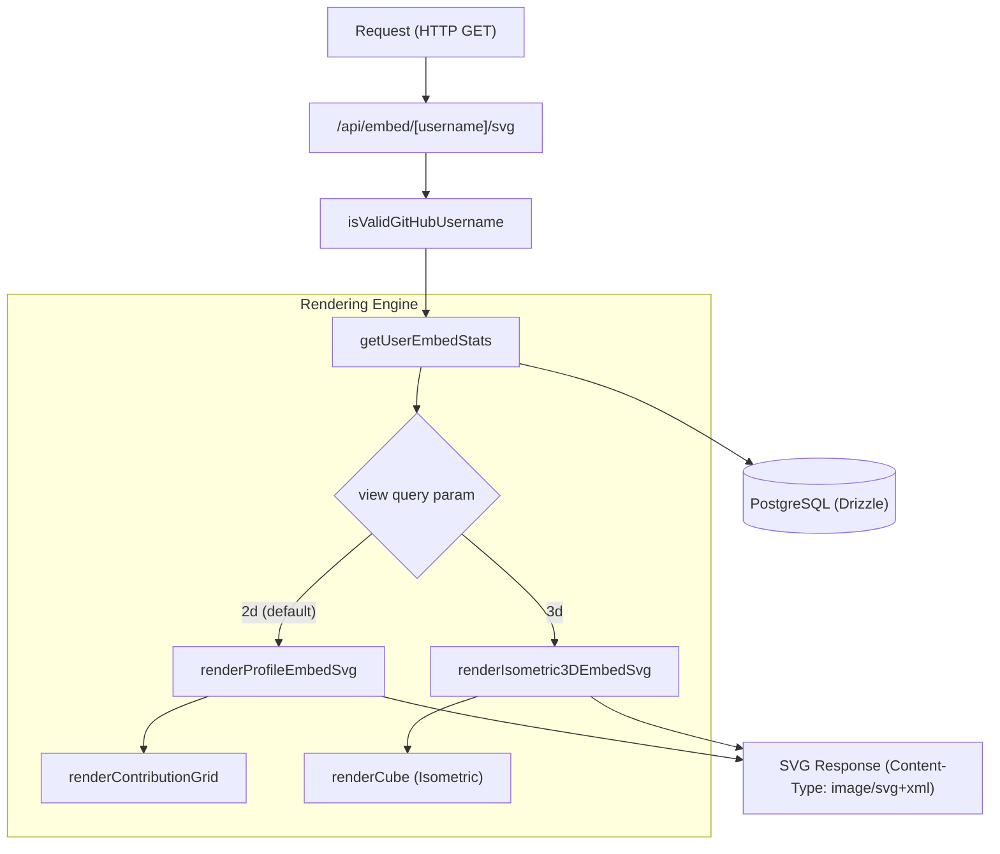

# Embeddable Profile Cards and Badges

Relevant source files

The following files were used as context for generating this wiki page:

- [.github/assets/client-copilot.jpg](.github/assets/client-copilot.jpg)
- [crates/tokscale-core/src/sessions/copilot.rs](crates/tokscale-core/src/sessions/copilot.rs)
- [packages/frontend/__tests__/api/embedSvgRoute.test.ts](packages/frontend/__tests__/api/embedSvgRoute.test.ts)
- [packages/frontend/__tests__/lib/renderIsometric3DSvg.test.ts](packages/frontend/__tests__/lib/renderIsometric3DSvg.test.ts)
- [packages/frontend/__tests__/lib/renderProfileBadgeSvg.test.ts](packages/frontend/__tests__/lib/renderProfileBadgeSvg.test.ts)
- [packages/frontend/__tests__/lib/renderProfileEmbedSvg.test.ts](packages/frontend/__tests__/lib/renderProfileEmbedSvg.test.ts)
- [packages/frontend/__tests__/lib/username.test.ts](packages/frontend/__tests__/lib/username.test.ts)
- [packages/frontend/src/app/api/badge/[username]/svg/route.ts](packages/frontend/src/app/api/badge/[username]/svg/route.ts)
- [packages/frontend/src/app/api/embed/[username]/svg/route.ts](packages/frontend/src/app/api/embed/[username]/svg/route.ts)
- [packages/frontend/src/components/TabBar.tsx](packages/frontend/src/components/TabBar.tsx)
- [packages/frontend/src/components/profile/ProfileEmbedDialog.tsx](packages/frontend/src/components/profile/ProfileEmbedDialog.tsx)
- [packages/frontend/src/lib/embed/getUserEmbedStats.ts](packages/frontend/src/lib/embed/getUserEmbedStats.ts)
- [packages/frontend/src/lib/embed/renderIsometric3DSvg.ts](packages/frontend/src/lib/embed/renderIsometric3DSvg.ts)
- [packages/frontend/src/lib/embed/renderProfileBadgeSvg.ts](packages/frontend/src/lib/embed/renderProfileBadgeSvg.ts)
- [packages/frontend/src/lib/embed/renderProfileEmbedSvg.ts](packages/frontend/src/lib/embed/renderProfileEmbedSvg.ts)
- [packages/frontend/src/lib/format.ts](packages/frontend/src/lib/format.ts)
- [packages/frontend/src/lib/validation/username.ts](packages/frontend/src/lib/validation/username.ts)

The Tokscale embed system allows users to showcase their AI token usage statistics on external platforms like GitHub READMEs or personal portfolios. The system provides high-performance SVG generation for 2D profile cards, 3D isometric contribution graphs, and Shields.io-style badges through specialized API endpoints.

## System Architecture and Data Flow

The embed system operates as a server-side rendering pipeline within the Next.js application. It fetches aggregated data from the PostgreSQL database and transforms it into optimized SVG strings.

### Embed Generation Pipeline

The following diagram illustrates the data flow from a request to the final SVG output.

**Embed Data Flow Pipeline**

**Sources:**
- `packages/frontend/src/app/api/embed/[username]/svg/route.ts:55-150`
- `packages/frontend/src/lib/embed/getUserEmbedStats.ts:36-96`
- `packages/frontend/src/lib/embed/renderProfileEmbedSvg.ts:241-260`

---

## Profile Cards (2D and 3D)

Tokscale supports two primary visual styles for profile cards: a flat 2D card with an optional contribution grid, and a 3D isometric view inspired by GitHub's contribution visualizers.

### 2D Profile Cards
The 2D card is rendered via `renderProfileEmbedSvg` [packages/frontend/src/lib/embed/renderProfileEmbedSvg.ts:241-260](). It features:
- **Dynamic Theming:** Supports `dark` and `light` palettes defined in the `THEMES` constant [packages/frontend/src/lib/embed/renderProfileEmbedSvg.ts:48-113]().
- **Metric Cards:** Displays Total Tokens, Total Cost, and Rank using `metricCard` [packages/frontend/src/lib/embed/renderProfileEmbedSvg.ts:167-192]().
- **Auto-scaling:** Font sizes for token counts automatically scale down via `fitValueFontSize` to prevent overflow in the SVG container [packages/frontend/src/lib/embed/renderProfileEmbedSvg.ts:152-156]().
- **Contribution Grid:** A 12-month activity heatmap rendered with `renderContributionGrid` [packages/frontend/src/lib/embed/renderProfileEmbedSvg.ts:200-239]().

### 3D Isometric View
The 3D view is generated by `renderIsometric3DEmbedSvg` [packages/frontend/src/lib/embed/renderIsometric3DSvg.ts:251-300]().
- **Cube Rendering:** Uses `renderCube` to create isometric shapes using `<rect>` elements and CSS transforms (`skewY`, `skewX`, `scale`) [packages/frontend/src/lib/embed/renderIsometric3DSvg.ts:99-126]().
- **Height Scaling:** Cube heights are normalized based on token intensity, ranging from `MIN_HEIGHT` (2px) to `MAX_HEIGHT` (35px) [packages/frontend/src/lib/embed/renderIsometric3DSvg.ts:88-90]().
- **Animations:** Includes SVG `<animateTransform>` and `<animate>` tags for a "drop-in" entry effect when the SVG loads [packages/frontend/src/lib/embed/renderIsometric3DSvg.ts:118-124]().

**Sources:**
- `packages/frontend/src/lib/embed/renderProfileEmbedSvg.ts:1-300`
- `packages/frontend/src/lib/embed/renderIsometric3DSvg.ts:1-300`

---

## Shields.io-style Badges

The `/api/badge/[username]/svg` endpoint provides compact, standardized badges for specific metrics.

### Implementation Details
The badge system uses `renderProfileBadgeSvg` [packages/frontend/src/lib/embed/renderProfileBadgeSvg.ts:158-185](). Unlike the profile cards which use the `Figtree` font, badges use `Verdana` to match the standard Shields.io aesthetic [packages/frontend/src/lib/embed/renderProfileBadgeSvg.ts:20]().

- **Text Measurement:** Since SVG cannot natively measure text width on the server, the system uses a pre-computed array of character widths (`VERDANA_WIDTHS`) to calculate the necessary SVG width [packages/frontend/src/lib/embed/renderProfileBadgeSvg.ts:27-34]().
- **Styles:** Supports `flat` (rounded corners with gradient) and `flat-square` (sharp corners, crisp edges) [packages/frontend/src/lib/embed/renderProfileBadgeSvg.ts:165-166]().
- **Metrics:** Can be toggled between `tokens`, `cost`, or `rank` via the `metric` query parameter [packages/frontend/src/lib/embed/renderProfileBadgeSvg.ts:162-164]().

**Sources:**
- `packages/frontend/src/lib/embed/renderProfileBadgeSvg.ts:4-156`

---

## API Endpoints and Configuration

### `/api/embed/[username]/svg`
Main endpoint for profile cards.
- **Query Parameters:**
  - `view`: `2d` (default) or `3d` [packages/frontend/src/app/api/embed/[username]/svg/route.ts:35-37]().
  - `theme`: `dark` (default) or `light` [packages/frontend/src/app/api/embed/[username]/svg/route.ts:16-18]().
  - `compact`: `1` or `true` to remove the contribution graph and reduce padding [packages/frontend/src/app/api/embed/[username]/svg/route.ts:20-23]().
  - `sort`: `tokens` (default) or `cost` to determine ranking logic [packages/frontend/src/app/api/embed/[username]/svg/route.ts:25-28]().

### Cache Strategy
The API utilizes Next.js `unstable_cache` with a 60-second revalidation period [packages/frontend/src/lib/embed/getUserEmbedStats.ts:110-111](). Response headers include `s-maxage=60` and `stale-while-revalidate=300` to ensure high availability and performance for GitHub's image proxy (Camo) [packages/frontend/src/app/api/embed/[username]/svg/route.ts:44]().

### User Interface: Embed Dialog
The `ProfileEmbedDialog` component provides a GUI for users to customize their cards and copy Markdown/HTML snippets [packages/frontend/src/components/profile/ProfileEmbedDialog.tsx:21-75]().

**Code Entity Map**
| Feature | Code Entity | File Path |
| :--- | :--- | :--- |
| **Data Fetching** | `fetchUserEmbedStats` | `packages/frontend/src/lib/embed/getUserEmbedStats.ts` |
| **2D Renderer** | `renderProfileEmbedSvg` | `packages/frontend/src/lib/embed/renderProfileEmbedSvg.ts` |
| **3D Renderer** | `renderIsometric3DEmbedSvg` | `packages/frontend/src/lib/embed/renderIsometric3DSvg.ts` |
| **Badge Renderer** | `renderProfileBadgeSvg` | `packages/frontend/src/lib/embed/renderProfileBadgeSvg.ts` |
| **XML Safety** | `escapeXml` | `packages/frontend/src/lib/format.ts` |

**Sources:**
- `packages/frontend/src/app/api/embed/[username]/svg/route.ts:1-150`
- `packages/frontend/src/lib/embed/getUserEmbedStats.ts:98-113`
- `packages/frontend/src/components/profile/ProfileEmbedDialog.tsx:51-75`
