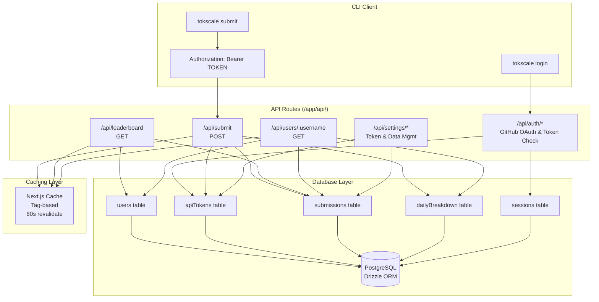

# API Routes

Relevant source files

The following files were used as context for generating this wiki page:

- [packages/frontend/__tests__/api/authToken.test.ts](packages/frontend/__tests__/api/authToken.test.ts)
- [packages/frontend/__tests__/api/settingsTokensList.test.ts](packages/frontend/__tests__/api/settingsTokensList.test.ts)
- [packages/frontend/__tests__/api/submitAuth.test.ts](packages/frontend/__tests__/api/submitAuth.test.ts)
- [packages/frontend/__tests__/lib/bearerToken.test.ts](packages/frontend/__tests__/lib/bearerToken.test.ts)
- [packages/frontend/src/app/api/auth/token/route.ts](packages/frontend/src/app/api/auth/token/route.ts)
- [packages/frontend/src/app/api/settings/submitted-data/route.ts](packages/frontend/src/app/api/settings/submitted-data/route.ts)
- [packages/frontend/src/app/api/settings/tokens/route.ts](packages/frontend/src/app/api/settings/tokens/route.ts)
- [packages/frontend/src/app/api/submit/route.ts](packages/frontend/src/app/api/submit/route.ts)
- [packages/frontend/src/app/api/users/[username]/route.ts](packages/frontend/src/app/api/users/[username]/route.ts)
- [packages/frontend/src/lib/db/helpers.ts](packages/frontend/src/lib/db/helpers.ts)
- [packages/frontend/src/lib/db/migrations/0000_add_user_id_unique_constraint.sql](packages/frontend/src/lib/db/migrations/0000_add_user_id_unique_constraint.sql)
- [packages/frontend/src/lib/db/migrations/meta/0000_snapshot.json](packages/frontend/src/lib/db/migrations/meta/0000_snapshot.json)
- [packages/frontend/src/lib/db/migrations/meta/_journal.json](packages/frontend/src/lib/db/migrations/meta/_journal.json)
- [packages/frontend/src/lib/db/schema.ts](packages/frontend/src/lib/db/schema.ts)

## Purpose and Scope

This document describes the backend API routes exposed by the Next.js frontend application at tokscale.ai. These endpoints handle data submission from the CLI, serve leaderboard data, provide user profile information, and manage user settings. The API layer sits between the CLI tool and the PostgreSQL database, implementing authentication, validation, and data aggregation logic.

For information about the frontend pages that consume these APIs, see [Frontend Web Application](#4). For details on the CLI commands that call these endpoints, see [Social Platform Commands](#3.2.2).

---

## API Route Architecture

The Tokscale API consists of several primary endpoint families, each serving a distinct purpose in the system's data flow.

**Sources:** [packages/frontend/src/app/api/submit/route.ts:1-395](), [packages/frontend/src/app/api/users/[username]/route.ts:1-389](), [packages/frontend/src/lib/db/schema.ts:1-280](), [packages/frontend/src/app/api/settings/tokens/route.ts:1-82]()

---

## API Endpoint Summary

| Endpoint | Method | Authentication | Purpose | Caching |
|----------|--------|----------------|---------|---------|
| `/api/submit` | POST | Bearer Token | Submit token usage data from CLI | Invalidates cache |
| `/api/leaderboard` | GET | None | List ranked users with pagination | ISR 60s |
| `/api/users/:username` | GET | None | Get user profile with full statistics | ISR 60s |
| `/api/auth/token` | GET | Bearer Token | Validate CLI token and return metadata | None |
| `/api/settings/tokens` | GET/POST | Session | Manage personal API tokens | None |
| `/api/settings/submitted-data` | DELETE | Session/Token | Delete all user submission data | Invalidates cache |

**Sources:** [packages/frontend/src/app/api/submit/route.ts:51-63](), [packages/frontend/src/app/api/users/[username]/route.ts:17-23](), [packages/frontend/src/app/api/auth/token/route.ts:5-44](), [packages/frontend/src/app/api/settings/tokens/route.ts:21-82](), [packages/frontend/src/app/api/settings/submitted-data/route.ts:27-69]()

---

## Submit Endpoint

For a detailed breakdown of the submission logic, validation, and source-level merge transactions, see [Submit Endpoint](#5.1).

### Route Definition
**Endpoint:** `POST /api/submit`
**File Location:** [packages/frontend/src/app/api/submit/route.ts:64-395]()

The submit endpoint is the primary data ingestion point. It accepts token usage data from the CLI and implements a **source-level merge** strategy to preserve existing data while updating only the submitted clients.

### Authentication Flow
The endpoint extracts a Bearer token from the `Authorization` header using `getBearerToken()` and validates it via `authenticatePersonalToken()`. It rejects invalid or expired tokens before starting database transactions.

**Sources:** [packages/frontend/src/app/api/submit/route.ts:69-89](), [packages/frontend/src/lib/auth/bearerToken.ts:4-21]()

---

## Leaderboard API

For detailed information on period filtering, pagination, and rank calculation, see [Leaderboard API](#5.2).

### Route Definition
**Endpoint:** `GET /api/leaderboard`

This endpoint provides paginated leaderboard data. It calculates user ranks by aggregating `totalTokens` from the `submissions` table, joined with the `users` table for profile metadata.

### Caching
The leaderboard uses Next.js Incremental Static Regeneration (ISR) with a 60-second revalidation period. It is forcefully revalidated via `revalidateTag("leaderboard")` whenever new data is successfully submitted.

**Sources:** [packages/frontend/src/app/api/submit/route.ts:373-378](), [packages/frontend/src/app/api/users/[username]/route.ts:17]()

---

## User Profile API

For details on the parallel query strategy and 365-day data aggregation, see [User Profile API](#5.3).

### Route Definition
**Endpoint:** `GET /api/users/:username`
**File Location:** [packages/frontend/src/app/api/users/[username]/route.ts:23-389]()

This endpoint fetches comprehensive statistics for a user. It uses `Promise.all()` to concurrently fetch aggregate stats, the latest submission metadata, the user's current leaderboard rank, and a 365-day daily breakdown.

### Data Aggregation
Daily data is fetched from the `dailyBreakdown` table. Because a user might have multiple submission records (e.g., from different devices), the API aggregates this data in memory, merging client and model breakdowns for each specific date.

**Sources:** [packages/frontend/src/app/api/users/[username]/route.ts:52-119](), [packages/frontend/src/app/api/users/[username]/route.ts:163-267]()

---

## Authentication Flow

For details on GitHub OAuth, device flow, and token management, see [Authentication Flow](#5.4).

### Token Validation
**Endpoint:** `GET /api/auth/token`
**File Location:** [packages/frontend/src/app/api/auth/token/route.ts:5-44]()

This endpoint is used by the CLI to verify that a stored API token is still valid. It returns the user's `username`, `displayName`, and `avatarUrl` upon successful authentication.

**Sources:** [packages/frontend/src/app/api/auth/token/route.ts:30-36]()

---

## Settings and Data Management API

For details on managing API tokens and deleting user data, see [Settings and Data Management API](#5.5).

### Token Management
**Endpoint:** `GET/POST /api/settings/tokens`
**File Location:** [packages/frontend/src/app/api/settings/tokens/route.ts:1-82]()

Users can list their active personal access tokens or issue new ones. The `POST` request accepts a `name` for the token and returns the raw token string exactly once.

**Sources:** [packages/frontend/src/app/api/settings/tokens/route.ts:28-37](), [packages/frontend/src/app/api/settings/tokens/route.ts:57-74]()

### Data Deletion
**Endpoint:** `DELETE /api/settings/submitted-data`
**File Location:** [packages/frontend/src/app/api/settings/submitted-data/route.ts:27-69]()

This endpoint allows users to wipe their token usage history. It deletes all records from the `submissions` table for the authenticated user (which cascades to `dailyBreakdown`) and triggers a comprehensive cache invalidation for the user's profile and leaderboard entries.

**Sources:** [packages/frontend/src/app/api/settings/submitted-data/route.ts:34-52]()
