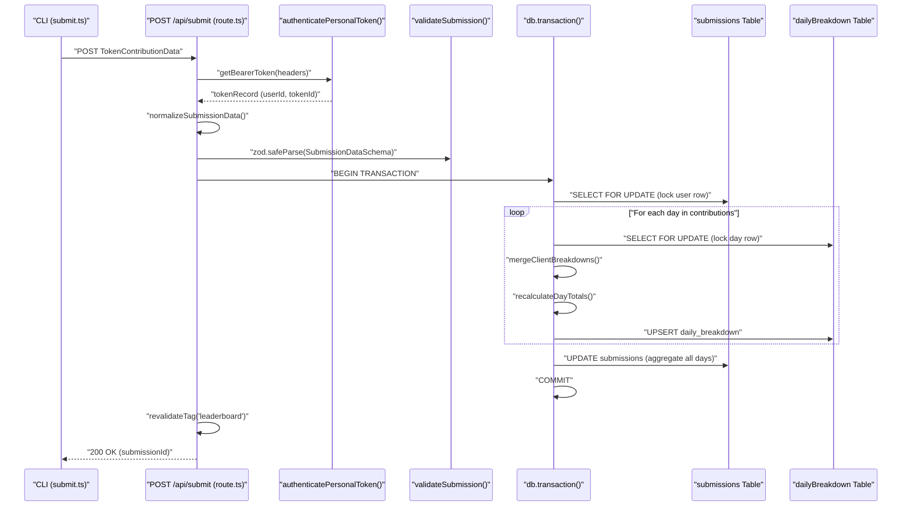
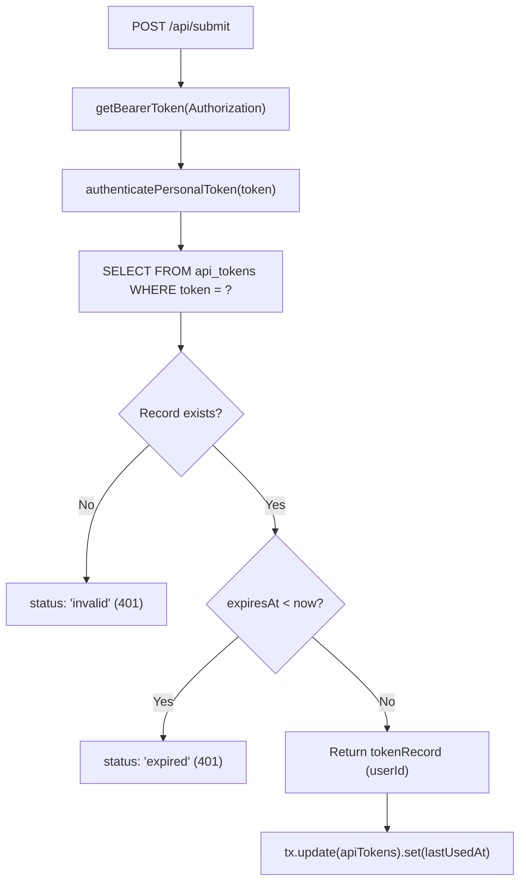

# Submit Endpoint

<details>
<summary>Relevant source files</summary>

The following files were used as context for generating this wiki page:

- [packages/frontend/__tests__/api/submit.test.ts](packages/frontend/__tests__/api/submit.test.ts)
- [packages/frontend/src/app/api/submit/route.ts](packages/frontend/src/app/api/submit/route.ts)
- [packages/frontend/src/app/api/users/[username]/route.ts](packages/frontend/src/app/api/users/[username]/route.ts)
- [packages/frontend/src/components/SourceLogo.tsx](packages/frontend/src/components/SourceLogo.tsx)
- [packages/frontend/src/lib/constants.ts](packages/frontend/src/lib/constants.ts)
- [packages/frontend/src/lib/db/helpers.ts](packages/frontend/src/lib/db/helpers.ts)
- [packages/frontend/src/lib/db/migrations/0000_add_user_id_unique_constraint.sql](packages/frontend/src/lib/db/migrations/0000_add_user_id_unique_constraint.sql)
- [packages/frontend/src/lib/db/migrations/meta/0000_snapshot.json](packages/frontend/src/lib/db/migrations/meta/0000_snapshot.json)
- [packages/frontend/src/lib/db/migrations/meta/_journal.json](packages/frontend/src/lib/db/migrations/meta/_journal.json)
- [packages/frontend/src/lib/db/schema.ts](packages/frontend/src/lib/db/schema.ts)
- [packages/frontend/src/lib/types.ts](packages/frontend/src/lib/types.ts)
- [packages/frontend/src/lib/validation/submission.ts](packages/frontend/src/lib/validation/submission.ts)

</details>


The Submit Endpoint (`POST /api/submit`) is the primary API for uploading token usage data from the CLI to the tokscale.ai platform. This endpoint performs authenticated data ingestion with intelligent source-level merging, ensuring that data from different AI coding sources (OpenCode, Claude, Cursor, etc.) can be incrementally updated without losing previously submitted data from other sources.

For authentication details, see [Authentication Flow](#5.4). For how submitted data is displayed, see [Leaderboard API](#5.2) and [User Profile API](#5.3).

## API Contract

The endpoint accepts token contribution data structured as daily breakdowns with client-specific metrics, and returns submission metadata with updated totals.

### Request Format

**Endpoint:** `POST /api/submit`

**Headers:**
| Header | Value | Required |
|--------|-------|----------|
| `Authorization` | `Bearer <api_token>` | Yes |
| `Content-Type` | `application/json` | Yes |

**Body Structure (SubmissionData):**
The request body is validated against `SubmissionDataSchema` in [packages/frontend/src/lib/validation/submission.ts:159-164]().

```typescript
{
  "meta": {
    "version": string,           // CLI version (e.g., "1.0.24")
    "dateRange": {
      "start": string,           // ISO date (e.g., "2024-01-01")
      "end": string              // ISO date
    }
  },
  "summary": {
    "totalTokens": number,
    "totalCost": number,
    "activeDays": number,
    "clients": string[],         // e.g., ["opencode", "cursor"]
    "models": string[]           // e.g., ["claude-3-5-sonnet-20241022"]
  },
  "contributions": [
    {
      "date": string,            // ISO date
      "clients": [
        {
          "client": string,      // Client name (e.g. "cursor", "claude")
          "modelId": string,     // Model identifier
          "tokens": {
            "input": number,
            "output": number,
            "cacheRead": number,
            "cacheWrite": number,
            "reasoning": number
          },
          "cost": number,
          "messages": number
        }
      ]
    }
  ]
}
```

**Sources:** [packages/frontend/src/app/api/submit/route.ts:51-63](), [packages/frontend/src/lib/validation/submission.ts:159-164](), [packages/frontend/src/lib/types.ts:87-92]()

## End-to-End Submission Flow

The following diagram shows the complete flow from CLI invocation to database storage, highlighting the transition from CLI entities to API route logic.



**Sources:** [packages/frontend/src/app/api/submit/route.ts:64-395](), [packages/frontend/src/lib/db/helpers.ts:72-88]()

## Authentication

Authentication is performed using API tokens issued during the device flow login process. The endpoint validates both token existence and expiration via `authenticatePersonalToken` in [packages/frontend/src/lib/auth/personalTokens.ts]().

### Token Validation Logic



**Sources:** [packages/frontend/src/app/api/submit/route.ts:69-90](), [packages/frontend/src/app/api/submit/route.ts:142-145]()

## Data Validation and Normalization

The endpoint performs normalization to ensure backward compatibility and data integrity before Zod validation.

### Normalization Logic
1. **Model ID Defaults:** If `modelId` is missing or empty, it is set to `"unknown"` in `normalizeSubmissionData` [packages/frontend/src/app/api/submit/route.ts:22-48]().
2. **Legacy Key Mapping:** Older CLI versions using the key `sources` are mapped to the new `clients` key in `normalizeLegacySources` [packages/frontend/src/lib/validation/submission.ts:113-157]().
3. **Client Aliasing:** The client `kilocode` is automatically aliased to `kilo` to maintain consistency [packages/frontend/src/lib/validation/submission.ts:96-105]().

### Mathematical Consistency
The `validateSubmission` function in [packages/frontend/src/lib/validation/submission.ts:182-240]() checks:
- **No Future Dates:** Rejects submissions with dates more than 2 days in the future to account for timezone skew [packages/frontend/src/lib/validation/submission.ts:210-222]().
- **Total Sums:** Validates that `input + output + cacheRead + cacheWrite + reasoning` matches the provided `totals.tokens` [packages/frontend/src/lib/validation/submission.ts:227-234]().

**Sources:** [packages/frontend/src/app/api/submit/route.ts:22-48](), [packages/frontend/src/lib/validation/submission.ts:113-157](), [packages/frontend/src/lib/validation/submission.ts:182-240]()

## Source-Level Merge Algorithm

The endpoint implements a **Client-Level Merge** strategy. Unlike a full overwrite, this preserves data for clients that are not present in the current submission.

### Implementation
The merge logic is defined in `mergeClientBreakdowns` [packages/frontend/src/lib/db/helpers.ts:72-88]().

```typescript
export function mergeClientBreakdowns(
  existing: Record<string, ClientBreakdownData> | null | undefined,
  incoming: Record<string, ClientBreakdownData>,
  incomingClients: Set<string>
): Record<string, ClientBreakdownData> {
  const merged: Record<string, ClientBreakdownData> = { ...(existing || {}) };

  for (const clientName of incomingClients) {
    if (incoming[clientName]) {
      merged[clientName] = { ...incoming[clientName] };
    } else {
      delete merged[clientName];
    }
  }

  return merged;
}
```

### Logic Summary
| State | Behavior |
|-------|----------|
| **Client in Submission** | Overwrites the existing data for that specific client in the DB. |
| **Client NOT in Submission** | Preserved. The existing data for other clients remains untouched. |
| **Client in Submission but Empty** | Deleted from the record (allows for correction/deletion of data). |

**Sources:** [packages/frontend/src/lib/db/helpers.ts:72-88](), [packages/frontend/src/app/api/submit/route.ts:54-58]()

## Database Transaction and Locking

To prevent race conditions during concurrent submissions, the endpoint utilizes row-level locking via PostgreSQL `FOR UPDATE`.

### Transaction Steps
1. **Lock Submission:** Selects the user's submission record with `FOR UPDATE` [packages/frontend/src/app/api/submit/route.ts:150-155]().
2. **Lock Daily Data:** Selects all existing `daily_breakdown` rows for that submission with `FOR UPDATE` [packages/frontend/src/app/api/submit/route.ts:190-199]().
3. **In-Memory Merge:** Iterates through incoming contributions, merging them with `existingDaysMap` [packages/frontend/src/app/api/submit/route.ts:213-280]().
4. **Batch Write:** Performs `UPSERT` on the `daily_breakdown` table [packages/frontend/src/app/api/submit/route.ts:282-284]().
5. **Aggregate Totals:** Queries the `daily_breakdown` table to sum all tokens and costs across all days to update the parent `submissions` record [packages/frontend/src/app/api/submit/route.ts:286-311]().

### Database Entities Involved
| Code Entity | DB Table | Purpose |
|-------------|----------|---------|
| `submissions` | `submissions` | Stores user-level aggregate totals, cost, and date ranges [packages/frontend/src/lib/db/schema.ts:148-190](). |
| `dailyBreakdown` | `daily_breakdown` | Stores JSONB breakdowns of `source_breakdown` and `model_breakdown` per day [packages/frontend/src/lib/db/schema.ts:213-241](). |
| `apiTokens` | `api_tokens` | Validates authentication and updates `last_used_at` [packages/frontend/src/lib/db/schema.ts:93-113](). |

**Sources:** [packages/frontend/src/app/api/submit/route.ts:141-371](), [packages/frontend/src/lib/db/schema.ts:148-241]()
