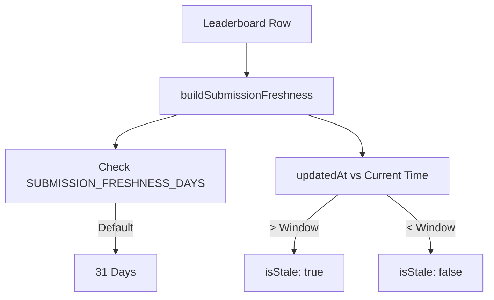

# Leaderboard API

<details>
<summary>Relevant source files</summary>

The following files were used as context for generating this wiki page:

- [crates/tokscale-core/src/sessions/crush.rs](crates/tokscale-core/src/sessions/crush.rs)
- [packages/frontend/__tests__/api/leaderboard.test.ts](packages/frontend/__tests__/api/leaderboard.test.ts)
- [packages/frontend/__tests__/api/usersProfile.test.ts](packages/frontend/__tests__/api/usersProfile.test.ts)
- [packages/frontend/__tests__/lib/getLeaderboard.test.ts](packages/frontend/__tests__/lib/getLeaderboard.test.ts)
- [packages/frontend/__tests__/lib/getLeaderboardAllTime.test.ts](packages/frontend/__tests__/lib/getLeaderboardAllTime.test.ts)
- [packages/frontend/__tests__/lib/submissionFreshness.test.ts](packages/frontend/__tests__/lib/submissionFreshness.test.ts)
- [packages/frontend/src/app/api/leaderboard/route.ts](packages/frontend/src/app/api/leaderboard/route.ts)
- [packages/frontend/src/app/api/leaderboard/user/[username]/route.ts](packages/frontend/src/app/api/leaderboard/user/[username]/route.ts)
- [packages/frontend/src/lib/leaderboard/getLeaderboard.ts](packages/frontend/src/lib/leaderboard/getLeaderboard.ts)
- [packages/frontend/src/lib/leaderboard/types.ts](packages/frontend/src/lib/leaderboard/types.ts)
- [packages/frontend/vercel.json](packages/frontend/vercel.json)

</details>


The Leaderboard API provides public endpoints for querying ranked user token usage statistics. It supports filtering by time period (all-time, monthly, weekly), pagination, sorting (by tokens or cost), and individual user rank lookup. This endpoint powers the public leaderboard page at [tokscale.ai](https://tokscale.ai).

## API Endpoints

The Leaderboard API exposes two primary endpoints:

| Endpoint | Method | Purpose | Caching |
|----------|--------|---------|---------|
| `/api/leaderboard` | GET | Ranked list with pagination and search | 60s ISR |
| `/api/leaderboard/user/[username]` | GET | Individual user rank lookup | 60s ISR |

### GET /api/leaderboard

The main leaderboard endpoint returns paginated rankings with global statistics.

**Query Parameters:**

| Parameter | Type | Default | Validation | Description |
|-----------|------|---------|------------|-------------|
| `period` | string | `"all"` | `["all", "month", "week"]` | Time period filter |
| `sortBy` | string | `"tokens"`| `["tokens", "cost"]` | Primary sorting metric |
| `page` | number | `1` | `>= 1` | Page number (1-indexed) |
| `limit` | number | `50` | `1-100` | Results per page |
| `search` | string | `""` | - | Case-insensitive username filter |

**Implementation:** [packages/frontend/src/app/api/leaderboard/route.ts:16-45]()

```typescript
// Request validation and parameter parsing
const periodParam = searchParams.get("period") || "all";
const period: Period = VALID_PERIODS.includes(periodParam as Period)
  ? (periodParam as Period)
  : "all";

const sortByParam = searchParams.get("sortBy") || "tokens";
const sortBy: SortBy = VALID_SORT_BY.includes(sortByParam as SortBy)
  ? (sortByParam as SortBy)
  : "tokens";

const page = Math.max(1, parseIntSafe(searchParams.get("page"), 1));
const limit = Math.min(100, Math.max(1, parseIntSafe(searchParams.get("limit"), 50)));
const search = (searchParams.get("search") || "").trim();

const data = await getLeaderboardData(period, page, limit, sortBy, search);
```

**Sources:** [packages/frontend/src/app/api/leaderboard/route.ts:1-46]()

### GET /api/leaderboard/user/[username]

Retrieves a specific user's rank and statistics for a given period.

**Path Parameters:**

| Parameter | Validation | Description |
|-----------|------------|-------------|
| `username` | GitHub format | GitHub username to lookup |

**Implementation:** [packages/frontend/src/app/api/leaderboard/user/[username]/route.ts:11-50]()

**Sources:** [packages/frontend/src/app/api/leaderboard/user/[username]/route.ts:1-51]()

## Response Format

### Leaderboard Response

The response includes the ranked user list, pagination metadata, and aggregate statistics for the requested period.

```typescript
interface LeaderboardData {
  users: LeaderboardUser[];
  pagination: {
    page: number;
    limit: number;
    totalUsers: number;
    totalPages: number;
    hasNext: boolean;
    hasPrev: boolean;
  };
  stats: {
    totalTokens: number;
    totalCost: number;
    totalSubmissions: number | null;
    uniqueUsers: number;
  };
  period: Period;
  sortBy: SortBy;
}
```

**Type Definitions:** [packages/frontend/src/lib/leaderboard/types.ts:1-38]()

### LeaderboardUser Object

Contains user identity, usage totals, and "freshness" metadata.

```typescript
interface LeaderboardUser {
  rank: number;
  userId: string;
  username: string;
  displayName: string | null;
  avatarUrl: string | null;
  totalTokens: number;
  totalCost: number;
  submissionCount: number | null;
  lastSubmission: string;
  submissionFreshness: SubmissionFreshness | null;
}
```

**Sources:** [packages/frontend/src/lib/leaderboard/types.ts:6-17](), [packages/frontend/src/lib/leaderboard/getLeaderboard.ts:11-13]()

## Request Flow Architecture

```mermaid
sequenceDiagram
    participant Browser
    participant RouteHandler["/api/leaderboard<br/>route.ts"]
    participant GetLeaderboard["getLeaderboardData()<br/>getLeaderboard.ts"]
    participant DB["Neon PostgreSQL"]
    
    Browser->>RouteHandler: GET /api/leaderboard?period=month&sortBy=cost
    RouteHandler->>RouteHandler: Parse & Validate Query Params
    RouteHandler->>GetLeaderboard: getLeaderboardData(period, page, limit, sortBy, search)
    
    alt period == "all"
        GetLeaderboard->>DB: Query All-Time Submissions (Aggregated)
    else period == "month" | "week"
        GetLeaderboard->>DB: Query dailyBreakdown (Filtered by Date)
    end
    
    DB-->>GetLeaderboard: Raw Rows
    
    alt period != "all"
        GetLeaderboard->>GetLeaderboard: aggregatePeriodRows()
    end
    
    GetLeaderboard->>GetLeaderboard: Calculate Ranks & Paginate
    GetLeaderboard-->>RouteHandler: LeaderboardData
    RouteHandler-->>Browser: JSON Response (revalidate: 60s)
```

**Sources:** [packages/frontend/src/app/api/leaderboard/route.ts:16-45](), [packages/frontend/src/lib/leaderboard/getLeaderboard.ts:236-285]()

## Data Retrieval Logic

### All-Time Leaderboard

For the "all" period, the system queries the `submissions` table directly. It uses scalar subqueries to retrieve the `cli_version` and `schema_version` from the most recent submission for each user to determine data "freshness".

```typescript
// Subquery for freshness metadata
const latestCliVersion = db
  .select({ cli_version: submissions.cliVersion })
  .from(submissions.as("s2"))
  .where(eq(sql`s2.user_id`, users.id))
  .orderBy(desc(sql`s2.updated_at`))
  .limit(1);
```

**Implementation:** [packages/frontend/src/lib/leaderboard/getLeaderboard.ts:311-340]()

### Period-Based Leaderboard (Month/Week)

For "month" or "week", the system queries the `dailyBreakdown` table. Because a user may have multiple daily entries, the API performs manual aggregation in memory using `aggregatePeriodRows`.

1.  **Date Range Calculation:** `getPeriodDateRange` calculates UTC start/end strings [packages/frontend/src/lib/leaderboard/getLeaderboard.ts:65-91]().
2.  **Aggregation:** `aggregatePeriodRows` reduces multiple daily rows into a single `LeaderboardUser` object per user [packages/frontend/src/lib/leaderboard/getLeaderboard.ts:117-160]().
3.  **Sorting:** `compareLeaderboardUsers` handles tie-breaking (e.g., if tokens are equal, sort by cost; if both equal, sort by username) [packages/frontend/src/lib/leaderboard/getLeaderboard.ts:93-115]().

**Sources:** [packages/frontend/src/lib/leaderboard/getLeaderboard.ts:65-160](), [packages/frontend/src/lib/leaderboard/getLeaderboard.ts:236-285]()

## Submission Freshness

The API includes a `submissionFreshness` object to indicate if a user's data is outdated.



**Logic:** [packages/frontend/src/lib/submissionFreshness.ts:44-61]()
**Usage in API:** [packages/frontend/src/lib/leaderboard/getLeaderboard.ts:131-136]()

**Sources:** [packages/frontend/src/lib/submissionFreshness.ts:1-61](), [packages/frontend/src/lib/leaderboard/getLeaderboard.ts:131-136]()

## Error Handling

The API implements structured error responses with appropriate HTTP status codes.

| Error Type | Status Code | Response | Trigger |
|------------|-------------|----------|---------|
| Invalid Username | 400 | `{ error: "Invalid username format" }` | Malformed GitHub username [packages/frontend/src/app/api/leaderboard/user/[username]/route.ts:18-23]() |
| User Not Found | 404 | `{ error: "User not found or has no submissions" }` | Username doesn't exist or has 0 tokens [packages/frontend/src/app/api/leaderboard/user/[username]/route.ts:38-40]() |
| Internal Error | 500 | `{ error: "Failed to fetch leaderboard" }` | Database or aggregation failure [packages/frontend/src/app/api/leaderboard/route.ts:39-44]() |

**Sources:** [packages/frontend/src/app/api/leaderboard/route.ts:38-44](), [packages/frontend/src/app/api/leaderboard/user/[username]/route.ts:18-40]()
