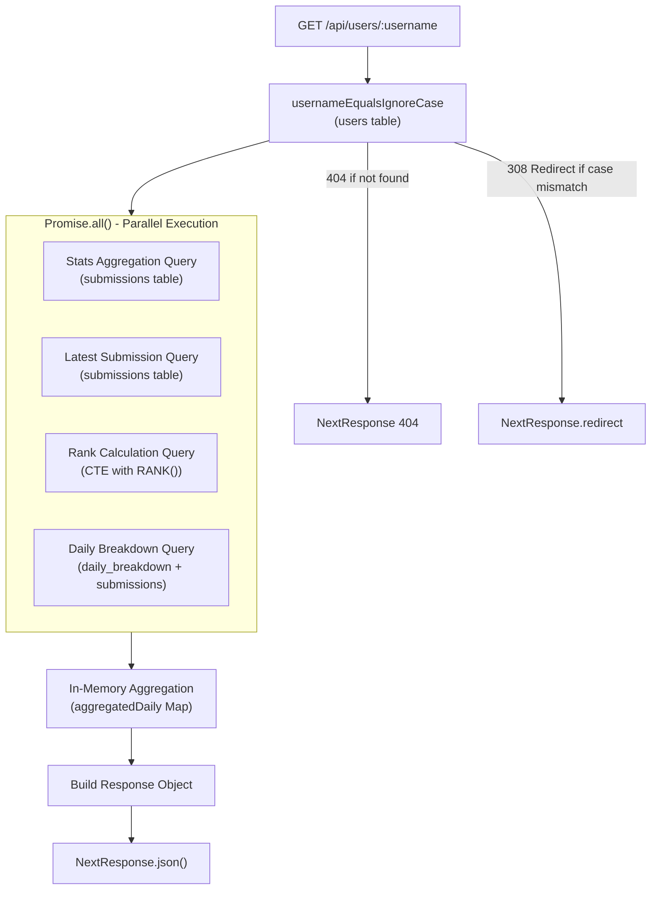
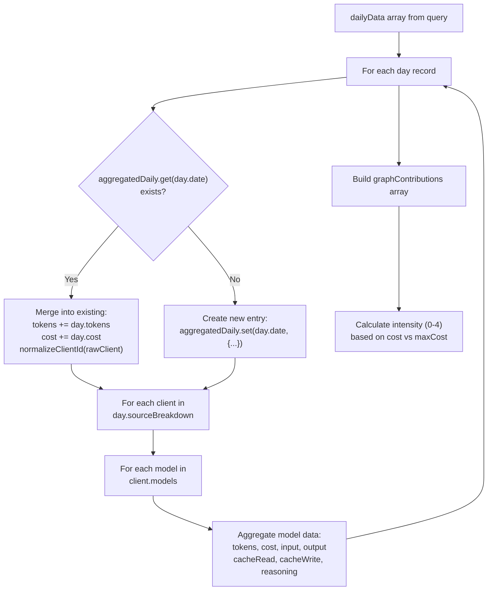
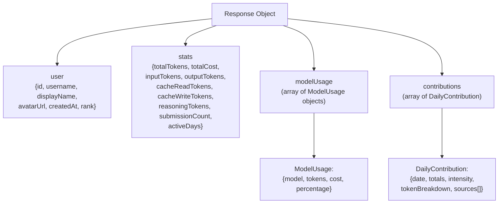

# User Profile API

<details>
<summary>Relevant source files</summary>

The following files were used as context for generating this wiki page:

- [packages/frontend/src/app/api/submit/route.ts](packages/frontend/src/app/api/submit/route.ts)
- [packages/frontend/src/app/api/users/[username]/route.ts](packages/frontend/src/app/api/users/[username]/route.ts)
- [packages/frontend/src/lib/db/helpers.ts](packages/frontend/src/lib/db/helpers.ts)
- [packages/frontend/src/lib/db/migrations/0000_add_user_id_unique_constraint.sql](packages/frontend/src/lib/db/migrations/0000_add_user_id_unique_constraint.sql)
- [packages/frontend/src/lib/db/migrations/meta/0000_snapshot.json](packages/frontend/src/lib/db/migrations/meta/0000_snapshot.json)
- [packages/frontend/src/lib/db/migrations/meta/_journal.json](packages/frontend/src/lib/db/migrations/meta/_journal.json)
- [packages/frontend/src/lib/db/schema.ts](packages/frontend/src/lib/db/schema.ts)

</details>


## Purpose and Scope

The User Profile API provides a read-only HTTP endpoint at `GET /api/users/:username` that retrieves comprehensive token usage statistics, contribution graphs, and activity data for individual users. This endpoint serves the public user profile pages at `/u/:username` and aggregates data from the `users`, `submissions`, and `dailyBreakdown` tables to generate a complete view of a user's AI token consumption history.

The API handles legacy client normalization (e.g., mapping `kilocode` to `kilo`) and implements a parallel query strategy to ensure high performance.

**Sources:** [packages/frontend/src/app/api/users/[username]/route.ts:1-23](), [packages/frontend/src/app/api/users/[username]/route.ts:12-15]()

## Endpoint Specification

| Property | Value |
|----------|-------|
| **Method** | `GET` |
| **Path** | `/api/users/:username` |
| **Authentication** | None (public endpoint) |
| **ISR Revalidation** | 60 seconds |
| **Cache Strategy** | ISR with `revalidate = 60` |

The endpoint is defined in [packages/frontend/src/app/api/users/[username]/route.ts:23-389]() and exports an async `GET` function that accepts a dynamic `username` parameter from Next.js App Router.

**Sources:** [packages/frontend/src/app/api/users/[username]/route.ts:17-23]()

## Request Flow and Query Architecture

The API employs a parallel query strategy using `Promise.all` to fetch four distinct datasets concurrently, minimizing database round-trips and total response time.

### Parallel Query Execution Diagram



**Sources:** [packages/frontend/src/app/api/users/[username]/route.ts:28-119]()

### Query 1: User Lookup

The initial query uses `usernameEqualsIgnoreCase` to find the user. If a match is found but the case doesn't match the primary username, it performs a 308 redirect to the canonical URL.

[packages/frontend/src/app/api/users/[username]/route.ts:28-47]()

```typescript
const matchingUsers = await db
  .select({ ... })
  .from(users)
  .where(usernameEqualsIgnoreCase(username))
  .limit(USERNAME_LOOKUP_LIMIT);
const user = getSingleUsernameMatch(matchingUsers, username);
```

**Sources:** [packages/frontend/src/app/api/users/[username]/route.ts:28-47]()

### Query 2: Stats Aggregation

Aggregates all-time statistics across all submissions for the user. It calculates `totalTokens`, `totalCost` (cast to DECIMAL), and specific token types like `reasoningTokens` and `cacheReadTokens`.

[packages/frontend/src/app/api/users/[username]/route.ts:53-67]()

**Sources:** [packages/frontend/src/app/api/users/[username]/route.ts:53-67]()

### Query 3: Rank Calculation

Computes the user's global rank using a Common Table Expression (CTE) with window functions. The `user_totals` CTE sums tokens per `user_id`, and the `ranked` CTE applies `RANK() OVER (ORDER BY total_tokens DESC)`.

[packages/frontend/src/app/api/users/[username]/route.ts:82-97]()

**Sources:** [packages/frontend/src/app/api/users/[username]/route.ts:82-97]()

### Query 4: Daily Breakdown Data

Fetches granular daily activity for the past 365 days by joining `daily_breakdown` with `submissions`.

[packages/frontend/src/app/api/users/[username]/route.ts:99-118]()

**Sources:** [packages/frontend/src/app/api/users/[username]/route.ts:99-118]()

## Data Aggregation Logic

After parallel queries complete, the endpoint performs in-memory aggregation to combine multiple daily records into a single unified view per date.

### Aggregation Algorithm Diagram



**Sources:** [packages/frontend/src/app/api/users/[username]/route.ts:163-267]()

### Client and Model Breakdown Merging

The nested aggregation structure handles:

1.  **Client-level aggregation**: Combines data for each client (e.g., "cursor", "claude-code") across all days.
2.  **Legacy Aliasing**: Uses `normalizeClientId` to map legacy IDs like `kilocode` to `kilo`.
3.  **Model-level aggregation**: Within each client, aggregates metrics per model.
4.  **Token type tracking**: Separately tracks `input`, `output`, `cacheRead`, `cacheWrite`, and `reasoning` tokens.

**Sources:** [packages/frontend/src/app/api/users/[username]/route.ts:12-15](), [packages/frontend/src/app/api/users/[username]/route.ts:176-238]()

## Contribution Graph Calculation

The endpoint generates GitHub-style contribution graph data with intensity levels (0-4) based on the distribution of daily costs.

[packages/frontend/src/app/api/users/[username]/route.ts:269-286]()

| Intensity | Cost Range | Visual Representation |
| :--- | :--- | :--- |
| 0 | `cost === 0` | Empty/no activity |
| 1 | `0 < cost ≤ maxCost * 0.25` | Light |
| 2 | `maxCost * 0.25 < cost ≤ maxCost * 0.5` | Medium |
| 3 | `maxCost * 0.5 < cost ≤ maxCost * 0.75` | Dark |
| 4 | `cost > maxCost * 0.75` | Darkest |

**Sources:** [packages/frontend/src/app/api/users/[username]/route.ts:269-286]()

## Response Schema

The endpoint returns a JSON response containing user info, aggregated stats, and a list of daily contributions.

### Response Object Diagram



**Sources:** [packages/frontend/src/app/api/users/[username]/route.ts:352-381]()

## Performance Considerations

### Database Query Optimization

*   **Parallel Queries**: Uses `Promise.all()` to execute four independent queries concurrently, reducing total latency. [packages/frontend/src/app/api/users/[username]/route.ts:52-119]()
*   **Case-Insensitive Indexing**: Leverages `usernameEqualsIgnoreCase` which utilizes the `USERS_USERNAME_LOWER_UNIQUE_INDEX`. [packages/frontend/src/lib/db/schema.ts:45-47](), [packages/frontend/src/app/api/users/[username]/route.ts:37]()
*   **Join Optimization**: The join between `daily_breakdown` and `submissions` is constrained by the `userId` index on `submissions`. [packages/frontend/src/app/api/users/[username]/route.ts:111-114]()

### ISR Caching

The endpoint uses Next.js Incremental Static Regeneration with a revalidation period of 60 seconds.

**Sources:** [packages/frontend/src/app/api/users/[username]/route.ts:17]()

## Type Definitions

The API uses internal types for processing daily and model data:

*   `ModelData`: Tracks `tokens`, `cost`, `input`, `output`, `cacheRead`, `cacheWrite`, `reasoning`, and `messages`. [packages/frontend/src/app/api/users/[username]/route.ts:125-134]()
*   `ClientBreakdown`: Extends model metrics with a nested `models` record. [packages/frontend/src/app/api/users/[username]/route.ts:136-147]()

**Sources:** [packages/frontend/src/app/api/users/[username]/route.ts:125-147]()
