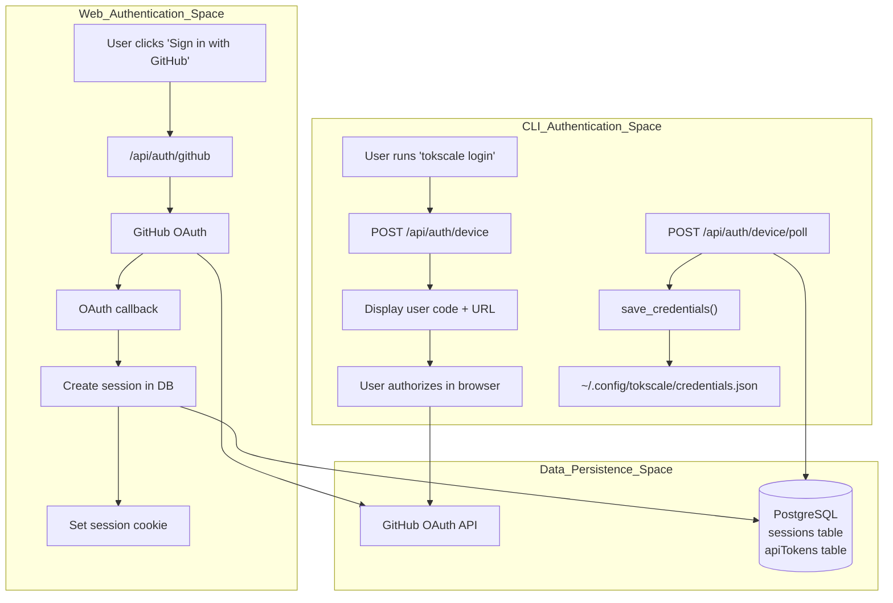
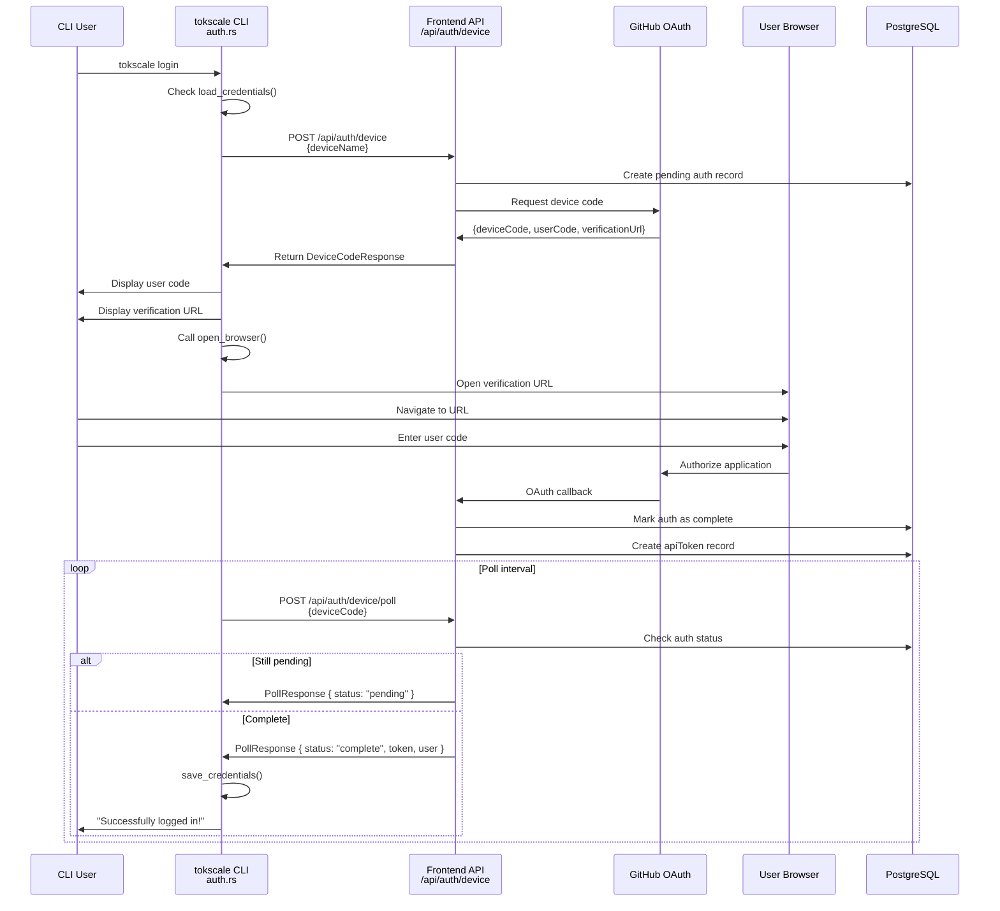
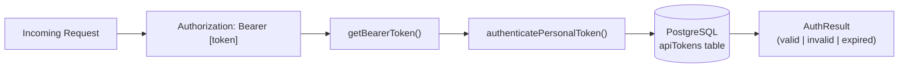

# Authentication Flow

<details>
<summary>Relevant source files</summary>

The following files were used as context for generating this wiki page:

- [Cargo.lock](Cargo.lock)
- [crates/tokscale-cli/Cargo.toml](crates/tokscale-cli/Cargo.toml)
- [crates/tokscale-cli/src/auth.rs](crates/tokscale-cli/src/auth.rs)
- [crates/tokscale-cli/src/cursor.rs](crates/tokscale-cli/src/cursor.rs)
- [crates/tokscale-core/Cargo.toml](crates/tokscale-core/Cargo.toml)
- [packages/frontend/__tests__/api/authToken.test.ts](packages/frontend/__tests__/api/authToken.test.ts)
- [packages/frontend/__tests__/api/devicePoll.test.ts](packages/frontend/__tests__/api/devicePoll.test.ts)
- [packages/frontend/__tests__/api/settingsTokensDelete.test.ts](packages/frontend/__tests__/api/settingsTokensDelete.test.ts)
- [packages/frontend/__tests__/api/settingsTokensList.test.ts](packages/frontend/__tests__/api/settingsTokensList.test.ts)
- [packages/frontend/__tests__/api/submitAuth.test.ts](packages/frontend/__tests__/api/submitAuth.test.ts)
- [packages/frontend/__tests__/lib/bearerToken.test.ts](packages/frontend/__tests__/lib/bearerToken.test.ts)
- [packages/frontend/__tests__/lib/personalTokens.test.ts](packages/frontend/__tests__/lib/personalTokens.test.ts)
- [packages/frontend/src/app/api/auth/device/poll/route.ts](packages/frontend/src/app/api/auth/device/poll/route.ts)
- [packages/frontend/src/app/api/auth/token/route.ts](packages/frontend/src/app/api/auth/token/route.ts)
- [packages/frontend/src/app/api/settings/submitted-data/route.ts](packages/frontend/src/app/api/settings/submitted-data/route.ts)
- [packages/frontend/src/app/api/settings/tokens/[tokenId]/route.ts](packages/frontend/src/app/api/settings/tokens/[tokenId]/route.ts)
- [packages/frontend/src/app/api/settings/tokens/route.ts](packages/frontend/src/app/api/settings/tokens/route.ts)
- [packages/frontend/src/lib/auth/personalTokens.ts](packages/frontend/src/lib/auth/personalTokens.ts)
- [packages/frontend/src/lib/auth/session.ts](packages/frontend/src/lib/auth/session.ts)

</details>


This document describes the authentication system used across Tokscale's CLI and web frontend. It covers the GitHub OAuth integration, the Device Authorization Grant flow for CLI users, session management for the web application, and the handling of personal API tokens.

## Overview

Tokscale implements two parallel authentication flows: a **device flow** for the CLI tool and a **web-based OAuth flow** for the frontend application. Both flows eventually map to a user record in the database, enabling authenticated operations like data submission and profile management.



**Sources:** [crates/tokscale-cli/src/auth.rs:219-335](), [packages/frontend/src/app/api/auth/token/route.ts:5-44]()

## Device Flow Authentication (CLI)

The CLI uses the OAuth 2.0 Device Authorization Grant flow, allowing users to authenticate on a separate device (browser) while the CLI polls for completion. This is primarily handled in the `login` function in the Rust CLI.

### Device Flow Sequence



**Sources:** [crates/tokscale-cli/src/auth.rs:219-335](), [crates/tokscale-cli/src/auth.rs:38-59]()

### Key Functions and Structs

| Entity | Location | Purpose |
|----------|----------|---------|
| `login()` | [crates/tokscale-cli/src/auth.rs:219-335]() | Orchestrates the entire device flow and polling loop. |
| `DeviceCodeResponse` | [crates/tokscale-cli/src/auth.rs:38-49]() | Struct for the initial device authorization response. |
| `PollResponse` | [crates/tokscale-cli/src/auth.rs:52-58]() | Struct for polling status updates. |
| `open_browser()` | [crates/tokscale-cli/src/auth.rs:189-217]() | Cross-platform utility to open URLs in the default browser. |
| `get_device_name()` | [crates/tokscale-cli/src/auth.rs:166-172]() | Generates a string like "CLI on [hostname]" for identification. |

**Sources:** [crates/tokscale-cli/src/auth.rs:38-335]()

## Credential Storage

The CLI stores authenticated session data locally to avoid re-authentication. These are stored in a JSON file at `~/.config/tokscale/credentials.json`.

### Credentials Data Structure

The `Credentials` struct is serialized to disk with restricted file permissions (`0o600` on Unix systems).

```rust
pub struct Credentials {
    pub token: String,
    pub username: String,
    pub avatar_url: Option<String>,
    pub created_at: String,
}
```

**Sources:** [crates/tokscale-cli/src/auth.rs:15-22](), [crates/tokscale-cli/src/auth.rs:90-114]()

### Credential Management Functions

| Function | Location | Purpose |
|----------|----------|---------|
| `save_credentials()` | [crates/tokscale-cli/src/auth.rs:90-114]() | Persists credentials to disk with safe permissions. |
| `load_credentials()` | [crates/tokscale-cli/src/auth.rs:116-124]() | Reads credentials from the local config path. |
| `resolve_api_token()` | [crates/tokscale-cli/src/auth.rs:136-150]() | Resolves token from environment (`TOKSCALE_API_TOKEN`) or stored file. |
| `clear_credentials()` | [crates/tokscale-cli/src/auth.rs:152-160]() | Deletes the local credentials file (logout). |

**Sources:** [crates/tokscale-cli/src/auth.rs:90-160]()

## API Token Handling

Tokscale supports Personal Access Tokens (API Tokens) for headless environments (like CI/CD) and CLI authentication.

### Token Validation Flow

The backend validates tokens using the `authenticatePersonalToken` library function, which checks the database for validity and expiration.



**Sources:** [packages/frontend/src/app/api/auth/token/route.ts:7-28](), [packages/frontend/src/lib/auth/bearerToken.ts:1-21]()

### Token Management API

Users can manage their tokens through the web interface, which interacts with the following API routes:

- **List Tokens**: `GET /api/settings/tokens` - Lists metadata (name, creation date) for all user tokens. [packages/frontend/src/app/api/settings/tokens/route.ts:21-45]()
- **Create Token**: `POST /api/settings/tokens` - Issues a new raw token. This is the only time the secret value is displayed. [packages/frontend/src/app/api/settings/tokens/route.ts:47-82]()
- **Delete Token**: `DELETE /api/settings/tokens/[tokenId]` - Revokes a specific token.

### Security Implementation

- **Bearer Scheme**: The system accepts "Bearer" case-insensitively. [packages/frontend/src/lib/auth/bearerToken.ts:12-16]()
- **Atomic Writes**: On the CLI, sensitive files are written using an atomic rename pattern to prevent corruption. [crates/tokscale-cli/src/cursor.rs:161-218]()
- **Environment Overrides**: The environment variable `TOKSCALE_API_TOKEN` always takes precedence over stored credentials. [crates/tokscale-cli/src/auth.rs:137-143]()

**Sources:** [packages/frontend/src/app/api/auth/token/route.ts:1-44](), [crates/tokscale-cli/src/auth.rs:136-150]()

## Cursor IDE Authentication

In addition to standard Tokscale auth, the CLI manages authentication with Cursor.com to sync usage data.

- **Storage**: Credentials are stored in `~/.config/tokscale/cursor-credentials.json`. [crates/tokscale-cli/src/cursor.rs:33-35]()
- **Mechanism**: It uses the `WorkosCursorSessionToken` cookie to authenticate requests to Cursor's internal usage endpoints. [crates/tokscale-cli/src/cursor.rs:130-151]()
- **Cache**: Usage data is cached locally in `~/.config/tokscale/cursor-cache` to reduce API calls. [crates/tokscale-cli/src/cursor.rs:41-43]()

**Sources:** [crates/tokscale-cli/src/cursor.rs:33-151]()
