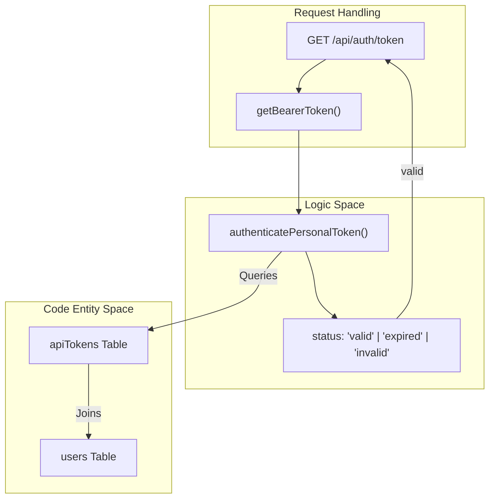
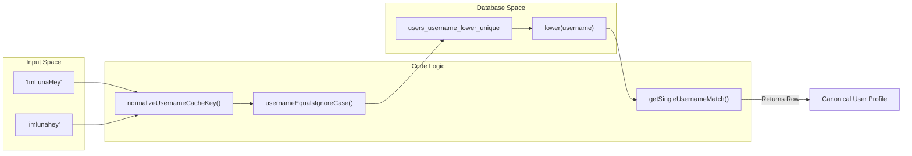

# Settings and Data Management API

Relevant source files

The following files were used as context for generating this wiki page:

- [packages/frontend/__tests__/api/authToken.test.ts](packages/frontend/__tests__/api/authToken.test.ts)
- [packages/frontend/__tests__/api/settingsSubmittedDataDelete.test.ts](packages/frontend/__tests__/api/settingsSubmittedDataDelete.test.ts)
- [packages/frontend/__tests__/api/settingsTokensList.test.ts](packages/frontend/__tests__/api/settingsTokensList.test.ts)
- [packages/frontend/__tests__/api/submitAuth.test.ts](packages/frontend/__tests__/api/submitAuth.test.ts)
- [packages/frontend/__tests__/lib/bearerToken.test.ts](packages/frontend/__tests__/lib/bearerToken.test.ts)
- [packages/frontend/__tests__/lib/getUserEmbedStats.test.ts](packages/frontend/__tests__/lib/getUserEmbedStats.test.ts)
- [packages/frontend/__tests__/lib/usernameLookup.test.ts](packages/frontend/__tests__/lib/usernameLookup.test.ts)
- [packages/frontend/src/app/api/auth/token/route.ts](packages/frontend/src/app/api/auth/token/route.ts)
- [packages/frontend/src/app/api/settings/submitted-data/route.ts](packages/frontend/src/app/api/settings/submitted-data/route.ts)
- [packages/frontend/src/app/api/settings/tokens/route.ts](packages/frontend/src/app/api/settings/tokens/route.ts)

The Settings and Data Management API provides endpoints for users to manage their personal access tokens, verify their identity via API, and control their data footprint on Tokscale. These endpoints are primarily consumed by the Tokscale CLI and the web-based user settings dashboard.

## API Token Management

Tokscale uses Personal Access Tokens (PATs) to authorize CLI submissions and other programmatic interactions. These tokens are managed via the `/api/settings/tokens` endpoint.

### Listing Tokens
The `GET /api/settings/tokens` endpoint retrieves all active tokens for the authenticated user. To protect security, the response includes metadata but omits the actual raw token string and sensitive fields like `userId`.

**Data Flow:**
1. The request calls `getSession()` to verify the user's web session [[packages/frontend/src/app/api/settings/tokens/route.ts:23-26]]().
2. It invokes `listPersonalTokens(session.id)` to fetch records from the database [[packages/frontend/src/app/api/settings/tokens/route.ts:28-28]]().
3. The results are mapped to a public schema containing `id`, `name`, `createdAt`, and `lastUsedAt` [[packages/frontend/src/app/api/settings/tokens/route.ts:31-36]]().

### Creating Tokens
The `POST /api/settings/tokens` endpoint allows users to generate new PATs.

**Implementation Details:**
- **Token Naming:** If no name is provided, it defaults to `"CI token"` [[packages/frontend/src/app/api/settings/tokens/route.ts:5-10]](). Names are trimmed and capped at 100 characters [[packages/frontend/src/app/api/settings/tokens/route.ts:6-18]]().
- **Uniqueness:** The `issuePersonalToken` function is called with `ensureUniqueName: true` to prevent confusion in the UI [[packages/frontend/src/app/api/settings/tokens/route.ts:60-60]]().
- **Single Exposure:** The raw token string is returned only once in the `201 Created` response [[packages/frontend/src/app/api/settings/tokens/route.ts:63-74]]().

### Token Authentication Flow
The `/api/auth/token` endpoint allows the CLI to verify if a locally stored token is still valid and retrieve the associated user profile.

**Logic Path:**
1. Extracts the token from the `Authorization: Bearer <token>` header using `getBearerToken` [[packages/frontend/src/app/api/auth/token/route.ts:7-13]]().
2. Calls `authenticatePersonalToken(token, { touchLastUsedAt: false })` [[packages/frontend/src/app/api/auth/token/route.ts:15-17]]().
3. Returns a 401 error if the token is `"invalid"` or `"expired"` [[packages/frontend/src/app/api/auth/token/route.ts:19-28]]().
4. Returns the `username`, `displayName`, and `avatarUrl` if valid [[packages/frontend/src/app/api/auth/token/route.ts:30-36]]().

### Token Entity Mapping
The following diagram maps the API logic to the underlying data entities and helper functions.

**Diagram: Token Authentication Entity Map**

Sources: [[packages/frontend/src/app/api/auth/token/route.ts:5-44]](), [[packages/frontend/src/lib/auth/bearerToken.ts:1-21]]()

## Data Management and Deletion

Users have the right to delete their submitted token usage data. This is handled by the `/api/settings/submitted-data` endpoint.

### Deleting User Data
The `DELETE /api/settings/submitted-data` endpoint performs a cascading cleanup of all usage records associated with a user.

**Implementation Logic:**
1. **Resolution:** The user is resolved via either a Bearer token or a session cookie [[packages/frontend/src/app/api/settings/submitted-data/route.ts:10-25]]().
2. **Database Execution:** It performs a `DELETE` operation on the `submissions` table where `userId` matches [[packages/frontend/src/app/api/settings/submitted-data/route.ts:34-37]]().
3. **Cache Invalidation:** This is the most critical step. To ensure the leaderboard and profile pages reflect the deletion, the system invalidates multiple Next.js tags and paths [[packages/frontend/src/app/api/settings/submitted-data/route.ts:42-52]]().

**Cache Invalidation Targets:**
| Target Type | Keys / Paths |
| :--- | :--- |
| Global Tags | `leaderboard`, `max`, `user-rank` |
| User-Specific Tags | `user:<username>`, `user-rank:<username>`, `embed-user:<username>` |
| Static Paths | `/leaderboard`, `/profile`, `/u/<username>` |

Sources: [[packages/frontend/src/app/api/settings/submitted-data/route.ts:27-69]](), [[packages/frontend/__tests__/api/settingsSubmittedDataDelete.test.ts:136-180]]()

## Username Resolution and Normalization

Because usernames are used in URLs (e.g., `/u/ImLunaHey`), the API must handle case-insensitive lookups safely to prevent collisions.

**Normalization Strategy:**
- **Case Folding:** All cache keys are normalized using `normalizeUsernameCacheKey`, which converts the username to lowercase [[packages/frontend/src/lib/db/usernameLookup.ts:68-70]]().
- **Functional Index:** The database utilizes a unique functional index on `lower("username")` to enforce uniqueness at the storage layer [[packages/frontend/__tests__/lib/usernameLookup.test.ts:91-100]]().
- **Ambiguity Check:** When looking up a user, the system fetches up to 2 rows. If more than 1 row matches case-insensitively, it throws an `AmbiguousUsernameError` [[packages/frontend/__tests__/lib/getUserEmbedStats.test.ts:113-118]]().

**Diagram: Username Resolution Pipeline**

Sources: [[packages/frontend/__tests__/lib/usernameLookup.test.ts:38-89]](), [[packages/frontend/__tests__/lib/getUserEmbedStats.test.ts:160-184]]()

## Summary of Endpoints

| Method | Endpoint | Description | Auth Required |
| :--- | :--- | :--- | :--- |
| `GET` | `/api/auth/token` | Validates a PAT and returns user info | Bearer Token |
| `GET` | `/api/settings/tokens` | Lists metadata for all user tokens | Web Session |
| `POST` | `/api/settings/tokens` | Creates a new PAT | Web Session |
| `DELETE` | `/api/settings/submitted-data` | Deletes all user submission data | Session or Token |

Sources: [[packages/frontend/src/app/api/settings/tokens/route.ts:1-82]](), [[packages/frontend/src/app/api/auth/token/route.ts:1-44]](), [[packages/frontend/src/app/api/settings/submitted-data/route.ts:1-70]]()
