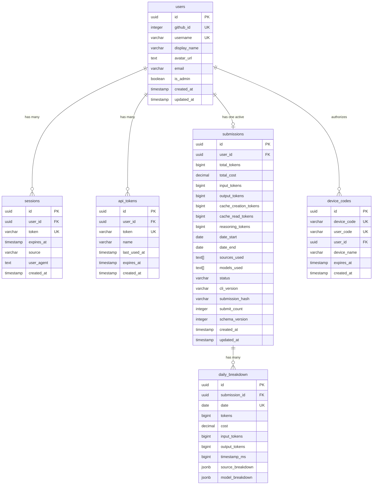

# Database Schema

Relevant source files

The following files were used as context for generating this wiki page:

- [packages/frontend/src/app/api/submit/route.ts](packages/frontend/src/app/api/submit/route.ts)
- [packages/frontend/src/app/api/users/[username]/route.ts](packages/frontend/src/app/api/users/[username]/route.ts)
- [packages/frontend/src/lib/db/helpers.ts](packages/frontend/src/lib/db/helpers.ts)
- [packages/frontend/src/lib/db/migrations/0000_add_user_id_unique_constraint.sql](packages/frontend/src/lib/db/migrations/0000_add_user_id_unique_constraint.sql)
- [packages/frontend/src/lib/db/migrations/meta/0000_snapshot.json](packages/frontend/src/lib/db/migrations/meta/0000_snapshot.json)
- [packages/frontend/src/lib/db/migrations/meta/_journal.json](packages/frontend/src/lib/db/migrations/meta/_journal.json)
- [packages/frontend/src/lib/db/schema.ts](packages/frontend/src/lib/db/schema.ts)

This document describes the PostgreSQL database schema used by the Tokscale web platform. The schema stores user authentication data, submission records, and daily token usage breakdowns. For information about how data flows through the API to populate this database, see [API Routes](#5). For details on how the frontend queries this schema, see [Frontend Web Application](#4).

The database uses Drizzle ORM and is hosted on Neon Serverless PostgreSQL. The schema implements a one-to-one-active submission model where each user has at most one active submission record that is updated through client-level (source-level) merges.

## Schema Overview

The database consists of six primary tables organized into two functional groups: authentication tables (`users`, `sessions`, `apiTokens`, `deviceCodes`) and submission tables (`submissions`, `dailyBreakdown`).

### Entity Relationship Diagram

**Sources:**
- [packages/frontend/src/lib/db/schema.ts:26-280]()

## Core Tables

### Users Table

The `users` table stores GitHub-authenticated user accounts. Each user is identified by their unique GitHub ID and username.

| Column | Type | Constraints | Description |
|--------|------|-------------|-------------|
| `id` | `uuid` | PK, auto-generated | Internal user identifier |
| `githubId` | `integer` | NOT NULL, UNIQUE | GitHub OAuth user ID |
| `username` | `varchar(39)` | NOT NULL, UNIQUE | GitHub username |
| `displayName` | `varchar(255)` | nullable | User's display name |
| `avatarUrl` | `text` | nullable | GitHub avatar URL |
| `isAdmin` | `boolean` | NOT NULL, default `false` | Admin privilege flag |
| `createdAt` | `timestamp` | NOT NULL, default now | Account creation timestamp |

**Indexes:**
- `idx_users_username` on `username` [packages/frontend/src/lib/db/schema.ts:44-44]()
- `USERS_USERNAME_LOWER_UNIQUE_INDEX` (Case-insensitive unique username) [packages/frontend/src/lib/db/schema.ts:45-47]()

**Sources:**
- [packages/frontend/src/lib/db/schema.ts:26-50]()

### Sessions Table

The `sessions` table tracks active user sessions for both web and CLI authentication.

| Column | Type | Constraints | Description |
|--------|------|-------------|-------------|
| `userId` | `uuid` | FK to `users.id` | Owner of session |
| `token` | `varchar(64)` | NOT NULL, UNIQUE | Session token |
| `source` | `varchar(10)` | default `'web'` | Session origin (web/cli) |

**Sources:**
- [packages/frontend/src/lib/db/schema.ts:61-81]()

### API Tokens Table

The `apiTokens` table stores tokens used by the CLI for data submission.

| Column | Type | Constraints | Description |
|--------|------|-------------|-------------|
| `token` | `varchar(64)` | NOT NULL, UNIQUE | API token used in `Authorization: Bearer` |
| `lastUsedAt`| `timestamp` | nullable | Updated on every `/api/submit` call |

**Sources:**
- [packages/frontend/src/lib/db/schema.ts:93-113]()
- [packages/frontend/src/app/api/submit/route.ts:142-145]()

## Submission Tables

For details on relationships and the merge strategy, see [Data Models and Relationships](#6.1).

### Submissions Table

The `submissions` table stores aggregated token usage data per user. It enforces a **one-to-one relationship** between users and submissions through the unique constraint `submissions_user_id_unique` [packages/frontend/src/lib/db/schema.ts:198-198]().

```mermaid
graph TB
    subgraph "One-to-One Submission Model"
        User["users table"]
        Sub["submissions table<br/>(max 1 row per user)"]
        Daily["daily_breakdown table<br/>(many rows)"]
        
        User -->|"userId FK<br/>UNIQUE constraint"| Sub
        Sub -->|"submissionId FK"| Daily
    end
    
    subgraph "Update Flow"
        API["POST /api/submit"]
        Lock["SELECT ... FOR UPDATE<br/>Row-level lock"]
        Merge["mergeClientBreakdowns()<br/>Source-level merge"]
        Recalc["recalculateDayTotals()"]
        Update["UPDATE submissions"]
        
        API --> Lock
        Lock --> Merge
        Merge --> Recalc
        Recalc --> Update
    end
```

#### Token Counter Columns
| Column | Type | Description |
|--------|------|-------------|
| `totalTokens` | `bigint` | Sum of all token types |
| `totalCost` | `decimal(12,4)` | Total USD cost |
| `reasoningTokens` | `bigint` | Tokens for extended thinking models [packages/frontend/src/lib/db/schema.ts:166-168]() |
| `schemaVersion` | `integer` | Versioning for CLI data formats (0=legacy, 1=timestamp-aware) [packages/frontend/src/lib/db/schema.ts:182-182]() |

**Sources:**
- [packages/frontend/src/lib/db/schema.ts:148-190]()

### Daily Breakdown Table

The `daily_breakdown` table stores per-day token usage with source and model breakdowns.

| Column | Type | Description |
|--------|------|-------------|
| `date` | `date` | Activity date (YYYY-MM-DD) |
| `timestampMs` | `bigint` | Unix timestamp of earliest session on this day [packages/frontend/src/lib/db/schema.ts:219-219]() |
| `sourceBreakdown` | `jsonb` | Detailed client-level data [packages/frontend/src/lib/db/schema.ts:221-221]() |
| `modelBreakdown` | `jsonb` | Map of model ID → token count [packages/frontend/src/lib/db/schema.ts:222-222]() |

#### Source Breakdown JSONB Structure
The `sourceBreakdown` column stores a nested JSON structure mapping client names to detailed token and cost data, including model-specific breakdowns per client [packages/frontend/src/lib/db/helpers.ts:16-28]().

**Sources:**
- [packages/frontend/src/lib/db/schema.ts:203-256]()
- [packages/frontend/src/lib/db/helpers.ts:5-38]()

## Query Patterns and Optimization

For details on indexing and concurrency, see [Query Patterns and Optimization](#6.2).

### Client-Level Merge Algorithm
When a user runs `tokscale submit`, the API performs a **client-level merge** using `mergeClientBreakdowns()` [packages/frontend/src/lib/db/helpers.ts:72-88](). This only updates clients present in the current submission while preserving data for clients not included in the payload.

### Concurrency Control
The submission endpoint uses `FOR UPDATE` row-level locking to prevent race conditions during concurrent submissions for the same user [packages/frontend/src/app/api/submit/route.ts:154-154]() [packages/frontend/src/app/api/submit/route.ts:199-199]().

### Performance
The `GET /api/users/[username]` endpoint uses `Promise.all` to fetch user stats, latest submissions, leaderboard rank, and daily breakdowns in parallel [packages/frontend/src/app/api/users/[username]/route.ts:52-119]().

**Sources:**
- [packages/frontend/src/app/api/submit/route.ts:141-355]()
- [packages/frontend/src/app/api/users/[username]/route.ts:52-119]()
- [packages/frontend/src/lib/db/migrations/meta/_journal.json:1-48]()
