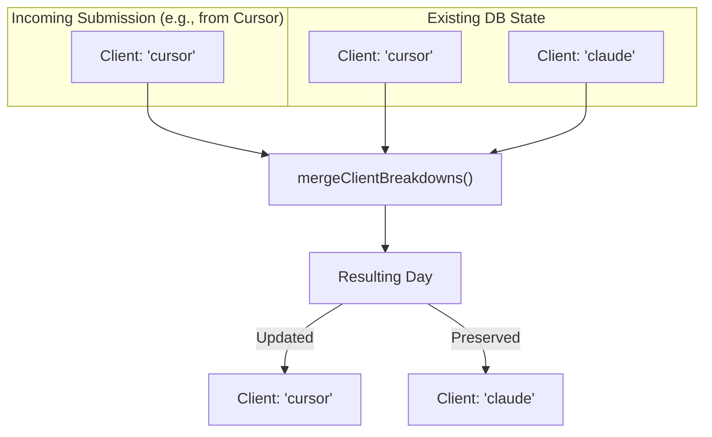

# Data Models and Relationships

<details>
<summary>Relevant source files</summary>

The following files were used as context for generating this wiki page:

- [packages/frontend/__tests__/api/submit.test.ts](packages/frontend/__tests__/api/submit.test.ts)
- [packages/frontend/src/app/api/submit/route.ts](packages/frontend/src/app/api/submit/route.ts)
- [packages/frontend/src/app/api/users/[username]/route.ts](packages/frontend/src/app/api/users/[username]/route.ts)
- [packages/frontend/src/components/SourceLogo.tsx](packages/frontend/src/components/SourceLogo.tsx)
- [packages/frontend/src/lib/constants.ts](packages/frontend/src/lib/constants.ts)
- [packages/frontend/src/lib/db/helpers.ts](packages/frontend/src/lib/db/helpers.ts)
- [packages/frontend/src/lib/db/migrations/0000_add_user_id_unique_constraint.sql](packages/frontend/src/lib/db/migrations/0000_add_user_id_unique_constraint.sql)
- [packages/frontend/src/lib/db/migrations/meta/0000_snapshot.json](packages/frontend/src/lib/db/migrations/meta/0000_snapshot.json)
- [packages/frontend/src/lib/db/migrations/meta/_journal.json](packages/frontend/src/lib/db/migrations/meta/_journal.json)
- [packages/frontend/src/lib/db/schema.ts](packages/frontend/src/lib/db/schema.ts)
- [packages/frontend/src/lib/types.ts](packages/frontend/src/lib/types.ts)
- [packages/frontend/src/lib/validation/submission.ts](packages/frontend/src/lib/validation/submission.ts)

</details>


## Purpose and Scope

This document describes the PostgreSQL database schema used by the Tokscale web platform, including table definitions, relationships, constraints, and the specialized data model patterns that enable incremental submission updates. The schema supports user authentication, API token management, and storage of token usage statistics with daily granularity.

Tokscale implements a specialized **one-to-one-active** submission model and a **source-level merge** strategy to ensure that token usage data remains consistent across multiple client devices and CLI versions.

---

## Core Tables and Relationships

The database consists of six primary tables organized around user identity and token usage data. The schema enforces a strict relationship between users and their token usage summaries.

### Entity Relationship Diagram

```mermaid
erDiagram
    "users" ||--o{ "sessions" : "has"
    "users" ||--o{ "api_tokens" : "has"
    "users" ||--o{ "device_codes" : "requests"
    "users" ||--|| "submissions" : "has_one_active"
    "submissions" ||--o{ "daily_breakdown" : "contains"
    
    "users" {
        uuid id PK
        integer github_id UK
        varchar username UK
        varchar display_name
        text avatar_url
        varchar email
        boolean is_admin
        timestamp created_at
        timestamp updated_at
    }
    
    "sessions" {
        uuid id PK
        uuid user_id FK
        varchar token UK
        timestamp expires_at
        varchar source
        text user_agent
        timestamp created_at
    }
    
    "api_tokens" {
        uuid id PK
        uuid user_id FK
        varchar token UK
        varchar name
        timestamp last_used_at
        timestamp expires_at
        timestamp created_at
    }

    "device_codes" {
        uuid id PK
        varchar device_code UK
        varchar user_code UK
        uuid user_id FK
        varchar device_name
        timestamp expires_at
        timestamp created_at
    }
    
    "submissions" {
        uuid id PK
        uuid user_id FK_UK
        bigint total_tokens
        decimal total_cost
        bigint input_tokens
        bigint output_tokens
        bigint cache_creation_tokens
        bigint cache_read_tokens
        bigint reasoning_tokens
        date date_start
        date date_end
        text_array sources_used
        text_array models_used
        varchar status
        varchar cli_version
        varchar submission_hash
        integer submit_count
        integer schema_version
        timestamp created_at
        timestamp updated_at
    }
    
    "daily_breakdown" {
        uuid id PK
        uuid submission_id FK
        date date UK
        bigint tokens
        decimal cost
        bigint input_tokens
        bigint output_tokens
        jsonb source_breakdown
        jsonb model_breakdown
        bigint timestamp_ms
    }
```

**Sources:** [packages/frontend/src/lib/db/schema.ts:26-263](), [packages/frontend/src/lib/db/migrations/0000_add_user_id_unique_constraint.sql:1-107]()

---

## User and Authentication Tables

### users Table
The `users` table stores user identity information obtained from GitHub OAuth. 

**Indexes & Constraints:**
- `idx_users_username` on `username` [packages/frontend/src/lib/db/schema.ts:44]().
- `USERS_USERNAME_LOWER_UNIQUE_INDEX` provides case-insensitive unique lookup [packages/frontend/src/lib/db/schema.ts:45-47]().
- `idx_users_github_id` on `githubId` [packages/frontend/src/lib/db/schema.ts:48]().

### apiTokens Table
Stores long-lived API tokens used by the CLI (`tokscale submit`).
- **Unique Constraint:** `api_tokens_user_name_unique` on `(userId, name)` ensures each user can only have one token per name [packages/frontend/src/lib/db/schema.ts:111]().

### deviceCodes Table
Facilitates the OAuth 2.0 Device Authorization Grant flow used for CLI login.
- `device_code` is the long identifier sent to the device [packages/frontend/src/lib/db/schema.ts:129]().
- `user_code` is the short 8-9 character code entered by the user in the browser [packages/frontend/src/lib/db/schema.ts:130]().

---

## Submission Data Tables

### submissions Table
The `submissions` table stores aggregated token usage statistics for each user. The **one-to-one-active** model is enforced by the unique constraint `submissions_user_id_unique` on `userId` [packages/frontend/src/lib/db/schema.ts:198]().

| Column | Type | Description |
|--------|------|-------------|
| `totalTokens` | `bigint` | Sum of all tokens across all days [packages/frontend/src/lib/db/schema.ts:156](). |
| `reasoningTokens` | `bigint` | Total tokens from reasoning models (e.g., o1) [packages/frontend/src/lib/db/schema.ts:166](). |
| `submitCount` | `integer` | Incremented on every successful `POST /api/submit` [packages/frontend/src/lib/db/schema.ts:180](). |
| `schemaVersion` | `integer` | Tracks data format (0: legacy, 1: timestamp-aware) [packages/frontend/src/lib/db/schema.ts:182](). |

### dailyBreakdown Table
Stores granular daily token usage. This table is the source of truth for all submission totals.

| Column | Type | Description |
|--------|------|-------------|
| `sourceBreakdown` | `jsonb` | Nested breakdown by client (e.g., cursor, claude) and model [packages/frontend/src/lib/db/schema.ts:223](). |
| `timestampMs` | `bigint` | The earliest message timestamp recorded for that day [packages/frontend/src/lib/db/schema.ts:230](). |

---

## Data Model Design Principles

### Source-Level Merge Strategy
The system implements a "Client-Level Merge" (historically "Source-Level"). When a user submits data from the CLI, the server merges the incoming data with existing records at the client level.

**Merge Logic:**
1. Only updates clients (sources) present in the submission [packages/frontend/src/app/api/submit/route.ts:55]().
2. Preserves data for clients NOT in the submission [packages/frontend/src/app/api/submit/route.ts:56]().
3. Recalculates all totals from the resulting `dailyBreakdown` [packages/frontend/src/app/api/submit/route.ts:57]().



**Implementation:**
The `mergeClientBreakdowns` function copies all existing data, then iterates through the `incomingClients` set to either update or delete specific client entries [packages/frontend/src/lib/db/helpers.ts:72-88]().

### Daily Breakdown Structure
The `sourceBreakdown` field in `dailyBreakdown` uses a nested structure to track model usage per client:

```typescript
// Defined in packages/frontend/src/lib/db/helpers.ts:16-28
export interface ClientBreakdownData {
  tokens: number;
  cost: number;
  // ... token types (input, output, etc)
  models: Record<string, ModelBreakdownData>;
}
```

### Data Normalization
The submission API handles legacy formats where "sources" was used instead of "clients" [packages/frontend/src/app/api/submit/route.ts:31-35](). It also normalizes client aliases, such as mapping `kilocode` to `kilo` [packages/frontend/src/lib/validation/submission.ts:96-105]().

---

## Relationships and Integrity

### Concurrency Handling
During submission, the system uses `FOR UPDATE` row-level locking on both the `submissions` record and the `dailyBreakdown` records within a transaction [packages/frontend/src/app/api/submit/route.ts:154, 199](). This prevents race conditions where two devices might attempt to merge data into the same day simultaneously.

### Validation
Submissions undergo Level 1 validation using Zod [packages/frontend/src/lib/validation/submission.ts:159-164](). This includes:
- Mathematical consistency (totals must match the sum of breakdowns) [packages/frontend/src/lib/validation/submission.ts:227-230]().
- No future dates (with a 2-day buffer for timezones) [packages/frontend/src/lib/validation/submission.ts:210-212]().
- Validating client IDs against `SUPPORTED_SOURCES` [packages/frontend/src/lib/validation/submission.ts:22-42]().

**Sources:**
- `packages/frontend/src/lib/db/schema.ts`
- `packages/frontend/src/app/api/submit/route.ts`
- `packages/frontend/src/lib/db/helpers.ts`
- `packages/frontend/src/lib/validation/submission.ts`
- `packages/frontend/src/lib/types.ts`
