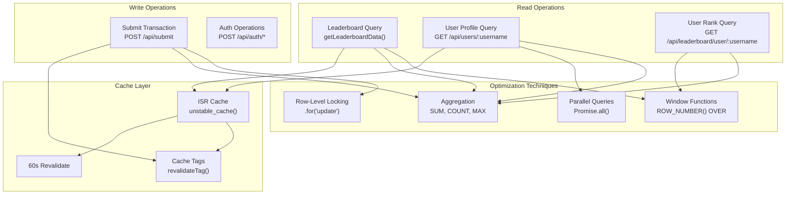
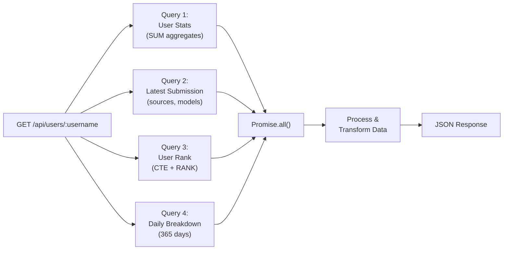
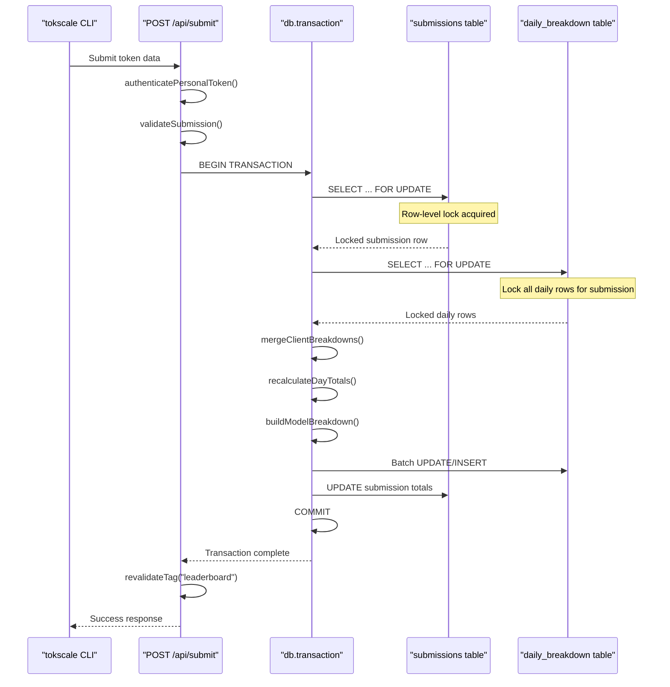
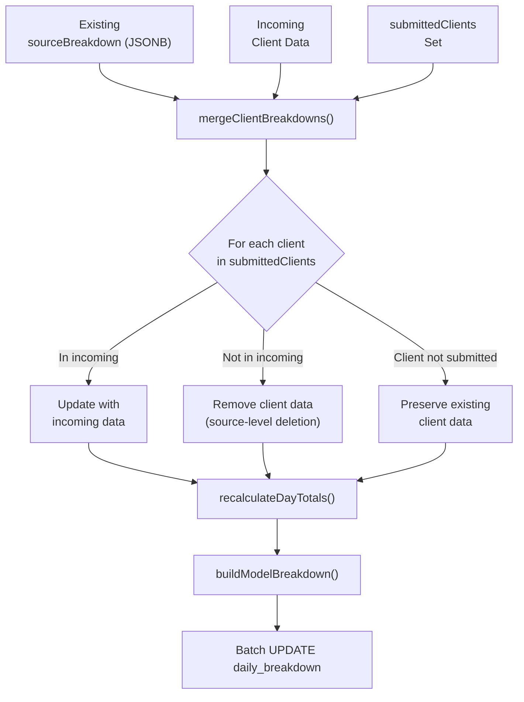

# Query Patterns and Optimization

<details>
<summary>Relevant source files</summary>

The following files were used as context for generating this wiki page:

- [packages/frontend/src/app/api/submit/route.ts](packages/frontend/src/app/api/submit/route.ts)
- [packages/frontend/src/app/api/users/[username]/route.ts](packages/frontend/src/app/api/users/[username]/route.ts)
- [packages/frontend/src/lib/date-utils.ts](packages/frontend/src/lib/date-utils.ts)
- [packages/frontend/src/lib/db/helpers.ts](packages/frontend/src/lib/db/helpers.ts)
- [packages/frontend/src/lib/db/migrations/0000_add_user_id_unique_constraint.sql](packages/frontend/src/lib/db/migrations/0000_add_user_id_unique_constraint.sql)
- [packages/frontend/src/lib/db/migrations/0001_youthful_snowbird.sql](packages/frontend/src/lib/db/migrations/0001_youthful_snowbird.sql)
- [packages/frontend/src/lib/db/migrations/0002_square_lyja.sql](packages/frontend/src/lib/db/migrations/0002_square_lyja.sql)
- [packages/frontend/src/lib/db/migrations/0004_add_timestamp_and_schema_version.sql](packages/frontend/src/lib/db/migrations/0004_add_timestamp_and_schema_version.sql)
- [packages/frontend/src/lib/db/migrations/meta/0000_snapshot.json](packages/frontend/src/lib/db/migrations/meta/0000_snapshot.json)
- [packages/frontend/src/lib/db/migrations/meta/0002_snapshot.json](packages/frontend/src/lib/db/migrations/meta/0002_snapshot.json)
- [packages/frontend/src/lib/db/migrations/meta/_journal.json](packages/frontend/src/lib/db/migrations/meta/_journal.json)
- [packages/frontend/src/lib/db/schema.ts](packages/frontend/src/lib/db/schema.ts)

</details>


This document details the database query patterns, indexing strategy, concurrency control mechanisms, and performance optimizations used throughout the Tokscale web application. For information about the database schema structure and table relationships, see [Data Models and Relationships](6.1). For information about API endpoint implementations, see [API Routes](5).

## Overview

The application uses PostgreSQL with Drizzle ORM and implements several optimization strategies:
- Window functions for efficient ranking calculations
- Row-level locking for concurrent write operations
- Strategic indexing for high-traffic queries
- ISR caching with tag-based invalidation
- Parallel query execution for complex data fetching
- Client-level merging to allow incremental data updates

---

## Query Pattern Architecture



Sources: [packages/frontend/src/app/api/users/[username]/route.ts:52-119](), [packages/frontend/src/app/api/submit/route.ts:141-356]()

---

## User Profile Query Pattern

User profile queries use parallel execution to minimize latency when fetching multiple related datasets from the `users`, `submissions`, and `daily_breakdown` tables.

### Parallel Query Execution



Sources: [packages/frontend/src/app/api/users/[username]/route.ts:52-119]()

### Query Details

The user profile endpoint executes four queries in parallel using `Promise.all()`:

| Query | Purpose | Key Operations |
|-------|---------|----------------|
| Stats Aggregation | Total tokens, cost, counts | `SUM(totalTokens)`, `SUM(totalCost)`, `MIN(dateStart)` |
| Latest Submission | Sources and models used | `ORDER BY desc(submissions.updatedAt)` LIMIT 1 |
| User Rank | Global ranking | CTE with `RANK() OVER (ORDER BY total_tokens)` |
| Daily Breakdown | 365-day contribution graph | JOIN with date filter `gte(dailyBreakdown.date, oneYearAgo)` |

The results are then aggregated in-memory to handle legacy client aliases (e.g., mapping `kilocode` to `kilo`) and to build a consolidated view of model usage across different clients [packages/frontend/src/app/api/users/[username]/route.ts:12-15](), [packages/frontend/src/app/api/users/[username]/route.ts:149-215]().

Sources: [packages/frontend/src/app/api/users/[username]/route.ts:52-119](), [packages/frontend/src/app/api/users/[username]/route.ts:163-215]()

---

## Transaction and Concurrency Control

The `POST /api/submit` endpoint uses row-level locking to prevent race conditions during concurrent submissions from the same user account.

### Submit Transaction Flow



Sources: [packages/frontend/src/app/api/submit/route.ts:141-356]()

### Locking Strategy

The submit endpoint implements pessimistic locking using Drizzle's `.for('update')` modifier to ensure that while one submission is being merged, no other process can modify the same user's data [packages/frontend/src/app/api/submit/route.ts:154](), [packages/frontend/src/app/api/submit/route.ts:199]().

```typescript
// Lock the user's submission row
const [existingSubmission] = await tx
  .select({ id: submissions.id })
  .from(submissions)
  .where(eq(submissions.userId, tokenRecord.userId))
  .for('update')
  .limit(1);

// Lock all daily breakdown rows for this submission
const existingDays = await tx
  .select({ ... })
  .from(dailyBreakdown)
  .where(eq(dailyBreakdown.submissionId, submissionId))
  .for('update');
```

Sources: [packages/frontend/src/app/api/submit/route.ts:150-155](), [packages/frontend/src/app/api/submit/route.ts:190-199]()

### Client-Level Merge Logic

The system implements a "Client-Level Merge" strategy. Instead of overwriting all data, it selectively updates only the clients (tools like Cursor, Claude Code, etc.) present in the current submission [packages/frontend/src/app/api/submit/route.ts:54-57]().



Sources: [packages/frontend/src/lib/db/helpers.ts:72-88](), [packages/frontend/src/app/api/submit/route.ts:208-281]()

---

## Index Strategy

The database schema defines indexes to optimize both write-path lookups (authentication) and read-path aggregations (leaderboard and profile).

### Index Definitions

| Table | Index Name | Column(s) | Purpose |
|-------|------------|-----------|---------|
| `users` | `idx_users_username` | `username` | Fast user lookup [packages/frontend/src/lib/db/schema.ts:44]() |
| `users` | `USERS_USERNAME_LOWER_UNIQUE_INDEX` | `lower(username)` | Case-insensitive lookup [packages/frontend/src/lib/db/schema.ts:45-47]() |
| `submissions` | `idx_submissions_user_id` | `user_id` | Foreign key lookup [packages/frontend/src/lib/db/schema.ts:192]() |
| `submissions` | `idx_submissions_leaderboard` | `user_id, total_tokens, total_cost, created_at` | Composite index for leaderboard [packages/frontend/src/lib/db/schema.ts:197]() |
| `daily_breakdown` | `idx_daily_breakdown_submission_id` | `submission_id` | Join optimization [packages/frontend/src/lib/db/schema.ts:248]() |
| `daily_breakdown` | `idx_daily_breakdown_date` | `date` | Time-series filtering [packages/frontend/src/lib/db/schema.ts:249]() |
| `api_tokens` | `idx_api_tokens_token` | `token` | Authentication lookup [packages/frontend/src/lib/db/schema.ts:109]() |

Sources: [packages/frontend/src/lib/db/schema.ts:26-255]()

---

## Cache Invalidation and ISR

The web application utilizes Next.js Incremental Static Regeneration (ISR) and tag-based invalidation to maintain high performance while ensuring data freshness.

- **Revalidation Interval**: User profile routes are revalidated every 60 seconds [packages/frontend/src/app/api/users/[username]/route.ts:17]().
- **On-Demand Invalidation**: When data is submitted via `POST /api/submit`, the system triggers revalidation for the specific user's path and the global leaderboard [packages/frontend/src/app/api/submit/route.ts:2](), [packages/frontend/src/app/api/submit/route.ts:20]().

```typescript
// Inside POST /api/submit
revalidateTag("leaderboard");
await revalidateUsernamePaths(tokenRecord.username);
```

Sources: [packages/frontend/src/app/api/submit/route.ts:373-375](), [packages/frontend/src/app/api/users/[username]/route.ts:17]()

---

## Migration History

The database schema has evolved to support richer token tracking (e.g., reasoning tokens, cache tokens) and more precise time tracking.

| Migration Tag | Key Changes |
|---------------|-------------|
| `0000_add_user_id_unique_constraint` | Initial schema with users, submissions, and daily breakdowns [packages/frontend/src/lib/db/migrations/0000_add_user_id_unique_constraint.sql:1-107]() |
| `0001_youthful_snowbird` | Corrected token calculation logic to include cache and reasoning tokens in totals [packages/frontend/src/lib/db/migrations/0001_youthful_snowbird.sql:1-49]() |
| `0002_square_lyja` | Added `reasoning_tokens` column to `submissions` [packages/frontend/src/lib/db/migrations/0002_square_lyja.sql:1]() |
| `0004_add_timestamp_and_schema_version` | Added `timestamp_ms` to `daily_breakdown` for precise local time mapping and `schema_version` to `submissions` [packages/frontend/src/lib/db/migrations/0004_add_timestamp_and_schema_version.sql:1-4]() |
| `0005_add_case_insensitive_username_index` | Added case-insensitive index for username lookups [packages/frontend/src/lib/db/migrations/meta/_journal.json:44-46]() |

Sources: [packages/frontend/src/lib/db/migrations/meta/_journal.json:1-48](), [packages/frontend/src/lib/db/migrations/0001_youthful_snowbird.sql:1-49]()
