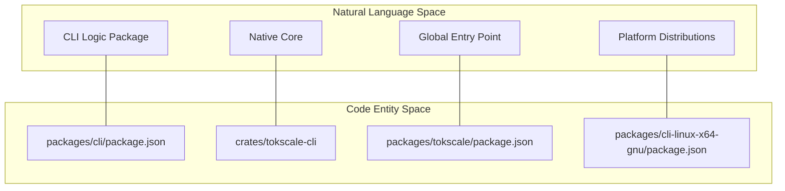
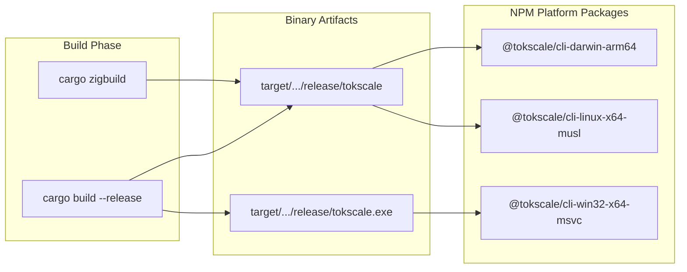

# Development and Build System

<details>
<summary>Relevant source files</summary>

The following files were used as context for generating this wiki page:

- [.github/workflows/build-native.yml](.github/workflows/build-native.yml)
- [.github/workflows/launcher_validation.yml](.github/workflows/launcher_validation.yml)
- [.github/workflows/publish-cli.yml](.github/workflows/publish-cli.yml)
- [.github/workflows/test_coverage.yml](.github/workflows/test_coverage.yml)
- [.gitignore](.gitignore)
- [.npmrc](.npmrc)
- [package.json](package.json)
- [packages/cli/bin.js](packages/cli/bin.js)
- [packages/cli/tsconfig.json](packages/cli/tsconfig.json)
- [packages/tokscale/bin.js](packages/tokscale/bin.js)
- [scripts/check-version-coherence.sh](scripts/check-version-coherence.sh)
- [scripts/post-discord-release.sh](scripts/post-discord-release.sh)
- [scripts/test-package-launchers.sh](scripts/test-package-launchers.sh)

</details>


This document provides an overview of the development workflow, build system architecture, and CI/CD pipeline for the Tokscale monorepo. It covers the monorepo structure, native binary compilation, multi-platform build matrix, and automated publishing workflow.

For detailed instructions on setting up a local development environment, see [Local Development Setup](#7.1). For in-depth information about native module compilation and cross-platform builds, see [Build Pipeline and Native Module Compilation](#7.2). For CI/CD automation details, see [CI/CD and Publishing](#7.3).

---

## Monorepo Architecture

Tokscale is organized as a monorepo using Bun workspaces [package.json:7-9](). It contains multiple packages including the CLI, a convenience wrapper, the Next.js frontend, and performance benchmarks.

### Workspace Structure

The monorepo manages dependencies and versions across several key directories [package.json:7-9]():

```
tokscale-monorepo/
├── packages/
│   ├── cli/           → @tokscale/cli (Main CLI logic & TS wrapper)
│   ├── tokscale/      → tokscale (Global binary entry point)
│   ├── frontend/      → tokscale.ai web application
│   ├── benchmarks/    → Performance testing suite
│   └── cli-{platform} → 8 platform-specific binary distributions
├── crates/            → Native Rust implementation
└── scripts/           → Build and validation utilities
```

The published packages maintain a strict version coherence managed by `scripts/check-version-coherence.sh` [scripts/check-version-coherence.sh:1-121]().

**Diagram: System Entity Mapping**



Sources: [package.json:1-9](), [scripts/check-version-coherence.sh:47-52]()

### Root-Level Build Scripts

The root `package.json` defines scripts for unified development [package.json:10-18]():

| Script | Command | Purpose |
|--------|---------|---------|
| `build` | `cargo build --release -p tokscale-cli && bun run build:cli` | Full production build of Rust and TS |
| `build:cli` | `bun run --cwd packages/cli build` | Compiles TypeScript CLI source |
| `cli` | `./scripts/cli.sh` | Helper to run CLI from source |
| `dev:frontend` | `bun run --cwd packages/frontend dev` | Starts Next.js development server |
| `test:launchers` | `bash scripts/test-package-launchers.sh` | Validates binary execution across runtimes |

Sources: [package.json:10-18]()

---

## Multi-Platform Build Matrix

The native Rust core is compiled for eight different platform targets to ensure broad compatibility without requiring users to have a Rust toolchain.

### Supported Platform Targets

The build system targets major operating systems and architectures [.github/workflows/build-native.yml:23-64]():

| Platform | Target Triple | Host Runner | Build Tool |
|----------|---------------|-------------|------------|
| macOS x64 | `x86_64-apple-darwin` | `macos-latest` | `cargo build` |
| macOS ARM64 | `aarch64-apple-darwin` | `macos-latest` | `cargo build` |
| Linux GNU x64 | `x86_64-unknown-linux-gnu` | `ubuntu-latest` | `cargo zigbuild` |
| Linux MUSL x64 | `x86_64-unknown-linux-musl` | `ubuntu-latest` | `cargo zigbuild` |
| Windows x64 | `x86_64-pc-windows-msvc` | `windows-latest` | `cargo build` |

Sources: [.github/workflows/build-native.yml:23-64](), [.github/workflows/publish-cli.yml:160-185]()

**Diagram: Native Build to NPM Package Mapping**



Sources: [.github/workflows/build-native.yml:23-64](), [.github/workflows/publish-cli.yml:187-219]()

---

## CI/CD and Publishing

The Tokscale release process is fully automated via GitHub Actions, handling versioning, parallel compilation, and distribution.

### Version Management
The `bump-versions` job synchronizes versions across `Cargo.toml`, `packages/cli/package.json`, and all platform-specific manifests [.github/workflows/publish-cli.yml:26-158](). It ensures that the Rust binary reports the same version as the npm package [.github/workflows/publish-cli.yml:95-115]().

### Automated Testing and Linting
Every push and pull request triggers a comprehensive suite of checks:
- **Linting**: Runs `cargo clippy` and `cargo fmt` with auto-fix capabilities [.github/workflows/test_coverage.yml:34-91]().
- **Coverage**: Generates coverage reports using `cargo tarpaulin` and updates badges [.github/workflows/test_coverage.yml:93-194]().
- **Launcher Validation**: Executes `scripts/test-package-launchers.sh` to ensure the JS wrappers correctly find and execute the native binary in various environments (Node.js, Bun, and restricted PATHs) [scripts/test-package-launchers.sh:1-168]().

### Publishing Sequence
1. **Bump**: Calculate and apply new version to all manifests.
2. **Build**: Compile native binaries for 8 platforms in parallel [.github/workflows/publish-cli.yml:159-219]().
3. **Publish**: 
    - Publish platform-specific packages (e.g., `@tokscale/cli-linux-x64-gnu`).
    - Publish `@tokscale/cli` which lists platform packages as `optionalDependencies` [.github/workflows/publish-cli.yml:66-74]().
    - Publish the `tokscale` alias package.
4. **Notify**: Post release notes to Discord [.github/workflows/publish-cli.yml:364-372]().

Sources: [.github/workflows/publish-cli.yml:1-372](), [.github/workflows/test_coverage.yml:1-194](), [scripts/test-package-launchers.sh:1-168]()
