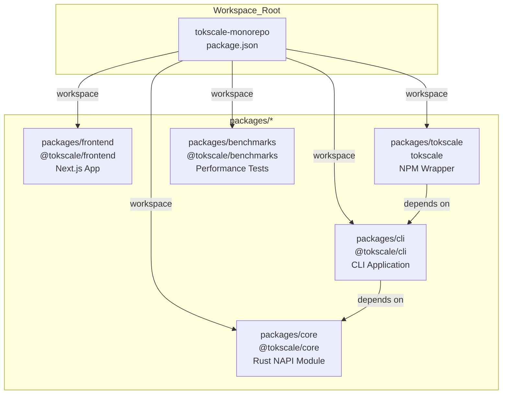
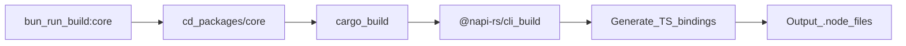
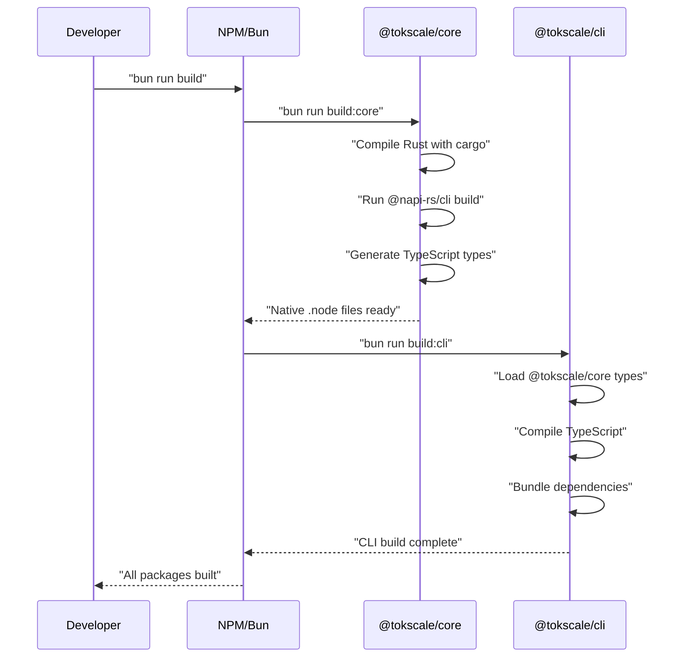

# Local Development Setup

<details>
<summary>Relevant source files</summary>

The following files were used as context for generating this wiki page:

- [packages/benchmarks/README.md](packages/benchmarks/README.md)
- [packages/benchmarks/generate.ts](packages/benchmarks/generate.ts)
- [packages/benchmarks/runner.ts](packages/benchmarks/runner.ts)
- [packages/cli/bunfig.toml](packages/cli/bunfig.toml)
- [packages/cli/tsconfig.json](packages/cli/tsconfig.json)
- [scripts/cli.sh](scripts/cli.sh)

</details>


This page provides instructions for setting up a local development environment for the Tokscale monorepo. It covers prerequisites, installation steps, building native modules, running development servers, and using the benchmark infrastructure.

## Overview

Tokscale uses a monorepo managed with Bun workspaces. The development setup requires building a native Rust module (`@tokscale/core`) before running the CLI or frontend applications. This guide walks through the complete setup process from initial clone to running development servers.

## Prerequisites

### Required Tools

| Tool | Minimum Version | Purpose |
|------|----------------|---------|
| **Bun** | Latest | Package manager and JavaScript runtime |
| **Node.js** | 20.x | TypeScript compilation and tooling |
| **Rust** | 1.70+ | Building native NAPI modules |
| **NAPI-RS CLI** | 3.4.1+ | Native module build tooling |

### Platform-Specific Requirements

The native `@tokscale/core` module must be compiled for your platform. The build system supports:
- macOS (x64, ARM64)
- Linux GNU (x64, ARM64)
- Linux MUSL (x64, ARM64)
- Windows (x64, ARM64)

## Repository Structure

The monorepo is organized into the following workspaces:



**Workspace Configuration Diagram**

Each workspace has its own `package.json` with independent dependencies and scripts.

## Installation Steps

### 1. Clone Repository

```bash
git clone https://github.com/junhoyeo/tokscale.git
cd tokscale
```

### 2. Install Dependencies

```bash
bun install
```

This command installs all workspace dependencies and automatically runs the `postinstall` script. The `postinstall` hook checks for the `$VERCEL` environment variable and conditionally builds the core module.

### 3. Build Native Core Module

If the postinstall script was skipped or you need to rebuild:

```bash
bun run build:core
```

The build process:
1. Compiles Rust source to native `.node` binaries
2. Generates NAPI-RS TypeScript bindings
3. Places artifacts in `packages/core/` directory



**Build Script Execution Flow**

### 4. Build CLI Package

```bash
bun run build:cli
```

This compiles the TypeScript CLI application and its dependencies. The CLI depends on the core module being built first. The CLI configuration is defined in `packages/cli/tsconfig.json`, targeting `ES2022` with `NodeNext` module resolution [packages/cli/tsconfig.json:3-5]().

**Sources:** [packages/cli/tsconfig.json:1-20]()

## Development Workflows

### Running the CLI Locally

The monorepo provides a development script for running the CLI without installation:

```bash
./scripts/cli.sh [command] [options]
```

The `scripts/cli.sh` helper is a bash script that:
1. Records the start time using Perl `Time::HiRes` [scripts/cli.sh:2]().
2. Executes the CLI entry point `packages/cli/src/index.ts` directly using Bun [scripts/cli.sh:3]().
3. Passes all command-line arguments (`"$@"`) to the entry point [scripts/cli.sh:3]().
4. Captures the exit code [scripts/cli.sh:4]().
5. Calculates and prints the total execution time in milliseconds [scripts/cli.sh:5-6]().

**Sources:** [scripts/cli.sh:1-8]()

### Running the Frontend Dev Server

```bash
bun run dev:frontend
```

This starts the Next.js development server for the web application at `packages/frontend`.

### Running Benchmarks

The benchmark infrastructure allows measuring performance using real or synthetic data.

```bash
# Generate synthetic data (~6,000 messages)
bun run generate

# Run benchmark with synthetic data
bun run run:synthetic
```

The `packages/benchmarks/generate.ts` script creates realistic test data for supported clients like OpenCode, Claude Code, Codex, and Gemini [packages/benchmarks/generate.ts:5-10](). It allows scaling the data volume via the `--scale` flag [packages/benchmarks/generate.ts:24]().

The `packages/benchmarks/runner.ts` script measures:
- **Wall-clock time**: Total execution time [packages/benchmarks/runner.ts:38]().
- **Peak memory usage**: Maximum RSS during execution [packages/benchmarks/runner.ts:39]().

It can test both the TypeScript and Rust implementations of the graph generation logic [packages/benchmarks/runner.ts:166-228]().

**Sources:** [packages/benchmarks/generate.ts:1-76](), [packages/benchmarks/runner.ts:1-94](), [packages/benchmarks/README.md:1-30]()

## Complete Build Sequence

To build all packages in correct dependency order:

```bash
bun run build
```



**Build Dependency Sequence**

## Common Development Tasks

| Task | Command | Notes |
|------|---------|-------|
| Install all dependencies | `bun install` | Runs postinstall hook |
| Build everything | `bun run build` | Core → CLI sequence |
| Run CLI in dev mode | `./scripts/cli.sh [args]` | Uses Bun to run TS directly |
| Generate test data | `bun run generate` | From `packages/benchmarks` |
| Run benchmarks | `bun run run:synthetic` | Measures time and memory |

**Sources:** [scripts/cli.sh:1-8](), [packages/benchmarks/README.md:11-26]()

## Troubleshooting

### Native Module Build Failures
- Ensure Rust toolchain is installed: `rustc --version`.
- Verify NAPI-RS CLI: `bunx @napi-rs/cli --version`.
- Clear build artifacts: `rm -rf packages/core/target`.

### CLI Script Execution Errors
If `./scripts/cli.sh` fails with permission denied:
```bash
chmod +x scripts/cli.sh
```
The script requires `bun` to be in your `$PATH` to execute `packages/cli/src/index.ts` [scripts/cli.sh:3]().

**Sources:** [scripts/cli.sh:1-8]()
