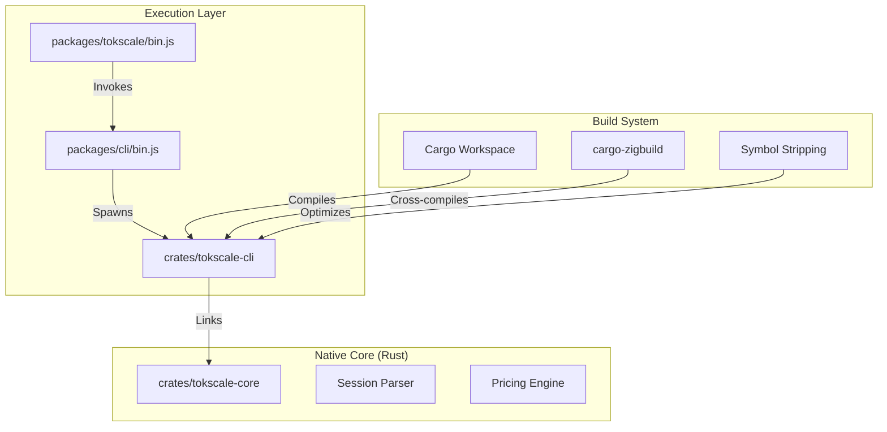
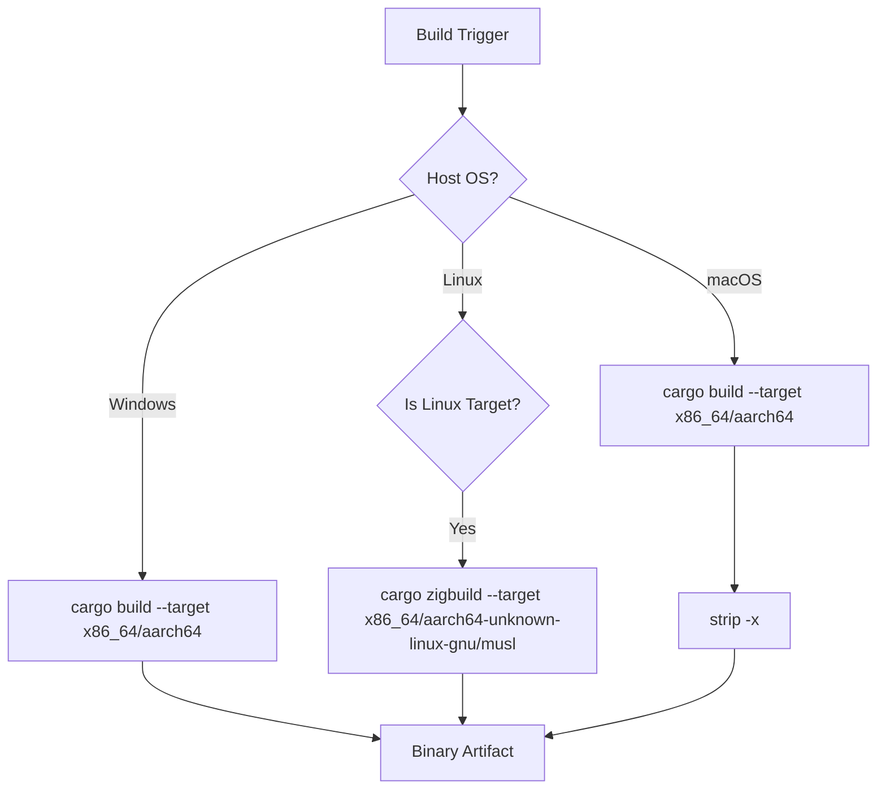
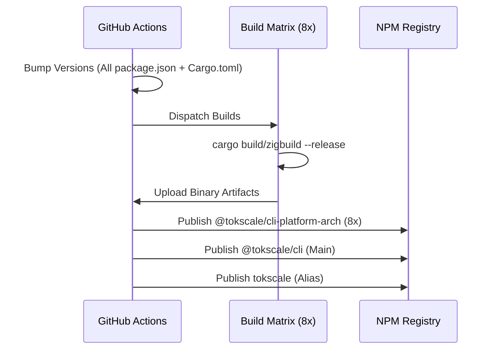

# Build Pipeline and Native Module Compilation

Relevant source files

The following files were used as context for generating this wiki page:

- [.github/workflows/build-native.yml](.github/workflows/build-native.yml)
- [.github/workflows/launcher_validation.yml](.github/workflows/launcher_validation.yml)
- [.github/workflows/publish-cli.yml](.github/workflows/publish-cli.yml)
- [.github/workflows/test_coverage.yml](.github/workflows/test_coverage.yml)
- [.gitignore](.gitignore)
- [.npmrc](.npmrc)
- [Cargo.toml](Cargo.toml)
- [package.json](package.json)
- [packages/cli-darwin-arm64/package.json](packages/cli-darwin-arm64/package.json)
- [packages/cli-darwin-x64/package.json](packages/cli-darwin-x64/package.json)
- [packages/cli-linux-arm64-gnu/package.json](packages/cli-linux-arm64-gnu/package.json)
- [packages/cli-linux-arm64-musl/package.json](packages/cli-linux-arm64-musl/package.json)
- [packages/cli-linux-x64-gnu/package.json](packages/cli-linux-x64-gnu/package.json)
- [packages/cli-linux-x64-musl/package.json](packages/cli-linux-x64-musl/package.json)
- [packages/cli-win32-arm64-msvc/package.json](packages/cli-win32-arm64-msvc/package.json)
- [packages/cli-win32-x64-msvc/package.json](packages/cli-win32-x64-msvc/package.json)
- [packages/cli/bin.js](packages/cli/bin.js)
- [packages/tokscale/bin.js](packages/tokscale/bin.js)
- [scripts/check-version-coherence.sh](scripts/check-version-coherence.sh)
- [scripts/post-discord-release.sh](scripts/post-discord-release.sh)
- [scripts/test-package-launchers.sh](scripts/test-package-launchers.sh)

## Purpose and Scope

This document details the multi-platform native build process for the Tokscale CLI and its core components. The system utilizes a Rust-based core (`tokscale-core`) and a CLI wrapper (`tokscale-cli`), both managed within a Cargo workspace. The pipeline handles cross-compilation for 8 distinct platform targets, manages version synchronization across the monorepo, and automates the publication of binaries to npm as platform-specific optional dependencies.

## Native Module Architecture Overview

The Tokscale CLI is built as a high-performance native binary. While the project uses a monorepo structure with Node.js packages, the execution core is written in Rust to leverage SIMD-accelerated JSON parsing (`simd-json`) and parallel processing (`rayon`).

**Sources:** [Cargo.toml:1-6](), [packages/tokscale/bin.js:1-16](), [packages/cli/bin.js:1-12]()

## Build Targets and Platform Support

Tokscale supports 8 platform-architecture combinations. These are distributed via npm as individual packages that the main `@tokscale/cli` package lists as `optionalDependencies`.

| Platform | Architecture | Target Triple | Libc | NPM Package |
|----------|-------------|---------------|------|-------------|
| macOS | x86_64 | `x86_64-apple-darwin` | - | `@tokscale/cli-darwin-x64` |
| macOS | ARM64 | `aarch64-apple-darwin` | - | `@tokscale/cli-darwin-arm64` |
| Linux | x86_64 | `x86_64-unknown-linux-gnu` | glibc | `@tokscale/cli-linux-x64-gnu` |
| Linux | x86_64 | `x86_64-unknown-linux-musl` | musl | `@tokscale/cli-linux-x64-musl` |
| Linux | ARM64 | `aarch64-unknown-linux-gnu` | glibc | `@tokscale/cli-linux-arm64-gnu` |
| Linux | ARM64 | `aarch64-unknown-linux-musl` | musl | `@tokscale/cli-linux-arm64-musl` |
| Windows | x86_64 | `x86_64-pc-windows-msvc` | - | `@tokscale/cli-win32-x64-msvc` |
| Windows | ARM64 | `aarch64-pc-windows-msvc` | - | `@tokscale/cli-win32-arm64-msvc` |

**Sources:** [.github/workflows/publish-cli.yml:66-74](), [packages/cli-linux-arm64-gnu/package.json:2-15]()

## Build Process and Optimizations

### Release Profile Configuration
To ensure maximum performance and minimum binary size, the `Cargo.toml` defines a highly optimized release profile.

[Cargo.toml:88-93]()

- `lto = true`: Enables Link Time Optimization across the entire workspace.
- `opt-level = 3`: Maximum optimizations for speed.
- `codegen-units = 1`: Improves optimization potential at the cost of slower build times.
- `strip = true`: Automatically removes debug symbols from the binary.

### Cross-Compilation Strategy
The pipeline uses different strategies based on the host and target:

1.  **macOS Native**: Uses standard `cargo build` on `macos-latest` runners.
2.  **Linux Cross-Compilation**: Utilizes `cargo-zigbuild` and `zig` to target both `gnu` and `musl` environments from a single `ubuntu-latest` runner without complex Docker setups.
3.  **Windows Native**: Uses MSVC toolchain on `windows-latest`.

**Sources:** [.github/workflows/build-native.yml:24-63](), [.github/workflows/build-native.yml:84-95]()

## CI/CD Pipeline: Publish Workflow

The publication process is managed by `.github/workflows/publish-cli.yml`. It ensures that every component in the monorepo is updated to the exact same version string.

### 1. Version Bumping and Coherence
The `bump-versions` job acts as the source of truth. It calculates the new version and updates:
- `packages/cli/package.json` (and all its `optionalDependencies` references).
- All 8 platform-specific `package.json` files.
- `packages/tokscale/package.json`.
- The Rust `Cargo.toml` workspace version via a Python helper script.

[.../.github/workflows/publish-cli.yml:65-115]()

A coherence check is performed at the end of the bump to verify that all files match the expected version.

**Sources:** [.github/workflows/publish-cli.yml:34-139](), [scripts/check-version-coherence.sh:1-10]()

### 2. Parallel Binary Compilation
The `build-cli-binary` job runs a matrix of 8 parallel runners. Each runner compiles the `tokscale-cli` crate for its specific target.

[.../.github/workflows/publish-cli.yml:159-223]()

### 3. Artifact Management and NPM Publication
Once all binaries are built, they are uploaded as artifacts. The publication jobs (`publish-platform-packages`, `publish-cli-package`, and `publish-wrapper-package`) download these binaries and place them into the correct directory structure before running `npm publish`.

- **Platform Packages**: Contains only the compiled binary (e.g., `bin/tokscale`).
- **CLI Package**: Contains the JS entry point and metadata.
- **Wrapper Package**: The `tokscale` alias package.

**Sources:** [.github/workflows/publish-cli.yml:225-349]()

## Version Coherence Verification

To prevent broken releases where the JS wrapper expects a version of the binary that wasn't published, the script `scripts/check-version-coherence.sh` is used in both the linting and publishing phases.

It checks:
1. That all `package.json` files in `packages/` have identical versions.
2. That the Rust `Cargo.toml` workspace version matches the JS versions.
3. That the `optionalDependencies` in the main CLI package point to the correct versions of the platform packages.

**Sources:** [scripts/check-version-coherence.sh:1-10](), [.github/workflows/test_coverage.yml:50-51]()
