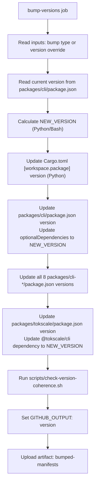
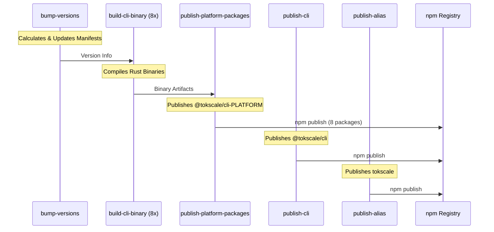

# CI/CD and Publishing

Relevant source files

The following files were used as context for generating this wiki page:

- [.github/workflows/build-native.yml](.github/workflows/build-native.yml)
- [.github/workflows/launcher_validation.yml](.github/workflows/launcher_validation.yml)
- [.github/workflows/publish-cli.yml](.github/workflows/publish-cli.yml)
- [.github/workflows/test_coverage.yml](.github/workflows/test_coverage.yml)
- [.gitignore](.gitignore)
- [.npmrc](.npmrc)
- [package.json](package.json)
- [packages/cli/bin.js](packages/cli/bin.js)
- [packages/tokscale/bin.js](packages/tokscale/bin.js)
- [scripts/check-version-coherence.sh](scripts/check-version-coherence.sh)
- [scripts/generate-release-notes.ts](scripts/generate-release-notes.ts)
- [scripts/post-discord-release.sh](scripts/post-discord-release.sh)
- [scripts/test-package-launchers.sh](scripts/test-package-launchers.sh)
- [tarpaulin.toml](tarpaulin.toml)

This document explains the automated CI/CD pipeline for building native Rust binaries across 8 platform targets and publishing synchronized npm packages. The workflow handles version bumping, parallel native compilation, version coherence verification, npm publishing, and automatic release notes generation for Discord and GitHub.

For information about the local build process and native module compilation, see [7.2](). For general development setup, see [7.1]().

## Overview

Tokscale uses a GitHub Actions workflow that orchestrates the entire release process:

- **Automatic version bumping** of the Rust workspace and all npm packages in lockstep.
- **Parallel compilation** of the native Rust CLI for 8 platform/architecture combinations.
- **Version Coherence Checks** to ensure all manifest files (Cargo.toml, package.json) are synchronized.
- **Release Notes Generation** using git history and GitHub PR metadata.
- **Sequential publishing** to npm with platform-specific optional dependencies.

The main workflow is manually triggered via `workflow_dispatch` at [.github/workflows/publish-cli.yml:5-20]().

Sources: [.github/workflows/publish-cli.yml:1-25](), [.github/workflows/test_coverage.yml:1-30]()

## Version Management Strategy

### Workspace-wide Synchronization

The workflow maintains synchronized versions across the Rust workspace and multiple npm packages. The version is calculated based on a manual override or a semantic bump type (patch, minor, major) [.github/workflows/publish-cli.yml:42-63]().

| Entity | Location | Role |
| :--- | :--- | :--- |
| `tokscale-cli` (Rust) | `Cargo.toml` | Core logic version (reported by CLI `--version`) |
| `@tokscale/cli` | `packages/cli/package.json` | Main logic wrapper and binary dispatcher |
| `tokscale` | `packages/tokscale/package.json` | Alias/convenience package |
| Platform Packages | `packages/cli-*/package.json` | Host platform-specific binaries |

### Bump Versions Job Flow

Sources: [.github/workflows/publish-cli.yml:26-158](), [scripts/check-version-coherence.sh:16-120]()

## Multi-Platform Build Matrix

### Platform Targets

The `build-cli-binary` job compiles the Rust binary for 8 targets using `cargo build` or `cargo zigbuild` for Linux cross-compilation [.github/workflows/publish-cli.yml:159-180]().

| Target | Host Runner | Tooling |
| :--- | :--- | :--- |
| `x86_64-apple-darwin` | `macos-latest` | `cargo build`, `strip -x` |
| `aarch64-apple-darwin` | `macos-latest` | `cargo build`, `strip -x` |
| `x86_64-unknown-linux-gnu` | `ubuntu-latest` | `cargo zigbuild`, `strip` |
| `x86_64-unknown-linux-musl` | `ubuntu-latest` | `cargo zigbuild`, `strip` |
| `aarch64-unknown-linux-gnu` | `ubuntu-latest` | `cargo zigbuild` |
| `aarch64-unknown-linux-musl` | `ubuntu-latest` | `cargo zigbuild` |
| `x86_64-pc-windows-msvc` | `windows-latest` | `cargo build` |
| `aarch64-pc-windows-msvc` | `windows-latest` | `cargo build` |

Sources: [.github/workflows/publish-cli.yml:159-180](), [.github/workflows/build-native.yml:17-64]()

### Caching and Optimization

The workflow uses `actions/cache@v5` to store the Cargo registry and target directories, keyed by the `Cargo.lock` hash [.github/workflows/build-native.yml:73-82](). For Linux targets, `mlugg/setup-zig` and `cargo-zigbuild` are utilized to ensure glibc compatibility and support musl builds [.github/workflows/build-native.yml:84-96]().

## Publishing and Release

### Release Notes Generation

Tokscale uses a custom Bun script `scripts/generate-release-notes.ts` to automate changelogs. It performs the following:
1. Identifies commits between the last tag and `HEAD` [scripts/generate-release-notes.ts:71-87]().
2. Resolves GitHub usernames via email search [scripts/generate-release-notes.ts:89-102]().
3. Links commits to merged Pull Requests [scripts/generate-release-notes.ts:104-136]().
4. Detects first-time contributors [scripts/generate-release-notes.ts:138-164]().

The generated notes are posted to Discord via `scripts/post-discord-release.sh`, which handles message splitting if the content exceeds Discord's 2000-character limit [scripts/post-discord-release.sh:22-71]().

Sources: [scripts/generate-release-notes.ts:1-210](), [scripts/post-discord-release.sh:1-72]()

### Publishing Sequence

Sources: [.github/workflows/publish-cli.yml:159-349]()

## Verification and Quality Assurance

### Version Coherence Check
The `scripts/check-version-coherence.sh` script (invoked during linting and publishing) ensures that:
- The Rust `workspace.package.version` matches all `package.json` files [scripts/check-version-coherence.sh:35-42]().
- The `tokscale` alias package depends on the correct version of `@tokscale/cli` [scripts/check-version-coherence.sh:61-66]().
- All 8 platform-specific optional dependencies are correctly listed in the main CLI manifest [scripts/check-version-coherence.sh:78-93]().

### Launcher Smoke Tests
The `scripts/test-package-launchers.sh` script validates that the published packages work correctly in different environments (Node.js vs Bun) and correctly locate the native binary within the `node_modules` structure [scripts/test-package-launchers.sh:130-168]().

### Coverage and Linting
The `Test & Coverage` workflow runs `cargo test` and `cargo clippy` [/.github/workflows/test_coverage.yml:87-119](). On the `main` branch, it uses `cargo-tarpaulin` to generate coverage reports and updates a coverage badge in the repository [/.github/workflows/test_coverage.yml:121-185]().

Sources: [scripts/check-version-coherence.sh:1-121](), [scripts/test-package-launchers.sh:1-168](), [.github/workflows/test_coverage.yml:1-194]()
