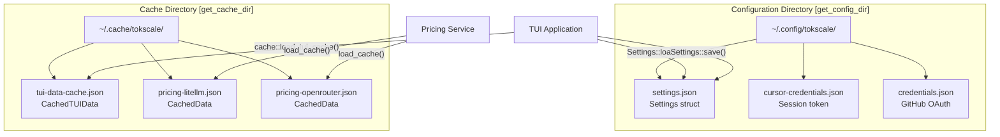
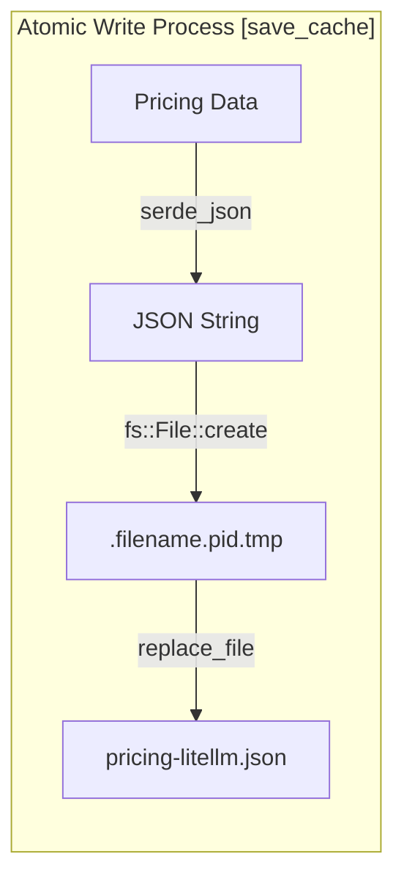

# Configuration and Customization

Relevant source files

The following files were used as context for generating this wiki page:

- [crates/tokscale-cli/src/tui/cache.rs](crates/tokscale-cli/src/tui/cache.rs)
- [crates/tokscale-cli/src/tui/settings.rs](crates/tokscale-cli/src/tui/settings.rs)
- [crates/tokscale-core/src/pricing/cache.rs](crates/tokscale-core/src/pricing/cache.rs)
- [packages/frontend/.env.example](packages/frontend/.env.example)

This document covers the configuration system for the Tokscale CLI tool and TUI, including persistent settings, environment variables, credential storage, and customization options. For frontend environment variables and configuration, see [Frontend Environment Variables](#8.2).

## Overview

Tokscale stores configuration in standard user directories following platform conventions. The CLI supports both persistent settings (saved between sessions) and runtime configuration (environment variables). The TUI maintains user preferences for visual themes, auto-refresh behavior, and display options.

**Configuration Types:**
- **Persistent Settings**: JSON file at `~/.config/tokscale/settings.json` [crates/tokscale-cli/src/tui/settings.rs:134-142]()
- **Credentials**: Session tokens for authenticated services (Cursor IDE, social platform)
- **Environment Variables**: Runtime overrides for advanced users (e.g., `TOKSCALE_CONFIG_DIR`) [crates/tokscale-cli/src/tui/settings.rs:165-167]()
- **Cache Data**: Pricing data and TUI state cache [crates/tokscale-cli/src/tui/cache.rs:1-4]()

Sources: [crates/tokscale-cli/src/tui/settings.rs:1-64](), [crates/tokscale-cli/src/tui/cache.rs:22-35]()

---

## Configuration File Locations

**Platform-Specific Paths:**

| Platform | Config Directory | Cache Directory |
|----------|-----------------|-----------------|
| Unix/Linux | `~/.config/tokscale/` | `~/.cache/tokscale/` |
| macOS | `~/.config/tokscale/` | `~/.cache/tokscale/` |
| Windows | `%USERPROFILE%\.config\tokscale\` | `%USERPROFILE%\.cache\tokscale\` |

Sources: [crates/tokscale-cli/src/tui/settings.rs:134-149](), [crates/tokscale-cli/src/tui/cache.rs:26-35](), [crates/tokscale-core/src/pricing/cache.rs:8-14]()

---

## Settings File Structure

The `~/.config/tokscale/settings.json` file stores persistent TUI preferences using the `Settings` struct [crates/tokscale-cli/src/tui/settings.rs:29-64]().

### Settings Fields

| Field | Type | Default | Range/Values | Description |
|-------|------|---------|--------------|-------------|
| `colorPalette` | string | `"blue"` | See `ThemeName` | TUI contribution graph color theme [crates/tokscale-cli/src/tui/settings.rs:32-33]() |
| `autoRefreshEnabled` | boolean | `false` | true/false | Enable automatic data refresh in TUI [crates/tokscale-cli/src/tui/settings.rs:34-35]() |
| `autoRefreshMs` | u64 | `60000` | 30s - 1h | Auto-refresh interval in milliseconds [crates/tokscale-cli/src/tui/settings.rs:11-13]() |
| `nativeTimeoutMs` | u64 | `300000` | 5s - 1h | Timeout for native parsing operations [crates/tokscale-cli/src/tui/settings.rs:15-17]() |
| `scanner` | Object | `{}` | `ScannerSettings` | Custom paths for SQLite databases [crates/tokscale-cli/src/tui/settings.rs:49-50]() |
| `defaultClients` | Array | `[]` | Client IDs | Pre-filtered clients for every run [crates/tokscale-cli/src/tui/settings.rs:60-61]() |

### Scanner Configuration

The `scanner` field allows users to pin additional paths for tools like OpenCode without setting environment variables on every invocation [crates/tokscale-cli/src/tui/settings.rs:42-44]().

Sources: [crates/tokscale-cli/src/tui/settings.rs:29-64](), [crates/tokscale-cli/src/tui/settings.rs:171-180]()

---

## Cache Management

Tokscale implements disk-based caching to enable "instant startup" for the TUI while fresh data loads in the background [crates/tokscale-cli/src/tui/cache.rs:1-4]().

### TUI Data Cache
The `tui-data-cache.json` file stores a serialized `CachedTUIData` object [crates/tokscale-cli/src/tui/cache.rs:50-60](). It includes:
- **Schema Version**: Current version is `7` [crates/tokscale-cli/src/tui/cache.rs:24]().
- **Staleness**: Cache is considered stale after 5 minutes [crates/tokscale-cli/src/tui/cache.rs:23]().
- **Data**: Includes aggregated `models`, `daily` usage, `hourly` usage, and `graph` data [crates/tokscale-cli/src/tui/cache.rs:65-77]().

### Pricing Cache
Pricing data from LiteLLM and OpenRouter is cached with a TTL of 3600 seconds (1 hour) [crates/tokscale-core/src/pricing/cache.rs:6](). The system uses an atomic temp-file rename pattern to prevent corruption on crash [crates/tokscale-core/src/pricing/cache.rs:86-89]().

Sources: [crates/tokscale-cli/src/tui/cache.rs:22-35](), [crates/tokscale-core/src/pricing/cache.rs:1-103]()

---

## Frontend Environment Variables

The web application (Next.js) requires several environment variables for database connectivity and authentication. For details, see [Frontend Environment Variables](#8.2).

### Core Variables
| Variable | Description |
|----------|-------------|
| `DATABASE_URL` | PostgreSQL connection string [packages/frontend/.env.example:7]() |
| `GITHUB_CLIENT_ID` | OAuth Client ID for GitHub login [packages/frontend/.env.example:13]() |
| `GITHUB_CLIENT_SECRET` | OAuth Client Secret for GitHub login [packages/frontend/.env.example:14]() |
| `NEXT_PUBLIC_URL` | The public-facing URL of the application [packages/frontend/.env.example:19]() |

Sources: [packages/frontend/.env.example:1-23]()

---

## CLI Configuration Details

The CLI configuration supports legacy fallback paths, particularly for macOS users transitioning from older versions [crates/tokscale-cli/src/tui/settings.rs:147-149](). For details, see [CLI Configuration](#8.1).

### Default Behavior
- **Color Palette**: Defaults to `blue` [crates/tokscale-cli/src/tui/settings.rs:85-87]().
- **Auto-Refresh**: Disabled by default; when enabled, defaults to 60 seconds [crates/tokscale-cli/src/tui/settings.rs:98-103]().
- **Lossy Deserialization**: The `defaultClients` list uses a lossy deserializer to prevent a single malformed entry from breaking the entire settings load [crates/tokscale-cli/src/tui/settings.rs:73-83]().

Sources: [crates/tokscale-cli/src/tui/settings.rs:97-110](), [crates/tokscale-cli/src/tui/settings.rs:151-182]()
