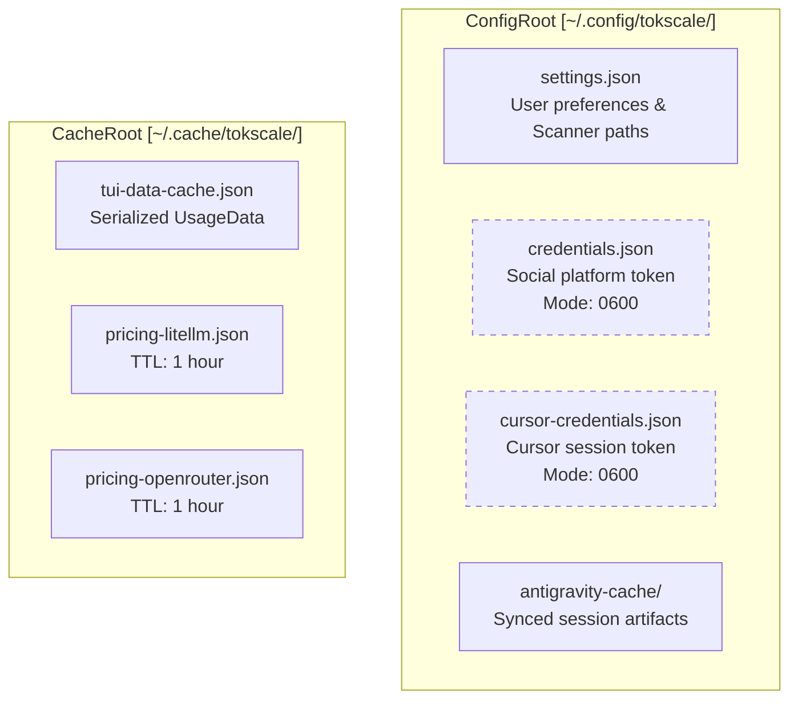
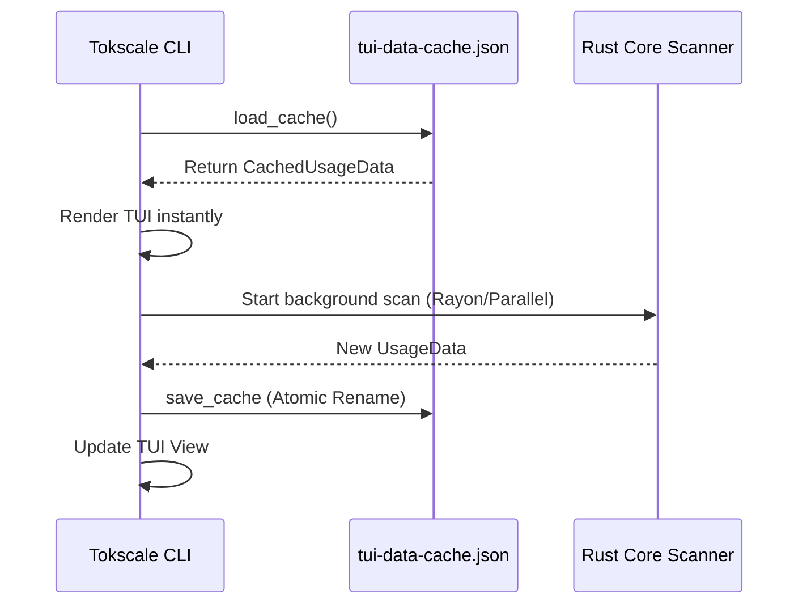

# CLI Configuration

<details>
<summary>Relevant source files</summary>

The following files were used as context for generating this wiki page:

- [README.ja.md](README.ja.md)
- [README.ko.md](README.ko.md)
- [README.md](README.md)
- [README.zh-cn.md](README.zh-cn.md)
- [crates/tokscale-cli/src/antigravity.rs](crates/tokscale-cli/src/antigravity.rs)
- [crates/tokscale-cli/src/paths.rs](crates/tokscale-cli/src/paths.rs)
- [crates/tokscale-cli/src/tui/cache.rs](crates/tokscale-cli/src/tui/cache.rs)
- [crates/tokscale-cli/src/tui/config.rs](crates/tokscale-cli/src/tui/config.rs)
- [crates/tokscale-cli/src/tui/settings.rs](crates/tokscale-cli/src/tui/settings.rs)
- [crates/tokscale-core/src/pricing/cache.rs](crates/tokscale-core/src/pricing/cache.rs)

</details>


This page documents the Tokscale CLI configuration system, including settings files, credential storage, and directory structure. For information about frontend environment variables, see [Frontend Environment Variables](#8.2).

## Purpose and Scope

The CLI configuration system manages user preferences, authentication credentials, and cached data through a collection of JSON files. In v2, the configuration logic has been moved into the Rust core and CLI crates to support the high-performance TUI and native scanning capabilities. The system handles:

- **User Preferences**: Color themes, auto-refresh settings, and default client filters.
- **Authentication**: OAuth tokens for the social platform and Cursor IDE session tokens.
- **Scanner Settings**: Custom paths for SQLite databases (e.g., OpenCode) and other scanner overrides.
- **Data Caching**: Disk-based caching for TUI data and model pricing to enable instant startup.

---

## Configuration Directory Structure

Tokscale follows the XDG Base Directory specification. On macOS, it includes a transparent fallback to legacy paths to ensure smooth upgrades.



**Sources**: [crates/tokscale-cli/src/tui/settings.rs:134-142](), [crates/tokscale-cli/src/tui/cache.rs:26-35](), [crates/tokscale-cli/src/antigravity.rs:22-31]()

---

## Settings File (`settings.json`)

The `Settings` struct manages global CLI behavior. It is loaded via `Settings::load()` which clamps values to safe ranges (e.g., refresh intervals) [crates/tokscale-cli/src/tui/settings.rs:151-182]().

### Settings Schema and Defaults

| Field | Type | Default | Description |
|-------|------|---------|-------------|
| `colorPalette` | `String` | `"blue"` | TUI theme (e.g., blue, green, halloween) |
| `autoRefreshEnabled` | `bool` | `false` | Enables background data polling in TUI |
| `autoRefreshMs` | `u64` | `60,000` | Interval (Min: 30s, Max: 1h) [crates/tokscale-cli/src/tui/settings.rs:11-13]() |
| `defaultClients` | `Vec<String>` | `[]` | Pins specific clients (e.g., `["opencode", "claude"]`) |
| `scanner` | `ScannerSettings` | `default` | Stores extra SQLite paths for OpenCode [crates/tokscale-cli/src/tui/settings.rs:50-61]() |
| `nativeTimeoutMs` | `u64` | `300,000` | Timeout for native Rust core operations |

### Scanner Configuration
The `scanner` field allows users to persist additional search paths for AI agent databases without environment variables. It is loaded by every CLI entry point that builds `LocalParseOptions` [crates/tokscale-cli/src/tui/settings.rs:112-121]().

**Sources**: [crates/tokscale-cli/src/tui/settings.rs:31-64](), [crates/tokscale-cli/src/tui/settings.rs:97-110]()

---

## TUI Data Caching

To achieve "instant startup," the CLI serializes the processed `UsageData` to `tui-data-cache.json`.

### Implementation Flow
1. **Startup**: TUI attempts to load `CachedTUIData` from `~/.cache/tokscale/tui-data-cache.json` [crates/tokscale-cli/src/tui/cache.rs:28-35]().
2. **Staleness Check**: If the cache is older than 5 minutes (`CACHE_STALE_THRESHOLD_MS`), it is considered stale but may still be used for the initial render while a fresh scan runs in the background [crates/tokscale-cli/src/tui/cache.rs:22-24]().
3. **Atomic Writes**: Cache updates use a temp-file rename pattern to prevent corruption during crashes [crates/tokscale-core/src/pricing/cache.rs:86-96]().



**Sources**: [crates/tokscale-cli/src/tui/cache.rs:1-60](), [crates/tokscale-core/src/pricing/cache.rs:86-96]()

---

## Advanced UI Customization (`.tokscale`)

While `settings.json` handles functional preferences, a separate TOML-based config file (`~/.tokscale`) allows for deep UI customization of colors and display names for providers and clients.

### Configuration Structure
The `TokscaleConfig` struct is loaded once via `OnceLock` [crates/tokscale-cli/src/tui/config.rs:9-17]().

```toml
# ~/.tokscale
[colors.providers]
anthropic = "#D97757"
openai = "#10A37F"

[display_names.clients]
opencode = "OpenCode (Local)"
```

### Color Resolution
Colors are parsed from hex strings into `ratatui::style::Color` [crates/tokscale-cli/src/tui/config.rs:78-87](). The TUI uses these overrides to theme the contribution bars and model lists.

**Sources**: [crates/tokscale-cli/src/tui/config.rs:11-33](), [crates/tokscale-cli/src/tui/config.rs:40-47]()

---

## Credential and Cache Persistence

### Credential Storage
Credentials for `tokscale.ai` and Cursor are stored in `credentials.json` and `cursor-credentials.json`. v2 ensures these files are managed with restricted permissions to prevent unauthorized access.

### Antigravity Sync Cache
The `antigravity sync` command caches session artifacts locally to `~/.config/tokscale/antigravity-cache/`. 
- **Manifest**: `manifest.json` tracks session IDs, hashes, and sync timestamps [crates/tokscale-cli/src/antigravity.rs:37-48]().
- **Atomic Sync**: Uses a `SyncLockGuard` to prevent concurrent sync processes from corrupting the local cache [crates/tokscale-cli/src/antigravity.rs:161-163]().

### Pricing Cache
Pricing data from LiteLLM and OpenRouter is cached with a 1-hour TTL (`CACHE_TTL_SECS`) [crates/tokscale-core/src/pricing/cache.rs:6-14]().

**Sources**: [crates/tokscale-cli/src/antigravity.rs:22-40](), [crates/tokscale-core/src/pricing/cache.rs:1-20]()

---

## Path Resolution and Migration

Tokscale handles cross-platform path differences and migrates legacy data automatically.

| Type | Linux/macOS | Windows | Fallback/Legacy |
|------|-------------|---------|-----------------|
| Config | `~/.config/tokscale/` | `%USERPROFILE%\.config\tokscale\` | `~/Library/Application Support/tokscale/` (macOS) |
| Cache | `~/.cache/tokscale/` | `%USERPROFILE%\.cache\tokscale\` | `~/.tokscale/` (Legacy v1) |

**Migration Logic**: `Settings::load()` checks the primary path first. If missing, it attempts to read from the legacy macOS path unless `TOKSCALE_CONFIG_DIR` is set [crates/tokscale-cli/src/tui/settings.rs:164-170]().

**Sources**: [crates/tokscale-cli/src/paths.rs:18-31](), [crates/tokscale-cli/src/tui/settings.rs:151-170]()
