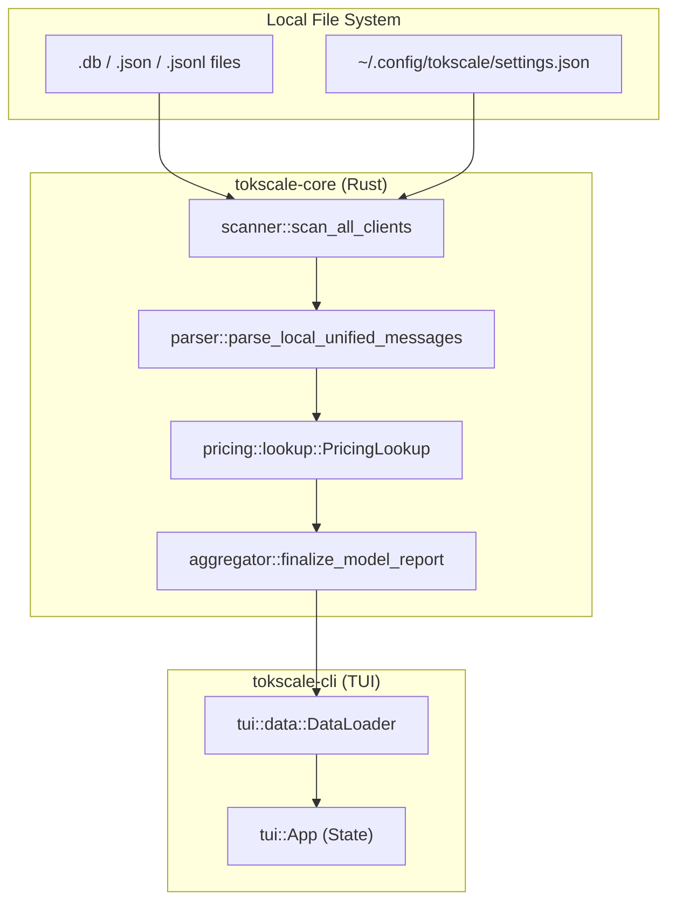
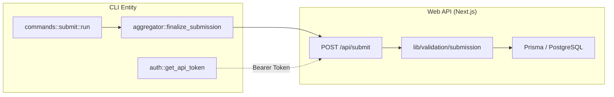

# Glossary

Relevant source files

The following files were used as context for generating this wiki page:

- [AGENTS.md](AGENTS.md)
- [README.ja.md](README.ja.md)
- [README.ko.md](README.ko.md)
- [README.md](README.md)
- [README.zh-cn.md](README.zh-cn.md)
- [crates/tokscale-cli/src/antigravity.rs](crates/tokscale-cli/src/antigravity.rs)
- [crates/tokscale-cli/src/commands/wrapped.rs](crates/tokscale-cli/src/commands/wrapped.rs)
- [crates/tokscale-cli/src/main.rs](crates/tokscale-cli/src/main.rs)
- [crates/tokscale-cli/src/paths.rs](crates/tokscale-cli/src/paths.rs)
- [crates/tokscale-cli/src/tui/client_ui.rs](crates/tokscale-cli/src/tui/client_ui.rs)
- [crates/tokscale-cli/src/tui/data/mod.rs](crates/tokscale-cli/src/tui/data/mod.rs)
- [crates/tokscale-cli/src/tui/ui/widgets.rs](crates/tokscale-cli/src/tui/ui/widgets.rs)
- [crates/tokscale-cli/tests/cli_tests.rs](crates/tokscale-cli/tests/cli_tests.rs)
- [crates/tokscale-core/src/aggregator.rs](crates/tokscale-core/src/aggregator.rs)
- [crates/tokscale-core/src/clients.rs](crates/tokscale-core/src/clients.rs)
- [crates/tokscale-core/src/lib.rs](crates/tokscale-core/src/lib.rs)
- [crates/tokscale-core/src/message_cache.rs](crates/tokscale-core/src/message_cache.rs)
- [crates/tokscale-core/src/pricing/litellm.rs](crates/tokscale-core/src/pricing/litellm.rs)
- [crates/tokscale-core/src/pricing/lookup.rs](crates/tokscale-core/src/pricing/lookup.rs)
- [crates/tokscale-core/src/pricing/mod.rs](crates/tokscale-core/src/pricing/mod.rs)
- [crates/tokscale-core/src/pricing/openrouter.rs](crates/tokscale-core/src/pricing/openrouter.rs)
- [crates/tokscale-core/src/provider_identity.rs](crates/tokscale-core/src/provider_identity.rs)
- [crates/tokscale-core/src/scanner.rs](crates/tokscale-core/src/scanner.rs)
- [crates/tokscale-core/src/sessions/codex.rs](crates/tokscale-core/src/sessions/codex.rs)
- [crates/tokscale-core/src/sessions/gemini.rs](crates/tokscale-core/src/sessions/gemini.rs)
- [crates/tokscale-core/src/sessions/mod.rs](crates/tokscale-core/src/sessions/mod.rs)
- [crates/tokscale-core/src/sessions/opencode.rs](crates/tokscale-core/src/sessions/opencode.rs)
- [packages/frontend/__tests__/api/submit.test.ts](packages/frontend/__tests__/api/submit.test.ts)
- [packages/frontend/src/components/SourceLogo.tsx](packages/frontend/src/components/SourceLogo.tsx)
- [packages/frontend/src/lib/constants.ts](packages/frontend/src/lib/constants.ts)
- [packages/frontend/src/lib/types.ts](packages/frontend/src/lib/types.ts)
- [packages/frontend/src/lib/validation/submission.ts](packages/frontend/src/lib/validation/submission.ts)

This glossary defines technical terms, domain concepts, and implementation-specific jargon used across the Tokscale codebase.

## Domain Concepts

### Unified Message
The internal standardized data structure used to represent a single AI interaction (request/response pair) regardless of the original source format. All client-specific parsers must output `UnifiedMessage` objects to be processed by the aggregator.

*   **Implementation**: Defined as the `UnifiedMessage` struct in the Rust core.
*   **Key Fields**: `client`, `model_id`, `provider_id`, `tokens` (a `TokenBreakdown`), and `cost`.
*   **Code Pointer**: [crates/tokscale-core/src/sessions/mod.rs:33-52]()

### Token Breakdown
A granular accounting of tokens consumed during an interaction, categorized by their specific role in the LLM execution pipeline.

| Category | Description |
| :--- | :--- |
| `input` | Prompt tokens sent to the model. |
| `output` | Completion tokens generated by the model. |
| `cache_read` | Tokens retrieved from a provider-side cache (e.g., Anthropic Prompt Caching). |
| `cache_write` | Tokens written to a provider-side cache for future reuse. |
| `reasoning` | Internal "thinking" tokens used by models like OpenAI o1. |

*   **Implementation**: `TokenBreakdown` struct.
*   **Code Pointer**: [crates/tokscale-core/src/lib.rs:138-144]()

### Client (Source)
An external tool or IDE that generates AI session data. Tokscale supports 25+ clients, ranging from CLI tools (Claude Code, OpenCode) to IDEs (Cursor, Roo Code). Each client is identified by a `ClientId` enum.

*   **Implementation**: `ClientId` enum and `ClientDef` struct.
*   **Code Pointer**: [crates/tokscale-core/src/clients.rs]() (referenced in [crates/tokscale-core/src/lib.rs:15]())

### Provider
The backend entity hosting the AI model (e.g., `openai`, `anthropic`, `google`). Note that a single model (e.g., `llama-3`) can be served by multiple providers (e.g., `groq`, `together`, `vertex_ai`).

*   **Code Pointer**: [crates/tokscale-core/src/provider_identity.rs]()

---

## Technical Jargon & Logic

### Grouping Strategy
The logic used to aggregate individual messages into report rows. Users can toggle this via the `--group-by` flag.

*   **Strategies**: `model`, `client,model`, `client,provider,model`, and `workspace,model`.
*   **Code Pointer**: [crates/tokscale-core/src/lib.rs:100-106]()

### Multi-Step Pricing Resolution
The algorithm used by `PricingLookup` to find the cost of a model. Because model IDs vary across clients (e.g., `claude-3-5-sonnet` vs `anthropic/claude-3.5-sonnet`), the system uses a prioritized fallback:
1.  **Exact Match**: Case-insensitive match against known IDs.
2.  **Alias Resolution**: Mapping internal names to canonical IDs.
3.  **Fuzzy Match**: Stripping prefixes (like `openai/`) and suffixes (like dates or `-beta`) to find a base model.

*   **Implementation**: `PricingLookup::lookup_with_provider`.
*   **Code Pointer**: [crates/tokscale-core/src/pricing/lookup.rs:172-215]()

### Workspace Detection
The process of associating a session with a specific project or directory. This is used for "Workspace" reports. For CLI tools, this is often derived from the Current Working Directory (`cwd`) found in session metadata.

*   **Implementation**: `workspace_bucket` and `normalize_workspace_key`.
*   **Code Pointer**: [crates/tokscale-cli/src/tui/data/mod.rs:161-176]() and [crates/tokscale-core/src/sessions/mod.rs]()

---

## Architecture Diagrams

### Data Flow: From Local Files to TUI
This diagram bridges the physical file system ("Natural Language Space") to the internal Rust processing entities ("Code Entity Space").

Title: Local Session Parsing Data Flow

Sources: [crates/tokscale-core/src/scanner.rs:59-77](), [crates/tokscale-core/src/lib.rs:205-215](), [crates/tokscale-cli/src/tui/data/mod.rs:151-156]()

### Web Submission Flow
This diagram illustrates how local data is prepared and sent to the `tokscale.ai` platform.

Title: Data Submission Pipeline

Sources: [crates/tokscale-cli/src/main.rs:205-215](), [packages/frontend/src/lib/validation/submission.ts](), [crates/tokscale-core/src/aggregator.rs]()

---

## Abbreviations Reference

| Abbreviation | Full Term | Context |
| :--- | :--- | :--- |
| **TUI** | Terminal User Interface | The interactive Rust-based dashboard (`tokscale tui`). |
| **ISR** | Incremental Static Regeneration | Next.js strategy used for the leaderboard at `tokscale.ai`. |
| **JSONL** | JSON Lines | The format used by many AI agents (e.g., Codex, Copilot) for session logs. |
| **NAPI** | Node API | The bridge allowing the Node.js CLI to call the native Rust `tokscale-core`. |
| **WAL** | Write-Ahead Logging | SQLite sidecar files (`-wal`) filtered out during scanning. |

Sources: [crates/tokscale-cli/src/main.rs:198-203](), [crates/tokscale-core/src/scanner.rs:37-39](), [README.md:9-14]()
