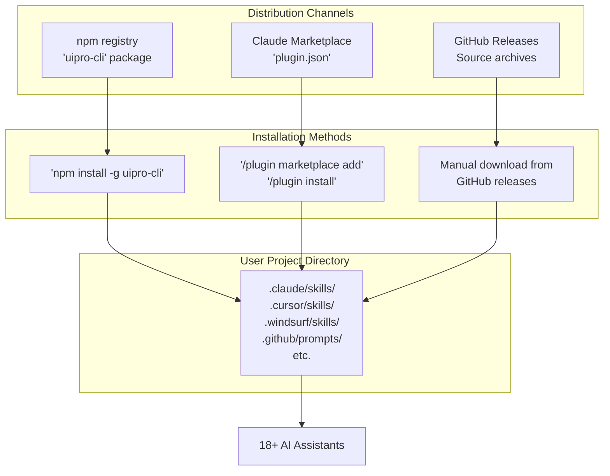
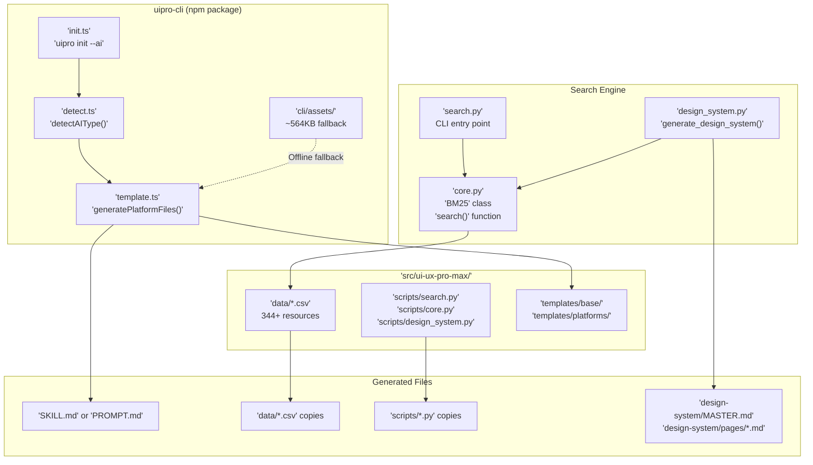
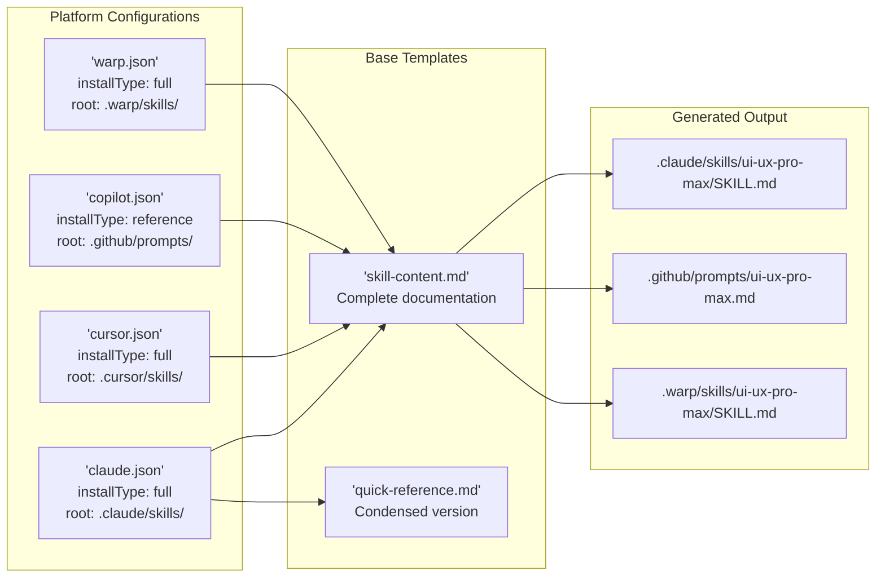

# Overview

<details>
<summary>Relevant source files</summary>

The following files were used as context for generating this wiki page:

- [CLAUDE.md](CLAUDE.md)
- [README.md](README.md)
- [cli/.npmignore](cli/.npmignore)
- [cli/README.md](cli/README.md)
- [cli/assets/templates/platforms/augment.json](cli/assets/templates/platforms/augment.json)
- [cli/assets/templates/platforms/kilocode.json](cli/assets/templates/platforms/kilocode.json)
- [cli/assets/templates/platforms/warp.json](cli/assets/templates/platforms/warp.json)
- [cli/package.json](cli/package.json)
- [cli/src/commands/init.ts](cli/src/commands/init.ts)
- [cli/src/commands/uninstall.ts](cli/src/commands/uninstall.ts)
- [cli/src/index.ts](cli/src/index.ts)
- [cli/src/types/index.ts](cli/src/types/index.ts)
- [cli/src/utils/detect.ts](cli/src/utils/detect.ts)
- [cli/src/utils/extract.ts](cli/src/utils/extract.ts)
- [cli/src/utils/github.ts](cli/src/utils/github.ts)
- [cli/src/utils/template.ts](cli/src/utils/template.ts)
- [skill.json](skill.json)
- [src/ui-ux-pro-max/templates/platforms/augment.json](src/ui-ux-pro-max/templates/platforms/augment.json)
- [src/ui-ux-pro-max/templates/platforms/kilocode.json](src/ui-ux-pro-max/templates/platforms/kilocode.json)
- [src/ui-ux-pro-max/templates/platforms/warp.json](src/ui-ux-pro-max/templates/platforms/warp.json)

</details>


## Purpose and Scope

UI/UX Pro Max is an AI-powered design intelligence toolkit that provides searchable databases of UI/UX resources (styles, colors, typography, patterns) to AI coding assistants. This page introduces the system architecture, distribution methods, installation modes, and core capabilities. For specific installation instructions, see [Getting Started](#1.1). For detailed architecture diagrams, see [System Architecture](#1.2).

Sources: [README.md:18-18](), [CLAUDE.md:7-7]()

## What is UI/UX Pro Max

UI/UX Pro Max consists of three primary components:

1. **Knowledge Base** — 344+ design resources stored in CSV databases covering 10 domains (styles, colors, typography, landing patterns, charts, UX guidelines, icons, products, reasoning rules) and 16 technology stacks. [CLAUDE.md:14-28](), [CLAUDE.md:34-36]()
2. **Search Engine** — BM25-based ranking system in `core.py` with domain auto-detection and stack-specific filtering. [CLAUDE.md:39-40](), [CLAUDE.md:60-61]()
3. **Design System Generator** — Reasoning engine in `design_system.py` that performs multi-domain searches and synthesizes complete design systems with Master + Overrides pattern. [README.md:38-40](), [CLAUDE.md:40-40]()

The system integrates with 18+ AI coding assistants through a skill/workflow pattern, activating automatically when users request UI/UX work. [cli/src/types/index.ts:1-1]()

Sources: [README.md:36-40](), [CLAUDE.md:7-7](), [CLAUDE.md:31-57]()

## Distribution Channels



**Distribution Methods**

| Method | Package | Target Audience |
|--------|---------|-----------------|
| npm | `uipro-cli` | Users who prefer CLI installation via `uipro init`. [cli/package.json:2-7]() |
| GitHub Releases | Source archives (.zip) | Users installing manually or offline. [cli/src/utils/github.ts:45-46]() |
| Claude Marketplace | Direct plugin installation | Claude Code users only via `.claude-plugin/`. [CLAUDE.md:57-57]() |

The CLI tool (`uipro-cli`) is the recommended installation method, as it handles platform detection via `detectAIType()` and generates platform-specific files from templates. [cli/src/utils/detect.ts:10-10]()

Sources: [README.md:1-16](), [cli/src/utils/detect.ts:10-65](), [cli/package.json:1-8]()

## Core System Components



**Component Responsibilities**

| Component | File Path | Responsibility |
|-----------|-----------|----------------|
| CLI Tool | `cli/src/commands/init.ts` | Installation orchestration, platform detection, template generation. [cli/src/commands/init.ts:117-117]() |
| Platform Detection | `cli/src/utils/detect.ts` | Scans for `.claude/`, `.cursor/`, etc. directories. [cli/src/utils/detect.ts:10-65]() |
| Template Engine | `cli/src/utils/template.ts` | Renders platform-specific files from base templates. [cli/src/utils/template.ts:187-187]() |
| Search Engine | `src/ui-ux-pro-max/scripts/core.py` | BM25 ranking, domain detection, CSV querying. [CLAUDE.md:39-40]() |
| Design System Generator | `src/ui-ux-pro-max/scripts/design_system.py` | Multi-domain search, reasoning rules, Master+Overrides output. [CLAUDE.md:40-40]() |
| Knowledge Base | `src/ui-ux-pro-max/data/` | 344+ resources across 10 domains and 16 stacks. [CLAUDE.md:34-36]() |

Sources: [CLAUDE.md:31-57](), [cli/src/utils/detect.ts:10-65](), [cli/src/utils/template.ts:187-218]()

## Platform Integration Architecture

The system supports 18 AI platforms through a template-based configuration system. Each platform has a JSON configuration file in `src/ui-ux-pro-max/templates/platforms/` that defines:

- `folderStructure` — Root directory (`.claude/`, `.cursor/`, etc.) and file naming. [cli/src/types/index.ts:29-33]()
- `installType` — `"full"` (complete knowledge base) or `"reference"` (quick reference only). [cli/src/types/index.ts:28-28]()
- `frontmatter` — YAML metadata (required for platforms like GitHub Copilot). [cli/src/types/index.ts:35-35]()
- `scriptPath` — Relative path to search scripts. [cli/src/types/index.ts:34-34]()



**Supported Platforms (Partial List)**

| Platform | Root Directory | Filename | Install Type | Detection Path |
|----------|----------------|----------|--------------|----------------|
| Claude Code | `.claude/` | `SKILL.md` | full | [cli/src/utils/detect.ts:13-15]() |
| Cursor | `.cursor/` | `SKILL.md` | full | [cli/src/utils/detect.ts:16-18]() |
| Windsurf | `.windsurf/` | `SKILL.md` | full | [cli/src/utils/detect.ts:19-21]() |
| GitHub Copilot | `.github/` | `PROMPT.md` | reference | [cli/src/utils/detect.ts:25-27]() |
| Warp | `.warp/` | `SKILL.md` | full | [cli/src/utils/detect.ts:61-63]() |
| Trae | `.trae/` | `SKILL.md` | full | [cli/src/utils/detect.ts:43-45]() |

Sources: [cli/src/utils/detect.ts:10-65](), [cli/src/types/index.ts:25-42](), [cli/src/types/index.ts:49-68]()

## Interaction Modes

The system operates in two distinct modes depending on platform capabilities:

**Skill Mode (Auto-activation)**
Platforms receive `installType: "full"` content. The AI assistant treats the toolkit as a native capability, invoking search scripts automatically when design needs are identified. [cli/src/types/index.ts:3-3](), [cli/src/utils/template.ts:13-13]()

**Workflow Mode (Explicit invocation)**
Platforms receive `installType: "reference"` content to minimize context window usage. Users typically invoke the toolkit via slash commands or explicit prompt references. [cli/src/types/index.ts:3-3](), [cli/src/utils/template.ts:13-13]()

Sources: [cli/src/types/index.ts:3-3](), [cli/src/utils/template.ts:10-27]()

## Search and Generation Workflow

```mermaid
sequenceDiagram
    participant User
    participant AI["AI Assistant<br/>(Claude/Cursor/etc)"]
    participant SkillMd["'SKILL.md'"]
    participant SearchPy["'scripts/search.py'"]
    participant CorePy["'scripts/core.py'"]
    participant DesignSystemPy["'scripts/design_system.py'"]
    participant CSV["'data/*.csv'"]
    
    User->>AI: "Build landing page for SaaS"
    AI->>SkillMd: Read skill instructions
    SkillMd->>AI: Workflow: Analyze→Generate→Search→Stack
    
    AI->>SearchPy: python3 search.py "SaaS"<br/>--design-system -p "MyApp"
    SearchPy->>DesignSystemPy: 'generate_design_system()'
    
    DesignSystemPy->>CorePy: 'search(domain="product")'
    CorePy->>CSV: Query 'products.csv'
    CSV-->>CorePy: Top matches (BM25 rank)
    CorePy-->>DesignSystemPy: 'product_results'
    
    DesignSystemPy->>CSV: Load 'ui-reasoning.csv'
    CSV-->>DesignSystemPy: Matching rules (JSON)
    
    DesignSystemPy->>CorePy: 'search(domain="style")' etc.
    CorePy->>CSV: Parallel domain queries
    CSV-->>CorePy: Ranked matches
    
    DesignSystemPy->>DesignSystemPy: Synthesize results
    DesignSystemPy-->>SearchPy: Complete design system
    SearchPy-->>AI: Markdown output
    
    AI->>User: Present design system<br/>+ Generate code
```

Sources: [README.md:93-119](), [CLAUDE.md:9-28]()

## Development Architecture

Changes in `src/ui-ux-pro-max/` automatically propagate to `.claude/` and `.shared/` via symlinks for local development. However, CLI assets require manual synchronization before publishing to npm. [CLAUDE.md:64-83]()

**Sync Rules**
1. **Data & Scripts**: Edit in `src/ui-ux-pro-max/`. [CLAUDE.md:68-71]()
2. **Templates**: Edit in `src/ui-ux-pro-max/templates/`. [CLAUDE.md:73-76]()
3. **CLI Assets**: Run manual `cp` commands to `cli/assets/` before publishing. [CLAUDE.md:78-83]()

Sources: [CLAUDE.md:58-98](), [cli/package.json:9-12]()

---

**Next Steps:**
- [Getting Started](#1.1) — Quick-start installation and basic usage.
- [System Architecture](#1.2) — Detailed technical deep-dive.
