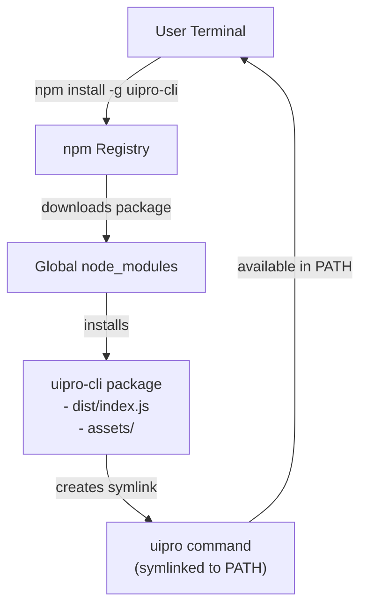
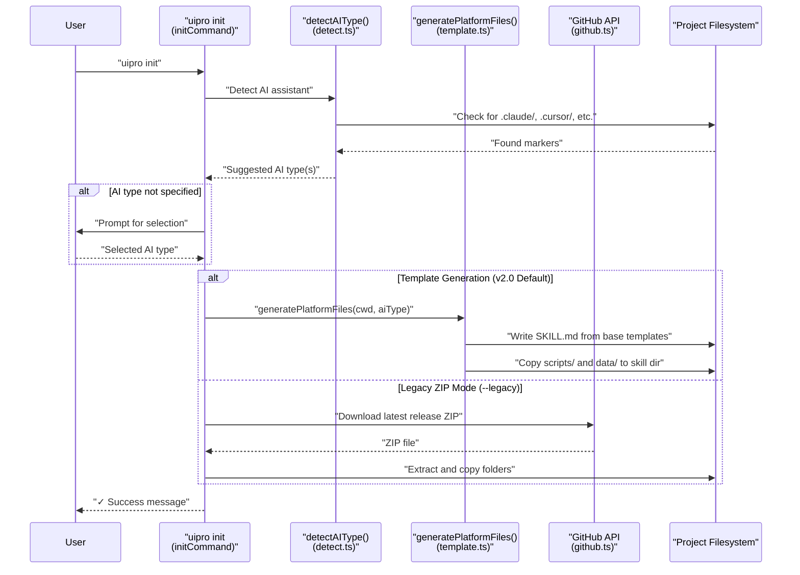
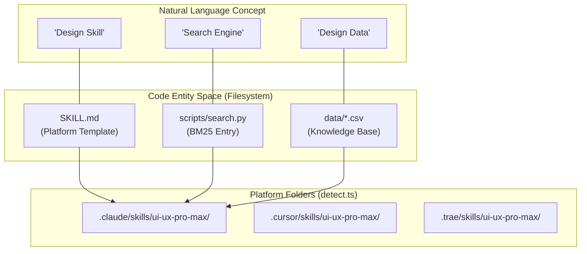
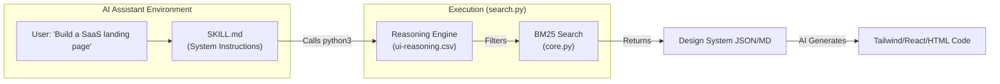

# Getting Started

<details>
<summary>Relevant source files</summary>

The following files were used as context for generating this wiki page:

- [README.md](README.md)
- [cli/.npmignore](cli/.npmignore)
- [cli/README.md](cli/README.md)
- [cli/assets/templates/platforms/augment.json](cli/assets/templates/platforms/augment.json)
- [cli/assets/templates/platforms/kilocode.json](cli/assets/templates/platforms/kilocode.json)
- [cli/assets/templates/platforms/warp.json](cli/assets/templates/platforms/warp.json)
- [cli/package.json](cli/package.json)
- [cli/src/commands/init.ts](cli/src/commands/init.ts)
- [cli/src/commands/uninstall.ts](cli/src/commands/uninstall.ts)
- [cli/src/index.ts](cli/src/index.ts)
- [cli/src/types/index.ts](cli/src/types/index.ts)
- [cli/src/utils/detect.ts](cli/src/utils/detect.ts)
- [cli/src/utils/extract.ts](cli/src/utils/extract.ts)
- [cli/src/utils/github.ts](cli/src/utils/github.ts)
- [cli/src/utils/template.ts](cli/src/utils/template.ts)
- [skill.json](skill.json)
- [src/ui-ux-pro-max/templates/platforms/augment.json](src/ui-ux-pro-max/templates/platforms/augment.json)
- [src/ui-ux-pro-max/templates/platforms/kilocode.json](src/ui-ux-pro-max/templates/platforms/kilocode.json)
- [src/ui-ux-pro-max/templates/platforms/warp.json](src/ui-ux-pro-max/templates/platforms/warp.json)

</details>


This document guides you through the installation and first-time usage of the `uipro-cli` tool. It covers prerequisites, installation commands, initialization workflows, and basic verification steps for 18 supported AI platforms.

## Prerequisites

Before installing `uipro-cli`, ensure the following are available on your system:

| Requirement | Version | Purpose |
|------------|---------|---------|
| Python | 3.x or higher | Required by `search.py` script to perform BM25 searches [cli/assets/templates/platforms/kilocode.json:10]() |
| Node.js | 18.x or higher | Required for the CLI runtime (Bun-compatible) [cli/package.json:43-44]() |
| npm / bun | Latest | Package manager for installing `uipro-cli` [cli/package.json:14-15]() |

### Verifying Prerequisites

```bash
# Check Python installation
python3 --version

# Check Node.js and npm
node --version
npm --version
```

Sources: [cli/package.json:1-48](), [cli/assets/templates/platforms/kilocode.json:1-21]()

---

## Installation

The `uipro-cli` package is distributed via npm and installed globally to make the `uipro` command available system-wide.

### Installing uipro-cli

```bash
npm install -g uipro-cli
```

This installs the package defined in [cli/package.json:1-48]() with the binary entry point at [cli/package.json:6-8]() which maps the `uipro` command to `./dist/index.js`.

### Verifying Installation

```bash
# Check CLI version
uipro --version
# Expected output: 2.5.0 (or current version)

# View available commands
uipro --help
```

The version number is maintained in [cli/package.json:3]() and loaded into the command program at [cli/src/index.ts:16-23]().

**Installation Flow Diagram:**



Sources: [cli/package.json:1-48](), [cli/src/index.ts:1-23]()

---

## First-Time Initialization

After installation, navigate to your project directory and run the `init` command to install the UI/UX Pro Max skill.

### Basic Initialization

```bash
# Navigate to your project
cd /path/to/your/project

# Initialize with auto-detection
uipro init
```

The `init` command implementation at [cli/src/index.ts:26-44]() accepts several options:

| Option | Flag | Description |
|--------|------|-------------|
| AI Type | `--ai <type>` | Target AI assistant (e.g., claude, cursor, trae) [cli/src/types/index.ts:1]() |
| Force | `--force` | Overwrite existing files [cli/src/index.ts:29]() |
| Offline | `--offline` | Skip GitHub download, use bundled assets [cli/src/index.ts:30]() |
| Global | `--global` | Install to home directory (`~/`) instead of project [cli/src/index.ts:31]() |

### Supported AI Types

The CLI supports 18 AI assistant types, validated against `AI_TYPES` at [cli/src/types/index.ts:44]():

```bash
uipro init --ai claude      # Claude Code (.claude/skills/)
uipro init --ai cursor      # Cursor (.cursor/skills/)
uipro init --ai windsurf    # Windsurf (.windsurf/skills/)
uipro init --ai trae        # Trae (.trae/skills/)
uipro init --ai roocode     # Roo Code (.roo/skills/)
uipro init --ai copilot     # GitHub Copilot (.github/prompts/)
uipro init --ai warp        # Warp (.warp/skills/)
uipro init --ai augment     # Augment (.augment/skills/)
uipro init --ai all         # Install for all detected assistants
```

### Initialization Workflow

**Initialization Process Diagram:**



Sources: [cli/src/commands/init.ts:117-216](), [cli/src/utils/detect.ts:10-77](), [cli/src/utils/template.ts:187-218]()

---

## Installation Results

The system uses a **self-contained installation model** [cli/src/utils/template.ts:215](). Every skill installation includes its own copy of the search engine and design database to ensure zero-dependency operation.

**Natural Language to Code Entity Mapping:**



| AI Type | Root Directory | Skill Filename |
|---------|----------------|----------------|
| Claude | `.claude` | `SKILL.md` |
| Cursor | `.cursor` | `SKILL.md` |
| Trae | `.trae` | `SKILL.md` |
| GitHub Copilot | `.github` | `ui-ux-pro-max.prompt.md` |
| KiloCode | `.kilocode` | `SKILL.md` |

Sources: [cli/src/types/index.ts:49-68](), [cli/src/utils/detect.ts:79-120](), [cli/assets/templates/platforms/kilocode.json:5-9]()

---

## Basic Usage Workflow

Once installed, the skill provides design intelligence through a 4-step automated workflow.

### Usage Workflow Diagram



### Example Prompts

1. **Intelligent Design System Generation**:
   `"Analyze my project requirements for a 'Meditation App' and generate a full design system."`
   
2. **Component Search**:
   `"Find the best accessible color palette for a financial dashboard using the ui-ux-pro-max skill."`

3. **Stack-Specific Implementation**:
   `"Build a hero section for a spa website using React and Tailwind, following the UI/UX Pro Max guidelines."`

Sources: [README.md:36-91](), [cli/assets/templates/platforms/warp.json:15-17]()

---

## Verifying Installation

To confirm the skill is properly installed and functional:

### 1. Check File Existence
Verify the skill directory exists in your project root:
```bash
# Example for Cursor
ls -la .cursor/skills/ui-ux-pro-max/
```
Expected files: `SKILL.md`, `scripts/search.py`, `data/` [cli/src/utils/template.ts:198-215]().

### 2. Test Search Script Directly
The search script can be tested independently via terminal:
```bash
python3 .cursor/skills/ui-ux-pro-max/scripts/search.py --domain style "glassmorphism"
```

### 3. Uninstalling
If you need to remove the skill, use the built-in uninstaller:
```bash
uipro uninstall --ai cursor
```
The `uninstallCommand` at [cli/src/commands/uninstall.ts:39-135]() will prompt for confirmation before deleting the platform-specific `ui-ux-pro-max` skill directory.

Sources: [cli/src/commands/uninstall.ts:20-37](), [cli/src/utils/template.ts:187-218]()
