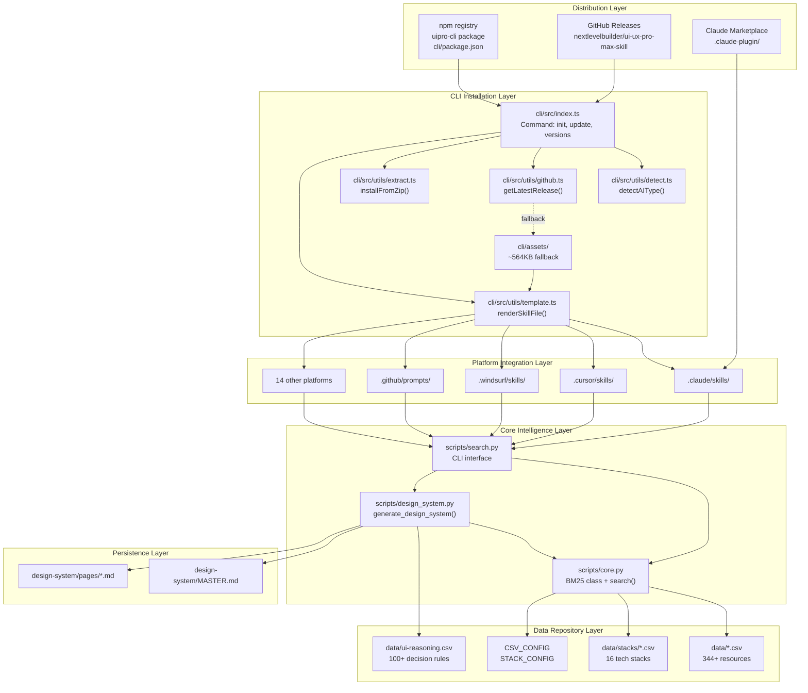
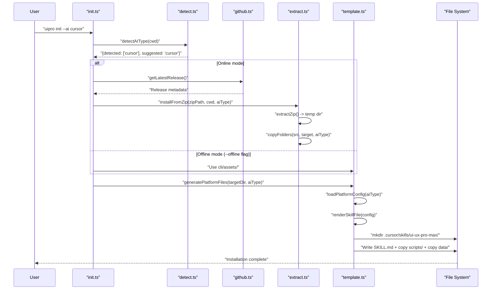
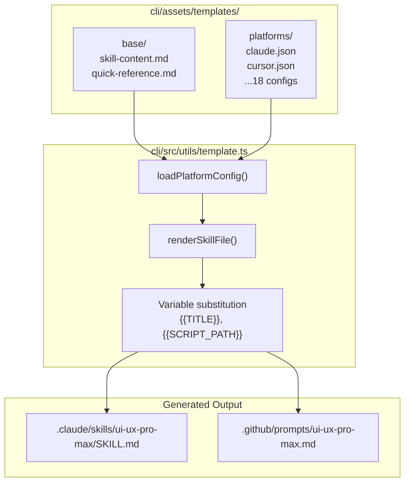
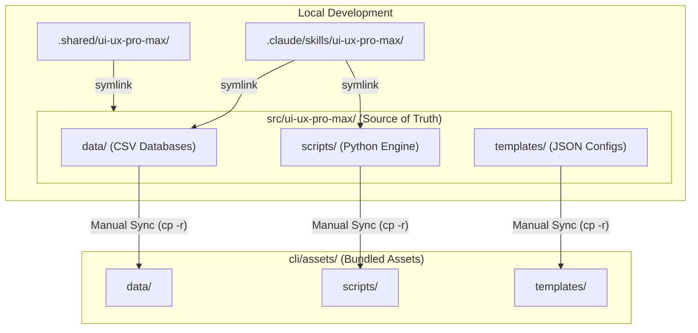

# System Architecture

Relevant source files

The following files were used as context for generating this wiki page:

- [CLAUDE.md](CLAUDE.md)
- [README.md](README.md)
- [cli/.npmignore](cli/.npmignore)
- [cli/README.md](cli/README.md)
- [cli/assets/scripts/search.py](cli/assets/scripts/search.py)
- [cli/package.json](cli/package.json)
- [cli/src/index.ts](cli/src/index.ts)
- [cli/src/types/index.ts](cli/src/types/index.ts)
- [cli/src/utils/detect.ts](cli/src/utils/detect.ts)
- [cli/src/utils/extract.ts](cli/src/utils/extract.ts)
- [cli/src/utils/github.ts](cli/src/utils/github.ts)
- [cli/src/utils/template.ts](cli/src/utils/template.ts)
- [src/ui-ux-pro-max/data/stacks/flutter.csv](src/ui-ux-pro-max/data/stacks/flutter.csv)
- [src/ui-ux-pro-max/data/stacks/jetpack-compose.csv](src/ui-ux-pro-max/data/stacks/jetpack-compose.csv)
- [src/ui-ux-pro-max/data/stacks/shadcn.csv](src/ui-ux-pro-max/data/stacks/shadcn.csv)
- [src/ui-ux-pro-max/scripts/core.py](src/ui-ux-pro-max/scripts/core.py)
- [src/ui-ux-pro-max/scripts/search.py](src/ui-ux-pro-max/scripts/search.py)

This document describes the technical architecture of the UI/UX Pro Max system, including its distribution mechanisms, core intelligence components, platform integration layer, and data persistence patterns. The system is designed as a distributed AI skill that operates across 18+ AI coding assistant platforms through template-based generation and a centralized Source of Truth.

---

## System Overview

The UI/UX Pro Max system consists of five primary layers: distribution, installation, intelligence, integration, and persistence. These layers work together to deliver design intelligence from a centralized knowledge base to multiple AI platforms.

### High-Level System Topology

**Sources:** [README.md:1-103](), [CLAUDE.md:30-58](), [cli/src/index.ts:20-81]()

---

## Distribution and Installation Layer

The system provides three distribution channels, each serving different installation workflows.

### Distribution Channels

| Channel | Package | Install Method | Target Audience |
|---------|---------|----------------|-----------------|
| npm registry | `uipro-cli` | `npm install -g uipro-cli` | General users [cli/package.json:2-7]() |
| GitHub Releases | Source archives + ZIP assets | `uipro init` downloads via API | Offline/enterprise users [cli/src/utils/github.ts:1-10]() |
| Claude Marketplace | Plugin directory | Marketplace Integration | Claude Code users only [CLAUDE.md:57-57]() |

### CLI Entry Point Architecture

The CLI is implemented as a TypeScript/Bun application [cli/package.json:13-17](). The main entry point [cli/src/index.ts:1-83]() defines commands using the `commander` library:

- `init` - Installs the skill to the current project or globally [cli/src/index.ts:26-44]().
- `update` - Upgrades an existing installation to the latest version [cli/src/index.ts:52-64]().
- `uninstall` - Removes the skill from project or home directory [cli/src/index.ts:67-81]().
- `versions` - Lists all available GitHub releases [cli/src/index.ts:47-49]().

**Sources:** [cli/src/index.ts:1-83](), [cli/package.json:1-48]()

### Platform Detection System

The `detectAIType()` function [cli/src/utils/detect.ts:10-77]() scans the current working directory for platform-specific folders to determine which AI assistants are present. It supports 18 platforms including:

| Platform | Detection Path | Constant |
|----------|---------------|----------|
| Claude Code | `.claude/` | `'claude'` |
| Cursor | `.cursor/` | `'cursor'` |
| Windsurf | `.windsurf/` | `'windsurf'` |
| Antigravity | `.agents/` | `'antigravity'` |
| GitHub Copilot | `.github/` | `'copilot'` |
| Trae | `.trae/` | `'trae'` |
| Roo Code | `.roo/` | `'roocode'` |
| Warp | `.warp/` | `'warp'` |

**Sources:** [cli/src/utils/detect.ts:10-77](), [cli/src/types/index.ts:44-68]()

---

## CLI Installation Pipeline

The installation flow consists of asset acquisition, extraction, and template rendering.

### Installation Sequence Diagram

**Sources:** [cli/src/index.ts:26-44](), [cli/src/utils/extract.ts:125-149](), [cli/src/utils/template.ts:187-218]()

### Asset Extraction and File Copying

The `extract.ts` module handles archive extraction and folder operations [cli/src/utils/extract.ts:1-150]().
- `extractZip`: Uses `Expand-Archive` on Windows and `unzip` on Unix [cli/src/utils/extract.ts:13-24]().
- `copyFolders`: Recursively copies folders defined in `AI_FOLDERS` [cli/src/utils/extract.ts:35-88]().
- `AI_FOLDERS`: Maps platforms to required directories, including the `.shared` folder for symlink support [cli/src/types/index.ts:49-68]().

**Sources:** [cli/src/utils/extract.ts:1-150](), [cli/src/types/index.ts:49-68]()

---

## Template-Based Generation System

UI/UX Pro Max uses a template system to generate platform-specific files from a single base.

### Template Architecture

**Sources:** [cli/src/utils/template.ts:6-157]()

### Platform Configuration Schema

The `PlatformConfig` interface [cli/src/types/index.ts:25-42]() defines how each platform is handled:
- `installType`: `'full'` (Skill mode) or `'reference'` (Workflow mode) [cli/src/types/index.ts:28-28]().
- `folderStructure`: Defines the `root`, `skillPath`, and `filename` for the target platform [cli/src/types/index.ts:29-33]().
- `frontmatter`: YAML metadata for platforms like Copilot [cli/src/utils/template.ts:103-117]().

**Sources:** [cli/src/types/index.ts:25-42](), [cli/src/utils/template.ts:123-157]()

---

## Core Intelligence System

The intelligence layer consists of Python modules that implement search and reasoning.

### BM25 Search Engine

The `core.py` module implements the `BM25` ranking algorithm [src/ui-ux-pro-max/scripts/core.py:104-160]().
- `tokenize`: Normalizes text and filters short words [src/ui-ux-pro-max/scripts/core.py:117-120]().
- `fit`: Builds the IDF index from documents [src/ui-ux-pro-max/scripts/core.py:122-140]().
- `score`: Ranks documents against a query [src/ui-ux-pro-max/scripts/core.py:141-160]().

**Sources:** [src/ui-ux-pro-max/scripts/core.py:104-160]()

### Search CLI Interface

`search.py` serves as the primary entry point for AI assistants [src/ui-ux-pro-max/scripts/search.py:56-115]().
- `--domain`: Searches specific categories like `style`, `color`, or `ux` [src/ui-ux-pro-max/scripts/search.py:59-59]().
- `--stack`: Searches technology-specific guidelines (e.g., `react`, `shadcn`) [src/ui-ux-pro-max/scripts/search.py:60-60]().
- `--design-system`: Triggers the reasoning engine to generate a complete system [src/ui-ux-pro-max/scripts/search.py:64-64]().

**Sources:** [src/ui-ux-pro-max/scripts/search.py:56-115](), [src/ui-ux-pro-max/scripts/core.py:17-92]()

---

## Source of Truth and Symlink Architecture

The project maintains a strict "Source of Truth" model to ensure consistency across development environments and installations.

### Directory Mapping and Symlinks

**Sync Rules:**
1. **Data & Scripts**: Modifications are made in `src/ui-ux-pro-max/`. Changes are instantly reflected in local dev environments via symlinks [CLAUDE.md:68-71]().
2. **CLI Assets**: Before publishing the `uipro-cli` package, assets must be manually synced from `src/ui-ux-pro-max/` to `cli/assets/` [CLAUDE.md:78-83]().
3. **Reference Folders**: No manual sync; the CLI generates these from templates during `uipro init` [CLAUDE.md:85-85]().

**Sources:** [CLAUDE.md:32-58](), [CLAUDE.md:62-86]()
