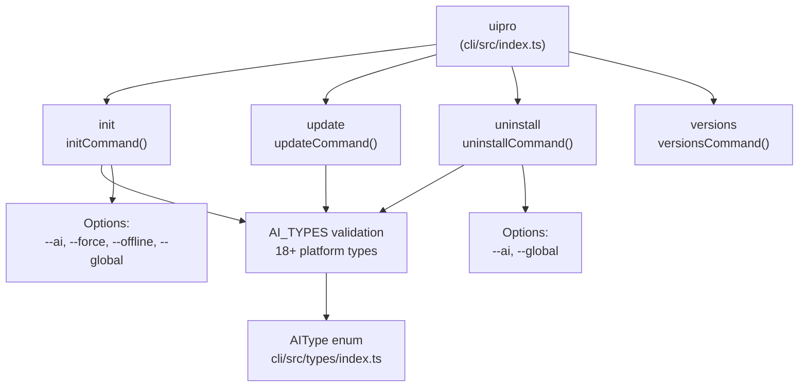
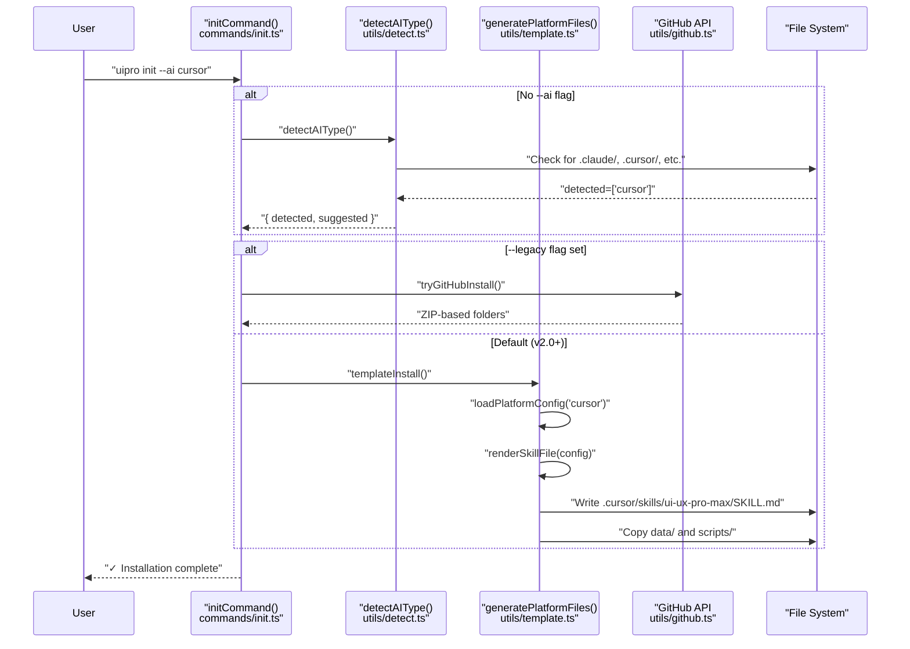

# uipro-cli Tool

<details>
<summary>Relevant source files</summary>

The following files were used as context for generating this wiki page:

- [README.md](README.md)
- [cli/.npmignore](cli/.npmignore)
- [cli/README.md](cli/README.md)
- [cli/assets/templates/platforms/augment.json](cli/assets/templates/platforms/augment.json)
- [cli/assets/templates/platforms/kilocode.json](cli/assets/templates/platforms/kilocode.json)
- [cli/assets/templates/platforms/warp.json](cli/assets/templates/platforms/warp.json)
- [cli/package.json](cli/package.json)
- [cli/src/commands/init.ts](cli/src/commands/init.ts)
- [cli/src/commands/uninstall.ts](cli/src/commands/uninstall.ts)
- [cli/src/index.ts](cli/src/index.ts)
- [cli/src/types/index.ts](cli/src/types/index.ts)
- [cli/src/utils/detect.ts](cli/src/utils/detect.ts)
- [cli/src/utils/extract.ts](cli/src/utils/extract.ts)
- [cli/src/utils/github.ts](cli/src/utils/github.ts)
- [cli/src/utils/template.ts](cli/src/utils/template.ts)
- [skill.json](skill.json)
- [src/ui-ux-pro-max/templates/platforms/augment.json](src/ui-ux-pro-max/templates/platforms/augment.json)
- [src/ui-ux-pro-max/templates/platforms/kilocode.json](src/ui-ux-pro-max/templates/platforms/kilocode.json)
- [src/ui-ux-pro-max/templates/platforms/warp.json](src/ui-ux-pro-max/templates/platforms/warp.json)

</details>


The `uipro-cli` tool is a Node.js command-line interface distributed via npm that automates the installation and management of the UI/UX Pro Max skill across 18+ AI coding platforms. It handles platform detection, GitHub release downloading with bundled fallback, and a v2.0 template-based generation system for creating platform-specific configuration files.

This page covers the CLI's package structure, command architecture, and high-level installation workflow. For detailed information on specific subsystems, see:
- CLI command options and usage: [CLI Commands](#2.1)
- Installation pipeline stages: [Installation Flow](#2.2)
- Platform directory detection logic: [Platform Detection](#2.3)
- Template-based file generation: [Template Generation](#2.4)

---

## Package Structure

The `uipro-cli` package is configured as an ES module with a binary entry point at `dist/index.js`. The package includes two critical directories:

| Directory | Purpose |
|-----------|---------|
| `dist/` | Compiled TypeScript output from `src/` [cli/package.json:10]() |
| `assets/` | Templates, platform JSON configs, and bundled data/scripts [cli/package.json:11]() |

The `package.json` defines the binary command `uipro` that maps to the compiled entry point:

```json
"bin": {
  "uipro": "./dist/index.js"
}
```

### Key Dependencies

| Package | Purpose |
|---------|---------|
| `commander@^12.1.0` | Command-line argument parsing and subcommand routing [cli/package.json:37]() |
| `chalk@^5.3.0` | Terminal color output for success/error messages [cli/package.json:38]() |
| `ora@^8.1.1` | Animated spinners during async operations [cli/package.json:39]() |
| `prompts@^2.4.2` | Interactive platform selection and confirmation [cli/package.json:40]() |

**Sources:** [cli/package.json:1-48]()

---

## Command Architecture

### Entry Point and Command Registration

The CLI entry point at [cli/src/index.ts:1-84]() uses `commander` to register four primary subcommands: `init`, `versions`, `update`, and `uninstall`.

**Command Hierarchy Diagram**



### Command Implementation Files

Each command is implemented in a separate module under `src/commands/`:

| Command | Module | Purpose |
|---------|--------|---------|
| `init` | `commands/init.ts` | Install skill to project or home directory [cli/src/commands/init.ts:117]() |
| `update` | `commands/update.ts` | Update existing installation to latest version [cli/src/commands/update.ts:9]() |
| `uninstall` | `commands/uninstall.ts` | Remove skill files from project or globally [cli/src/commands/uninstall.ts:39]() |
| `versions` | `commands/versions.js` | Fetch and display available GitHub releases [cli/src/commands/versions.ts:8]() |

**Sources:** [cli/src/index.ts:1-84](), [cli/src/types/index.ts:1-44](), [cli/README.md:13-37]()

---

## Installation Architecture

The CLI orchestrates a multi-stage installation process. In v2.0+, the default mode is **Template Generation**, which constructs the skill files dynamically rather than just copying static assets.

**Installation Flow with Code Entities**



### Installation Modes

| Mode | Trigger | Logic |
|------|---------|-------|
| **Template** | Default | Uses `generatePlatformFiles` to render Markdown from templates and platform JSON [cli/src/utils/template.ts:187-218](). |
| **Legacy ZIP** | `--legacy` | Downloads ZIP from GitHub via `getLatestRelease` [cli/src/utils/github.ts:35]() and extracts via `installFromZip` [cli/src/utils/extract.ts:125](). |
| **Global** | `--global` | Installs to `homedir()` [cli/src/utils/template.ts:196]() and rewrites script paths to absolute `~/` paths [cli/src/utils/template.ts:148-154](). |

**Sources:** [cli/src/commands/init.ts:159-183](), [cli/src/utils/template.ts:123-157]()

---

## Platform Detection and Configuration

### Detection Logic
The `detectAIType` function scans the current working directory for hidden platform folders (e.g., `.cursor`, `.windsurf`, `.trae`) to suggest the appropriate installation target [cli/src/utils/detect.ts:10-77]().

### Platform JSON Schema
Each supported platform (18 total as of v2.5.0) is defined by a JSON configuration file in `assets/templates/platforms/`. These files define:
- `folderStructure`: Where the skill and its files should live [cli/assets/templates/platforms/warp.json:5-9]().
- `installType`: Whether the platform supports a `full` or `reference` skill [cli/src/types/index.ts:28]().
- `frontmatter`: Platform-specific metadata (YAML) for the skill file [cli/src/utils/template.ts:103-117]().

**Sources:** [cli/src/utils/detect.ts:1-77](), [cli/src/utils/template.ts:10-49](), [cli/assets/templates/platforms/warp.json:1-18]()

---

## ZIP Extraction and Fallback

While Template Generation is the primary mode, the CLI maintains robust ZIP handling for legacy support and manual updates.

**Extraction Utilities**
The `extractZip` function handles platform-specific extraction [cli/src/utils/extract.ts:13-24]():
- **Windows**: Uses PowerShell `Expand-Archive`.
- **Unix**: Uses `unzip`.

**Fallback Strategy**
In legacy mode, if the GitHub download fails due to rate limits (`GitHubRateLimitError`) or network issues, the CLI automatically falls back to bundled assets in the `ASSETS_DIR` [cli/src/commands/init.ts:174-178]().

**Sources:** [cli/src/utils/extract.ts:1-150](), [cli/src/commands/init.ts:69-95]()

---

## Development and Build

The CLI is developed using TypeScript and the Bun runtime.

| Action | Command |
|--------|---------|
| **Build** | `bun run build` (Compiles to `dist/`) [cli/package.json:14]() |
| **Dev** | `bun run src/index.ts` [cli/package.json:15]() |
| **Link** | `bun link` (For local testing of the `uipro` command) [cli/README.md:58]() |

The `prepublishOnly` hook ensures that the `dist/` directory is always up-to-date before publishing to npm [cli/package.json:16]().

**Sources:** [cli/package.json:13-17](), [cli/README.md:45-59]()
