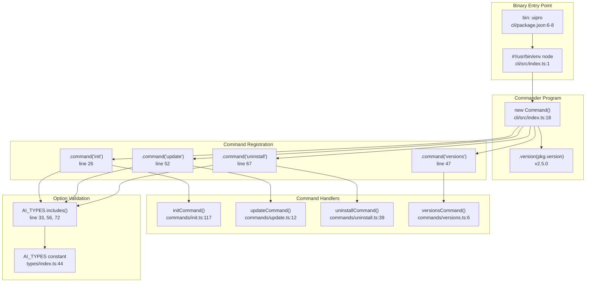
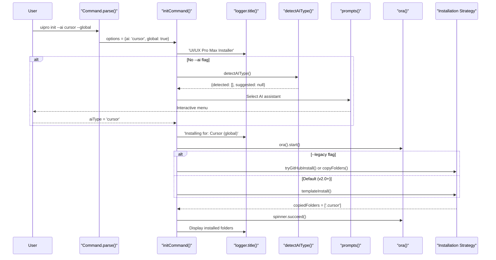
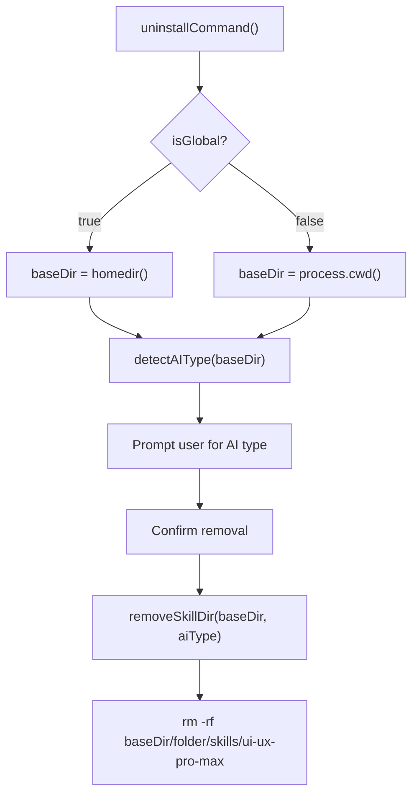

# CLI Commands

<details>
<summary>Relevant source files</summary>

The following files were used as context for generating this wiki page:

- [LICENSE](LICENSE)
- [README.md](README.md)
- [cli/.gitignore](cli/.gitignore)
- [cli/.npmignore](cli/.npmignore)
- [cli/README.md](cli/README.md)
- [cli/assets/templates/platforms/augment.json](cli/assets/templates/platforms/augment.json)
- [cli/assets/templates/platforms/kilocode.json](cli/assets/templates/platforms/kilocode.json)
- [cli/assets/templates/platforms/warp.json](cli/assets/templates/platforms/warp.json)
- [cli/bun.lock](cli/bun.lock)
- [cli/package.json](cli/package.json)
- [cli/src/commands/init.ts](cli/src/commands/init.ts)
- [cli/src/commands/uninstall.ts](cli/src/commands/uninstall.ts)
- [cli/src/commands/update.ts](cli/src/commands/update.ts)
- [cli/src/commands/versions.ts](cli/src/commands/versions.ts)
- [cli/src/index.ts](cli/src/index.ts)
- [cli/src/types/index.ts](cli/src/types/index.ts)
- [cli/src/utils/detect.ts](cli/src/utils/detect.ts)
- [cli/src/utils/extract.ts](cli/src/utils/extract.ts)
- [cli/src/utils/github.ts](cli/src/utils/github.ts)
- [cli/src/utils/template.ts](cli/src/utils/template.ts)
- [skill.json](skill.json)
- [src/ui-ux-pro-max/templates/platforms/augment.json](src/ui-ux-pro-max/templates/platforms/augment.json)
- [src/ui-ux-pro-max/templates/platforms/kilocode.json](src/ui-ux-pro-max/templates/platforms/kilocode.json)
- [src/ui-ux-pro-max/templates/platforms/warp.json](src/ui-ux-pro-max/templates/platforms/warp.json)

</details>


This document details the command-line interface of the `uipro` CLI tool, which provides four primary commands for installing and managing UI/UX Pro Max across AI coding assistants. The CLI is distributed via npm as `uipro-cli` [cli/package.json:1-8]() and provides installation orchestration with automatic platform detection, GitHub integration, and template-based file generation.

For information about the installation pipeline and asset download mechanisms, see [Installation Flow](#2.2). For platform detection logic, see [Platform Detection](#2.3). For template-based file generation, see [Template Generation](#2.4).

---

## Command Overview

The CLI exposes four commands through the `uipro` executable:

| Command | Purpose | Key Options |
|---------|---------|-------------|
| `uipro init` | Install UI/UX Pro Max to current project or globally | `--ai`, `--force`, `--offline`, `--legacy`, `--global` |
| `uipro update` | Update to latest version (alias for init with force) | `--ai` |
| `uipro uninstall` | Remove skill files from project or home directory | `--ai`, `--global` |
| `uipro versions` | List available GitHub releases | None |

**Sources:** [cli/src/index.ts:20-81](), [cli/package.json:6-8]()

---

## CLI Program Structure

The following diagram maps the command-line entry point to code entities:



**Sources:** [cli/src/index.ts:1-84](), [cli/package.json:1-8]()

---

## init Command

The `init` command installs UI/UX Pro Max to the current working directory or the user's home directory by detecting platforms, generating skill files, and copying data assets.

### Syntax

```bash
uipro init [options]
```

### Options

| Option | Type | Description | Default |
|--------|------|-------------|---------|
| `-a, --ai <type>` | string | Target AI platform (e.g., `cursor`, `claude`, `all`) | Interactive prompt |
| `-f, --force` | boolean | Overwrite existing files without confirmation | `false` |
| `-o, --offline` | boolean | Skip GitHub download, use bundled assets only | `false` |
| `-g, --global` | boolean | Install to home directory (`~/`) instead of project | `false` |
| `--legacy` | boolean | Use ZIP-based installation instead of templates | `false` |

**Sources:** [cli/src/index.ts:26-44](), [cli/src/commands/init.ts:24-30]()

### Execution Flow



**Sources:** [cli/src/commands/init.ts:117-216](), [cli/src/index.ts:26-44]()

### Installation Strategies

#### Template Generation (Default)
This method uses `generatePlatformFiles` [cli/src/utils/template.ts:187]() to create platform-specific Markdown files and copy local scripts/data. If `--global` is set, it rewrites Python script paths to use absolute home directory paths [cli/src/utils/template.ts:148-154]().

#### ZIP-Based Installation (Legacy)
Controlled by the `--legacy` flag. It attempts to download a release from GitHub via `tryGitHubInstall` [cli/src/commands/init.ts:36]() and extract it. If offline or GitHub fails, it uses `copyFolders` [cli/src/utils/extract.ts:35]() to move assets from the CLI package to the target.

**Sources:** [cli/src/commands/init.ts:98-115](), [cli/src/utils/template.ts:123-157]()

---

## uninstall Command

The `uninstall` command removes the `ui-ux-pro-max` skill directory from specific AI assistant folders.

### Syntax

```bash
uipro uninstall [options]
```

### Options

| Option | Type | Description |
|--------|------|-------------|
| `-a, --ai <type>` | string | Specific AI assistant to remove |
| `-g, --global` | boolean | Uninstall from home directory (`~/`) |

**Sources:** [cli/src/index.ts:67-81](), [cli/src/commands/uninstall.ts:12-15]()

### Implementation: removeSkillDir
The core logic resides in `removeSkillDir` [cli/src/commands/uninstall.ts:20](), which iterates through folders mapped in `AI_FOLDERS` [cli/src/types/index.ts:49]() and deletes the `skills/ui-ux-pro-max` subdirectory.



**Sources:** [cli/src/commands/uninstall.ts:20-135]()

---

## update Command

The `update` command fetches the latest release version from GitHub and re-runs the installation process with the `force` flag enabled to overwrite existing files.

### Syntax

```bash
uipro update [options]
```

**Sources:** [cli/src/index.ts:52-64](), [cli/src/commands/update.ts:12-36]()

---

## versions Command

The `versions` command queries the GitHub Releases API to display available versions. It uses `fetchReleases` [cli/src/utils/github.ts:34]() and handles rate limits via `checkRateLimit` [cli/src/utils/github.ts:22]().

**Sources:** [cli/src/commands/versions.ts:6-42](), [cli/src/utils/github.ts:34-51]()

---

## Command-Line Option Validation

### AI Type Validation
The CLI validates the `--ai` option against the `AI_TYPES` constant [cli/src/types/index.ts:44](). Supported types include:
`claude`, `cursor`, `windsurf`, `antigravity`, `copilot`, `roocode`, `kiro`, `codex`, `qoder`, `gemini`, `trae`, `opencode`, `continue`, `codebuddy`, `droid`, `kilocode`, `warp`, `augment`, `all`.

**Sources:** [cli/src/index.ts:33-37](), [cli/src/types/index.ts:1]()

### Exit Codes

| Exit Code | Condition | Location |
|-----------|-----------|----------|
| `0` | Successful execution | Implicit |
| `1` | Invalid `--ai` type provided | [cli/src/index.ts:36, 59, 75]() |
| `1` | Installation/Uninstall failure | [cli/src/commands/init.ts:214](), [cli/src/commands/uninstall.ts:133]() |

**Sources:** [cli/src/index.ts:36-75](), [cli/src/commands/init.ts:214]()
