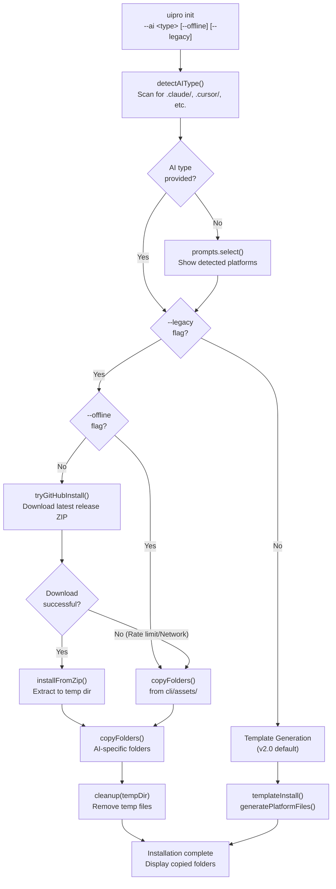
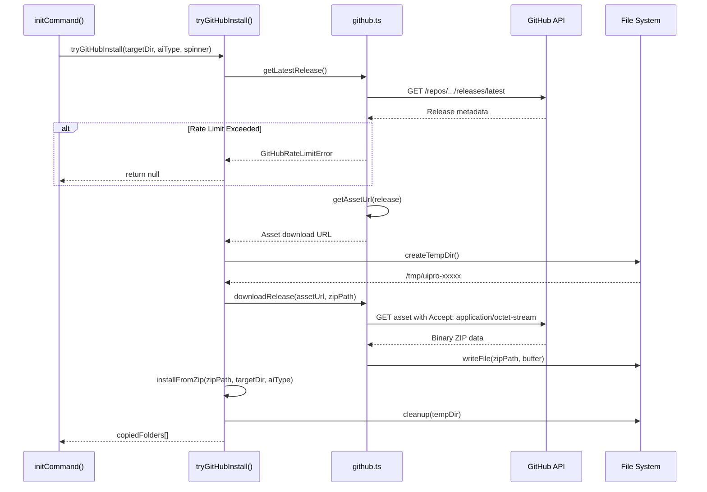
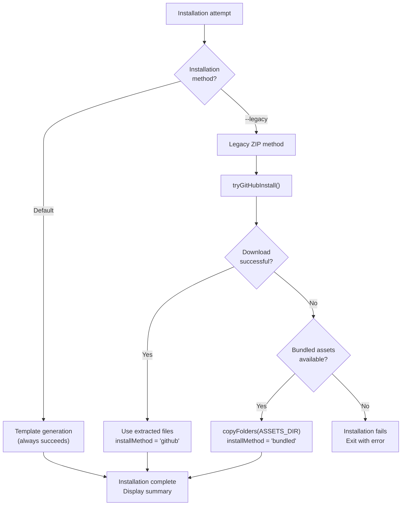
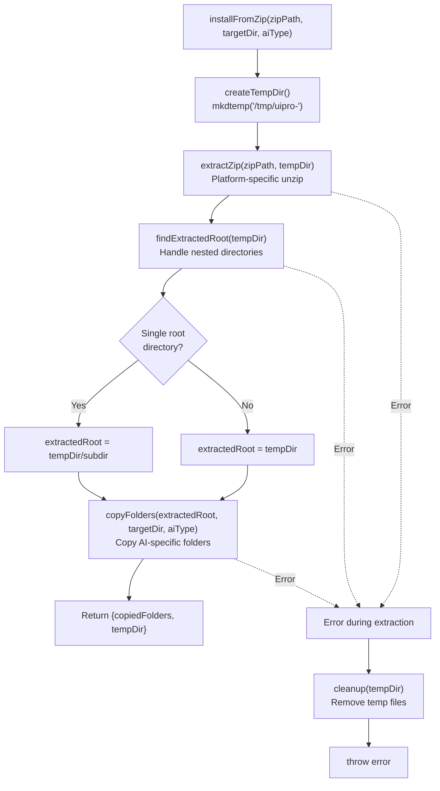
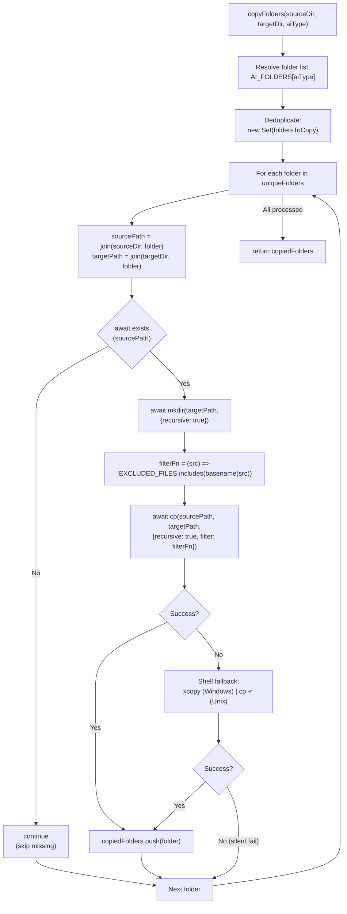
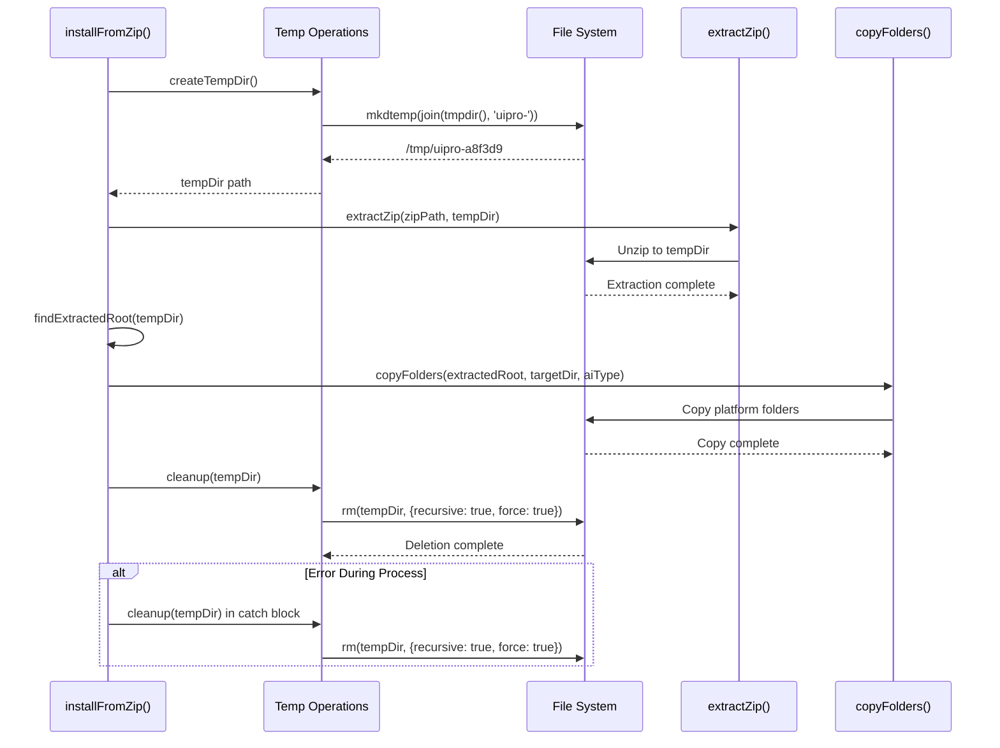
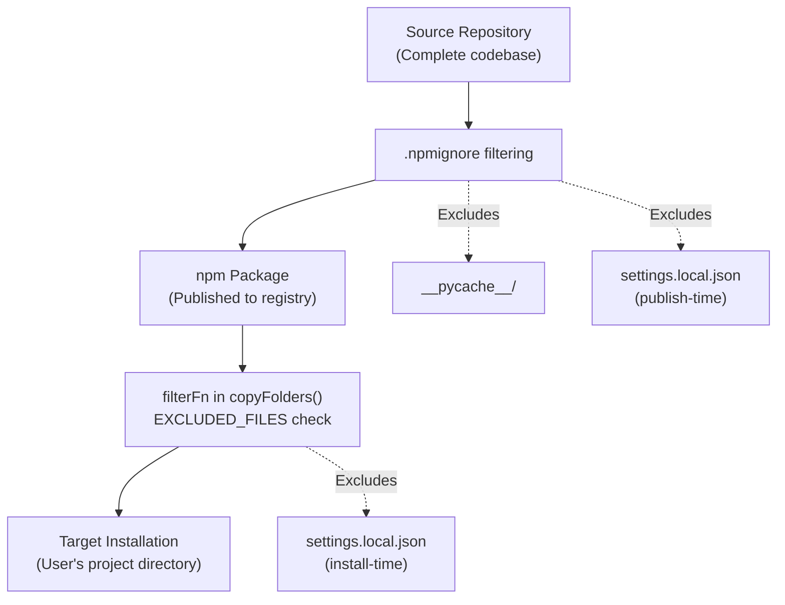

# Installation Flow

<details>
<summary>Relevant source files</summary>

The following files were used as context for generating this wiki page:

- [README.md](README.md)
- [cli/.npmignore](cli/.npmignore)
- [cli/README.md](cli/README.md)
- [cli/assets/templates/platforms/augment.json](cli/assets/templates/platforms/augment.json)
- [cli/assets/templates/platforms/kilocode.json](cli/assets/templates/platforms/kilocode.json)
- [cli/assets/templates/platforms/warp.json](cli/assets/templates/platforms/warp.json)
- [cli/package.json](cli/package.json)
- [cli/src/commands/init.ts](cli/src/commands/init.ts)
- [cli/src/commands/uninstall.ts](cli/src/commands/uninstall.ts)
- [cli/src/index.ts](cli/src/index.ts)
- [cli/src/types/index.ts](cli/src/types/index.ts)
- [cli/src/utils/detect.ts](cli/src/utils/detect.ts)
- [cli/src/utils/extract.ts](cli/src/utils/extract.ts)
- [cli/src/utils/github.ts](cli/src/utils/github.ts)
- [cli/src/utils/template.ts](cli/src/utils/template.ts)
- [skill.json](skill.json)
- [src/ui-ux-pro-max/templates/platforms/augment.json](src/ui-ux-pro-max/templates/platforms/augment.json)
- [src/ui-ux-pro-max/templates/platforms/kilocode.json](src/ui-ux-pro-max/templates/platforms/kilocode.json)
- [src/ui-ux-pro-max/templates/platforms/warp.json](src/ui-ux-pro-max/templates/platforms/warp.json)

</details>


The `uipro-cli` installation pipeline orchestrates multiple stages: GitHub asset download (with fallback handling), optional ZIP extraction for legacy mode, and template-based generation for the default v2.0 method. This document details the complete flow from the `uipro init` command invocation through final file placement in the user's project directory.

The installation system prioritizes template generation (introduced in v2.0) as the default method, with legacy ZIP-based installation available via the `--legacy` flag. Related documentation: [CLI Commands](#2.1) for command options, [Platform Detection](#2.3) for AI type detection, [Template Generation](#2.4) for the v2.0 template system.

Sources: [cli/src/commands/init.ts:1-217](), [cli/src/utils/extract.ts:1-150]()

## Installation Pipeline Overview

The installation flow consists of multiple stages with automatic fallback mechanisms. The pipeline is invoked via `initCommand()` [cli/src/commands/init.ts:117-216]() and executes the following decision tree:

**Complete Installation Flow**



The pipeline uses three installation methods defined in `initCommand` [cli/src/commands/init.ts:156-189]():

| Method | Trigger | Description | Files Source |
|--------|---------|-------------|--------------|
| **Template Generation** | Default (no `--legacy`) | Generates files from templates using platform configs | `cli/src/utils/template.ts` |
| **GitHub ZIP** | `--legacy` flag + network available | Downloads and extracts latest release | GitHub API + `extractZip()` |
| **Bundled Assets** | `--legacy --offline` or GitHub failure | Uses pre-packaged files from npm | `cli/assets/` directory |

Sources: [cli/src/commands/init.ts:156-189](), [cli/src/index.ts:26-44]()

## Installation Method Selection

As of v2.0, the CLI defaults to **template generation** rather than ZIP-based installation. This shift enables single-source-of-truth maintenance and platform-specific customization without distributing redundant files.

### Template Generation Method (Default)

When invoked without the `--legacy` flag, `initCommand()` calls `templateInstall()` [cli/src/commands/init.ts:181-182]():

```typescript
// Default: template-based generation
copiedFolders = await templateInstall(cwd, aiType, spinner, isGlobal);
installMethod = 'template';
```

The function `templateInstall` [cli/src/commands/init.ts:100-115]() routes to either:
- `generatePlatformFiles(targetDir, aiType, isGlobal)` - Single platform
- `generateAllPlatformFiles(targetDir, isGlobal)` - All platforms (when `aiType === 'all'`)

This method is covered in detail in [Template Generation](#2.4).

### Legacy ZIP Method (--legacy Flag)

When the `--legacy` flag is provided, the CLI attempts the original ZIP-based installation [cli/src/commands/init.ts:160-178]():

```typescript
if (options.legacy) {
  if (isGlobal) {
    spinner.warn('--global is not supported with --legacy mode, installing locally instead');
  }
  // Try GitHub download first (unless offline mode)
  if (!options.offline) {
    const githubResult = await tryGitHubInstall(cwd, aiType, spinner);
    if (githubResult) {
      copiedFolders = githubResult;
      installMethod = 'github';
    }
  }
  
  // Fall back to bundled assets if GitHub failed or offline mode
  if (installMethod !== 'github') {
    spinner.text = 'Installing from bundled assets...';
    copiedFolders = await copyFolders(ASSETS_DIR, cwd, aiType);
    installMethod = 'bundled';
  }
}
```

**Method Comparison**

| Aspect | Template Generation | Legacy ZIP |
|--------|---------------------|------------|
| **Default** | Yes (v2.0+) | No (requires `--legacy`) |
| **Network Required** | No | Yes (unless `--offline`) |
| **File Size** | Minimal (only target platform) | Larger (full release archive) |
| **Customization** | Per-platform via JSON configs | Static files from ZIP |
| **Maintenance** | Single source in `src/ui-ux-pro-max/` | Must sync to `cli/assets/` |
| **Speed** | Faster (no download/extract) | Slower (download + unzip) |

Sources: [cli/src/commands/init.ts:160-183](), [cli/src/utils/template.ts:187-218]()

## GitHub Download Phase

The `tryGitHubInstall()` function [cli/src/commands/init.ts:36-95]() orchestrates the GitHub release download pipeline with comprehensive error handling.

**GitHub Download Pipeline**



### GitHub API Interaction

The `github.ts` module defines core functions for interacting with the GitHub API:

| Function | Endpoint | Purpose |
|----------|----------|---------|
| `getLatestRelease()` | `/repos/{owner}/{repo}/releases/latest` | Get latest release metadata [cli/src/utils/github.ts:34-45]() |
| `downloadRelease(url, dest)` | Asset URL | Download binary ZIP to disk [cli/src/utils/github.ts:80-105]() |

All requests include rate limit detection via `checkRateLimit()` [cli/src/utils/github.ts:10-18]().

### Asset URL Resolution

The `getAssetUrl()` function [cli/src/utils/github.ts:60-78]() implements a two-tier fallback strategy:

1. **Uploaded ZIP asset** - Searches for `release.assets` with `.zip` extension
2. **Auto-generated archive** - Constructs URL: `https://github.com/{owner}/{repo}/archive/refs/tags/{tag}.zip`

This ensures installation works even if no ZIP is explicitly uploaded to the release.

Sources: [cli/src/commands/init.ts:36-95](), [cli/src/utils/github.ts:1-105]()

## Error Handling and Fallback Strategy

The installation pipeline implements graceful degradation with multiple fallback layers to maximize installation success rates.

### Error Types and Responses

| Error Type | Thrown By | Handler Behavior | Fallback Action |
|------------|-----------|------------------|-----------------|
| `GitHubRateLimitError` | `checkRateLimit()` | Warn user with reset time | Template generation [cli/src/commands/init.ts:75-78]() |
| `GitHubDownloadError` | `downloadRelease()` | Warn "GitHub download failed" | Template generation [cli/src/commands/init.ts:80-83]() |
| `TypeError` (fetch) | `fetch()` calls | Detect network issues | Template generation [cli/src/commands/init.ts:86-89]() |
| Unknown errors | Any stage | Generic "Download failed" warning | Template generation [cli/src/commands/init.ts:92-93]() |

**Fallback Decision Tree**



### Error Recovery Logic

The `tryGitHubInstall()` function [cli/src/commands/init.ts:36-95]() wraps all operations in a try-catch block with granular error classification. Returning `null` instead of throwing allows `initCommand()` to seamlessly fall back to template generation or bundled assets.

Sources: [cli/src/commands/init.ts:69-94](), [cli/src/utils/github.ts:10-32]()

## ZIP Extraction (Legacy Mode)

When using the `--legacy` flag, the `installFromZip()` function [cli/src/utils/extract.ts:125-149]() handles the complete extraction pipeline.

### installFromZip() Pipeline

The function coordinates multiple extraction stages:

**Legacy Installation Pipeline**



### Platform-Specific Extraction

The `extractZip()` function [cli/src/utils/extract.ts:13-24]() uses different shell commands based on `process.platform`:

| Platform | Detection | Command | Flags |
|----------|-----------|---------|-------|
| Windows | `process.platform === 'win32'` | `powershell -Command "Expand-Archive..."` | `-Force` (overwrite) |
| Unix/Linux/macOS | All other values | `unzip -o "..." -d "..."` | `-o` (overwrite without prompt) |

### Extracted Root Detection

GitHub release ZIPs often contain a single root directory. The `findExtractedRoot()` function [cli/src/utils/extract.ts:109-120]() handles this to ensure `copyFolders()` operates on the correct source path.

Sources: [cli/src/utils/extract.ts:125-149](), [cli/src/utils/extract.ts:109-120](), [cli/src/utils/extract.ts:13-24]()

## Folder Copying Logic

The `copyFolders()` function [cli/src/utils/extract.ts:35-88]() is used by the legacy installation method to selectively copy platform-specific directories.

### AI-Specific Folder Selection

The `AI_FOLDERS` mapping [cli/src/types/index.ts:49-68]() determines which directories to copy. The `.shared/` directory contains core scripts and data used by multiple platforms.

### Copy Operation Flow

The function implements a three-tier copy strategy: Node.js native API (`cp`), platform-specific shell fallback (`xcopy` or `cp -r`), and silent failure for missing sources.

**copyFolders() Execution Flow**



### File Exclusion Filter

The `filterFn` callback [cli/src/utils/extract.ts:63-66]() prevents specific files from being copied, such as `settings.local.json` [cli/src/utils/extract.ts:11]().

Sources: [cli/src/utils/extract.ts:35-88](), [cli/src/types/index.ts:49-68]()

## Temporary Directory Management

The installation pipeline uses temporary directories for ZIP extraction to avoid polluting the user's filesystem.

### Temporary Directory Lifecycle

**Temp Directory Lifecycle**



### Temporary Directory Functions

| Function | Purpose | Implementation |
|----------|---------|----------------|
| `createTempDir()` | Generate unique temp directory | `mkdtemp(join(tmpdir(), 'uipro-'))` [cli/src/utils/extract.ts:101-103]() |
| `cleanup(tempDir)` | Remove temp directory and contents | `rm(tempDir, {recursive: true, force: true})` [cli/src/utils/extract.ts:90-96]() |

Cleanup occurs in both the success path [cli/src/utils/extract.ts:143]() and the error path [cli/src/commands/init.ts:71-73]().

Sources: [cli/src/utils/extract.ts:90-103](), [cli/src/commands/init.ts:64-73]()

## File Exclusion Rules

The system maintains multiple layers of file exclusion to prevent sensitive or unnecessary files from being copied.

### Excluded Files List

The `EXCLUDED_FILES` constant [cli/src/utils/extract.ts:11]() defines files like `settings.local.json` that should not be overwritten.

### Multi-Layer Exclusion Strategy

**File Exclusion Layers**



This multi-layer approach ensures build artifacts and local configuration files are never distributed or overwritten.

Sources: [cli/src/utils/extract.ts:11](), [cli/.npmignore:1-2]()

## Version Management

The package uses semantic versioning. The current version is `2.5.0` [cli/package.json:3]().

Sources: [cli/package.json:3]()
