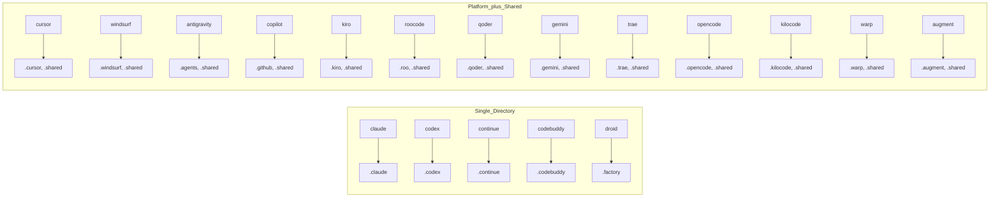

# Platform Detection

<details>
<summary>Relevant source files</summary>

The following files were used as context for generating this wiki page:

- [CLAUDE.md](CLAUDE.md)
- [README.md](README.md)
- [cli/.npmignore](cli/.npmignore)
- [cli/README.md](cli/README.md)
- [cli/package.json](cli/package.json)
- [cli/src/index.ts](cli/src/index.ts)
- [cli/src/types/index.ts](cli/src/types/index.ts)
- [cli/src/utils/detect.ts](cli/src/utils/detect.ts)
- [cli/src/utils/extract.ts](cli/src/utils/extract.ts)
- [cli/src/utils/github.ts](cli/src/utils/github.ts)
- [cli/src/utils/template.ts](cli/src/utils/template.ts)

</details>


## Purpose and Scope

The Platform Detection system identifies which AI coding assistant platforms are present in a user's project directory by scanning for platform-specific folders. The `detectAIType()` function returns detected platforms and suggests an installation target for the UI/UX Pro Max skill.

This system enables automatic environment detection, validates user-provided platform identifiers, and maps platforms to their corresponding directory structures.

For information about how template generation uses the detected platform, see [2.4](). For the complete CLI tool architecture, see [1.2]().

---

## Detection Components

The platform detection system consists of three components:

| Component | Purpose | Location |
|-----------|---------|----------|
| Type Definitions | `AIType` union, `AI_TYPES` array, `AI_FOLDERS` mapping | [cli/src/types/index.ts:1-68]() |
| Detection Function | `detectAIType()` - scans filesystem and returns detection results | [cli/src/utils/detect.ts:10-77]() |
| CLI Validation | Validates `--ai` flag and invokes detection in init/update commands | [cli/src/index.ts:20-81]() |

The system supports 18 distinct platforms plus an `'all'` option for multi-platform installations. Detection runs automatically when users execute `uipro init` or `uipro update` without the `--ai` flag.

**Sources:** [cli/src/types/index.ts:1-68](), [cli/src/utils/detect.ts:10-77](), [cli/src/index.ts:20-81]()

---

## Platform Type Definitions

### AIType Union

The `AIType` union type defines all supported platforms:

```typescript
export type AIType = 'claude' | 'cursor' | 'windsurf' | 'antigravity' | 'copilot' | 
                     'kiro' | 'roocode' | 'codex' | 'qoder' | 'gemini' | 'trae' | 
                     'opencode' | 'continue' | 'codebuddy' | 'droid' | 'kilocode' | 
                     'warp' | 'augment' | 'all';
```

The `AI_TYPES` array [cli/src/types/index.ts:44]() provides runtime validation:

```typescript
export const AI_TYPES: AIType[] = ['claude', 'cursor', 'windsurf', 'antigravity', 
  'copilot', 'roocode', 'kiro', 'codex', 'qoder', 'gemini', 'trae', 
  'opencode', 'continue', 'codebuddy', 'droid', 'kilocode', 'warp', 'augment', 'all'];
```

**Sources:** [cli/src/types/index.ts:1](), [cli/src/types/index.ts:44]()

### AI_FOLDERS Mapping

The `AI_FOLDERS` record maps each platform to its target installation directories. This mapping is used for backward compatibility with ZIP-based installs and for identifying folders to remove during uninstallation.

**Diagram: Platform to Directory Mapping (AI_FOLDERS)**



Two installation patterns are supported:
- **Single directory**: All files in one folder (e.g., `claude` uses `.claude`).
- **Dual directory**: Platform-specific files plus shared assets in `.shared/`. Note that for modern platforms like `kilocode`, `warp`, and `augment`, `.shared` is included as a no-op for consistent uninstall behavior [cli/src/types/index.ts:47-48]().

**Sources:** [cli/src/types/index.ts:49-68]()

### Platform Descriptions

The `getAITypeDescription()` function [cli/src/utils/detect.ts:79-120]() returns human-readable descriptions and the target paths for each platform:

| Platform | Description | Directory Marker |
|----------|-------------|------------------|
| `claude` | Claude Code | `.claude/skills/` |
| `cursor` | Cursor | `.cursor/skills/` |
| `windsurf` | Windsurf | `.windsurf/skills/` |
| `antigravity`| Antigravity | `.agents/skills/` |
| `copilot` | GitHub Copilot | `.github/prompts/` |
| `kiro` | Kiro | `.kiro/steering/` |
| `codex` | Codex | `.codex/skills/` |
| `roocode` | RooCode | `.roo/skills/` |
| `qoder` | Qoder | `.qoder/skills/` |
| `gemini` | Gemini CLI | `.gemini/skills/` |
| `trae` | Trae | `.trae/skills/` |
| `opencode` | OpenCode | `.opencode/skills/` |
| `continue` | Continue | `.continue/skills/` |
| `codebuddy` | CodeBuddy | `.codebuddy/skills/` |
| `droid` | Droid (Factory) | `.factory/skills/` |
| `kilocode` | KiloCode | `.kilocode/skills/` |
| `warp` | Warp | `.warp/skills/` |
| `augment` | Augment | `.augment/skills/` |

**Sources:** [cli/src/utils/detect.ts:79-120]()

---

## detectAIType() Function

### Detection Algorithm

The `detectAIType()` function [cli/src/utils/detect.ts:10-77]() implements filesystem-based platform detection using `existsSync()` from `node:fs`.

**Diagram: detectAIType() Execution Flow**

```mermaid
flowchart TD
    "Start"["detectAIType(cwd)"] --> "Init"["const detected: AIType[] = []"]
    "Init" --> "CheckClaude"{"existsSync('.claude')"}
    "CheckClaude" -- "Yes" --> "AddClaude"["detected.push('claude')"]
    "CheckClaude" -- "No" --> "CheckCursor"{"existsSync('.cursor')"}
    "AddClaude" --> "CheckCursor"
    
    "CheckCursor" -- "Yes" --> "AddCursor"["detected.push('cursor')"]
    "CheckCursor" -- "No" --> "CheckWindsurf"{"existsSync('.windsurf')"}
    "AddCursor" --> "CheckWindsurf"
    
    "CheckWindsurf" -- "Yes" --> "AddWindsurf"["detected.push('windsurf')"]
    "CheckWindsurf" -- "No" --> "CheckAgents"{"existsSync('.agents')"}
    "AddWindsurf" --> "CheckAgents"
    
    "CheckAgents" -- "Yes" --> "AddAgents"["detected.push('antigravity')"]
    "CheckAgents" -- "No" --> "CheckOther"["... checks for .github, .kiro, .codex, .roo, .qoder, .gemini, .trae, .opencode, .continue, .codebuddy, .factory, .kilocode, .warp, .augment ..."]
    "AddAgents" --> "CheckOther"
    
    "CheckOther" --> "Suggest"{"detected.length"}
    "Suggest" -- "1" --> "Single"["suggested = detected[0]"]
    "Suggest" -- "> 1" --> "Multi"["suggested = 'all'"]
    "Suggest" -- "0" --> "None"["suggested = null"]
    
    "Single" --> "Return"["return { detected, suggested }"]
    "Multi" --> "Return"
    "None" --> "Return"
```

**Sources:** [cli/src/utils/detect.ts:10-77]()

### DetectionResult Interface

The `DetectionResult` interface [cli/src/utils/detect.ts:5-8]() structures the output:

```typescript
interface DetectionResult {
  detected: AIType[];       // All platforms found in directory
  suggested: AIType | null; // Recommended installation target
}
```

**Suggestion Logic:**
- Exactly 1 platform detected → `suggested = detected[0]` [cli/src/utils/detect.ts:70-71]()
- Multiple platforms detected → `suggested = 'all'` [cli/src/utils/detect.ts:72-73]()
- No platforms detected → `suggested = null` [cli/src/utils/detect.ts:69]()

**Sources:** [cli/src/utils/detect.ts:5-8](), [cli/src/utils/detect.ts:69-74]()

### Directory Marker Strategy

The function checks for platform-specific directories using `join(cwd, marker)`:

**Diagram: Directory Markers to Platform Resolution**

```mermaid
graph TB
    subgraph "Filesystem"
        "cwd"["process.cwd()"]
    end
    
    subgraph "Directory_Markers"
        "d1"[".claude/"]
        "d2"[".cursor/"]
        "d3"[".windsurf/"]
        "d4"[".agents/ or .agent/"]
        "d5"[".github/"]
        "d6"[".kiro/"]
        "d7"[".codex/"]
        "d8"[".roo/"]
        "d9"[".qoder/"]
        "d10"[".gemini/"]
        "d11"[".trae/"]
        "d12"[".opencode/"]
        "d13"[".continue/"]
        "d14"[".codebuddy/"]
        "d15"[".factory/"]
        "d16"[".kilocode/"]
        "d17"[".warp/"]
        "d18"[".augment/"]
    end
    
    subgraph "AIType_Values"
        "t1"["'claude'"]
        "t2"["'cursor'"]
        "t3"["'windsurf'"]
        "t4"["'antigravity'"]
        "t5"["'copilot'"]
        "t6"["'kiro'"]
        "t7"["'codex'"]
        "t8"["'roocode'"]
        "t9"["'qoder'"]
        "t10"["'gemini'"]
        "t11"["'trae'"]
        "t12"["'opencode'"]
        "t13"["'continue'"]
        "t14"["'codebuddy'"]
        "t15"["'droid'"]
        "t16"["'kilocode'"]
        "t17"["'warp'"]
        "t18"["'augment'"]
    end
    
    "cwd" --> "d1" & "d2" & "d3" & "d4" & "d5" & "d6" & "d7" & "d8" & "d9" & "d10" & "d11" & "d12" & "d13" & "d14" & "d15" & "d16" & "d17" & "d18"
    
    "d1" --> "t1"
    "d2" --> "t2"
    "d3" --> "t3"
    "d4" --> "t4"
    "d5" --> "t5"
    "d6" --> "t6"
    "d7" --> "t7"
    "d8" --> "t8"
    "d9" --> "t9"
    "d10" --> "t10"
    "d11" --> "t11"
    "d12" --> "t12"
    "d13" --> "t13"
    "d14" --> "t14"
    "d15" --> "t15"
    "d16" --> "t16"
    "d17" --> "t17"
    "d18" --> "t18"
```

**Note:** For `antigravity`, the system checks for both `.agents` and `.agent` directories [cli/src/utils/detect.ts:22](). Detection of `.github` [cli/src/utils/detect.ts:25]() is mapped to `copilot`.

**Sources:** [cli/src/utils/detect.ts:13-66]()

---

## CLI Integration

### Command-Line Usage

Platform detection integrates with `init`, `update`, and `uninstall` commands [cli/src/index.ts:26-81]():

**init command**:
```bash
uipro init                    # Auto-detect platform
uipro init --ai claude        # Specify platform explicitly
uipro init --ai all           # Install for all platforms
```

**update command**:
```bash
uipro update                  # Auto-detect platform
uipro update --ai windsurf    # Update specific platform
```

**uninstall command**:
```bash
uipro uninstall               # Auto-detect platform to remove
```

**Sources:** [cli/src/index.ts:26-81]()

### Validation Flow

The CLI validates `--ai` flag values before invoking detection:

**Diagram: CLI Validation and Detection Flow**

```mermaid
flowchart TD
    "UserInput"["uipro init --ai <type>"]
    "UserInput" --> "CheckProvided"{"options.ai\nprovided?"}
    
    "CheckProvided" -- "Yes" --> "Validate"{"AI_TYPES.includes\n(options.ai)"}
    "CheckProvided" -- "No" --> "AutoDetect"["detectAIType(process.cwd())"]
    
    "Validate" -- "Valid" --> "PassToCommand"["initCommand({ ai: options.ai })"]
    "Validate" -- "Invalid" --> "ShowError"["console.error('Invalid AI type')"]
    "ShowError" --> "Exit"["process.exit(1)"]
    
    "AutoDetect" --> "Result"["{ detected, suggested }"]
    "Result" --> "PassToInit"["initCommand({ ai: suggested })"]
    
    "PassToCommand" --> "Execute"["Execute installation"]
    "PassToInit" --> "Execute"
```

Validation at [cli/src/index.ts:33-37](), [cli/src/index.ts:56-60](), and [cli/src/index.ts:72-76]() ensures only values from `AI_TYPES` are accepted.

**Sources:** [cli/src/index.ts:33-37](), [cli/src/index.ts:56-60](), [cli/src/index.ts:72-76]()

---

## Detection Result Handling

### Suggestion Priority

The function determines `suggested` based on `detected.length`:

| Scenario | `detected` Array | `suggested` Value | Rationale |
|----------|------------------|-------------------|-----------|
| No platforms | `[]` | `null` | User must manually select or specify |
| Single platform | `['claude']` | `'claude'` | Unambiguous target |
| Multiple platforms | `['claude', 'cursor']` | `'all'` | Suggest universal installation |

**Sources:** [cli/src/utils/detect.ts:69-74]()

### Integration with Installation System

The detected platform is passed via `InstallConfig` [cli/src/types/index.ts:19-23]():

```typescript
export interface InstallConfig {
  aiType: AIType;      // Target platform(s)
  version?: string;    // Optional version override
  force?: boolean;     // Overwrite existing files
}
```

The installation system uses `aiType` to:
1. Load platform-specific configurations via `loadPlatformConfig(aiType)` [cli/src/utils/template.ts:63-72]().
2. Determine directory structures and script paths [cli/src/utils/template.ts:187-218]().
3. Copy data and scripts to the correct target directory [cli/src/utils/template.ts:162-180]().

**Sources:** [cli/src/types/index.ts:19-23](), [cli/src/utils/template.ts:63-72](), [cli/src/utils/template.ts:162-218]()

---

## Limitations and Edge Cases

### Known Limitations

| Limitation | Impact | Mitigation |
|------------|--------|------------|
| `.github/` false positives | Detects Copilot when directory exists for GitHub Actions | Use `--ai` flag to override [cli/src/index.ts:28]() |
| Dual Agent Markers | Checks for both `.agents` and `.agent` | Mapped to a single `antigravity` type [cli/src/utils/detect.ts:22-24]() |
| Multiple Platforms | Defaults to `'all'` | Users can specify a single platform via CLI flag if preferred |

**Sources:** [cli/src/utils/detect.ts:22-26](), [cli/src/index.ts:28]()

### Error Handling

Error handling behavior:
- `existsSync()` exceptions are not explicitly caught, allowing them to bubble up to the CLI [cli/src/utils/detect.ts:10-66]().
- Invalid `--ai` values are rejected with a helpful error message listing all valid types [cli/src/index.ts:34-35]().
- If `loadPlatformConfig` is called with an unknown type, it throws an error [cli/src/utils/template.ts:65-67]().

**Sources:** [cli/src/index.ts:34-35](), [cli/src/utils/template.ts:65-67]()
