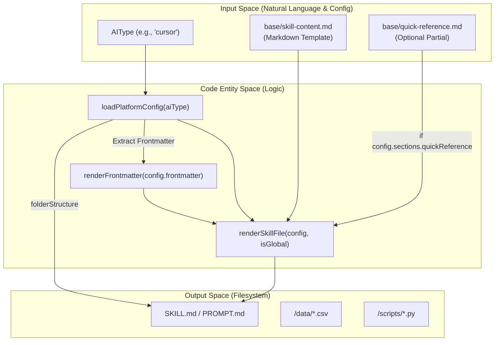
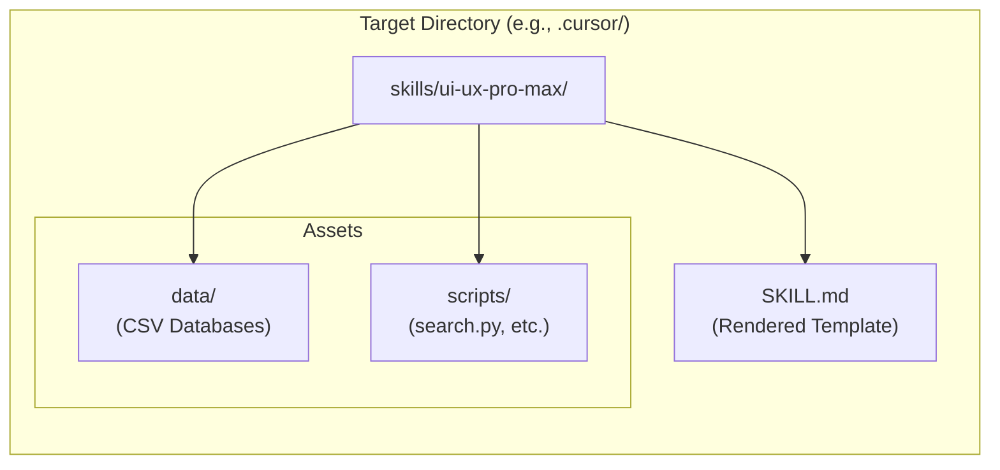

# Template Generation

Relevant source files

The following files were used as context for generating this wiki page:

- [README.md](README.md)
- [cli/.npmignore](cli/.npmignore)
- [cli/README.md](cli/README.md)
- [cli/assets/templates/base/skill-content.md](cli/assets/templates/base/skill-content.md)
- [cli/assets/templates/platforms/agent.json](cli/assets/templates/platforms/agent.json)
- [cli/assets/templates/platforms/copilot.json](cli/assets/templates/platforms/copilot.json)
- [cli/assets/templates/platforms/cursor.json](cli/assets/templates/platforms/cursor.json)
- [cli/assets/templates/platforms/kiro.json](cli/assets/templates/platforms/kiro.json)
- [cli/assets/templates/platforms/roocode.json](cli/assets/templates/platforms/roocode.json)
- [cli/assets/templates/platforms/windsurf.json](cli/assets/templates/platforms/windsurf.json)
- [cli/package.json](cli/package.json)
- [cli/src/index.ts](cli/src/index.ts)
- [cli/src/types/index.ts](cli/src/types/index.ts)
- [cli/src/utils/detect.ts](cli/src/utils/detect.ts)
- [cli/src/utils/extract.ts](cli/src/utils/extract.ts)
- [cli/src/utils/github.ts](cli/src/utils/github.ts)
- [cli/src/utils/template.ts](cli/src/utils/template.ts)

The Template Generation system is the core of the v2.0 architecture, responsible for producing platform-specific installation files from a single source of truth using declarative JSON configurations. This system enables the UI/UX Pro Max skill to support 18+ AI platforms (including Claude, Cursor, Windsurf, Trae, and others) by mapping a base template to specific folder structures, file naming conventions, and metadata requirements.

---

## Platform Configuration Schema

Each AI platform is defined by a JSON configuration file located in `cli/assets/templates/platforms/`. These files define the structural and content parameters used by the `template.ts` utility to generate the final skill files.

### Configuration Structure

The `PlatformConfig` interface defines the following fields:

| Field | Type | Purpose | Example Values |
|-------|------|---------|----------------|
| `platform` | `string` | Internal platform identifier | `"cursor"`, `"trae"`, `"warp"` |
| `displayName` | `string` | UI name shown in CLI prompts | `"Cursor"`, `"GitHub Copilot"` |
| `installType` | `string` | Delivery mode (`full` or `reference`) | `"full"` |
| `folderStructure.root` | `string` | Top-level hidden directory | `".cursor"`, `".github"`, `".trae"` |
| `folderStructure.skillPath` | `string` | Subdirectory path for the skill | `"skills/ui-ux-pro-max"` |
| `folderStructure.filename` | `string` | Target filename | `"SKILL.md"`, `"PROMPT.md"` |
| `scriptPath` | `string` | Path to the Python search engine | `"skills/ui-ux-pro-max/scripts/search.py"` |
| `frontmatter` | `Record \| null` | YAML metadata for the markdown file | `{"name": "ui-ux-pro-max"}` |
| `sections.quickReference` | `boolean` | Toggle for the quick-ref template | `true`, `false` |
| `skillOrWorkflow` | `string` | Categorization for instructions | `"Skill"`, `"Workflow"` |

**Sources:** [cli/src/types/index.ts:25-42](), [cli/src/utils/template.ts:10-27](), [cli/assets/templates/platforms/cursor.json:1-21]()

---

## Template Rendering Pipeline

The rendering pipeline transforms abstract platform definitions into concrete filesystem entities. It utilizes a base template (`base/skill-content.md`) and injects platform-specific values.

**Diagram: Template Generation Flow**

**Sources:** [cli/src/utils/template.ts:63-72](), [cli/src/utils/template.ts:123-157](), [cli/src/utils/template.ts:187-218]()

### Key Implementation Functions

- **`loadPlatformConfig(aiType)`**: Maps the CLI `AIType` to a JSON file (e.g., `claude` -> `claude.json`) and parses the configuration. [cli/src/utils/template.ts:63-72]()
- **`renderSkillFile(config, isGlobal)`**: Performs the string replacement for placeholders like `{{TITLE}}`, `{{DESCRIPTION}}`, and `{{SCRIPT_PATH}}`. If `isGlobal` is true, it rewrites relative paths to use the home directory prefix (`~/`). [cli/src/utils/template.ts:123-157]()
- **`generatePlatformFiles(targetDir, aiType, isGlobal)`**: The main entry point that creates the directory structure, writes the rendered markdown, and calls `copyDataAndScripts`. [cli/src/utils/template.ts:187-218]()

---

## Data and Script Injection

Unlike the legacy ZIP-based system, the v2.0 template system creates **self-contained** installations. Each platform directory receives its own copy of the core design database and search logic.

**Diagram: Self-Contained Skill Structure**

**Sources:** [cli/src/utils/template.ts:162-180](), [cli/src/utils/template.ts:215-215]()

The `copyDataAndScripts` function is responsible for this injection, ensuring that `search.py` and the associated `.csv` files are present within the specific platform's skill path. [cli/src/utils/template.ts:162-180]()

---

## Global vs Local Installation

The template system handles two distinct installation scopes:

1.  **Local (Default)**: Files are generated within the current working directory (e.g., `./.cursor/skills/...`).
2.  **Global (`--global`)**: Files are generated in the user's home directory (`~/`). The `renderSkillFile` function detects this and rewrites the Python execution commands to use absolute paths:
    - *Local*: `python3 skills/ui-ux-pro-max/scripts/search.py`
    - *Global*: `python3 ~/.cursor/skills/ui-ux-pro-max/scripts/search.py`

**Sources:** [cli/src/utils/template.ts:148-154](), [cli/src/utils/template.ts:195-203]()

---

## Platform Support Table (v2.5.0)

The system currently supports 18 AI assistant types. The following table illustrates how the template system maps these types to specific directory structures:

| AIType | Root Folder | Skill/Prompt Filename | Interaction Mode |
| :--- | :--- | :--- | :--- |
| `claude` | `.claude` | `SKILL.md` | Skill |
| `cursor` | `.cursor` | `SKILL.md` | Skill |
| `copilot` | `.github` | `PROMPT.md` | Workflow |
| `windsurf` | `.windsurf` | `SKILL.md` | Skill |
| `kiro` | `.kiro` | `SKILL.md` | Workflow |
| `roocode` | `.roo` | `SKILL.md` | Workflow |
| `trae` | `.trae` | `SKILL.md` | Skill |
| `warp` | `.warp` | `SKILL.md` | Skill |

**Sources:** [cli/src/types/index.ts:49-68](), [cli/assets/templates/platforms/cursor.json:5-20](), [cli/assets/templates/platforms/copilot.json:5-20](), [cli/assets/templates/platforms/kiro.json:5-20]()

---

## Summary of Data Flow

The CLI installation flow integrates template generation as the final step of the `init` command.

1.  **Detection**: `detectAIType()` identifies the platform. [cli/src/utils/detect.ts:10-77]()
2.  **Configuration**: `loadPlatformConfig()` fetches the JSON definition. [cli/src/utils/template.ts:63-72]()
3.  **Rendering**: `renderSkillFile()` merges the base template with config values. [cli/src/utils/template.ts:123-157]()
4.  **Materialization**: `generatePlatformFiles()` writes the files and copies dependencies. [cli/src/utils/template.ts:187-218]()

**Sources:** [cli/src/index.ts:26-44](), [cli/src/utils/template.ts:1-218]()
