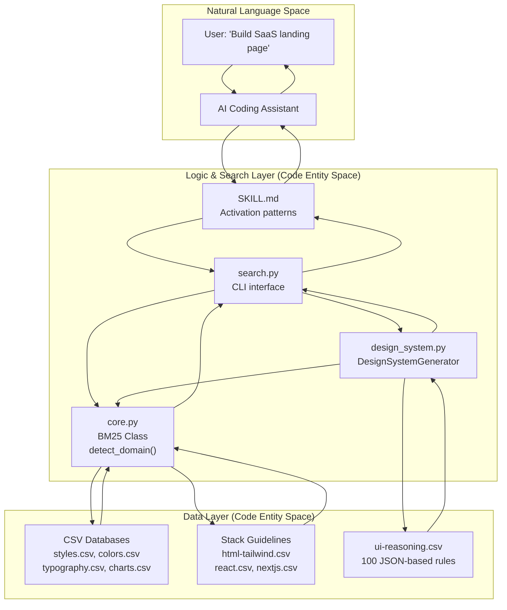
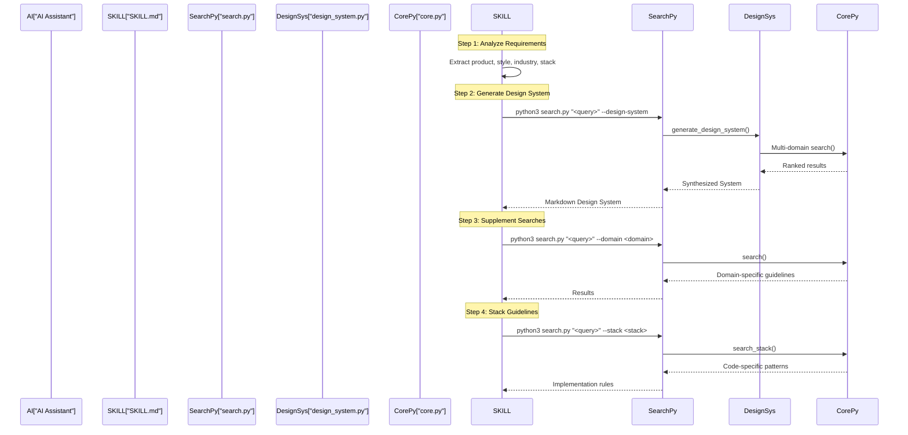

# UI/UX Pro Max Skill

<details>
<summary>Relevant source files</summary>

The following files were used as context for generating this wiki page:

- [.claude/skills/ui-ux-pro-max/SKILL.md](.claude/skills/ui-ux-pro-max/SKILL.md)
- [.claude/skills/ui-ux-pro-max/data/react-performance.csv](.claude/skills/ui-ux-pro-max/data/react-performance.csv)
- [CLAUDE.md](CLAUDE.md)
- [src/ui-ux-pro-max/data/google-fonts.csv](src/ui-ux-pro-max/data/google-fonts.csv)

</details>


## Purpose and Overview

The UI/UX Pro Max Skill provides AI coding assistants with design intelligence through a searchable database of 344+ design resources spanning UI styles, color palettes, typography, UX guidelines, and technology-specific best practices. The skill activates automatically or via commands when users request UI/UX work, guiding the AI through a systematic 4-step workflow to generate consistent, professional designs.

**Core Capabilities:**

| Resource Type | Count | Examples |
|---------------|-------|----------|
| UI Styles | 67 | Glassmorphism, Minimalism, Brutalism, AI-Native UI |
| Color Palettes | 161 | Industry-specific palettes for SaaS, E-commerce, Healthcare, Fintech |
| Font Pairings | 57 | Google Fonts combinations with mood/style keywords |
| Chart Types | 25 | Trend, comparison, funnel, heatmap with library recommendations |
| Tech Stacks | 16 | React, Next.js, Vue, Svelte, SwiftUI, Flutter, Tailwind, shadcn/ui |
| UX Guidelines | 99 | Accessibility, performance, responsive design best practices |
| Reasoning Rules | 100 | Industry-specific design system generation rules |

The skill operates across 18+ AI platforms including Claude Code, Cursor, Windsurf, Trae, and others. For detailed workflow steps, see [Skill Workflow](#3.1). For search domains and technology stacks, see [Search Domains and Stacks](#3.2). For quality validation, see [Pre-Delivery Checklist](#3.3).

**Sources:** [CLAUDE.md:5-28](), [.claude/skills/ui-ux-pro-max/SKILL.md:1-8](), [README.md:144-152](), [README.md:122-142]()

## Skill Architecture

The skill system bridges natural language requests to structured code entities through a search and reasoning engine.

### System Flow Diagram



**Component Responsibilities:**

| Component | File | Key Functions/Classes | Purpose |
|-----------|------|----------------------|---------|
| **Skill Definition** | `SKILL.md` | Frontmatter metadata | Defines activation and guides AI through the design process [SKILL.md:1-4]() |
| **CLI Interface** | `scripts/search.py` | `main()` | Entry point for domain/stack searches and design system generation [scripts/search.py:1-100]() |
| **Search Engine** | `scripts/core.py` | `BM25` class, `search()` | Implements probabilistic ranking (k1=1.5, b=0.75) [scripts/core.py:96-156]() |
| **Design Gen** | `scripts/design_system.py` | `generate_design_system()` | Synthesizes multi-domain data into a cohesive spec [scripts/design_system.py:1-200]() |
| **Data Repos** | `data/*.csv` | `CSV_CONFIG`, `STACK_CONFIG` | Mapped data for 10 domains and 16 stacks [scripts/core.py:17-84]() |

**Sources:** [CLAUDE.md:30-58](), [.claude/skills/ui-ux-pro-max/SKILL.md:1-8](), [src/ui-ux-pro-max/scripts/core.py:17-156]()

## How the Skill Activates

The skill supports two activation paradigms across 18 supported AI platforms:

**Skill Mode** - Auto-activates when AI detects UI/UX keywords:
- Platforms: Claude Code, Cursor, Windsurf, Augment, Trae, OpenCode, Continue, etc.
- Full content installation with complete knowledge base.
- Detection: "Build landing page", "Design dashboard", "Create UI component".

**Workflow Mode** - Requires explicit slash command or manual invocation:
- Platforms: Kiro, GitHub Copilot, Roo Code.
- Reference content installation with lighter context window usage.

The activation mechanism is defined in `SKILL.md` frontmatter metadata:

```markdown
---
name: ui-ux-pro-max
description: "UI/UX design intelligence... Actions: plan, build, create, design... Styles: glassmorphism, minimalism..."
---
```

**Activation Triggers:**

| Trigger Type | Examples | Result |
|--------------|----------|--------|
| **Action Verbs** | plan, build, create, design, implement, review, fix, improve | Skill activates and begins workflow |
| **Project Types** | website, landing page, dashboard, admin panel, SaaS, mobile app | Informs product type detection |
| **UI Elements** | button, modal, navbar, sidebar, card, table, form, chart | Guides component-level searches |

For detailed platform-specific integration mechanisms, see page 7.

**Sources:** [.claude/skills/ui-ux-pro-max/SKILL.md:1-4](), [README.md:312-333]()

## Skill Workflow Overview

When activated, the skill guides AI assistants through a systematic 4-step process.

### Workflow Execution Flow



| Step | Purpose | Search Command |
|------|---------|----------------|
| **1. Analyze** | Extract product type, style, industry, and stack | N/A |
| **2. Generate** | Create a comprehensive design system spec | `--design-system -p "Project"` |
| **3. Supplement** | Get additional domain-specific details (e.g., charts, ux) | `--domain <domain>` |
| **4. Stack** | Get implementation best practices for the tech stack | `--stack <stack>` |

For detailed workflow instructions, see [Skill Workflow](#3.1). For search domain and stack options, see [Search Domains and Stacks](#3.2).

**Sources:** [.claude/skills/ui-ux-pro-max/SKILL.md:122-228](), [README.md:88-119]()

## Search Engine and BM25 Implementation

The skill uses a BM25 probabilistic ranking algorithm implemented in `core.py` to score document relevance.

**BM25 Parameters:**

| Parameter | Value | Purpose |
|-----------|-------|---------|
| `k1` | 1.5 | Term frequency saturation parameter [scripts/core.py:102]() |
| `b` | 0.75 | Document length normalization factor [scripts/core.py:103]() |

**Key Search Logic:**

1.  **Tokenization**: `BM25.tokenize()` filters words with length > 2 and removes punctuation [scripts/core.py:109-112]().
2.  **Domain Detection**: `detect_domain()` uses keyword scoring to route queries to the correct CSV file [scripts/core.py:190-209]().
3.  **Scoring**: `BM25.score()` calculates TF-IDF scores across the corpus [scripts/core.py:133-155]().

**Sources:** [src/ui-ux-pro-max/scripts/core.py:96-254](), [CLAUDE.md:60]()

## Pre-Delivery Checklist

After implementation, the skill applies a quality assurance checklist to ensure the UI meets professional standards. This includes:

- **Accessibility**: Contrast ratios (4.5:1), ARIA labels, and keyboard navigation [SKILL.md:54]().
- **Performance**: WebP/AVIF usage, lazy loading, and CLS optimization [SKILL.md:56]().
- **Interaction**: Touch target sizes (44px), loading feedback, and hover states [SKILL.md:55]().
- **Visuals**: Avoiding emoji icons, consistent spacing, and light/dark mode support [SKILL.md:57]().

For the complete quality validation process, see [Pre-Delivery Checklist](#3.3).

**Sources:** [.claude/skills/ui-ux-pro-max/SKILL.md:52-63](), [.claude/skills/ui-ux-pro-max/SKILL.md:243-279]()
