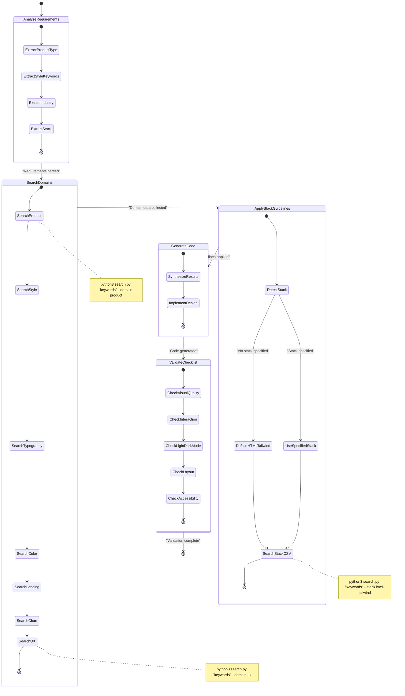
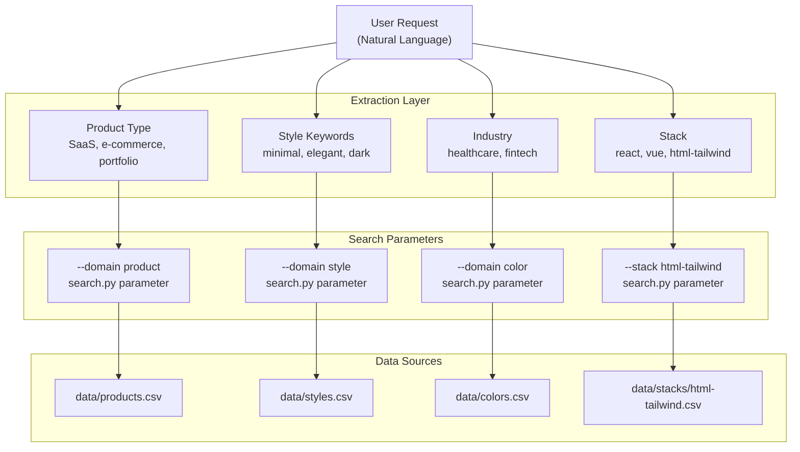
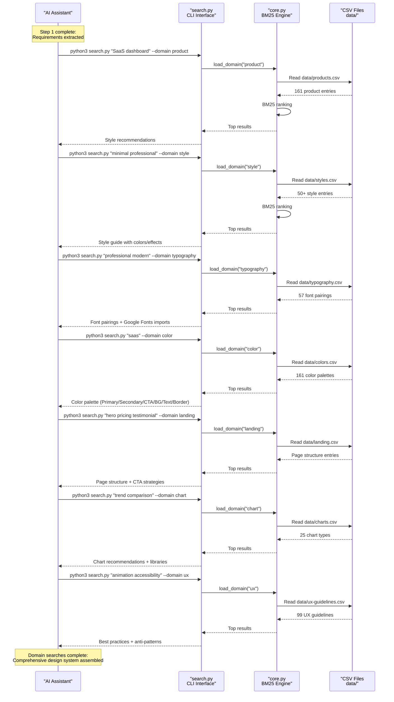
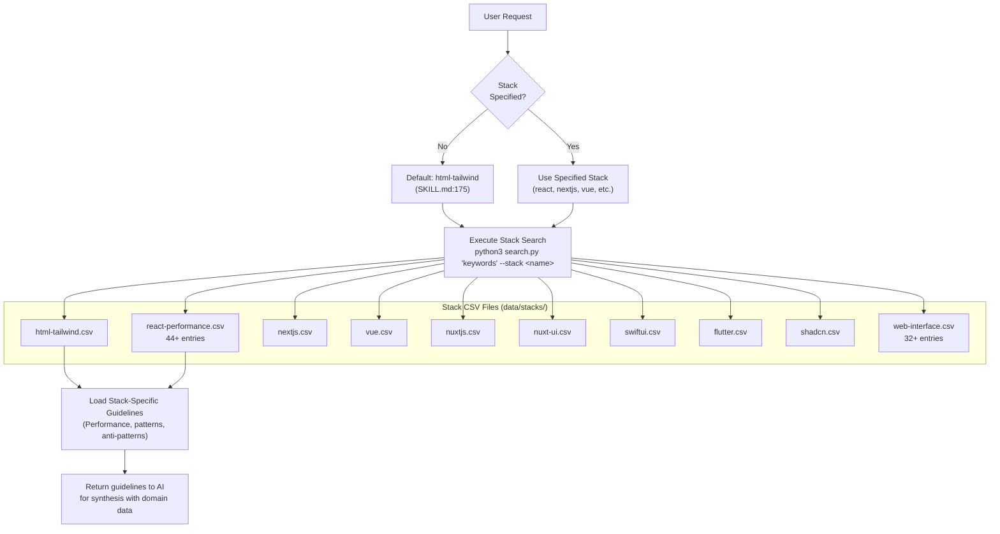
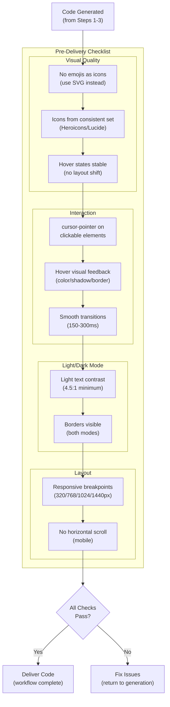

# Skill Workflow

<details>
<summary>Relevant source files</summary>

The following files were used as context for generating this wiki page:

- [.claude/skills/ui-ux-pro-max/SKILL.md](.claude/skills/ui-ux-pro-max/SKILL.md)
- [.claude/skills/ui-ux-pro-max/data/react-performance.csv](.claude/skills/ui-ux-pro-max/data/react-performance.csv)
- [CLAUDE.md](CLAUDE.md)
- [src/ui-ux-pro-max/data/google-fonts.csv](src/ui-ux-pro-max/data/google-fonts.csv)

</details>


This document describes the 4-step workflow defined in `SKILL.md` that AI coding assistants follow when handling UI/UX requests. The workflow orchestrates searches across design domains, applies stack-specific guidelines, and validates output quality before delivery.

## Overview

The skill workflow is a structured process that ensures AI assistants gather comprehensive design intelligence before generating UI/UX code. The workflow consists of four mandatory steps:

1.  **Analyze Requirements** - Extract product type, style keywords, industry, and technology stack.
2.  **Search Domains** - Query multiple design domains using `search.py`.
3.  **Apply Stack Guidelines** - Retrieve technology-specific best practices.
4.  **Validate with Pre-Delivery Checklist** - Verify code meets quality standards across 5 categories.

The workflow is defined in [.claude/skills/ui-ux-pro-max/SKILL.md:144-242]() and synchronized across all AI platform integrations. Each step produces inputs for the next, creating a dependency chain that builds a complete design system before code generation begins.

Sources: [.claude/skills/ui-ux-pro-max/SKILL.md:144-242](), [CLAUDE.md:7-29]()

## Workflow Execution Flow

**Workflow State Machine**



This state machine represents the execution flow defined in [.claude/skills/ui-ux-pro-max/SKILL.md:144-316](). Each state transition requires completion of the previous step. The workflow enforces sequential execution to ensure comprehensive design intelligence gathering before code generation.

Sources: [.claude/skills/ui-ux-pro-max/SKILL.md:144-242]()

## Step 1: Analyze Requirements

**Requirement Extraction Process**

The first step extracts key information from user requests using natural language understanding. The AI assistant parses the request to identify four critical attributes defined in [.claude/skills/ui-ux-pro-max/SKILL.md:146-152]():

| Attribute | Purpose | Examples | Used In |
|-----------|---------|----------|---------|
| **Product type** | Determines style recommendations and color palettes | SaaS, e-commerce, portfolio, dashboard, landing page | `--domain product`, `--domain color` |
| **Style keywords** | Identifies UI style and visual effects | minimal, playful, professional, elegant, dark mode | `--domain style` |
| **Industry** | Influences color scheme and UX patterns | healthcare, fintech, gaming, education, beauty | `--domain color`, `--domain ux` |
| **Stack** | Selects technology-specific guidelines | React, Vue, Next.js, html-tailwind (default) | `--stack <name>` |

**Requirement to Search Parameter Mapping**



The extraction logic is implicit in the workflow instructions. If no stack is specified, the default is `html-tailwind` as enforced in [.claude/skills/ui-ux-pro-max/SKILL.md:173-179]().

Sources: [.claude/skills/ui-ux-pro-max/SKILL.md:146-152](), [CLAUDE.md:16-28]()

## Step 2: Search Relevant Domains

**Domain Search Orchestration**

Step 2 performs multiple searches using `search.py` to gather comprehensive design intelligence. The workflow defines a recommended search order in [.claude/skills/ui-ux-pro-max/SKILL.md:162-171]():



**Domain to CSV File Mapping**

The domain flag maps to specific CSV files via the `search.py` logic:

| Domain Flag | CSV File | Data Type | Entry Count |
|-------------|----------|-----------|-------------|
| `product` | `data/products.csv` | Product type recommendations | 161 |
| `style` | `data/styles.csv` | UI styles with colors/effects | 50+ |
| `typography` | `data/typography.csv` | Font pairings with Google Fonts | 57 |
| `color` | `data/colors.csv` | Color palettes by product/industry | 161 |
| `landing` | `data/landing.csv` | Page structures and CTA strategies | ~30 |
| `chart` | `data/charts.csv` | Chart types and library recommendations | 25 |
| `ux` | `data/ux-guidelines.csv` | Best practices and anti-patterns | 99 |

The workflow encourages multiple searches with different keywords as stated in [.claude/skills/ui-ux-pro-max/SKILL.md:156](): "Search until you have enough context."

Sources: [.claude/skills/ui-ux-pro-max/SKILL.md:154-171](), [CLAUDE.md:15-23]()

## Step 3: Apply Stack Guidelines

**Stack Detection and Selection**

Step 3 retrieves technology-specific best practices using the `--stack` flag. The workflow enforces a default stack in [.claude/skills/ui-ux-pro-max/SKILL.md:173-181]():



**Available Technology Stacks**

The stack options are documented in [.claude/skills/ui-ux-pro-max/SKILL.md:204-215]():

| Stack Name | CSV File | Focus Areas |
|------------|----------|-------------|
| `html-tailwind` | `data/stacks/html-tailwind.csv` | Tailwind utilities, responsive design, accessibility (DEFAULT) |
| `react` | `data/stacks/react-performance.csv` | State, hooks, performance patterns |
| `nextjs` | `data/stacks/nextjs.csv` | SSR, routing, images, API routes |
| `vue` | `data/stacks/vue.csv` | Composition API, Pinia, Vue Router |
| `swiftui` | `data/stacks/swiftui.csv` | Views, State, Navigation, Animation |
| `react-native` | `data/stacks/react-native.csv` | Components, Navigation, Lists |
| `flutter` | `data/stacks/flutter.csv` | Widgets, State, Layout, Theming |
| `shadcn` | `data/stacks/shadcn.csv` | shadcn/ui components, theming, forms |

**React Performance Guidelines Example**

The `react-performance.csv` file ([.claude/skills/ui-ux-pro-max/data/react-performance.csv:1-46]()) contains 44+ performance issues across categories:

- **Async Waterfall**: Sequential awaits, `Promise.all` parallelization.
- **Bundle Size**: Barrel imports, dynamic imports, conditional loading.
- **Server**: `React.cache` dedup, LRU caching, RSC boundaries.
- **Rerender**: State dependencies, memo patterns, transitions.

**Web Interface Guidelines Example**

The `web-interface.csv` file ([.claude/skills/ui-ux-pro-max/data/web-interface.csv:1-32]()) contains 32+ cross-platform web guidelines:

- **Accessibility**: Icon button labels, form control labels, keyboard handlers.
- **Forms**: Autocomplete attributes, semantic input types, paste blocking.
- **Performance**: List virtualization, layout reads, DOM batching.

Sources: [.claude/skills/ui-ux-pro-max/SKILL.md:173-215](), [.claude/skills/ui-ux-pro-max/data/react-performance.csv:1-46](), [.claude/skills/ui-ux-pro-max/data/web-interface.csv:1-32]()

## Step 4: Validate with Pre-Delivery Checklist

**Quality Validation Process**

The final step validates generated code against a comprehensive checklist defined in [.claude/skills/ui-ux-pro-max/SKILL.md:303-337]().



**Common Rules for Professional UI**

The workflow defines common rules for frequently overlooked issues in [.claude/skills/ui-ux-pro-max/SKILL.md:264-301]():

| Category | Rule | Do | Don't |
|----------|------|----|----- |
| **Icons** | No emoji icons | Use SVG icons (Heroicons, Lucide) | Use emojis 🎨 🚀 ⚙️ as UI icons |
| **Icons** | Stable hover states | Use color/opacity transitions | Use scale transforms that shift layout |
| **Interaction** | Cursor pointer | Add `cursor-pointer` to clickable cards | Leave default cursor |
| **Light/Dark** | Text contrast | Use slate-900 for text in light mode | Use slate-400 for body text |
| **Layout** | Floating navbar | Add `top-4 left-4 right-4` spacing | Stick navbar to `top-0` |

Sources: [.claude/skills/ui-ux-pro-max/SKILL.md:264-337]()

## Practical Workflow Example

**Complete Workflow Execution**

The `SKILL.md` includes a concrete example in [.claude/skills/ui-ux-pro-max/SKILL.md:218-249]():

**User Request:** "Làm landing page cho dịch vụ chăm sóc da chuyên nghiệp"

**Step 1: Analyze Requirements**
- **Product type**: Service (beauty/spa/wellness)
- **Style keywords**: elegant, minimal, soft
- **Industry**: Beauty/skincare
- **Stack**: Not specified → default to `html-tailwind`

**Step 2: Search Relevant Domains**

```bash
# 1. Product type recommendations
python3 src/ui-ux-pro-max/scripts/search.py "beauty spa wellness service" --domain product

# 2. Style guide based on industry
python3 src/ui-ux-pro-max/scripts/search.py "elegant minimal soft" --domain style

# 3. Font pairings for luxury aesthetic
python3 src/ui-ux-pro-max/scripts/search.py "elegant luxury" --domain typography

# 4. Color palette for beauty industry
python3 src/ui-ux-pro-max/scripts/search.py "beauty spa wellness" --domain color
```

**Step 3: Stack Guidelines (Default)**

```bash
# 5. HTML/Tailwind best practices
python3 src/ui-ux-pro-max/scripts/search.py "layout responsive" --stack html-tailwind
```

**Step 4: Synthesize and Validate**
- Combine all search results into a cohesive design system.
- Implement landing page with selected styles, colors, and typography.
- Validate against pre-delivery checklist (21 checks).

Sources: [.claude/skills/ui-ux-pro-max/SKILL.md:218-249](), [CLAUDE.md:11-28]()

## Workflow Rule Prioritization

**Priority-Based Rule Application**

The workflow includes a priority system in [.claude/skills/ui-ux-pro-max/SKILL.md:52-63]() that helps AI assistants triage design decisions:

| Priority | Category | Impact Level | Domain | Key Checks |
|----------|----------|--------------|--------|------------|
| 1 | Accessibility | CRITICAL | `ux` | Contrast 4.5:1, Keyboard nav |
| 2 | Touch & Interaction | CRITICAL | `ux` | Min size 44×44px, Loading feedback |
| 3 | Performance | HIGH | `ux` | WebP/AVIF, Lazy loading |
| 4 | Style Selection | HIGH | `style` | Match product type, SVG icons |
| 5 | Layout & Responsive | HIGH | `ux` | Mobile-first, No horizontal scroll |
| 6 | Typography & Color | MEDIUM | `typography` | Base 16px, Semantic tokens |

This priority system ensures critical accessibility and interaction issues are addressed before lower-priority styling concerns.

Sources: [.claude/skills/ui-ux-pro-max/SKILL.md:52-63]()
