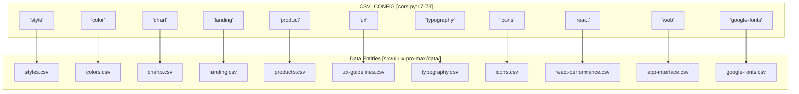
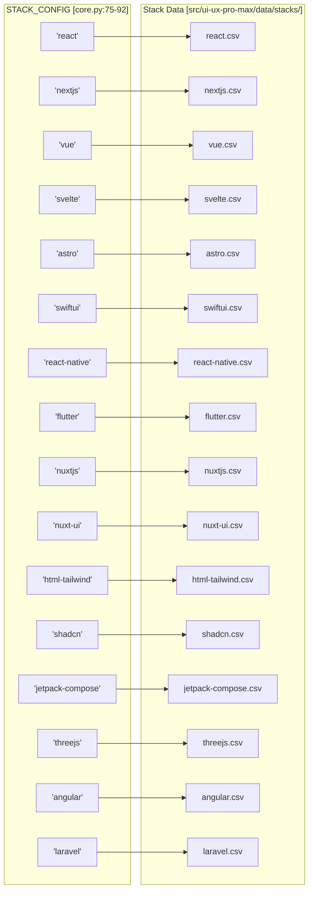

# Search Domains and Stacks

Relevant source files

The following files were used as context for generating this wiki page:

- [.claude/skills/ui-ux-pro-max/scripts/core.py](.claude/skills/ui-ux-pro-max/scripts/core.py)
- [.claude/skills/ui-ux-pro-max/scripts/search.py](.claude/skills/ui-ux-pro-max/scripts/search.py)
- [cli/assets/data/stacks/threejs.csv](cli/assets/data/stacks/threejs.csv)
- [cli/assets/scripts/search.py](cli/assets/scripts/search.py)
- [src/ui-ux-pro-max/data/stacks/angular.csv](src/ui-ux-pro-max/data/stacks/angular.csv)
- [src/ui-ux-pro-max/data/stacks/astro.csv](src/ui-ux-pro-max/data/stacks/astro.csv)
- [src/ui-ux-pro-max/data/stacks/flutter.csv](src/ui-ux-pro-max/data/stacks/flutter.csv)
- [src/ui-ux-pro-max/data/stacks/html-tailwind.csv](src/ui-ux-pro-max/data/stacks/html-tailwind.csv)
- [src/ui-ux-pro-max/data/stacks/jetpack-compose.csv](src/ui-ux-pro-max/data/stacks/jetpack-compose.csv)
- [src/ui-ux-pro-max/data/stacks/laravel.csv](src/ui-ux-pro-max/data/stacks/laravel.csv)
- [src/ui-ux-pro-max/data/stacks/nextjs.csv](src/ui-ux-pro-max/data/stacks/nextjs.csv)
- [src/ui-ux-pro-max/data/stacks/nuxt-ui.csv](src/ui-ux-pro-max/data/stacks/nuxt-ui.csv)
- [src/ui-ux-pro-max/data/stacks/nuxtjs.csv](src/ui-ux-pro-max/data/stacks/nuxtjs.csv)
- [src/ui-ux-pro-max/data/stacks/react.csv](src/ui-ux-pro-max/data/stacks/react.csv)
- [src/ui-ux-pro-max/data/stacks/shadcn.csv](src/ui-ux-pro-max/data/stacks/shadcn.csv)
- [src/ui-ux-pro-max/data/stacks/svelte.csv](src/ui-ux-pro-max/data/stacks/svelte.csv)
- [src/ui-ux-pro-max/data/stacks/swiftui.csv](src/ui-ux-pro-max/data/stacks/swiftui.csv)
- [src/ui-ux-pro-max/data/stacks/threejs.csv](src/ui-ux-pro-max/data/stacks/threejs.csv)
- [src/ui-ux-pro-max/data/stacks/vue.csv](src/ui-ux-pro-max/data/stacks/vue.csv)
- [src/ui-ux-pro-max/scripts/core.py](src/ui-ux-pro-max/scripts/core.py)
- [src/ui-ux-pro-max/scripts/search.py](src/ui-ux-pro-max/scripts/search.py)

This document catalogs the 10 search domains and 16 technology stacks supported by the UI/UX Pro Max search engine as of v2.5.0. Each domain provides access to specialized design knowledge stored in CSV databases, while stacks deliver implementation-specific guidelines for different frameworks and platforms.

**Sources:** [src/ui-ux-pro-max/scripts/core.py:17-73](), [src/ui-ux-pro-max/scripts/core.py:75-92]()

---

## Search Domains

Search domains partition the knowledge base into specialized categories, each backed by a dedicated CSV file. The `CSV_CONFIG` dictionary in `core.py` maps domain identifiers to file paths, search columns (used for BM25 indexing), and output columns (returned in results).

**Sources:** [src/ui-ux-pro-max/scripts/core.py:17-73]()

### Domain Configuration Architecture

The following diagram illustrates how the `CSV_CONFIG` dictionary structures the relationship between domain identifiers and their underlying data entities.

**Search Domain Mapping**

**Sources:** [src/ui-ux-pro-max/scripts/core.py:17-73]()

---

## Domain Catalog

| Domain | File | Search Columns (`search_cols`) | Purpose |
| :--- | :--- | :--- | :--- |
| `style` | `styles.csv` | Style Category, Keywords, Best For, Type, AI Prompt Keywords | Visual UI styles (glassmorphism, etc.) |
| `color` | `colors.csv` | Product Type, Notes | Product-specific hex color palettes |
| `chart` | `charts.csv` | Data Type, Keywords, Best Chart Type, When to Use | Data visualization selection |
| `landing` | `landing.csv` | Pattern Name, Keywords, Conversion Optimization, Section Order | Landing page structure patterns |
| `product` | `products.csv` | Product Type, Keywords, Primary Style Recommendation | Industry-specific design mapping |
| `ux` | `ux-guidelines.csv` | Category, Issue, Description, Platform | UX best practices and anti-patterns |
| `typography` | `typography.csv` | Font Pairing Name, Category, Mood, Heading Font, Body Font | Font pairing recommendations |
| `icons` | `icons.csv` | Category, Icon Name, Keywords, Best For | Lucide icon library mapping |
| `react` | `react-performance.csv` | Category, Issue, Keywords, Description | React/Next.js specific optimizations |
| `web` | `app-interface.csv` | Category, Issue, Keywords, Description | General web interface accessibility |
| `google-fonts` | `google-fonts.csv` | Family, Category, Stroke, Classifications, Keywords | Detailed font metadata |

**Sources:** [src/ui-ux-pro-max/scripts/core.py:17-73]()

---

## Technology Stacks

Technology stacks provide implementation-specific guidelines for 16 frameworks and platforms. Unlike domains, stacks use a uniform column structure defined by `_STACK_COLS` in `core.py`.

**Sources:** [src/ui-ux-pro-max/scripts/core.py:75-98]()

### Stack Implementation Mapping

This diagram maps the stack identifiers used in `STACK_CONFIG` to their specific CSV data sources.

**Technology Stack Mapping**

**Sources:** [src/ui-ux-pro-max/scripts/core.py:75-92]()

---

## Stack Guidelines Structure

Every stack CSV follows a strict schema defined in `_STACK_COLS` [src/ui-ux-pro-max/scripts/core.py:95-98](). This ensures that the `search_stack` function [src/ui-ux-pro-max/scripts/core.py:234-253]() can process any stack query uniformly.

### Common Search Columns
- `Category`: The functional area (e.g., "State", "Routing", "Performance").
- `Guideline`: The core rule or best practice.
- `Description`: Detailed technical explanation.
- `Do`: Recommended implementation.
- `Don't`: Anti-pattern to avoid.

### Common Output Columns
In addition to search columns, results include:
- `Code Good`: A snippet showing the correct implementation [src/ui-ux-pro-max/data/stacks/shadcn.csv:2]().
- `Code Bad`: A snippet showing the incorrect implementation [src/ui-ux-pro-max/data/stacks/flutter.csv:4]().
- `Severity`: Impact level (Low, Medium, High) [src/ui-ux-pro-max/data/stacks/angular.csv:3]().
- `Docs URL`: Reference to official documentation [src/ui-ux-pro-max/data/stacks/laravel.csv:2]().

**Sources:** [src/ui-ux-pro-max/scripts/core.py:95-98](), [src/ui-ux-pro-max/data/stacks/shadcn.csv:1-10](), [src/ui-ux-pro-max/data/stacks/flutter.csv:1-10]()

---

## Search Implementation

The `search.py` script acts as the primary entry point for querying these domains and stacks.

### Domain Search Flow
1. User provides a query via CLI [src/ui-ux-pro-max/scripts/search.py:58]().
2. The `search()` function in `core.py` is called [src/ui-ux-pro-max/scripts/search.py:109]().
3. If no domain is specified, `detect_domain()` uses keyword matching to select the best domain [src/ui-ux-pro-max/scripts/core.py:214-216]().
4. The `BM25` algorithm ranks CSV rows based on the `search_cols` [src/ui-ux-pro-max/scripts/core.py:104-162]().

### Stack Search Flow
1. User provides a query and an explicit `--stack` flag [src/ui-ux-pro-max/scripts/search.py:60]().
2. The `search_stack()` function is called [src/ui-ux-pro-max/scripts/search.py:101]().
3. It bypasses domain detection and queries the specific stack CSV file using `_STACK_COLS` [src/ui-ux-pro-max/scripts/core.py:234-253]().

**Sources:** [src/ui-ux-pro-max/scripts/search.py:56-115](), [src/ui-ux-pro-max/scripts/core.py:212-253]()
