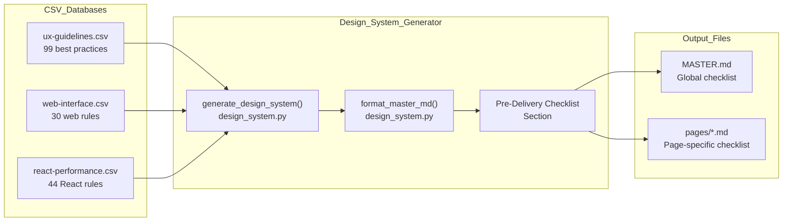
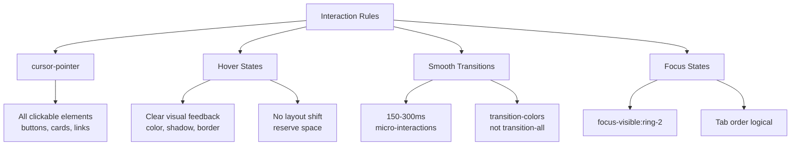
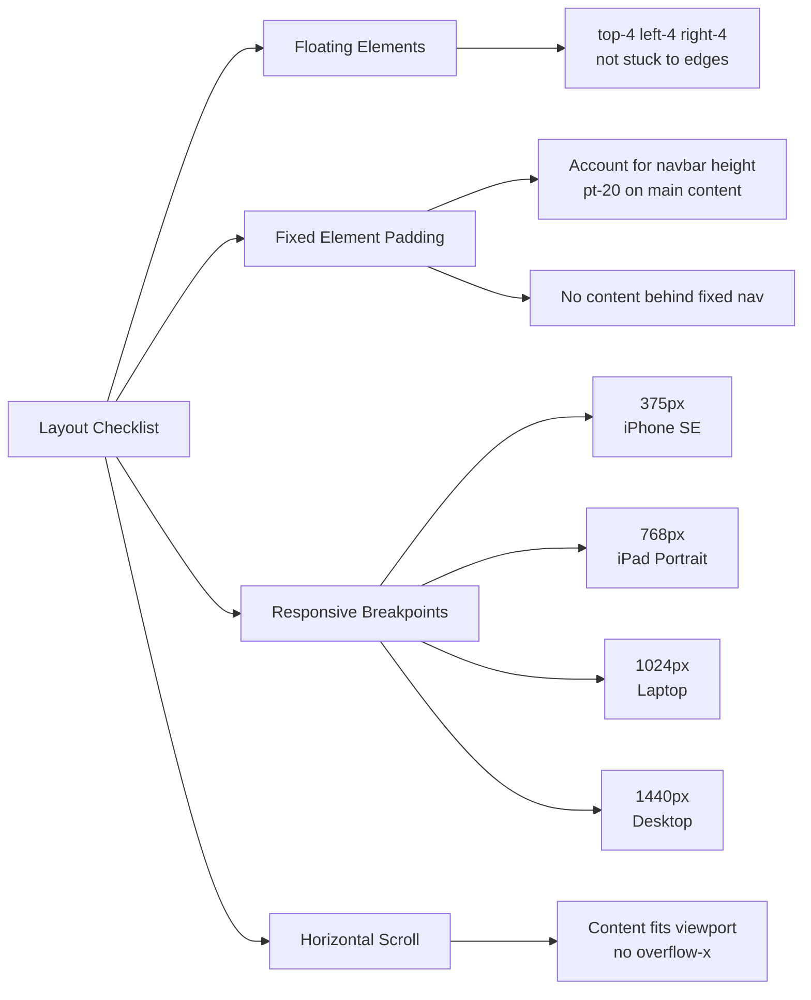
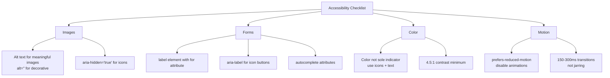
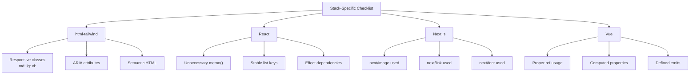
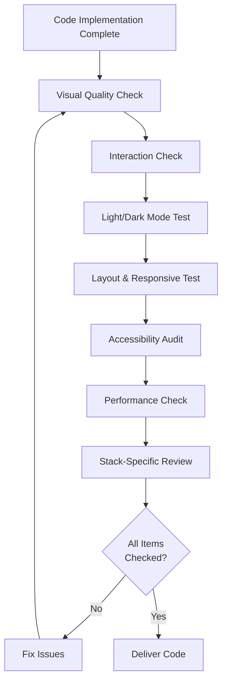

# Pre-Delivery Checklist

Relevant source files

The following files were used as context for generating this wiki page:

- [.claude/skills/ui-ux-pro-max/SKILL.md](.claude/skills/ui-ux-pro-max/SKILL.md)
- [.claude/skills/ui-ux-pro-max/data/react-performance.csv](.claude/skills/ui-ux-pro-max/data/react-performance.csv)
- [src/ui-ux-pro-max/data/google-fonts.csv](src/ui-ux-pro-max/data/google-fonts.csv)

The Pre-Delivery Checklist is a quality assurance verification system that ensures UI/UX deliverables meet professional standards before shipping. This checklist is automatically generated as part of the design system output and covers critical areas including accessibility, interaction design, visual consistency, and responsive behavior.

For information about the design system generation that produces this checklist, see [Design System Generator](#6). For stack-specific implementation guidelines, see [Stack-Specific Guidelines](#4.3).

## Purpose and Scope

The checklist serves three primary functions:

1.  **Automated Quality Gate** - Included in every `--design-system` output to remind developers of common issues.
2.  **Context-Aware Rules** - Filters checklist items based on product type and style selection.
3.  **Severity Prioritization** - Organizes items by impact (Critical → High → Medium → Low).

The checklist draws rules from multiple CSV databases and consolidates them into actionable verification steps. It does not replace manual testing but provides a systematic framework for catching the most common UI/UX defects.

Sources: [.claude/skills/ui-ux-pro-max/SKILL.md:10-25](), [.claude/skills/ui-ux-pro-max/SKILL.md:52-63]()

## Integration Architecture

The checklist is generated through a multi-stage pipeline that combines domain-specific rules with reasoning logic:

**Checklist Data Flow**

**Checklist Generation Flow:**

1.  `generate_design_system()` performs multi-domain searches including `ux` domain.
2.  `format_master_md()` consolidates results and adds the pre-delivery section.
3.  Output includes 7 standard categories with 20+ verification items.
4.  Page-specific overrides can add contextual checklist items.

Sources: [.claude/skills/ui-ux-pro-max/SKILL.md:48-63](), [.claude/skills/ui-ux-pro-max/SKILL.md:67-101]()

## Checklist Categories

The checklist organizes rules into seven priority-ordered categories. Each category targets specific quality dimensions:

**Category Hierarchy**

```mermaid
graph TB
    Checklist["Pre-Delivery Checklist"]
    
    Visual["Visual Quality<br/>No emojis, consistent icons"]
    Interaction["Interaction<br/>Cursor states, transitions"]
    LightDark["Light/Dark Mode<br/>Contrast, visibility"]
    Layout["Layout<br/>Spacing, responsive"]
    Accessibility["Accessibility<br/>WCAG AA compliance"]
    Performance["Performance<br/>Optimization checks"]
    Stack["Stack-Specific<br/>Framework rules"]
    
    Checklist --> Visual
    Checklist --> Interaction
    Checklist --> LightDark
    Checklist --> Layout
    Checklist --> Accessibility
    Checklist --> Performance
    Checklist --> Stack
    
    Visual --> Icons["SVG icons from Heroicons/Lucide"]
    Visual --> Logos["Verified brand logos"]
    Visual --> Hover["No layout-shift hover states"]
    
    Interaction --> Pointer["cursor-pointer on clickables"]
    Interaction --> Feedback["Visual hover feedback"]
    Interaction --> Transitions["150-300ms smooth transitions"]
    
    LightDark --> Contrast["4.5:1 minimum contrast"]
    LightDark --> Glass["Visible glass elements"]
    LightDark --> Borders["Visible borders both modes"]
    
    Layout --> Floating["Spacing from edges"]
    Layout --> Fixed["Content padding for fixed nav"]
    Layout --> Responsive["375px, 768px, 1024px, 1440px"]
    
    Accessibility --> Alt["Alt text for images"]
    Accessibility --> Labels["Form labels"]
    Accessibility --> Motion["prefers-reduced-motion"]
```

Sources: [.claude/skills/ui-ux-pro-max/SKILL.md:52-63](), [.claude/skills/ui-ux-pro-max/SKILL.md:67-101]()

## 1. Visual Quality

This category ensures professional visual appearance by preventing common amateur mistakes:

| Rule | Severity | CSV Source | Description |
| :--- | :--- | :--- | :--- |
| No emoji icons | Critical | `ux` | Emojis render inconsistently across platforms and lack semantic meaning. |
| Consistent icon set | High | `style` | All icons must come from a single library (Heroicons/Lucide). |
| Verified brand logos | Medium | `style` | Use official SVG from Simple Icons library. |
| No layout-shift hover | High | `ux` | Hover states must not cause content reflow. |
| Direct theme colors | Low | `color` | Use semantic tokens directly rather than raw hex. |

Sources: [.claude/skills/ui-ux-pro-max/SKILL.md:57-59]()

## 2. Interaction

Interaction rules ensure responsive, intuitive user experiences:

**Interaction Logic Space**

**Mapped to CSV Rules:**

| Checklist Item | CSV File | Priority | Severity |
| :--- | :--- | :--- | :--- |
| `cursor-pointer` | `ux` | 2 | Critical |
| Hover feedback | `ux` | 2 | Critical |
| Smooth transitions (150-300ms) | `ux` | 7 | Medium |
| Focus states visible | `ux` | 1 | Critical |

The checklist ensures developers implement visible focus rings for keyboard navigation, which is a WCAG 2.4.7 requirement.

Sources: [.claude/skills/ui-ux-pro-max/SKILL.md:55-60](), [.claude/skills/ui-ux-pro-max/SKILL.md:70-73]()

## 3. Light/Dark Mode Contrast

Light mode often receives less attention than dark mode, leading to insufficient contrast. This category enforces WCAG AA compliance in both modes:

| Rule | WCAG Level | Minimum Ratio | Context |
| :--- | :--- | :--- | :--- |
| Text contrast | AA | 4.5:1 | Normal text (< 18pt) |
| Large text contrast | AA | 3:1 | Large text (≥ 18pt or 14pt bold) |
| Glass element visibility | AA | 4.5:1 | Transparent containers |
| Border visibility | N/A | Perceptible | Both light and dark modes |

**Common Anti-Patterns:**

| Bad Practice | Good Practice | Rationale |
| :--- | :--- | :--- |
| `bg-white/10` in light mode | `bg-white/80` in light mode | Too transparent, insufficient contrast. |
| `text-gray-400` for body text | `text-slate-900` for body text | Fails 4.5:1 contrast requirement. |
| `border-white/10` in light | `border-gray-200` in light | Border invisible on white background. |

The contrast requirements map to `color-contrast` guidelines with a minimum 4.5:1 ratio for normal text.

Sources: [.claude/skills/ui-ux-pro-max/SKILL.md:54-59](), [.claude/skills/ui-ux-pro-max/SKILL.md:69-72]()

## 4. Layout and Responsive Design

Layout verification ensures content displays correctly across viewport sizes and accounts for fixed positioning:

**Layout Verification Flow**

**Breakpoint Standards:**

The checklist enforces specific breakpoints which align with standard device widths:

| Breakpoint | Width | Device |
| :--- | :--- | :--- |
| Mobile | 375px | iPhone SE |
| Tablet | 768px | iPad Portrait |
| Laptop | 1024px | MacBook |
| Desktop | 1440px | 1440p Display |

Sources: [.claude/skills/ui-ux-pro-max/SKILL.md:58-62](), [.claude/skills/ui-ux-pro-max/SKILL.md:92-99]()

## 5. Accessibility (WCAG AA)

Accessibility rules ensure compliance with WCAG 2.1 Level AA standards. These are non-negotiable for public-facing applications:

**Accessibility Logic Mapping**

**Skill Rule Mapping:**

| Checklist Item | Skill Key | Severity |
| :--- | :--- | :--- |
| Alt text | `alt-text` | Critical |
| Form labels | `form-labels` | Critical |
| Color not sole indicator | `color-not-only` | Critical |
| prefers-reduced-motion | `reduced-motion` | Critical |

Sources: [.claude/skills/ui-ux-pro-max/SKILL.md:67-82]()

## 6. Performance Considerations

Performance impacts perceived quality. The checklist includes high-impact performance items:

| Category | Rule | Severity |
| :--- | :--- | :--- |
| Async Waterfall | Parallelize independent fetches | Critical |
| Bundle Size | Direct path imports (avoid barrels) | Critical |
| Rerender | Memoize expensive components | Medium |
| Server | Use `React.cache()` for deduplication | Medium |

**React Performance Checklist (Sample):**

- [ ] Independent async operations use `Promise.all()`
- [ ] Large components lazy-loaded via `next/dynamic`
- [ ] Primitive dependencies used in `useEffect` arrays
- [ ] Heavy bundles preloaded on hover/focus intent

Sources: [.claude/skills/ui-ux-pro-max/data/react-performance.csv:2-15](), [.claude/skills/ui-ux-pro-max/SKILL.md:56]()

## 7. Stack-Specific Rules

The final checklist section includes framework-specific verification based on the detected or specified stack:

**Stack Verification Mapping**

**Example React-Specific Rules:**

- [ ] Avoid `const [user, posts] = await Promise.all([fetchUser(), fetchPosts()])` sequential awaits.
- [ ] Import directly from `lucide-react/dist/esm/icons/check` to avoid barrel loading.
- [ ] Use `cache()` for server-side request deduplication.

Sources: [.claude/skills/ui-ux-pro-max/data/react-performance.csv:3-12]()

## Verification Workflow

The checklist is designed for systematic verification before code delivery:

**QA Verification Cycle**

**Total Time:** ~85 minutes for comprehensive verification of a complex page.

Sources: [.claude/skills/ui-ux-pro-max/SKILL.md:12-24](), [.claude/skills/ui-ux-pro-max/SKILL.md:32-34]()
