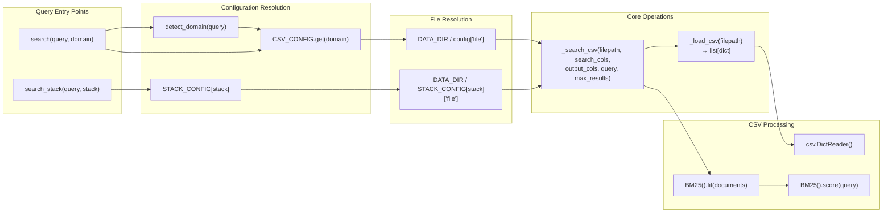

# Design Database

<details>
<summary>Relevant source files</summary>

The following files were used as context for generating this wiki page:

- [.claude/skills/ui-ux-pro-max/data/charts.csv](.claude/skills/ui-ux-pro-max/data/charts.csv)
- [.claude/skills/ui-ux-pro-max/data/colors.csv](.claude/skills/ui-ux-pro-max/data/colors.csv)
- [.claude/skills/ui-ux-pro-max/data/landing.csv](.claude/skills/ui-ux-pro-max/data/landing.csv)
- [.claude/skills/ui-ux-pro-max/data/products.csv](.claude/skills/ui-ux-pro-max/data/products.csv)
- [.claude/skills/ui-ux-pro-max/data/stacks/react-native.csv](.claude/skills/ui-ux-pro-max/data/stacks/react-native.csv)
- [.claude/skills/ui-ux-pro-max/data/styles.csv](.claude/skills/ui-ux-pro-max/data/styles.csv)
- [.claude/skills/ui-ux-pro-max/data/typography.csv](.claude/skills/ui-ux-pro-max/data/typography.csv)
- [.claude/skills/ui-ux-pro-max/data/ux-guidelines.csv](.claude/skills/ui-ux-pro-max/data/ux-guidelines.csv)
- [cli/assets/scripts/search.py](cli/assets/scripts/search.py)
- [src/ui-ux-pro-max/data/stacks/flutter.csv](src/ui-ux-pro-max/data/stacks/flutter.csv)
- [src/ui-ux-pro-max/data/stacks/jetpack-compose.csv](src/ui-ux-pro-max/data/stacks/jetpack-compose.csv)
- [src/ui-ux-pro-max/data/stacks/shadcn.csv](src/ui-ux-pro-max/data/stacks/shadcn.csv)
- [src/ui-ux-pro-max/scripts/core.py](src/ui-ux-pro-max/scripts/core.py)
- [src/ui-ux-pro-max/scripts/search.py](src/ui-ux-pro-max/scripts/search.py)

</details>


The Design Database is the knowledge repository that powers the UI/UX Pro Max search engine. It consists of a collection of CSV files containing 344+ curated design resources organized into 10 domain databases and 16 technology stack databases. Each database contains structured data with specific columns for BM25 search queries and formatted output.

For information about how these databases are queried, see [Search Engine](#5). For details about the configuration dictionaries that map domains to files and columns, see [CSV Data Structure](#4.1). For the reasoning rules that influence search behavior, see [Reasoning Rules](#4.2).

## Database Architecture

The database layer is organized into two parallel hierarchies: domain-specific databases for design knowledge and stack-specific databases for implementation guidelines. All databases are stored as CSV files in the `data/` directory and accessed through configuration dictionaries defined in `core.py`.

**Database Architecture Diagram**

```mermaid
graph TB
    subgraph "Configuration Layer"
        CSV_CONFIG["CSV_CONFIG dict<br/>(11 domain mappings)"]
        STACK_CONFIG["STACK_CONFIG dict<br/>(16 stack mappings)"]
        _STACK_COLS["_STACK_COLS dict<br/>(common stack columns)"]
    end
    
    subgraph "Domain Databases (data/)"
        styles["styles.csv<br/>UI styles"]
        colors["colors.csv<br/>Color palettes"]
        products["products.csv<br/>Product types"]
        typography["typography.csv<br/>Font pairings"]
        landing["landing.csv<br/>Landing patterns"]
        charts["charts.csv<br/>Chart types"]
        ux["ux-guidelines.csv<br/>UX guidelines"]
        icons["icons.csv<br/>Lucide icons"]
        react_perf["react-performance.csv<br/>React rules"]
        app_int["app-interface.csv<br/>Web interface rules"]
        gfonts["google-fonts.csv<br/>Google Fonts catalog"]
    end
    
    subgraph "Stack Databases (data/stacks/)"
        html_tw["html-tailwind.csv"]
        react_csv["react.csv"]
        nextjs["nextjs.csv"]
        astro["astro.csv"]
        vue["vue.csv"]
        nuxtjs["nuxtjs.csv"]
        nuxt_ui["nuxt-ui.csv"]
        svelte["svelte.csv"]
        swiftui["swiftui.csv"]
        react_native["react-native.csv"]
        flutter["flutter.csv"]
        shadcn["shadcn.csv"]
        jetpack["jetpack-compose.csv"]
        threejs["threejs.csv"]
        angular["angular.csv"]
        laravel["laravel.csv"]
    end
    
    subgraph "Access Layer"
        search_func["search() function"]
        search_stack_func["search_stack() function"]
        _search_csv["_search_csv() helper"]
        _load_csv["_load_csv() helper"]
    end
    
    CSV_CONFIG --> styles
    CSV_CONFIG --> colors
    CSV_CONFIG --> products
    CSV_CONFIG --> typography
    CSV_CONFIG --> landing
    CSV_CONFIG --> charts
    CSV_CONFIG --> ux
    CSV_CONFIG --> icons
    CSV_CONFIG --> react_perf
    CSV_CONFIG --> app_int
    CSV_CONFIG --> gfonts
    
    STACK_CONFIG --> html_tw
    STACK_CONFIG --> react_csv
    STACK_CONFIG --> nextjs
    STACK_CONFIG --> astro
    STACK_CONFIG --> vue
    STACK_CONFIG --> nuxtjs
    STACK_CONFIG --> nuxt_ui
    STACK_CONFIG --> svelte
    STACK_CONFIG --> swiftui
    STACK_CONFIG --> react_native
    STACK_CONFIG --> flutter
    STACK_CONFIG --> shadcn
    STACK_CONFIG --> jetpack
    STACK_CONFIG --> threejs
    STACK_CONFIG --> angular
    STACK_CONFIG --> laravel
    
    _STACK_COLS --> STACK_CONFIG
    
    search_func --> CSV_CONFIG
    search_stack_func --> STACK_CONFIG
    search_func --> _search_csv
    search_stack_func --> _search_csv
    _search_csv --> _load_csv
```



Sources: [src/ui-ux-pro-max/scripts/core.py:17-92]()

## Domain Databases

Domain databases contain design knowledge organized by subject matter. Each domain has a dedicated CSV file with specific columns for search operations and output formatting. The `CSV_CONFIG` dictionary maps domain names to file paths and column configurations.

**Domain Database Configuration**

| Domain | File | Search Columns | Purpose |
|--------|------|----------------|---------|
| `style` | `styles.csv` | Style Category, Keywords, Best For, Type, AI Prompt Keywords | UI styles with colors, effects, and implementation details |
| `color` | `colors.csv` | Product Type, Notes | Color palettes mapped to product categories |
| `chart` | `charts.csv` | Data Type, Keywords, Best Chart Type, When to Use, When NOT to Use, Accessibility Notes | Chart type recommendations by data type |
| `landing` | `landing.csv` | Pattern Name, Keywords, Conversion Optimization, Section Order | Landing page patterns with CTA strategies |
| `product` | `products.csv` | Product Type, Keywords, Primary Style Recommendation, Key Considerations | Product type recommendations with style mappings |
| `ux` | `ux-guidelines.csv` | Category, Issue, Description, Platform | UX best practices and anti-patterns |
| `typography` | `typography.csv` | Font Pairing Name, Category, Mood/Style Keywords, Best For, Heading Font, Body Font | Google Fonts pairings with import code |
| `icons` | `icons.csv` | Category, Icon Name, Keywords, Best For | Lucide icon catalog with import code |
| `react` | `react-performance.csv` | Category, Issue, Keywords, Description | React/Next.js performance optimization rules |
| `web` | `app-interface.csv` | Category, Issue, Keywords, Description | Web interface accessibility and standards |
| `google-fonts` | `google-fonts.csv` | Family, Category, Stroke, Classifications, Keywords, Subsets, Designers | Comprehensive Google Fonts catalog |

Sources: [src/ui-ux-pro-max/scripts/core.py:17-73]()

### Domain Database Column Structure

Each domain database defines two sets of columns:

1. **search_cols**: Columns concatenated for BM25 full-text search.
2. **output_cols**: Columns returned in search results.

Example from `styles.csv`:

```python
"style": {
    "file": "styles.csv",
    "search_cols": ["Style Category", "Keywords", "Best For", "Type", "AI Prompt Keywords"],
    "output_cols": ["Style Category", "Type", "Keywords", "Primary Colors", "Effects & Animation", "Best For", "Light Mode ✓", "Dark Mode ✓", "Performance", "Accessibility", "Framework Compatibility", "Complexity", "AI Prompt Keywords", "CSS/Technical Keywords", "Implementation Checklist", "Design System Variables"]
}
```

This separation allows searching on a subset of columns while returning comprehensive information in results. The BM25 algorithm builds its index from search columns only, optimizing query performance. For details on the data mapping, see [CSV Data Structure](#4.1).

Sources: [src/ui-ux-pro-max/scripts/core.py:18-22]()

## Stack Databases

Stack databases contain technology-specific implementation guidelines. All 16 stack databases share a common column structure defined in `_STACK_COLS`, ensuring consistent query patterns across different technology stacks.

**Stack Database Configuration**

| Stack | File | Technology |
|-------|------|------------|
| `html-tailwind` | `stacks/html-tailwind.csv` | HTML + Tailwind CSS |
| `react` | `stacks/react.csv` | React |
| `nextjs` | `stacks/nextjs.csv` | Next.js |
| `astro` | `stacks/astro.csv` | Astro |
| `vue` | `stacks/vue.csv` | Vue.js |
| `nuxtjs` | `stacks/nuxtjs.csv` | Nuxt.js |
| `nuxt-ui` | `stacks/nuxt-ui.csv` | Nuxt UI |
| `svelte` | `stacks/svelte.csv` | Svelte/SvelteKit |
| `swiftui` | `stacks/swiftui.csv` | SwiftUI (iOS) |
| `react-native` | `stacks/react-native.csv` | React Native |
| `flutter` | `stacks/flutter.csv` | Flutter (Dart) |
| `shadcn` | `stacks/shadcn.csv` | shadcn/ui |
| `jetpack-compose` | `stacks/jetpack-compose.csv` | Jetpack Compose (Android) |
| `threejs` | `stacks/threejs.csv` | Three.js (3D Web) |
| `angular` | `stacks/angular.csv` | Angular |
| `laravel` | `stacks/laravel.csv` | Laravel (PHP) |

Sources: [src/ui-ux-pro-max/scripts/core.py:75-92]()

### Unified Stack Column Structure

Unlike domain databases, all stack databases use identical column definitions stored in `_STACK_COLS`:

```python
_STACK_COLS = {
    "search_cols": ["Category", "Guideline", "Description", "Do", "Don't"],
    "output_cols": ["Category", "Guideline", "Description", "Do", "Don't", "Code Good", "Code Bad", "Severity", "Docs URL"]
}
```

This standardization enables the `search_stack()` function to operate uniformly across all technology stacks without per-stack configuration. For detailed guideline definitions, see [Stack-Specific Guidelines](#4.3).

Sources: [src/ui-ux-pro-max/scripts/core.py:95-98]()

## File Organization and Data Directory

All database files are located relative to the `DATA_DIR` constant, which resolves to the `data/` directory adjacent to the `scripts/` directory:

```python
DATA_DIR = Path(__file__).parent.parent / "data"
```

**Directory Structure**

```
src/ui-ux-pro-max/data/
├── styles.csv
├── colors.csv
├── products.csv
├── typography.csv
├── landing.csv
├── charts.csv
├── ux-guidelines.csv
├── icons.csv
├── react-performance.csv
├── app-interface.csv
├── google-fonts.csv
├── ui-reasoning.csv (see section 4.2)
└── stacks/
    ├── react.csv
    ├── nextjs.csv
    ├── ... (14 other stack files)
```

Sources: [src/ui-ux-pro-max/scripts/core.py:14]()

## Data Loading and Access Patterns

**Data Access Flow**



Sources: [src/ui-ux-pro-max/scripts/core.py:104-188]()

### CSV Loading and Search Implementation

The `_load_csv()` helper function loads a CSV file and returns it as a list of dictionaries. The core search logic is handled by `_search_csv()`, which builds a BM25 index from the `search_cols` and returns the top matches filtered by `output_cols`.

```python
def _search_csv(filepath, search_cols, output_cols, query, max_results):
    """Core search function using BM25"""
    if not filepath.exists():
        return []
    
    data = _load_csv(filepath)
    # Build documents from search columns
    documents = [" ".join(str(row.get(col, "")) for col in search_cols) for row in data]
    
    bm25 = BM25()
    bm25.fit(documents)
    ranked = bm25.score(query)
    
    results = []
    for idx, score in ranked[:max_results]:
        if score > 0:
            row = data[idx]
            results.append({col: row.get(col, "") for col in output_cols if col in row})
    return results
```

Sources: [src/ui-ux-pro-max/scripts/core.py:159-188]()

## Example Database Records

### Stack Database Sample (shadcn.csv)

Stack databases include severity ratings and code examples to guide AI implementation:

| No | Category | Guideline | Description | Do | Don't | Severity |
|----|----------|-----------|-------------|----|-------|----------|
| 4 | Theming | Use CSS variables for colors | Define colors as CSS variables in globals.css | CSS variables in :root and .dark | Hardcoded color values | High |
| 16 | Form | Use Form with react-hook-form | Integrate Form component with react-hook-form | useForm + Form + FormField pattern | Custom form handling without Form | High |

Sources: [src/ui-ux-pro-max/data/stacks/shadcn.csv:5-17]()

### UX Guidelines Sample (ux-guidelines.csv)

The `ux-guidelines.csv` file provides platform-specific best practices:

| No | Category | Issue | Platform | Description | Do | Don't | Severity |
|----|----------|-------|----------|-------------|----|-------|----------|
| 1 | Navigation | Smooth Scroll | Web | Anchor links should scroll smoothly | Use scroll-behavior: smooth | Jump directly without transition | High |
| 22 | Touch | Touch Target Size | Mobile | Small buttons are hard to tap | Minimum 44x44px touch targets | Tiny clickable areas | High |

Sources: [src/ui-ux-pro-max/data/ux-guidelines.csv:2-23]()

## Performance Characteristics

- **Query Latency**: Typically 50-150ms. The BM25 index is built fresh for each query (stateless).
- **Memory Footprint**: < 2MB per query. Data is loaded and released per search operation.
- **Search Logic**: Tokenizes query and corpus, calculates IDF, and ranks by BM25 score.

Sources: [src/ui-ux-pro-max/scripts/core.py:104-156]()
