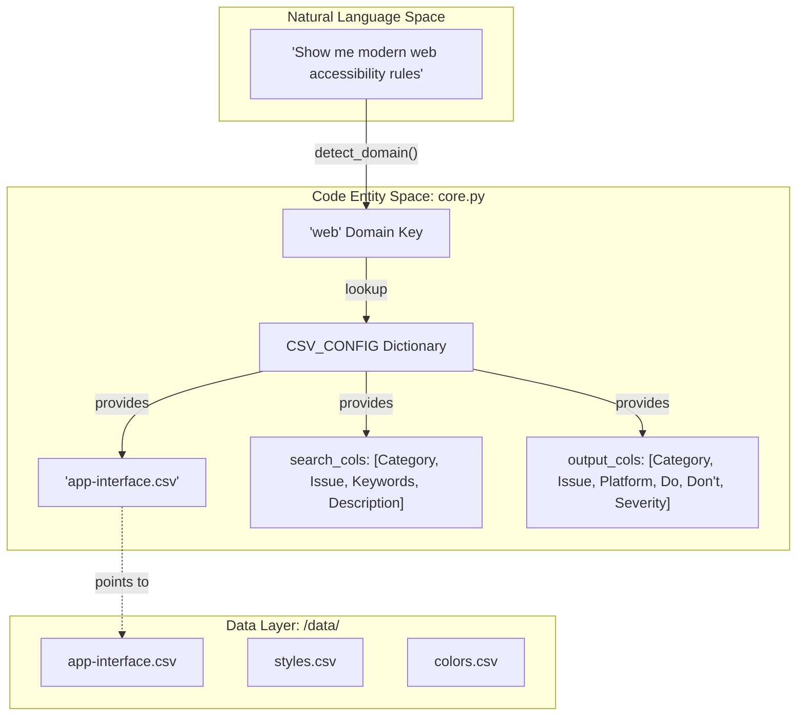
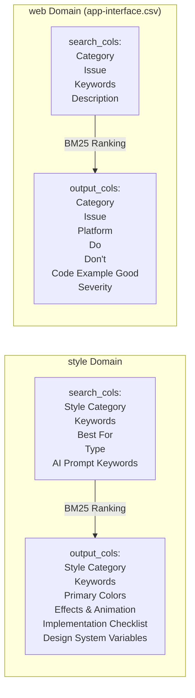
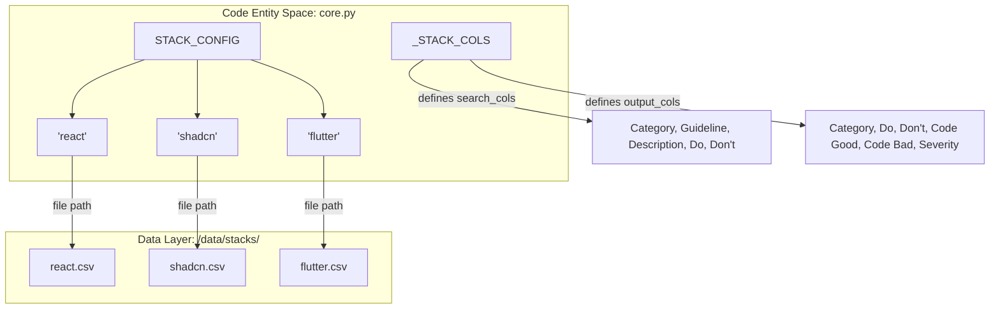

# CSV Data Structure

<details>
<summary>Relevant source files</summary>

The following files were used as context for generating this wiki page:

- [.claude/skills/ui-ux-pro-max/data/charts.csv](.claude/skills/ui-ux-pro-max/data/charts.csv)
- [.claude/skills/ui-ux-pro-max/data/colors.csv](.claude/skills/ui-ux-pro-max/data/colors.csv)
- [.claude/skills/ui-ux-pro-max/data/landing.csv](.claude/skills/ui-ux-pro-max/data/landing.csv)
- [.claude/skills/ui-ux-pro-max/data/products.csv](.claude/skills/ui-ux-pro-max/data/products.csv)
- [.claude/skills/ui-ux-pro-max/data/stacks/react-native.csv](.claude/skills/ui-ux-pro-max/data/stacks/react-native.csv)
- [.claude/skills/ui-ux-pro-max/data/styles.csv](.claude/skills/ui-ux-pro-max/data/styles.csv)
- [.claude/skills/ui-ux-pro-max/data/typography.csv](.claude/skills/ui-ux-pro-max/data/typography.csv)
- [.claude/skills/ui-ux-pro-max/data/ux-guidelines.csv](.claude/skills/ui-ux-pro-max/data/ux-guidelines.csv)
- [cli/assets/scripts/search.py](cli/assets/scripts/search.py)
- [src/ui-ux-pro-max/data/colors.csv](src/ui-ux-pro-max/data/colors.csv)
- [src/ui-ux-pro-max/data/icons.csv](src/ui-ux-pro-max/data/icons.csv)
- [src/ui-ux-pro-max/data/products.csv](src/ui-ux-pro-max/data/products.csv)
- [src/ui-ux-pro-max/data/stacks/flutter.csv](src/ui-ux-pro-max/data/stacks/flutter.csv)
- [src/ui-ux-pro-max/data/stacks/jetpack-compose.csv](src/ui-ux-pro-max/data/stacks/jetpack-compose.csv)
- [src/ui-ux-pro-max/data/stacks/shadcn.csv](src/ui-ux-pro-max/data/stacks/shadcn.csv)
- [src/ui-ux-pro-max/scripts/core.py](src/ui-ux-pro-max/scripts/core.py)
- [src/ui-ux-pro-max/scripts/search.py](src/ui-ux-pro-max/scripts/search.py)

</details>


## Purpose and Scope

This document describes the configuration dictionaries (`CSV_CONFIG` and `STACK_CONFIG`) that define the search interface for the CSV-based design knowledge base. These dictionaries map search domains and technology stacks to their corresponding CSV files and specify which columns to search and return. 

The system supports 11 primary design domains and 16 technology stacks, utilizing a BM25-based search engine to retrieve the most relevant design patterns, accessibility rules, and code snippets.

**Sources:** [src/ui-ux-pro-max/scripts/core.py:1-92]()

---

## Configuration System Overview

The search engine uses two primary configuration dictionaries located in `core.py`:

1. **`CSV_CONFIG`**: Maps design domains (e.g., `style`, `color`, `web`) to CSV files with customized search and output column sets.
2. **`STACK_CONFIG`**: Maps 16 technology stacks (e.g., `react`, `shadcn`, `flutter`) to CSV files located in the `stacks/` directory.
3. **`_STACK_COLS`**: Defines a common column structure used across all technology stack files to ensure consistent output formatting.

These configurations serve as the interface between user queries and the CSV data layer, determining which files to load and which fields to index for the BM25 algorithm.

**Sources:** [src/ui-ux-pro-max/scripts/core.py:17-98]()

---

## Domain Configuration Architecture

### CSV_CONFIG Structure

The following diagram illustrates how `CSV_CONFIG` maps natural language domains to specific code entities and data files.

"Natural Language Domain to Code Entity Mapping"


**Sources:** [src/ui-ux-pro-max/scripts/core.py:17-73](), [src/ui-ux-pro-max/scripts/search.py:108-114]()

---

## Domain-to-File Mappings

The `CSV_CONFIG` dictionary maps each domain key to a configuration object containing `file`, `search_cols`, and `output_cols`.

### Complete Domain Registry

| Domain Key | CSV File | Primary Use Case |
|------------|----------|------------------|
| `style` | `styles.csv` | UI styles, effects, and AI prompt keywords. |
| `color` | `colors.csv` | Color palettes (Primary, Secondary, Accent) by product type. |
| `chart` | `charts.csv` | Data visualization types, accessibility notes, and libraries. |
| `landing` | `landing.csv` | Landing page patterns and conversion optimization. |
| `product` | `products.csv` | Style recommendations for specific product categories. |
| `ux` | `ux-guidelines.csv` | General UX best practices (Do/Don't). |
| `typography` | `typography.csv` | Font pairings with Google Fonts and Tailwind config. |
| `icons` | `icons.csv` | Icon library references and import code. |
| `react` | `react-performance.csv` | React-specific performance and issue resolution. |
| `web` | `app-interface.csv` | Web interface accessibility and UI patterns. |
| `google-fonts`| `google-fonts.csv` | Detailed font metadata, subsets, and designers. |

**Sources:** [src/ui-ux-pro-max/scripts/core.py:17-73]()

---

## Column Specification Schema

Each domain configuration specifies two column lists that control BM25 search behavior:

### search_cols (Input Columns)
Columns concatenated into a single searchable document for BM25 ranking. These determine what content is indexed and matched against user queries.

### output_cols (Output Columns)
Columns returned in search results. These provide comprehensive information to the user after matching.

### Domain-Specific Column Configurations

"Search vs Output Column Flow"


**Sources:** [src/ui-ux-pro-max/scripts/core.py:18-22](), [src/ui-ux-pro-max/scripts/core.py:63-67]()

---

## Stack Configuration Architecture

### STACK_CONFIG Structure

The `STACK_CONFIG` dictionary maps 16 technology stacks to their CSV files in the `stacks/` subdirectory. Unlike domain configurations, all stacks share a common column schema defined in `_STACK_COLS`.

"Stack Configuration to Data File Mapping"


**Sources:** [src/ui-ux-pro-max/scripts/core.py:75-98]()

---

## Complete Stack Registry

The following 16 stacks are supported in `STACK_CONFIG`:

| Stack Key | CSV File Path |
|-----------|---------------|
| `react` | `stacks/react.csv` |
| `nextjs` | `stacks/nextjs.csv` |
| `vue` | `stacks/vue.csv` |
| `svelte` | `stacks/svelte.csv` |
| `astro` | `stacks/astro.csv` |
| `swiftui` | `stacks/swiftui.csv` |
| `react-native` | `stacks/react-native.csv` |
| `flutter` | `stacks/flutter.csv` |
| `nuxtjs` | `stacks/nuxtjs.csv` |
| `nuxt-ui` | `stacks/nuxt-ui.csv` |
| `html-tailwind` | `stacks/html-tailwind.csv` |
| `shadcn` | `stacks/shadcn.csv` |
| `jetpack-compose` | `stacks/jetpack-compose.csv` |
| `threejs` | `stacks/threejs.csv` |
| `angular` | `stacks/angular.csv` |
| `laravel` | `stacks/laravel.csv` |

**Sources:** [src/ui-ux-pro-max/scripts/core.py:75-92]()

---

## Standardized Stack Column Schema

All stack configurations use the `_STACK_COLS` schema for consistency:

```python
_STACK_COLS = {
    "search_cols": ["Category", "Guideline", "Description", "Do", "Don't"],
    "output_cols": ["Category", "Guideline", "Description", "Do", "Don't", "Code Good", "Code Bad", "Severity", "Docs URL"]
}
```

### Column Definitions

| Column | Role | Purpose |
|--------|------|---------|
| `Category` | Search/Output | High-level grouping (e.g., "Theming", "Components", "Layout"). |
| `Guideline` | Search/Output | The specific rule or best practice title. |
| `Do` / `Don't` | Search/Output | Actionable instructions for the developer. |
| `Code Good` | Output | Reference implementation snippet. |
| `Code Bad` | Output | Example of an anti-pattern. |
| `Severity` | Output | Impact rating: Low, Medium, High, or Critical. |

**Sources:** [src/ui-ux-pro-max/scripts/core.py:95-98](), [src/ui-ux-pro-max/data/stacks/shadcn.csv:1-5]()

---

## Implementation Details

### Data Loading and Path Resolution

The `DATA_DIR` constant defines the base path for all CSV files. `search_stack` and `search` functions resolve the absolute path by joining `DATA_DIR` with the `file` string found in the configurations.

```python
DATA_DIR = Path(__file__).parent.parent / "data"
# ...
filepath = DATA_DIR / STACK_CONFIG[stack]["file"]
```

**Sources:** [src/ui-ux-pro-max/scripts/core.py:14](), [src/ui-ux-pro-max/scripts/core.py:239]()

### Output Formatting

The `format_output` function in `search.py` processes the raw dictionary results from the CSV. It truncates values longer than 300 characters to ensure the output remains token-optimized for AI assistant context windows.

```python
def format_output(result):
    # ...
    for key, value in row.items():
        value_str = str(value)
        if len(value_str) > 300:
            value_str = value_str[:300] + "..."
        output.append(f"- **{key}:** {value_str}")
```

**Sources:** [src/ui-ux-pro-max/scripts/search.py:30-53]()
