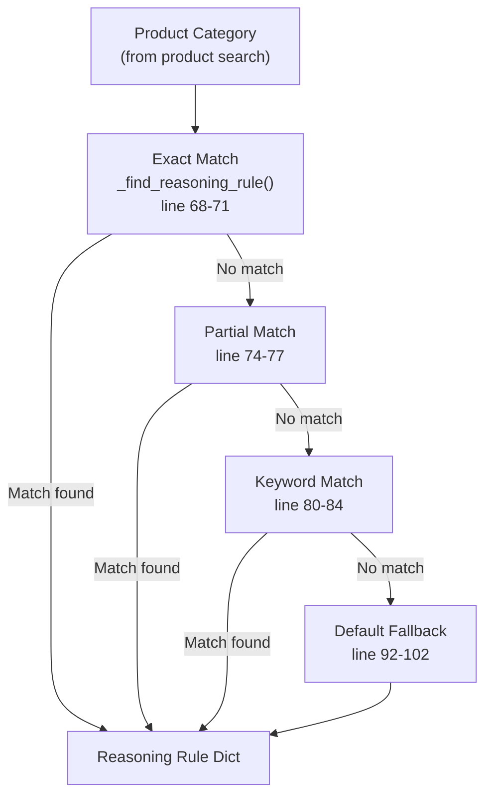
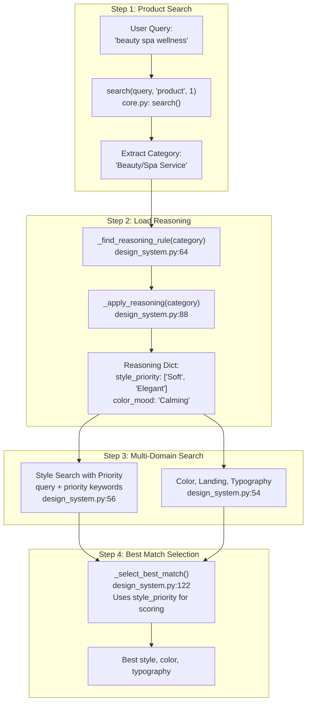
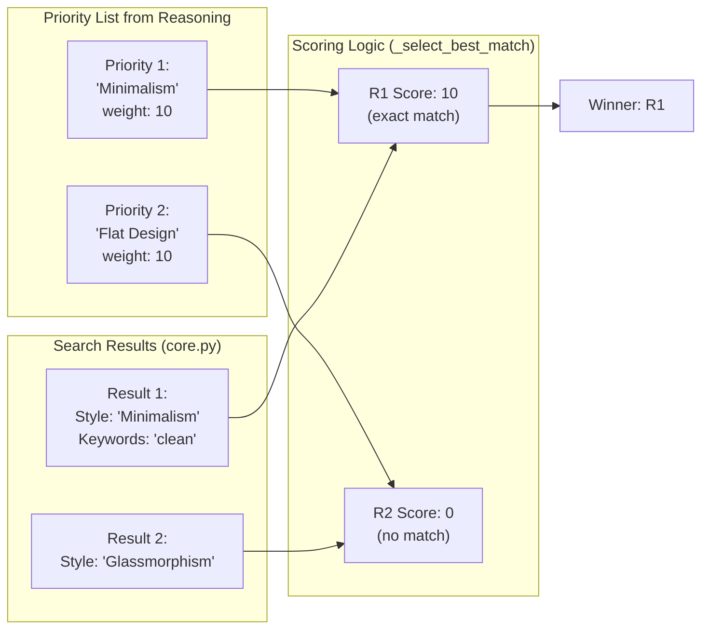

# Reasoning Rules

<details>
<summary>Relevant source files</summary>

The following files were used as context for generating this wiki page:

- [.claude/skills/ui-ux-pro-max/data/ui-reasoning.csv](.claude/skills/ui-ux-pro-max/data/ui-reasoning.csv)
- [cli/assets/scripts/search.py](cli/assets/scripts/search.py)
- [src/ui-ux-pro-max/data/stacks/flutter.csv](src/ui-ux-pro-max/data/stacks/flutter.csv)
- [src/ui-ux-pro-max/data/stacks/jetpack-compose.csv](src/ui-ux-pro-max/data/stacks/jetpack-compose.csv)
- [src/ui-ux-pro-max/data/stacks/shadcn.csv](src/ui-ux-pro-max/data/stacks/shadcn.csv)
- [src/ui-ux-pro-max/scripts/core.py](src/ui-ux-pro-max/scripts/core.py)
- [src/ui-ux-pro-max/scripts/search.py](src/ui-ux-pro-max/scripts/search.py)

</details>


## Purpose and Scope

Reasoning rules provide intelligent mapping between product categories and design recommendations. The rules system consists of 100 JSON-based decision rules stored in `ui-reasoning.csv` that map product types to recommended styles, color moods, typography moods, layout patterns, visual effects, and anti-patterns. This enables the design system generator to make context-aware recommendations rather than generic suggestions.

For information about the broader design system generation pipeline, see [Design System Generator](#6). For details about the search engine that executes queries before reasoning is applied, see [Search Engine](#5).

**Sources:** [src/ui-ux-pro-max/scripts/design_system.py:1-26]()

---

## CSV File Structure

The reasoning rules are stored in `data/ui-reasoning.csv` as a CSV file with the following columns:

| Column | Type | Description | Example |
|--------|------|-------------|---------|
| `UI_Category` | String | Product category name | "SaaS (General)", "Fintech/Crypto" |
| `Recommended_Pattern` | String | Landing page pattern name | "Hero + Features + CTA", "Data-Dense Dashboard" |
| `Style_Priority` | String (delimiter: `+`) | Ordered list of style preferences | "Glassmorphism + Flat Design" |
| `Color_Mood` | String | Color palette mood descriptor | "Trust blue + Accent contrast" |
| `Typography_Mood` | String | Typography mood descriptor | "Professional + Hierarchy" |
| `Key_Effects` | String | Recommended visual effects | "Subtle hover (200-250ms)" |
| `Decision_Rules` | JSON String | Structured decision logic | `{"if_ux_focused": "prioritize-minimalism"}` |
| `Anti_Patterns` | String (delimiter: `+`) | Design patterns to avoid | "Excessive animation + Dark mode by default" |
| `Severity` | Enum | Rule enforcement level | "LOW", "MEDIUM", "HIGH" |

**Sources:** [.claude/skills/ui-ux-pro-max/data/ui-reasoning.csv:1-21](), [src/ui-ux-pro-max/scripts/design_system.py:43-49]()

---

## Rule Matching Algorithm

The reasoning system uses a three-tier matching strategy within the `DesignSystemGenerator` class to find the most relevant rule for a given product category.

### Diagram: Rule Matching Strategy



**Sources:** [src/ui-ux-pro-max/scripts/design_system.py:64-86]()

### Matching Tiers

**Tier 1: Exact Match** ([src/ui-ux-pro-max/scripts/design_system.py:68-71]())
```python
# Case-insensitive exact match
if rule.get("UI_Category", "").lower() == category_lower:
    return rule
```

**Tier 2: Partial Match** ([src/ui-ux-pro-max/scripts/design_system.py:74-77]())
```python
# Bidirectional substring match
if ui_cat in category_lower or category_lower in ui_cat:
    return rule
```

**Tier 3: Keyword Match** ([src/ui-ux-pro-max/scripts/design_system.py:80-84]())
```python
# Tokenize category and check for any keyword overlap
keywords = ui_cat.replace("/", " ").replace("-", " ").split()
if any(kw in category_lower for kw in keywords):
    return rule
```

**Tier 4: Default Fallback** ([src/ui-ux-pro-max/scripts/design_system.py:92-102]())
Returns a generic rule with "Hero + Features + CTA" and "Minimalism" if no specific match is found.

**Sources:** [src/ui-ux-pro-max/scripts/design_system.py:64-102]()

---

## Rule Application Pipeline

Reasoning rules are applied during the `generate_design_system` execution to influence multi-domain searches and result selection.

### Diagram: Reasoning Integration in Design System Generation



**Sources:** [src/ui-ux-pro-max/scripts/design_system.py:163-190](), [src/ui-ux-pro-max/scripts/core.py:180-205]()

### Pipeline Stages

**Stage 1: Category Identification** ([src/ui-ux-pro-max/scripts/design_system.py:165-170]())
- Executes product domain search via `core.search` with `max_results=1`.
- Extracts `Product Type` field as the design category.

**Stage 2: Reasoning Rule Application** ([src/ui-ux-pro-max/scripts/design_system.py:172-174]())
- Calls `_apply_reasoning(category, {})`.
- Parses `Decision_Rules` JSON field and `Style_Priority` list.

**Stage 3: Priority-Guided Style Search** ([src/ui-ux-pro-max/scripts/design_system.py:56-59]())
- Combines user query with reasoning keywords to bias BM25.
- Example: `"fintech" + "Trust Authority"` → `"fintech Trust Authority"`.

**Stage 4: Best Match Selection** ([src/ui-ux-pro-max/scripts/design_system.py:122-157]())
- Scores results against `style_priority`.
- Exact style name match: +10 points.
- Keyword field match: +3 points.

**Sources:** [src/ui-ux-pro-max/scripts/design_system.py:51-62](), [src/ui-ux-pro-max/scripts/design_system.py:163-190]()

---

## Decision Rules JSON Format

The `Decision_Rules` column in `ui-reasoning.csv` contains JSON-encoded conditional logic.

### Parsing Logic

[src/ui-ux-pro-max/scripts/design_system.py:104-109]()

```python
decision_rules = {}
try:
    decision_rules = json.loads(rule.get("Decision_Rules", "{}"))
except json.JSONDecodeError:
    pass  # Empty dict if parsing fails
```

### Real-World Example

From row 2 of `ui-reasoning.csv`:
```json
{"if_ux_focused": "prioritize-minimalism", "if_data_heavy": "add-glassmorphism"}
```

While primarily for AI consumption and documentation generation, this structured data allows the system to adjust output severity and specific design constraints dynamically.

**Sources:** [.claude/skills/ui-ux-pro-max/data/ui-reasoning.csv:2](), [src/ui-ux-pro-max/scripts/design_system.py:104-109]()

---

## Style Priority System

The `style_priority` list ranks preferences using a delimiter-separated list (`+`).

### Diagram: Style Priority Scoring



**Sources:** [src/ui-ux-pro-max/scripts/design_system.py:122-157]()

### Scoring Algorithm

[src/ui-ux-pro-max/scripts/design_system.py:130-157]()

1.  **Exact Match**: If a priority keyword exactly matches the `Style Category` field, that result is immediately returned ([lines 131-136]()).
2.  **Weighted Scoring**: If no exact match, it iterates through results calculating a score:
    -   `Style Category` match: +10 points.
    -   `Keywords` field match: +3 points.
    -   General string match: +1 point.

**Sources:** [src/ui-ux-pro-max/scripts/design_system.py:122-157]()

---

## Anti-Patterns and Severity

Anti-patterns are design practices specifically forbidden for a category. They are rendered in the `MASTER.md` file during design system generation.

### Anti-Pattern Rendering

[src/ui-ux-pro-max/scripts/design_system.py:767-772]()

```python
if anti_patterns:
    anti_list = [a.strip() for a in anti_patterns.split("+")]
    for anti in anti_list:
        if anti:
            lines.append(f"- ❌ {anti}")
```

### Severity Levels

Reasoning rules define a `Severity` level (`LOW`, `MEDIUM`, `HIGH`) which influences the design system's tone and the strictness of the generated checklist.

**Example from CSV:**
- **Healthcare App**: Severity `HIGH` due to accessibility and ethical requirements ([line 9]()).
- **Educational App**: Severity `MEDIUM` ([line 10]()).

**Sources:** [.claude/skills/ui-ux-pro-max/data/ui-reasoning.csv:1-27](), [src/ui-ux-pro-max/scripts/design_system.py:767-781]()
