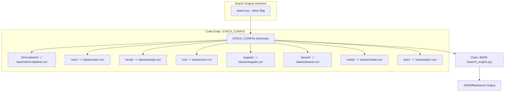
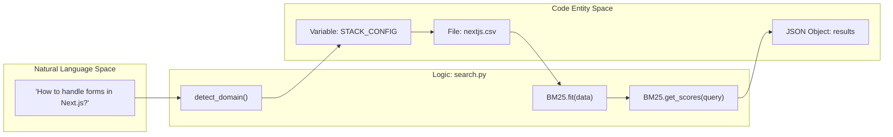

# Stack-Specific Guidelines

Relevant source files

The following files were used as context for generating this wiki page:

- [.claude/skills/ui-ux-pro-max/data/stacks/flutter.csv](.claude/skills/ui-ux-pro-max/data/stacks/flutter.csv)
- [.claude/skills/ui-ux-pro-max/data/stacks/html-tailwind.csv](.claude/skills/ui-ux-pro-max/data/stacks/html-tailwind.csv)
- [.claude/skills/ui-ux-pro-max/data/stacks/nextjs.csv](.claude/skills/ui-ux-pro-max/data/stacks/nextjs.csv)
- [.claude/skills/ui-ux-pro-max/data/stacks/react.csv](.claude/skills/ui-ux-pro-max/data/stacks/react.csv)
- [cli/assets/data/stacks/angular.csv](cli/assets/data/stacks/angular.csv)
- [cli/assets/data/stacks/laravel.csv](cli/assets/data/stacks/laravel.csv)
- [cli/assets/data/stacks/threejs.csv](cli/assets/data/stacks/threejs.csv)
- [src/ui-ux-pro-max/data/stacks/angular.csv](src/ui-ux-pro-max/data/stacks/angular.csv)
- [src/ui-ux-pro-max/data/stacks/astro.csv](src/ui-ux-pro-max/data/stacks/astro.csv)
- [src/ui-ux-pro-max/data/stacks/html-tailwind.csv](src/ui-ux-pro-max/data/stacks/html-tailwind.csv)
- [src/ui-ux-pro-max/data/stacks/laravel.csv](src/ui-ux-pro-max/data/stacks/laravel.csv)
- [src/ui-ux-pro-max/data/stacks/nextjs.csv](src/ui-ux-pro-max/data/stacks/nextjs.csv)
- [src/ui-ux-pro-max/data/stacks/nuxt-ui.csv](src/ui-ux-pro-max/data/stacks/nuxt-ui.csv)
- [src/ui-ux-pro-max/data/stacks/nuxtjs.csv](src/ui-ux-pro-max/data/stacks/nuxtjs.csv)
- [src/ui-ux-pro-max/data/stacks/react.csv](src/ui-ux-pro-max/data/stacks/react.csv)
- [src/ui-ux-pro-max/data/stacks/svelte.csv](src/ui-ux-pro-max/data/stacks/svelte.csv)
- [src/ui-ux-pro-max/data/stacks/swiftui.csv](src/ui-ux-pro-max/data/stacks/swiftui.csv)
- [src/ui-ux-pro-max/data/stacks/threejs.csv](src/ui-ux-pro-max/data/stacks/threejs.csv)
- [src/ui-ux-pro-max/data/stacks/vue.csv](src/ui-ux-pro-max/data/stacks/vue.csv)

This document details the technology stack-specific design and implementation guidelines that form part of the UI/UX Pro Max design database. Stack guidelines provide framework-specific best practices, anti-patterns, and code examples tailored to each supported technology stack. The system currently maintains guidelines for 16 technology stacks with detailed rule sets covering aspects like component structure, state management, styling patterns, and performance optimization.

For general UX best practices that apply across all stacks, see **3.3 Pre-Delivery Checklist**. For information on how these guidelines are retrieved via the search engine, see **5.2 search.py CLI Interface**.

## Overview and Purpose

Stack-specific guidelines serve three primary functions:

1.  **Framework-Specific Validation**: Provide technology-specific rules that catch common mistakes developers make when implementing UI designs in particular frameworks.
2.  **Best Practice Enforcement**: Encode expert knowledge about optimal patterns for each stack (e.g., Tailwind utility usage, React hooks patterns, Vue Composition API, Laravel Blade components).
3.  **Code Quality Standards**: Define "good" vs "bad" code examples with severity levels to prioritize fixes.

The guidelines are stored as CSV files in the `data/stacks/` directory and are queried by the search engine using the `--stack` flag. When no stack is specified, the system defaults to `html-tailwind`.

**Sources**: [.claude/skills/ui-ux-pro-max/SKILL.md:68-76](), [.claude/skills/ui-ux-pro-max/SKILL.md:96-107]()

## Supported Technology Stacks

The system supports 16 technology stacks as of version 2.5.0:

| Stack ID | Framework / Tech | Primary Focus Areas |
| :--- | :--- | :--- |
| `html-tailwind` | HTML + Tailwind CSS | Utility classes, responsive design, accessibility |
| `react` | React | State management, hooks, component patterns |
| `nextjs` | Next.js | SSR, App Router, Image optimization, Metadata |
| `vue` | Vue.js | Composition API, Pinia, Reactivity, Composables |
| `nuxtjs` | Nuxt.js | Auto-imports, Server engine, Data fetching |
| `svelte` | Svelte | Runes (v5), Stores, Actions, Transitions |
| `astro` | Astro | Islands architecture, Content collections, Zero-JS |
| `angular` | Angular | Signals, Standalone components, Typed forms |
| `laravel` | Laravel | Blade components, Livewire, Inertia.js |
| `swiftui` | SwiftUI | State/Binding, View composition, Modifiers |
| `flutter` | Flutter | Widgets, BLoC/Provider, Layout, Theming |
| `react-native` | React Native | Native components, Navigation, Performance |
| `threejs` | Three.js | Scene graph, Geometry, Materials, Shaders |
| `nuxt-ui` | Nuxt UI | Component library patterns, Tailwind integration |
| `shadcn-ui` | shadcn/ui | Component composition, Radix primitives |
| `material-ui` | MUI | Theme customization, SX prop, System |

**Sources**: [.claude/skills/ui-ux-pro-max/SKILL.md:96-107](), [src/ui-ux-pro-max/data/stacks/angular.csv:1-25](), [src/ui-ux-pro-max/data/stacks/laravel.csv:1-25]()

## Stack Configuration and Search Integration

### STACK_CONFIG Mapping

The search engine uses a `STACK_CONFIG` dictionary to map stack identifiers to their corresponding CSV files.

**Sources**: [src/ui-ux-pro-max/scripts/core.py]() (STACK_CONFIG dictionary definition), [.claude/skills/ui-ux-pro-max/SKILL.md:73-76]()

### Implementation Detail: Data Flow

When a stack is requested, the system performs the following data flow:

1.  **Detection**: The `detect_domain` function in `search.py` determines if the query pertains to a specific stack if not explicitly provided.
2.  **Loading**: The `CSV_CONFIG` or `STACK_CONFIG` in `core.py` provides the file path.
3.  **Ranking**: The `BM25` class (defined in `search_engine.py`) tokenizes the `Guideline`, `Description`, `Do`, and `Don't` columns to calculate relevance scores.

**Sources**: [src/ui-ux-pro-max/scripts/search.py:45-80](), [src/ui-ux-pro-max/scripts/core.py:10-40]()

## CSV File Structure

Each stack guideline CSV follows a standardized 10-column format:

| Column | Purpose | Example (Laravel) |
| :--- | :--- | :--- |
| `No` | Sequential ID | `1` |
| `Category` | Logical grouping | `Blade Templates` |
| `Guideline` | Short rule title | `Use Blade components for reusable UI` |
| `Description` | Context/Reasoning | `Extract repeated markup into named components` |
| `Do` | Recommended approach | `Use x-* components with @props` |
| `Don't` | Anti-pattern | `Duplicate HTML blocks across views` |
| `Code Good` | Implementation example | `<x-card :title="$title">...</x-card>` |
| `Code Bad` | Implementation to avoid | `@include('card', ['title' => $title])` |
| `Severity` | Priority rating | `High` |
| `Docs URL` | Official reference | `https://laravel.com/docs/blade#components` |

**Sources**: [src/ui-ux-pro-max/data/stacks/laravel.csv:1-2](), [src/ui-ux-pro-max/data/stacks/angular.csv:1-2]()

## Highlighted Stack Guidelines

### Angular (Modern v17+)
The Angular guidelines focus heavily on the shift to fine-grained reactivity and standalone components.

| Category | Guideline | Code Good | Severity |
| :--- | :--- | :--- | :--- |
| Components | Use standalone components | `@Component({ standalone: true ... })` | High |
| Components | Use signals for state | `count = signal(0);` | High |
| Components | Use @if/@for control flow | `@if (isLoggedIn) { ... }` | High |
| State | Use computed() for derived state | `total = computed(() => this.items()...)` | High |

**Sources**: [src/ui-ux-pro-max/data/stacks/angular.csv:2-5](), [src/ui-ux-pro-max/data/stacks/angular.csv:17]()

### Laravel (TALL/Inertia Stacks)
Laravel guidelines cover Blade, Livewire, and Inertia.js patterns.

| Category | Guideline | Code Good | Severity |
| :--- | :--- | :--- | :--- |
| Blade | Escape output with {{ }} | `{{ $user->name }}` | High |
| Livewire | Bind inputs with wire:model | `<input wire:model="email">` | High |
| Livewire | Use wire:loading for feedback | `wire:loading.attr="disabled"` | High |
| Inertia.js | Use <Link> for navigation | `<Link href="/dashboard">` | High |

**Sources**: [src/ui-ux-pro-max/data/stacks/laravel.csv:8](), [src/ui-ux-pro-max/data/stacks/laravel.csv:10](), [src/ui-ux-pro-max/data/stacks/laravel.csv:16](), [src/ui-ux-pro-max/data/stacks/laravel.csv:20]()

### Next.js (App Router v14/15)
Next.js guidelines emphasize Server Components and optimized data fetching.

| Category | Guideline | Code Good | Severity |
| :--- | :--- | :--- | :--- |
| Rendering | Use Server Components by default | `export default function Page()` | High |
| Rendering | Push Client Components down | `<InteractiveButton/> in Server Page` | High |
| DataFetching | Configure caching (v15+) | `fetch(url, { cache: 'force-cache' })` | High |
| Images | Use next/image for optimization | `<Image src={...} width={...} />` | High |

**Sources**: [src/ui-ux-pro-max/data/stacks/nextjs.csv:8](), [src/ui-ux-pro-max/data/stacks/nextjs.csv:10](), [src/ui-ux-pro-max/data/stacks/nextjs.csv:14](), [src/ui-ux-pro-max/data/stacks/nextjs.csv:18]()

## Implementation: Search and Synthesis

The `search.py` script serves as the bridge between Natural Language queries and the CSV guidelines.

**Sources**: [src/ui-ux-pro-max/scripts/search.py:20-50](), [src/ui-ux-pro-max/scripts/core.py:35-50]()

### Severity-Based Filtering
The system prioritizes results where `Severity == 'High'`. In the synthesis phase of the **Design System Generator**, high-severity anti-patterns from the `Don't` and `Code Bad` columns are used to generate specific "Implementation Warnings" in the final `MASTER.md` or `pages/*.md` files.

**Sources**: [.claude/skills/ui-ux-pro-max/SKILL.md:120-130](), [src/ui-ux-pro-max/data/stacks/html-tailwind.csv:27]()
